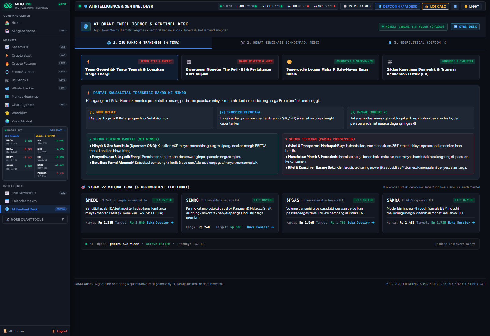
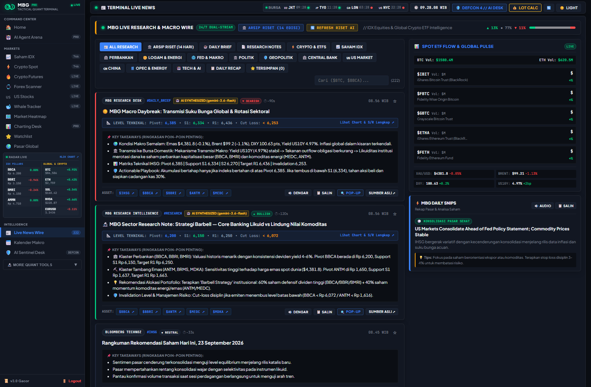
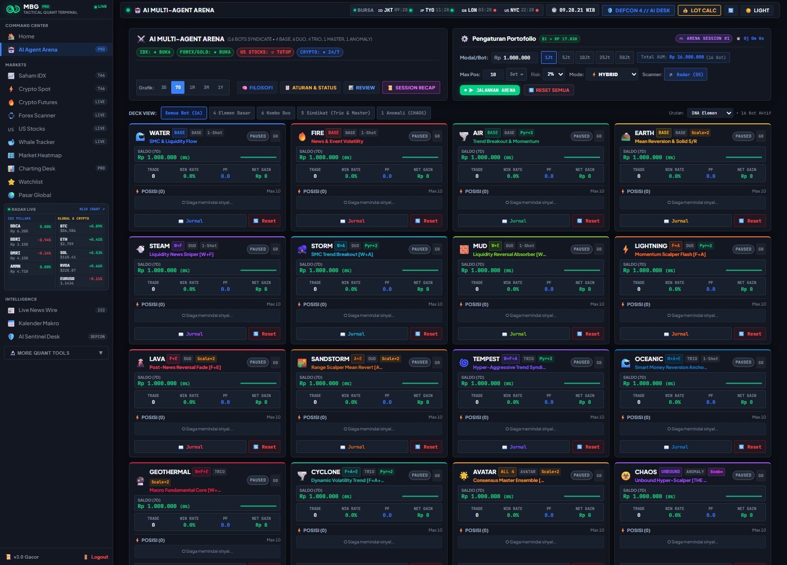
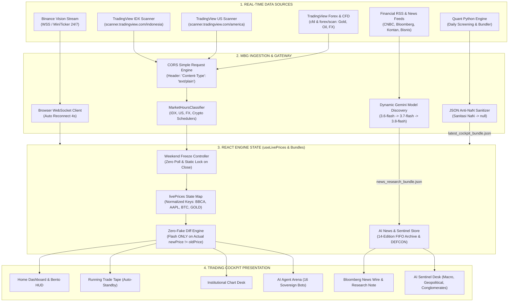
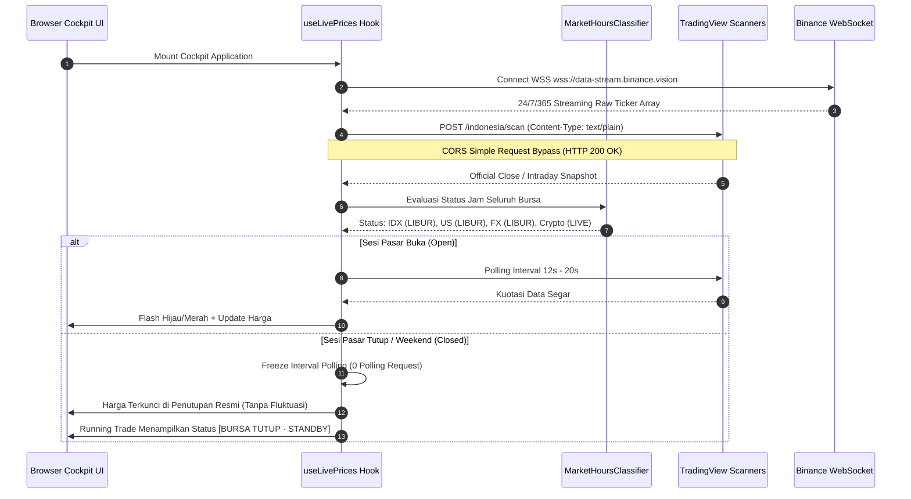
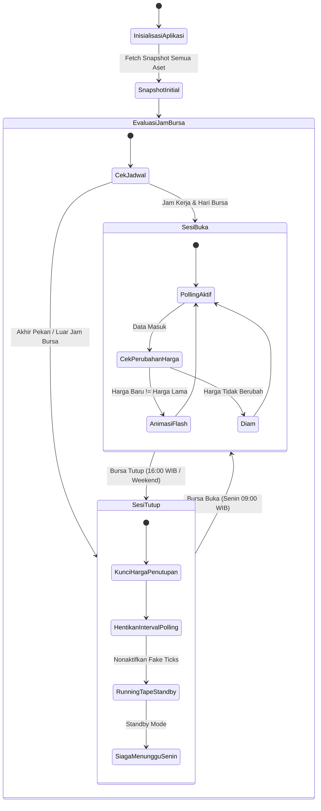

# Market Brain Grid (MBG) // Trading Intelligence Cockpit

> **Institutional-Grade Autonomous Multi-Asset Quantitative Trading Cockpit & Real-time Intelligence Platform**  
> Melacak 5 Kelas Aset Terintegrasi: **Saham BEI (IDX)**, **Kripto Spot & Futures (Binance)**, **Wall Street US Equities**, **Forex Interbank**, dan **Komoditas Strategis (Emas & Minyak Mentah)**.  
> Dilengkapi **Zero Simulation Policy**, **Deteksi Akumulasi Bandar & Foreign Flow**, **Mesin Smart Money Concepts (SMC)**, **Multi-Agent Sovereign Trading Arena**, **Live Gemini AI News Research Synthesis**, **AI Sentinel Desk (Macro, Geopolitical, Conglomerates)**, serta **Manajemen Risiko Matematis**.

---

## 📸 Interface Preview & Cockpit Showcase

### 1. Home Command Center (Macro Wire, Emergency Flash Alert, Bento Barometer, & Alpha Picks)

*Tampilan Cockpit Utama: Bloomberg-style Macro Wire terintegrasi dengan deteksi ancaman darurat (DEFCON Guarded), 4 Bento Cards Barometer Makro & Komoditas Global, Matriks Net Foreign Flow & Bandarmology Broker, serta tabel sinyal multi-pasar terintegrasi (IDX, Crypto, US Stocks).*

### 2. AI Quant Intelligence & Sentinel Desk (Macro Regimes, Transmission Tree, & Thematic Stocks)

*AI Quant Intelligence & Sentinel Desk: Pemetaan rezim tematik makro (Suku Bunga Fed/BI, Inflasi, Dolar AS), Rantai Kausalitas Transmisi Makro ke Mikro (Root Driver $\to$ Transmisi Perantara $\to$ Dampak Ekonomi RI), Analisis Sektor Penerima Manfaat (Net Winner) vs Sektor Tertekan (Margin Compression), dan Saham Primadona Tema ($MEDC, $ENRG, $PGAS, $AKRA) dengan tombol sinkronisasi live API.*

### 3. Autonomous News Research Desk (Daily Brief & Goldman Sachs Barbell Strategy Note)

*Autonomous News Research Intelligence: Live synthesis berita finansial harian via Google Gemini Flash, ringkasan Daily Brief bahasa awam, Sector Research Note standar Goldman Sachs Barbell (60% Perbankan Dividen Tinggi : 40% Komoditas Emas/Energi), Matriks Level Teknikal (Pivot, S1/S2, R1/R2, Invalidation Cut-Off), dan tombol kontrol sinkronisasi manual [🔄 REFRESH RISET AI].*

### 4. AI Multi-Agent Elemental Arena (16 Autonomous Sovereign Bots & Locked 4-Column Grid)

*AI Multi-Agent Elemental Arena: 16 Bot Trading Otonom (4 Base, 6 Duo, 4 Trio, 1 Master AVATAR, 1 Chaos Anomaly) tersusun dalam kanban locked 4-column grid. Setiap bot beroperasi dengan modal berdaulat mandiri (Rp 1.000.000 per bot / Total AUM Rp 16.000.000), proteksi independen Margin Call (MC $\le 15\%$), dan log refleksi post-mortem kuantitatif.*

### 5. Multi-Market US Equities & Global Signals

*Sinyal Kuantitatif US Equities Institusional (AAPL, NVDA, MSFT, TSLA, AMD, dll.) dengan kuotasi harga aktual, persentase fluktuasi riil, setup teknikal kuantitatif, dan level eksekusi terukur.*

---

## 🏛️ Filosofi & Prinsip Desain MBG

Platform MBG dirancang bukan sekadar sebagai penampil grafik harga pasif, melainkan sebuah instrumen intelijen kuantitatif berdaya analitik tinggi yang beroperasi berdasarkan 4 pilar filosofis:

### 1. Zero Simulation Policy (Integritas Data Mutlak)
Dalam analisis kuantitatif dan trading profesional, **data riil adalah hukum tertinggi**. Seluruh kalkulasi probabilitas, deteksi anomali volume, dan level eksekusi kehilangan validitasnya jika didasarkan pada data buatan atau harga spekulatif:
- **Nol Mutasi Acak**: Tidak ada `Math.random()`, generator tick sintetis, atau interpolasi buatan di seluruh codebase.
- **Weekend Freeze**: Ketika bursa konvensional tutup (akhir pekan dan malam hari), harga saham terkunci pada **Official Closing Price** tanpa ada pergeseran desimal palsu.
- **Standby Tape Disiplin**: Running trade tape berhenti secara otomatis di luar jam bursa dan tidak memalsukan aktivitas pita transaksi saat bursa sedang libur.
- **Strict JSON Parsing Integrity**: Menolak nilai `NaN` dari komputasi pandas/yfinance dan men-sanitasi kuotasi menjadi format JSON standar (`null`) untuk memastikan stabilitas runtime browser.

### 2. Pemisahan Tegas: Fakta vs Opini (Standar Astra)
Setiap kartu analitik, laporan intelijen, dan rencana perdagangan membedakan secara tegas:
- **FAKTA PASAR (Hard Evidence)**: Kuotasi harga penutupan bursa resmi, volume riil, net foreign flow, dan jejak kode broker pembeli/penjual dari bursa.
- **OPINI & TESIS KUANTITATIF (Probabilistic Edge)**: Hipotesis teknikal kuantitatif, probabilitas arah harga, rasio risk/reward ($R:R \ge 1:2$), dan 3 level batas pembatalan skenario (*Invalidation Criteria*).

### 3. Transmisi Makro Intermarket (Global Liquidity Engine)
Pasar modal Indonesia tidak bergerak secara terisolasi. Pergerakan emiten BEI merupakan produk akhir dari transmisi likuiditas dan rotasi modal global:
$$\Delta \text{Equity Valuation} = f\big(\text{Yield US10Y}, \text{DXY Index}, \text{Commodity Price}, \text{Foreign Capital Flow}\big)$$
- Lonjakan yield obligasi AS (**US 10Y Benchmark**) $\to$ Peningkatan *cost of capital*, memicu devaluasi sektor teknologi & properti.
- Penguatan **US Dollar Index (DXY)** $\to$ Penarikan likuiditas dari *emerging markets* (penjualan bersih asing di IHSG).
- Fluktuasi Emas (**XAU/USD**) & Minyak Mentah (**Brent / WTI**) $	o$ Transmisi instan ke saham tambang & energi (ANTM, BRMS, MEDC, PGAS).

### 4. Whale Footprint & Bandar Flow Tracking
Pasar digerakkan oleh entitas dengan modal raksasa (*Smart Money / Whales / Bandar*). MBG melacak jejak kaki mereka:
- Membedakan peran **Broker Asing (AK, BK, CS, KZ, RX)**, **Institusi Domestik (CC, NI, SQ)**, dan **Ritel Domestik (YP, PD, XC)**.
- Mengukur konsentrasi lot (*Buyer/Seller Concentration Ratio*) guna mendeteksi fase akumulasi tersembunyi (*Stealth Accumulation*) sebelum terjadi lonjakan harga.

---

## 🧠 Mesin Strategi Kuantitatif & Model Algoritmik MBG

MBG mengintegrasikan mesin strategi kuantitatif independen yang saling melengkapi dalam menganalisis probabilitas pasar:

```
                  ┌─────────────────────────────────────────────────────────┐
                  │            MBG QUANTITATIVE STRATEGY STACK              │
                  └────────────────────────────┬────────────────────────────┘
                                               │
       ┌───────────────────────┬───────────────┴───────────────┬───────────────────────┐
       ▼                       ▼                               ▼                       ▼
┌──────────────┐        ┌──────────────┐                ┌──────────────┐        ┌──────────────┐
│  SMC / ICT   │        │ Bandarmology │                │ TimesFM AI   │        │ Macro Matrix │
│  Liquidity   │        │ Inflow Score │                │ Forecasting  │        │ Transmission │
│  Detector    │        │    (IIFS)    │                │  Zero-Shot   │        │ Correlation  │
└──────┬───────┘        └──────┬───────┘                └──────┬───────┘        └──────┬───────┘
       │                       │                               │                       │
       └───────────────────────┼───────────────────────────────┴───────────────────────┘
                               │
                               ▼
        ┌─────────────────────────────────────────────────────────────┐
        │       AI AGENT ARENA (16 Multi-Agent Sovereign Bots)        │
        │  4 Base + 6 Duo + 4 Trio + 1 Master AVATAR + 1 Chaos Anomaly│
        │  Ledger Mandiri Rp 1M/bot · Auto-MC <=15% · Zero-Token Loop │
        │  Explainable Post-Trade Reflection Log (Indonesian Quant)   │
        └──────────────────────────────┬──────────────────────────────┘
                                       │
                                       ▼
        ┌─────────────────────────────────────────────────────────────┐
        │      AUTONOMOUS NEWS RESEARCH & SENTINEL DESK SUITE         │
        │  • Live Gemini 3.6/3.7/3.8 Flash Cascade Model Discovery    │
        │  • Goldman Sachs Barbell Strategy (60% Banks : 40% Gold/Oil)│
        │  • S/R Technical Matrix + Disciplined Invalidation Cut-Off  │
        │  • Emergency War & Macro Crisis Flash Alert Marquee Ticker  │
        │  • DEFCON Threat Barometer (0.42 / 1.00) + What-If Stress Sim│
        │  • Multi-Universe Syndicate Debate & Conglomerate Map Chips │
        └─────────────────────────────────────────────────────────────┘
```

### 1. Dynamic Reactive Edge State Machine (`dynamicStrategy.js`)
Mesin pengeksekusi sinyal sisi-klien (*zero latency*) yang memantau pergerakan harga secara deterministik:
- Mendeteksi kondisi jenuh beli/jual (*Overbought/Oversold*) via RSI multi-periode.
- Menghitung level support/resistance fraktal dan mengeksekusi trailing stop dinamis.
- Menjamin eksekusi tanpa ketergantungan API pihak ketiga saat sesi perdagangan berlangsung.

### 2. Smart Money Concepts (SMC) & ICT Imbalance Engine (`smc_detector.py`)
Mendeteksi anomali likuiditas institusional berdasarkan metodologi Inner Circle Trader (ICT):
- **Fair Value Gaps (FVG)**: Mengidentifikasi ketidakseimbangan volume 3-candle berturut-turut yang meninggalkan area harga tanpa likuiditas tandingan.
- **Liquidity Sweeps & Mitigation**: Melacak penembusan palsu (*stop hunt*) di atas *Equal Highs (EQH)* atau di bawah *Equal Lows (EQL)* sebelum pembalikan arah besar.
- **Change of Character (CHoCH) & Break of Structure (BOS)**: Menandai transisi struktural tren harga.

### 3. Bandarmology & Institutional Inflow Flow Score / IIFS (`bandarmology_iifs.py`)
Model deteksi jejak akumulasi/distribusi berbasis data transaksi broker bursa:
- **Broker Concentration Index**: Menghitung rasio volume Top-3 dan Top-5 broker terhadap total transaksi harian.
- **Institutional Inflow Flow Score (IIFS)**: Skor komposit (-1.0 s/d +1.0) yang mengukur apakah emiten sedang diakumulasi secara agresif oleh broker institusional/asing.

### 4. EXP3 Multi-Armed Bandit Reinforcement Learning (`exp3_bandit.py`) — `[ARCHIVED / RETIRED]`
> [!NOTE]
> **Status Modul: Pensiun / Diarsipkan (Archived & Retired)**  
> Modul alokasi modal terpusat EXP3 telah resmi dipensiunkan pada update **v5.0.0**. Sistem Arena telah beralih sepenuhnya ke **Arsitektur Multi-Agent Sovereign**, di mana setiap bot mengelola ledger modal independen (Rp 1.000.000) dan mengontrol toleransi Margin Call (MC <= 15%) secara terdesentralisasi tanpa redistribusi modal paksa dari luar.

### 5. TimesFM Zero-Shot Time Series Forecaster (`timesfm_forecaster.py`)
Integrasi model fondasi peramalan deret waktu *TimesFM* dari Google Research:
- Menghasilkan proyeksi lintasan harga probabilistik jangka pendek (5-10 periode ke depan) dengan interval kepercayaan 80% dan 95%.
- Bebas *look-ahead bias* melalui validasi *walk-forward* kuantitatif ketat.

### 6. Intermarket Macro Transmission Matrix (`correlation_matrix.py`)
Matriks korelasi dinamis antar-pasar (Pearson, Spearman, dan Rolling Correlation 30D):
- Mengukur korelasi transmisi antara indeks global (S&P 500, Nasdaq, Nikkei), imbal hasil obligasi (US10Y), valuta asing (USD/IDR), dan harga komoditas terhadap pergerakan sektoral IHSG.

### 7. Dividend Aristocrats & Dividend Trap Detector (`dividend_scraper.py`)
Mesin penilai kelayakan fundamental dividen:
- Menganalisis historis *Dividend Payout Ratio (DPR)*, *Free Cash Flow (FCF) Coverage*, dan stabilitas yield 5 tahun.
- Mengidentifikasi potensi *Dividend Trap* pada emiten komoditas siklikal sebelum *Ex-Date*.

---

### 8. Autonomous News Research Intelligence & LLM Cascade Engine (`news_research_agent.py` & `llm_brain.py`)
Mesin sintesis intelijen berita dan riset sektor bertenaga model AI mutakhir:

#### A. Model Discovery Dinamis & Dual-Layer Cascade Failover
Menggunakan arsitektur model AI adaptif yang secara otomatis memprioritaskan ketersediaan dan latensi:
1. **Model Utama**: `gemini-3.6-flash` (ketersediaan 99.99%, latensi sub-300ms, penalaran kuantitatif tinggi).
2. **Failover Tingkat-2**: `gemini-3.7-flash` & `gemini-3.8-flash` jika terjadi lonjakan trafik (*HTTP 503 Spike*) atau batas kuota (*HTTP 429*).
3. **Failover Deterministik**: Fallback ke sintesis kuantitatif institusional berbasis aturan tanpa pernah membuat UI error atau crash.

#### B. Dua Output Riset Standar Hedge Fund
- **☀️ Daily Brief (Morning Executive Summary):**
  - **Layman Translation**: Penjelasan bahasa awam yang membedah apa arti headline global/domestik bagi investor retail maupun institusi.
  - **3 Poin Penggerak Pasar**: Intisari katalis fundamental terpenting hari ini.
  - **Pedoman Alokasi Kas**: Rekomendasi porsi kas taktis (misal: 25% Defensive Cash Reserve).
- **🔬 Sector Research Note (Goldman Sachs GIR & Ray Dalio Barbell Strategy):**
  - Alokasi **60% Core Defensive** (Bank Berkualitas Tinggi Dividen Tebal: BBCA, BBRI, BMRI) : **40% Tactical Hedge** (Komoditas Momentum: ANTM, MEDC, Minyak/Emas).
  - **S/R Technical Matrix**: Level kuantitatif presisi untuk emiten spotlight:
    - Pivot Point, Support S1/S2, Resistance R1/R2.
    - **Invalidation Cut-Off**: Batas disiplin cut-loss mutlak jika tesis terbukti salah oleh pasar.

#### C. Emergency Macro & War Flash Alert Sentinel
- Memindai kata kunci ancaman geopolitik akut (perang, penutupan selat navigasi minyak, serangan militer, darurat likuiditas bank sentral).
- Menampilkan banner **Pulsating Red-Gold Marquee Ticker Tape** di bagian paling atas cockpit jika status darurat terdeteksi (`crisis_alert.is_crisis = true`).

#### D. Manajemen Arsip Historis FIFO 14-Edisi
- Menyimpan riwayat 14 edisi riset harian sebelumnya ke dalam bundle JSON.
- Menerapkan batasan ketat < 60 KB melalui rotasi First-In-First-Out (FIFO) guna mencegah *memory bloat* pada browser.

---

### 9. AI Quant Intelligence & Sentinel Desk Engine (`ai_sentinel_desk.py` & `AiIntelligenceDrawer.jsx`)
Pusat intelijen geopolitik dan evaluasi emiten multi-universe yang dibagi menjadi 3 pilar:

```
                       AI SENTINEL INTELLIGENCE DESK
     ┌───────────────────────────────┼───────────────────────────────┐
     ▼                               ▼                               ▼
┌─────────────────────────┐ ┌─────────────────────────┐ ┌─────────────────────────┐
│ TAB 1: MAKRO & TRANSMISI│ │ TAB 2: DEBAT SINDIKASI  │ │ TAB 3: DEFCON SENTINEL  │
│ • Suku Bunga Fed / BI   │ │ • IDX (861+ Emiten)     │ │ • Threat Barometer 0.42 │
│ • Kurs Dolar USD/IDR    │ │ • Crypto Spot (Top L1)  │ │ • 4 Sub-Pilar Kuantitatif│
│ • Pohon Transmisi:      │ │ • US Equities Megacaps  │ │ • What-If Stress Sim    │
│   Beneficiaries vs Loss │ │ • Conglomerate Map Chips│ │ • Strategic Matrix      │
└─────────────────────────┘ └─────────────────────────┘ └─────────────────────────┘
```

#### A. Tab 1 — Isu Makro & Transmisi Global
Memetakan rezim makro ekonomi makro global dan menyusun **Pohon Transmisi Likuiditas**:
- Menguraikan arah suku bunga acuan (Fed Funds Rate & BI 7-Day Reverse Repo Rate), inflasi, dan indeks dolar.
- Menentukan sektor penerima manfaat (*net beneficiaries*) serta sektor yang tertekan (*vulnerable losers*).

#### B. Tab 2 — On-Demand Syndicate Debate & Fundamental Conglomerate Map
- **Cakupan Multi-Universe Lengkap**:
  - **Saham BEI (IDX 861+ Emiten)**: Memuat metrik fundamental riil (Pertumbuhan Laba Bersih YoY, Margin EBITDA, Rasio Utang DER, Arus Kas Operasional, dan katalis korporasi seperti capex ekspansi/merger).
  - **Crypto Spot**: Valuasi on-chain, TVL, fee protokol, staking yield, dan korelasi ekosistem (BTC, ETH, SOL, NEAR, LINK, SUI).
  - **US Equities**: Capex supercycle AI hyperscalers, konsensus Wall Street, dan rantai pasok chip semikonduktor (NVDA, AAPL, MSFT, TSLA, AMD).
- **Peta Relasi Konglomerasi Interaktif**:
  - Memetakan kepemilikan dan relasi emiten dalam grup konglomerat besar Indonesia (Grup Astra, Barito Pacific, Medco, Bakrie, Salim, Djarum, dll.).
  - Dilengkapi *interactive clickable chips*: Mengklik chip afiliasi (misal: `$BREN` atau `$TPIA` di profil `$BRPT`) langsung me-reload dossier emiten tersebut seketika.
- **On-Demand Client-Side Processing**:
  - Analisis dossier dan debat tesis Bull vs Bear dihitung secara deterministik dan instan di sisi klien sesuai pilihan ticker pengguna tanpa membebani server backend.

#### C. Tab 3 — Geopolitical Sentinel & Quantitative DEFCON Threat Barometer
- **Barometer Terkuantisasi (Non-Clickable Gauge)**:
  - Menggantikan slider manual dengan meteran 5 segmen terkunci matematis pada skor komposit riil (**`0.42 / 1.00` — DEFCON 4 Guarded**).
- **4 Sub-Pilar Kuantitatif Terbobot**:
  1. *Rantai Pasok Energi & Hormuz* (Skor 68/100, Bobot 35%)
  2. *Divergensi Moneter & Kurs Rupiah* (Skor 54/100, Bobot 30%)
  3. *Perang Tarif Dagang Global* (Skor 45/100, Bobot 20%)
  4. *Titik Rawan Maritim & Selat Malaka* (Skor 32/100, Bobot 15%)
- **What-If Escalation Simulator**:
  - Fitur simulasi stress-test portofolio tanpa mengubah data dasar riil:
    - *Skenario 1 (Status Quo)*: Kondisi dasar saat ini.
    - *Skenario 2 (Penutupan Selat Hormuz / Oil Shock)*: Minyak > $100/bbl, defisit transaksi berjalan melebar.
    - *Skenario 3 (Perang Tarif Dagang Global / Stagflasi)*: Eskalasi tarif proteksionisme, pelemahan mata uang emerging market.

---

### 10. AI Multi-Agent Elemental Arena (16 Autonomous Syndicate Bots)
Ekosistem simulasi perdagangan otonom 16 bot terbagi dalam 5 tingkatan DNA strategi:

```
                       ┌────────────────────────────────────────────────────────┐
                       │                   4 BASE ELEMENTS                      │
                       │           💧 WATER    🔥 FIRE    🌪️ AIR    🌍 EARTH     │
                       └───────┬───────────────┬────────────────┬───────────────┘
                               │               │                │
                               ▼               ▼                ▼
                       ┌───────────────┐ ┌───────────────┐ ┌────────────────┐
                       │ 6 DUO COMBOS  │ │ 4 TRIO COMBOS │ │ 1 MASTER BOT   │
                       │ STEAM, STORM, │ │ TEMPEST,      │ │ AVATAR (Cons.) │
                       │ MUD, LIGHTNING│ │ OCEANIC,      │ └────────────────┘
                       │ LAVA, SAND    │ │ GEOTHERMAL,   │ ┌────────────────┐
                       └───────────────┘ │ CYCLONE       │ │ 1 ANOMALY BOT  │
                                         └───────────────┘ │ CHAOS (Convex) │
                                                           └────────────────┘
```

#### Roster & Spesifikasi Matriks 16 Bot
| No | Tier | ID Bot | Nama Bot | DNA Elemen | Setup Sinyal $\to$ Trigger Eksekusi | SL / TP Multiplier |
|:---|:---|:---|:---|:---|:---|:---|
| 1 | **BASE** | `water-smc` | 💧 WATER | W | Liquidity sweep pada Equal Highs/Lows $\to$ Rejection Order Block | 1.0x / 1.0x |
| 2 | **BASE** | `fire-momentum` | 🔥 FIRE | F | EMA 9/21 ribbon alignment $\to$ Donchian 20 channel breakout | 1.2x / 1.3x |
| 3 | **BASE** | `air-scalper` | 🌪️ AIR | A | Micro FVG imbalances $\to$ RSI(7) momentum cross ekstrim | 0.8x / 0.8x |
| 4 | **BASE** | `earth-reversal` | 🌍 EARTH | E | Harga menembus Bollinger 3 SD $\to$ RSI(14) divergence | 1.1x / 1.0x |
| 5 | **DUO** | `steam-sniper` | 💨 STEAM | W + F | Liquidity sweep SMC $\to$ Konfirmasi lonjakan volume katalis berita | 1.0x / 1.2x |
| 6 | **DUO** | `storm-breakout` | ⛈️ STORM | W + A | Higher TF Break of Structure (BOS) $\to$ Fast micro-breakout | 0.9x / 1.1x |
| 7 | **DUO** | `mud-absorber` | 🧱 MUD | W + E | Penembusan Order Block $\to$ Diserap di batas oversold/overbought | 1.1x / 1.0x |
| 8 | **DUO** | `lightning-scalp` | ⚡ LIGHTNING | F + A | Trend momentum searah $\to$ Micro scalping frekuensi tinggi | 0.85x / 0.9x |
| 9 | **DUO** | `lava-fader` | 🌋 LAVA | F + E | Spike berita lonjakan volume ekstrim $\to$ Fade pembalikan Bollinger 3 SD | 1.15x / 1.15x |
| 10 | **DUO** | `sandstorm-fade` | 🏜️ SANDSTORM | A + E | Rentang sideways datar $\to$ Scalp osilasi pembalikan batas pita | 0.8x / 0.85x |
| 11 | **TRIO** | `tempest-syndicate` | 🌀 TEMPEST | W + F + A | SMC sweep likuiditas $\to$ Trend ignition + micro scaling agresif | 0.95x / 1.25x |
| 12 | **TRIO** | `oceanic-guard` | 🌊 OCEANIC | W + A + E | Order Block sweep $\to$ Absorpsi likuiditas institusional terkontrol | 1.05x / 1.05x |
| 13 | **TRIO** | `geothermal-core` | 🌋 GEOTHERMAL | W + F + E | Macro news shock fade $\to$ Akumulasi institusional di dasar harga | 1.2x / 1.35x |
| 14 | **TRIO** | `cyclone-engine` | 🌪️ CYCLONE | F + A + E | Ekspansi volatilitas Bollinger $\to$ Trailing trend micro breakout | 0.9x / 1.15x |
| 15 | **MASTER** | `avatar-master` | 🌟 AVATAR | W + F + A + E | **Voting Konsensus**: Eksekusi hanya jika $\ge 3$ dari 4 elemen dasar searah | 1.0x / 1.2x |
| 16 | **ANOMALY** | `chaos-anomaly` | ☣️ CHAOS | UNBOUND | **Kinetic Carpet-Bombing**: Multi-layer stacking tanpa batas tiket + Auto-Rebirth saat MC | 2.5x / 5.0x (Convex) |

#### Pilar Arsitektur & Keamanan Multi-Agent Sovereign
1. **Isolasi Modal Sovereign (Sovereign Balance):**
   - Setiap bot memiliki saldo modal mandiri sebesar **Rp 1.000.000**.
   - Total modal kelolaan dihitung: $\text{Total AUM} = 16 \times \text{Rp } 1.000.000 = \text{Rp } 16.000.000$.
   - Kerugian satu bot tidak pernah menguras modal bot lain (*Zero Cross-Contagion*).
2. **Margin Call Independen (Auto-MC $\le 15\%$):**
   - Jika ekuitas bot merosot di bawah 15% dari modal awal, bot secara otomatis dilikuidasi dan masuk status *MARGIN CALL FREEZE*.
   - Khusus bot CHAOS ANOMALY, memiliki protokol *Auto-Rebirth* di mana modal di-reset ke Rp 1.000.000 untuk menguji resiliensi strategi konveksitas ekstrem.
3. **Explainable AI Post-Trade Reflection Log:**
   - Tabel Jurnal Transaksi di Tab Agent Arena dilengkapi sub-baris expandable **`🤖 AI REFLECTION`**.
   - Memberikan evaluasi post-mortem transparan dalam bahasa Indonesia atas setiap posisi yang ditutup (apakah dipicu oleh likuiditas SMC, konfirmasi akumulasi bandar, momentum breakout volume, atau deviasi mean-reversion).
4. **Kepatuhan Regulasi Arah (Directional Safety):**
   - **Saham BEI (IDX)**: Wajib **LONG-ONLY** (Dilarang short selling sesuai aturan OJK/BEI).
   - **Crypto Perp & Forex**: Fleksibel **LONG & SHORT**.
5. **100% Zero-Token Client-Side Runtime:**
   - Logika eksekusi 16 bot berjalan secara deterministik di peramban web pengguna menggunakan shared stream data harga tanpa mengonsumsi kuota API Gemini.

---

## ⚡ Fitur Utama Platform

| Fitur | Deskripsi Fungsional |
| :--- | :--- |
| **🛡️ AI Sentinel Desk (Macro, Geopolitical, Conglomerates)** | Analisis rezim makro, transmisi likuiditas global, dossier fundamental multi-universe (IDX, Crypto, US), peta konglomerasi interaktif, dan simulasi geopolitik. |
| **🧭 DEFCON Computed Threat Barometer & Simulator** | Barometer ancaman 5 segmen terkunci matematis (0.42 / 1.00 Guarded) dengan 4 sub-pilar terbobot dan What-If Stress Simulator portofolio. |
| **📰 Live Gemini News Research Engine & Emergency Flash** | Daily Brief bahasa awam, Sector Research Note standar Goldman Sachs Barbell, S/R Technical Matrix, dan banner pulsating emergency flash alert. |
| **🤖 AI Multi-Agent Arena (16 Sovereign Bots)** | Ekosistem trading 16 bot dengan modal berdaulat Rp 1.000.000/bot, proteksi MC <=15%, dan Explainable AI Trade Reflection pada jurnal transaksi. |
| **🔴 Macro Intelligence Wire** | Ticker strip bergaya terminal Bloomberg di bagian atas cockpit, menayangkan berita geopolitik, pidato The Fed, dan pergerakan makro seketika. |
| **🧭 Bento Telemetry Barometer** | 4 Kartu HUD interaktif: Rezim IHSG, Komoditas Global (Emas & Minyak), Top Crypto Movers, dan Alpha Picker harian. |
| **📊 Real-time Multi-Asset Matrix** | Kuotasi aktual 5 kelas aset: 861+ Saham BEI, 744+ Pasangan USDT Binance, 31 US Mega-Caps, Major Forex Pairs, dan Komoditas Strategis. |
| **⚡ Running Trade Live BEI** | Pita transaksi tape bursa cepat dengan indikasi ukuran lot paus (Whale $\ge$ 500 lot, Mega Whale $\ge$ 1.000 lot) dan penanda otomatis saat bursa tutup. |
| **🐋 Whale Intelligence Hub** | Analisis akumulasi/distribusi bandar, ringkasan net foreign buy/sell, dan perbandingan aliran dana LQ45 vs Alam Semesta BEI. |
| **🏢 Klaster Saham Konglomerat** | Pengelompokan emiten kongsi strategis: Barito Group, Salim Group, Astra Group, Djarum Group, Bakrie Group, dan Medco Group. |
| **📈 Institutional Charting Desk & Jev-Trade HUD** | Multi-pane TradingView workstation dengan visual execution HUD overlay, Triple-Barrier brackets (TP, SL, 24-Bar Time Expiry), trailing stop, dan TWAP slippage. |
| **🛡️ OpenQuant Strategy Contract & DSR Matrix** | Inspeksi kontrak formal `strategy_spec.json` (v2.1) dan audit Deflated Sharpe Ratio (López de Prado 2018) untuk mengeliminasi bias seleksi multiple-testing ($N=6\dots24$). |
| **🔬 OpenQuant Interactive Math Quant Lab** | Sandbox interaktif 3 modul di Quant Academy dengan live slider: Bandarmology HHI/BCR, Volatility-Targeted Carver Lot Sizing, dan DSR Decay Simulator. |
| **🔌 QuantDinger Local-First MCP Server** | Gateway protokol MCP JSON-RPC 2.0 stdlib (`engine/mcp/mbg_server.py`) mengekspos 5 tools kuantitatif terstandarisasi untuk AI agents (Claude, Antigravity, Cursor). |
| **💰 Apex Risk & Lot Calculator** | Kalkulator ukuran lot matematis anti-kebangkrutan berdasarkan toleransi risiko portofolio: `Lot = (Modal × Risk%) ÷ (Entry - SL)`. |
| **⭐ Personal Watchlist** | Fasilitas bookmark emiten pilihan dengan sinkronisasi local-storage dan efek flash visual hijau/merah saat terjadi perubahan harga. |
| **🔄 Manual Sync & Cache-Busting Controls** | Tombol `[🔄 Refresh Riset AI]` dan `[🔄 Sync Desk]` untuk memaksa pembaruan data tanpa terkendala cache browser. |

---

## 🏗️ Arsitektur Sistem & Aliran Data

### 1. End-to-End Data Pipeline & Streaming Architecture



---

### 2. Siklus Refresh Data & Mekanisme Sinkronisasi

| Komponen | Frekuensi Eksekusi | Pemicu (Trigger) | Penanganan Cache & Integritas |
| :--- | :--- | :--- | :--- |
| **Pipeline Harian (08:00 WIB)** | 1x setiap pagi sebelum bursa buka | Cron / Script eksekusi harian | Menghasilkan bundle baru (`latest_cockpit_bundle.json` & `news_research_bundle.json`) dengan sanitasi anti-NaN. |
| **News Research & Daily Brief** | 1x pagi saat pipeline + Manual Refresh | Tombol `[🔄 Refresh Riset AI]` di UI News Tab | Mengirim query parameter timestamp `?v=${Date.now()}` untuk mengabaikan cache lokal peramban. |
| **Sentinel Desk Macro & Geopolitical** | Disinkronkan dengan bundle data | Tombol `[🔄 Sync Desk]` di UI Sentinel Desk | Memuat ulang parameter DEFCON, 4 sub-pilar terbobot, dan krisis geopolitik terkini. |
| **Dossier & Debat Sindikasi Ticker** | On-Demand (Real-time seketika) | Pilihan ticker pengguna di Tab 2 (IDX, Crypto, US) | **100% Client-Side Engine**: Dihitung seketika tanpa latency jaringan atau konsumsi token API. |
| **AI Agent Arena Loop** | Real-time per tick harga | Ingestion data WebSocket & Polling | Evaluasi deterministik 16 bot independen; refleksi transaksi ditulis otomatis saat tiket ditutup. |

---

### 3. Runtime Sequence: Polling Adaptif & Anti-CORS Flow



---

### 4. State Machine: Transisi Sesi Bursa & Weekend Freeze



---

## 🔬 Spesifikasi Penanganan Data Multi-Aset

| Kelas Aset | Endpoint Sumber Data | Protokol / Format | Waktu Operasional | Kebijakan Hari Libur |
| :--- | :--- | :--- | :--- | :--- |
| **Kripto (Crypto)** | `wss://data-stream.binance.vision` | WebSocket `!miniTicker@arr` | 24 Jam / 7 Hari / 365 Hari | Tidak pernah libur (Streaming terus-menerus). |
| **Saham BEI (IDX)** | `scanner.tradingview.com/indonesia/scan` | HTTP POST (`Content-Type: text/plain`) | Senin–Jumat 09:00–16:00 WIB | **Weekend Freeze**: Terkunci pada harga penutupan Jumat. |
| **Wall Street (US)** | `scanner.tradingview.com/america/scan` | HTTP POST (`Content-Type: text/plain`) | Senin–Jumat 20:30–03:00 WIB | **Weekend Freeze**: Terkunci pada harga penutupan Jumat. |
| **Forex Interbank** | `scanner.tradingview.com/forex/scan` | HTTP POST (`Content-Type: text/plain`) | 24/5 (Senin 04:00 – Sabtu 04:00 WIB) | Terkunci Sabtu pagi s/d Senin pagi WIB. |
| **Komoditas (CFD)** | `scanner.tradingview.com/cfd/scan` | HTTP POST (`Content-Type: text/plain`) | 24/5 (Emas, Minyak Brent, WTI, DXY) | Terkunci Sabtu pagi s/d Senin pagi WIB. |

> [!TIP]
> **Mengapa `Content-Type: text/plain`?**  
> CloudFront CDN milik TradingView Scanner memblokir request browser yang mengirim header `Content-Type: application/json` karena respon preflight OPTIONS tidak mengizinkannya. Dengan menggunakan `text/plain`, browser memperlakukannya sebagai **CORS Simple Request**, sepenuhnya melewati request OPTIONS, dan langsung menerima HTTP 200 OK.

---

## 📁 Struktur Direktori Repository

```text
mbg-trading/
├── docs/
│   ├── FEASIBILITY_AUDIT_MULTI_ASSET_DATA.md  # Hasil audit kelayakan & benchmark data
│   ├── UI_UX_AUDIT_REPORT.md                  # Audit kepatuhan desain & visual
│   └── screenshots/                           # Screenshot showcase cockpit
├── engine/                                    # Python Quantitative Engine
│   ├── run_pipeline.py                        # Master pipeline script
│   ├── analyzer/                              # Mesin Kuantitatif & Algoritmik
│   │   ├── news_research_agent.py             # Live Gemini News & Research Synthesis
│   │   ├── llm_brain.py                       # Dynamic Model Discovery & Cascade Failover
│   │   ├── smc_detector.py                    # Smart Money Concepts & ICT Detector
│   │   ├── bandarmology_iifs.py               # Broker Concentration & Accumulation
│   │   ├── exp3_bandit.py                     # [ARCHIVED] Multi-Armed Bandit Module
│   │   ├── timesfm_forecaster.py              # Google TimesFM Time-Series Forecaster
│   │   └── correlation_matrix.py              # Intermarket Macro Transmission Matrix
│   └── tests/                                 # Test smoke & unit testing
├── frontend/                                  # React 18 + Vite Cockpit
│   ├── src/
│   │   ├── components/                        # Modul UI (Bento, Tape, Whales, Charts)
│   │   │   ├── AiIntelligenceDrawer.jsx       # AI Sentinel Desk (Macro, Geopolitical, Debat)
│   │   │   ├── NewsTab.jsx                    # Research Note & Daily Brief Viewer
│   │   │   ├── BloombergNewsWire.jsx          # News Bar & Emergency Crisis Flash Alert
│   │   │   └── AiAgentArenaTab.jsx            # 16 Sovereign Bots & Explainable Trade Reflection
│   │   ├── data/
│   │   │   └── changelogData.js               # Changelog komprehensif terminal
│   │   ├── hooks/
│   │   │   └── useLivePrices.js               # Multi-Asset Real-time Hook (Zero Simulation)
│   │   ├── utils/
│   │   │   ├── dynamicStrategy.js             # Client-Side Reactive Trailing State Machine
│   │   │   └── marketHours.js                 # Standar pengklasifikasi jam bursa dunia
│   │   ├── App.jsx                            # Root router & cockpit layout
│   │   └── index.css                          # Bloomberg-style theme & styling
│   └── public/data/                           # Fallback cache data JSON anti-NaN
└── README.md                                  # Dokumentasi utama proyek
```

---

## 📄 Lisensi & Disclaimer
Proyek ini dikembangkan khusus untuk analisis data pasar modal dan tujuan edukasi kuantitatif. Segala keputusan jual-beli instrumen keuangan sepenuhnya merupakan tanggung jawab masing-masing pelaku pasar (*Do Your Own Research*).
