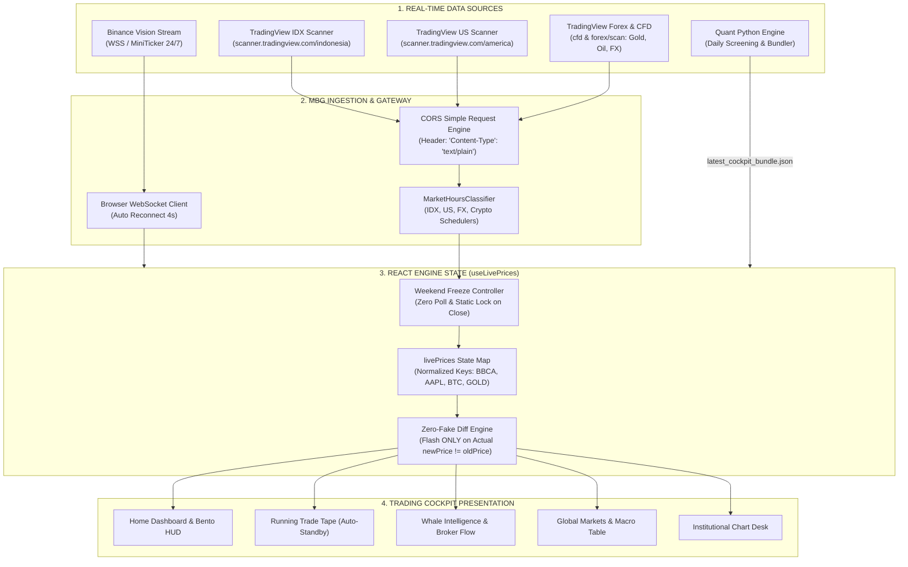
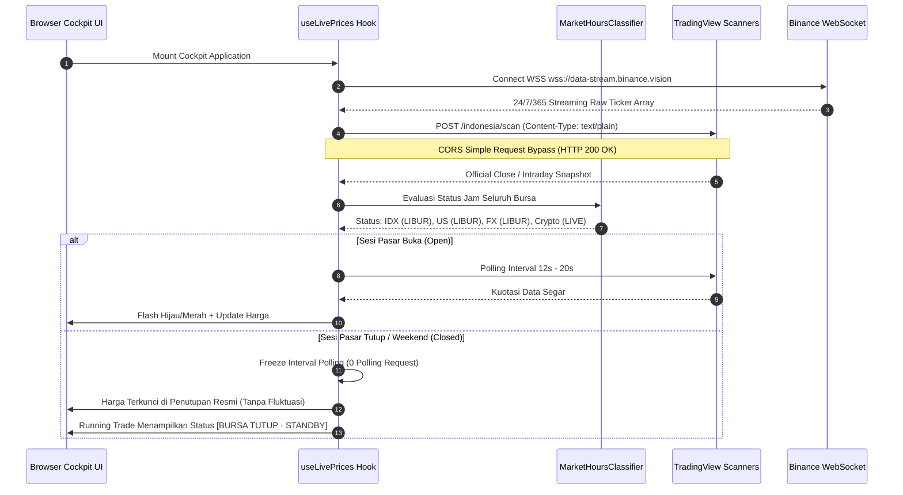
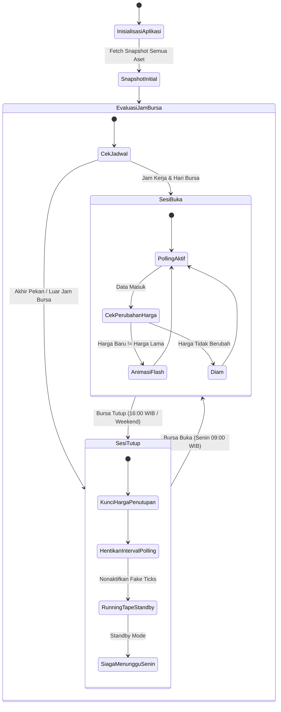

# Market Brain Grid (MBG) // Trading Intelligence Cockpit

> **Institutional-Grade Autonomous Multi-Asset Quantitative Trading Cockpit & Real-time Intelligence Platform**  
> Melacak 5 Kelas Aset Terintegrasi: **Saham BEI (IDX)**, **Kripto Spot & Futures (Binance)**, **Wall Street US Equities**, **Forex Interbank**, dan **Komoditas Strategis (Emas & Minyak Mentah)**.  
> Dilengkapi **Zero Simulation Policy**, **Deteksi Akumulasi Bandar & Foreign Flow**, serta **Kalkulator Risiko Presisi**.

---

## 📸 Interface Preview & Cockpit Showcase

### 1. Home Command Center (Macro Wire, Bento Barometer, & Alpha Picks)

*Tampilan Cockpit Utama: Bloomberg-style News Wire di bagian atas, 4 Bento Cards Barometer Makro & Komoditas, Matriks Net Foreign Flow, Rekap Konglomerat, dan Top 5 Alpha Setups.*

### 2. Multi-Market US Equities & Global Signals

*Sinyal Kuantitatif US Equities Institusional (AAPL, NVDA, MSFT, TSLA, dll.) dengan kuotasi harga aktual, persentase fluktuasi riil, dan level eksekusi teknikal.*

---

## 🏛️ Filosofi & Prinsip Desain MBG

Platform MBG dirancang bukan sekadar sebagai penampil grafik harga, melainkan sebuah instrumen analitik dengan integritas institusional berlandaskan 4 pilar filosofis:

### 1. Zero Simulation Policy (Integritas Data Mutlak)
Dalam analisis kuantitatif dan trading profesional, **data riil adalah hukum tertinggi**. MBG menolak segala bentuk angka rekayasa:
- **Nol Mutasi Acak**: Tidak ada `Math.random()`, generator tick sintetis, atau micro-pulse palsu di seluruh sistem.
- **Weekend Freeze**: Ketika bursa konvensional tutup (akhir pekan dan malam hari), harga saham terkunci pada **Official Closing Price**.
- **Standby Tape**: Running trade tape berhenti secara disiplin di luar jam bursa dan tidak memalsukan aktivitas pasar yang sedang libur.

### 2. Pemisahan Tegas: Fakta vs Opini (Standar Astra)
Setiap kartu analitik dan rencana perdagangan membedakan dengan jelas:
- **FAKTA**: Kuotasi harga bursa, volume riil, net foreign flow, dan jejak kode broker akumulator.
- **OPINI & TESIS**: Hipotesis teknikal kuantitatif, probabilitas arah, rasio risk/reward, dan 3 level invalidasi skenario.

### 3. Transmisi Makro Intermarket (Global Liquidity Engine)
Saham domestik tidak bergerak di ruang hampa. Pergerakan emiten BEI merupakan produk dari transmisi likuiditas global:
- Lonjakan yield obligasi AS (**US 10Y Benchmark**) $\to$ Tekanan valuasi sektor teknologi & perbankan.
- Penguatan **US Dollar Index (DXY)** $\to$ Aliran modal keluar (*capital outflow*) pasar berkembang.
- Geopolitik Emas (**XAU/USD**) & Minyak Mentah (**Brent / WTI**) $\to$ Rotasi sektor tambang & energi (ANTM, BRMS, MEDC).

### 4. Whale Footprint & Bandar Flow Tracking
Melacak pergerakan smart money (*Institutional Accumulation*) melalui analisis broker summary:
- Membedakan peran **Broker Asing (AK, BK, CS, KZ, RX)**, **Institusi Domestik (CC, NI, SQ)**, dan **Ritel Domestik (YP, PD, XC)**.
- Mengidentifikasi anomali volume sebelum terjadinya lonjakan harga (*Smart Money Footprint*).

---

## ⚡ Fitur Utama Platform

| Fitur | Deskripsi Fungsional |
| :--- | :--- |
| **🔴 Macro Intelligence Wire** | Ticker strip bergaya terminal Bloomberg di bagian atas cockpit, menayangkan berita geopolitik, pidato The Fed, dan pergerakan makro secara seketika. |
| **🧭 Bento Telemetry Barometer** | 4 Kartu HUD interaktif: Rezim IHSG, Komoditas Global (Emas & Minyak), Top Crypto Movers, dan Alpha Picker harian. |
| **📊 Real-time Multi-Asset Matrix** | Kuotasi aktual 5 kelas aset: 850+ Saham BEI, 744+ Pasangan USDT Binance, 31 US Mega-Caps, Major Forex Pairs, dan Komoditas Strategis. |
| **⚡ Running Trade Live BEI** | Pita transaksi tape bursa cepat dengan indikasi ukuran lot paus (Whale $\ge$ 500 lot, Mega Whale $\ge$ 1.000 lot) dan penanda otomatis saat bursa tutup. |
| **🐋 Whale Intelligence Hub** | Analisis akumulasi/distribusi bandar, ringkasan net foreign buy/sell, dan perbandingan aliran dana LQ45 vs Alam Semesta BEI. |
| **🏢 Klaster Saham Konglomerat** | Pengelompokan emiten kongsi strategis: Barito Group (Prajogo Pangestu), Salim Group, Astra Group, Djarum Group, Bakrie Group, dan Adaro Group. |
| **📈 Institutional Charting Desk** | Grafik TradingView modal interaktif multi-timeframe lengkap dengan level entry presisi, stop-loss, dan take-profit. |
| **💰 Apex Risk & Lot Calculator** | Kalkulator ukuran lot matematis anti-kebangkrutan berdasarkan toleransi risiko portofolio: `Lot = (Modal × Risk%) ÷ (Entry - SL)`. |
| **⭐ Personal Watchlist** | Fasilitas bookmark emiten pilihan dengan sinkronisasi local-storage dan efek flash visual hijau/merah saat terjadi perubahan harga. |
| **🛡️ Security Hub Drawer** | Panel deep-dive profil emiten/kripto dalam 1 klik (indikator teknikal RSI, SMA20, volume, dan data fundamental ringkas). |

---

## 🏗️ Arsitektur Sistem & Aliran Data

### 1. End-to-End Data Pipeline & Streaming Architecture



---

### 2. Runtime Sequence: Polling Adaptif & Anti-CORS Flow



---

### 3. State Machine: Transisi Sesi Bursa & Weekend Freeze



---

## 🔬 Spesifikasi Penanganan Data Multi-Aset

| Kelas Aset | Endpoint Sumber Data | Protokol / Format | Waktu Operasional | Kebijakan Hari Libur |
| :--- | :--- | :--- | :--- | :--- |
| **Kripto (Crypto)** | `wss://data-stream.binance.vision` | WebSocket `!miniTicker@arr` | 24 Jam / 7 Hari / 365 Hari | Tidak pernah libur (Streaming terus-menerus). |
| **Saham BEI (IDX)** | `scanner.tradingview.com/indonesia/scan` | HTTP POST (`Content-Type: text/plain`) | Senin–Jumat 09:00–16:00 WIB | **Weekend Freeze**: Terkunci pada harga penutupan Jumat. |
| **Wall Street (US)** | `scanner.tradingview.com/america/scan` | HTTP POST (`Content-Type: text/plain`) | Senin–Jumat 20:30–03:00 WIB | **Weekend Freeze**: Terkunci pada harga penutupan Jumat. |
| **Forex Interbank** | `scanner.tradingview.com/forex/scan` | HTTP POST (`Content-Type: text/plain`) | 24/5 (Senin 04:00 – Sabtu 04:00 WIB) | Terkunci Sabtu pagi s/d Senin pagi WIB. |
| **Komoditas (CFD)** | `scanner.tradingview.com/cfd/scan` | HTTP POST (`Content-Type: text/plain`) | 24/5 (Emas, Minyak Brent, WTI, DXY) | Terkunci Sabtu pagi s/d Senin pagi WIB. |

> [!TIP]
> **Mengapa `Content-Type: text/plain`?**  
> CloudFront CDN milik TradingView Scanner memblokir request browser yang mengirim header `Content-Type: application/json` karena respon preflight OPTIONS tidak mengizinkannya. Dengan menggunakan `text/plain`, browser memperlakukannya sebagai **CORS Simple Request**, sepenuhnya melewati request OPTIONS, dan langsung menerima HTTP 200 OK.

---

## 🛠️ Panduan Menjalankan Project di Lokal

### Prasyarat
- **Node.js**: v18.0.0 atau lebih baru.
- **Python**: v3.10 atau v3.11.

### 1. Menjalankan Frontend Dashboard
```bash
# Masuk ke direktori frontend
cd frontend

# Install dependensi
npm install

# Jalankan development server
npm run dev
```
Buka browser di `http://localhost:3000`. Dashboard akan terbuka secara instan.

### 2. Menjalankan Backend Python Quant Engine (Opsional)
```bash
# Dari root project:
py -m pip install -r engine/requirements.txt

# Menjalankan pipeline kalkulasi penuh:
py engine/run_pipeline.py --mode all
```
Hasil kalkulasi teknikal & rekomendasi harian akan diperbarui ke `frontend/public/data/latest_cockpit_bundle.json`.

### 3. Menjalankan Audit Kepatuhan (QA & QC)
```bash
# Menjalankan verifikasi static & live feed integrity:
node scratch/qa_qc_compliance_audit.mjs

# Menjalankan unit test backend:
py -3 engine/tests/test_smoke.py

# Memastikan build frontend bersih:
cd frontend && npm run build
```

---

## 📁 Struktur Direktori Repository

```text
mbg-trading/
├── docs/
│   ├── FEASIBILITY_AUDIT_MULTI_ASSET_DATA.md  # Hasil audit kelayakan & benchmark data
│   ├── UI_UX_AUDIT_REPORT.md                  # Audit kepatuhan desain & visual
│   └── screenshots/                           # Screenshot showcase cockpit
├── engine/                                    # Python Quantitative Engine
│   ├── run_pipeline.py                        # Master pipeline script
│   ├── scrapers/                              # Scraper IDX, Crypto, & Makro
│   ├── quant/                                 # Logika perhitungan lot & teknikal
│   └── tests/                                 # Test smoke & unit testing
├── frontend/                                  # React 18 + Vite Cockpit
│   ├── src/
│   │   ├── components/                        # Modul UI (Bento, Tape, Whales, Charts)
│   │   ├── hooks/
│   │   │   └── useLivePrices.js               # Multi-Asset Real-time Hook (Zero Simulation)
│   │   ├── utils/
│   │   │   └── marketHours.js                 # Standar pengklasifikasi jam bursa dunia
│   │   ├── App.jsx                            # Root router & cockpit layout
│   │   └── index.css                          # Bloomberg-style theme & styling
│   └── public/data/                           # Fallback cache data JSON
└── README.md                                  # Dokumentasi utama proyek
```

---

## 📄 Lisensi & Disclaimer
Proyek ini dikembangkan khusus untuk analisis data pasar modal dan tujuan edukasi kuantitatif. Segala keputusan jual-beli instrumen keuangan sepenuhnya merupakan tanggung jawab masing-masing pelaku pasar (*Do Your Own Research*).
