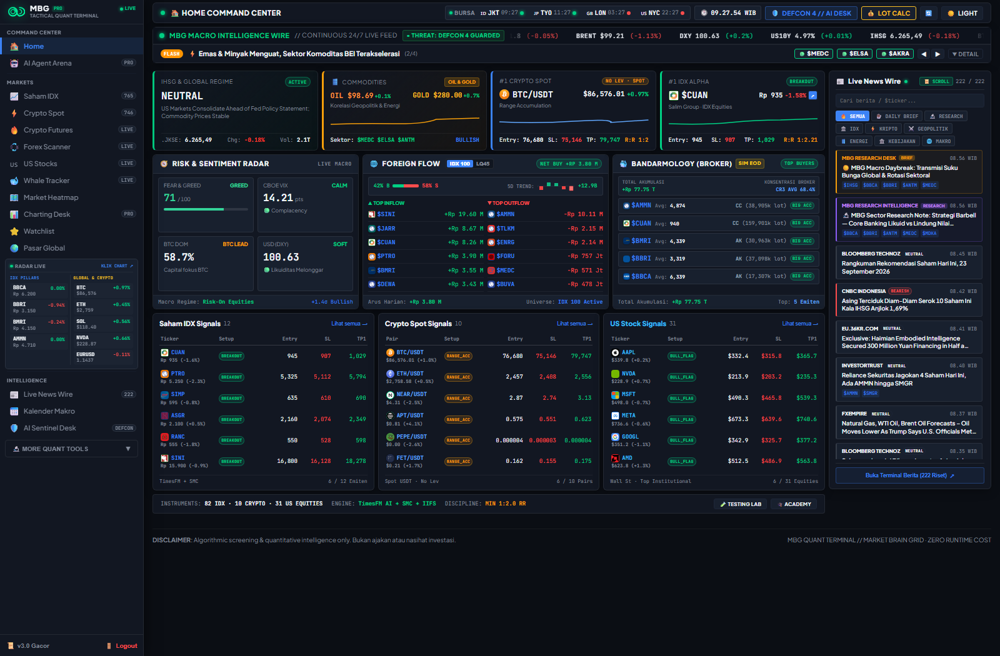
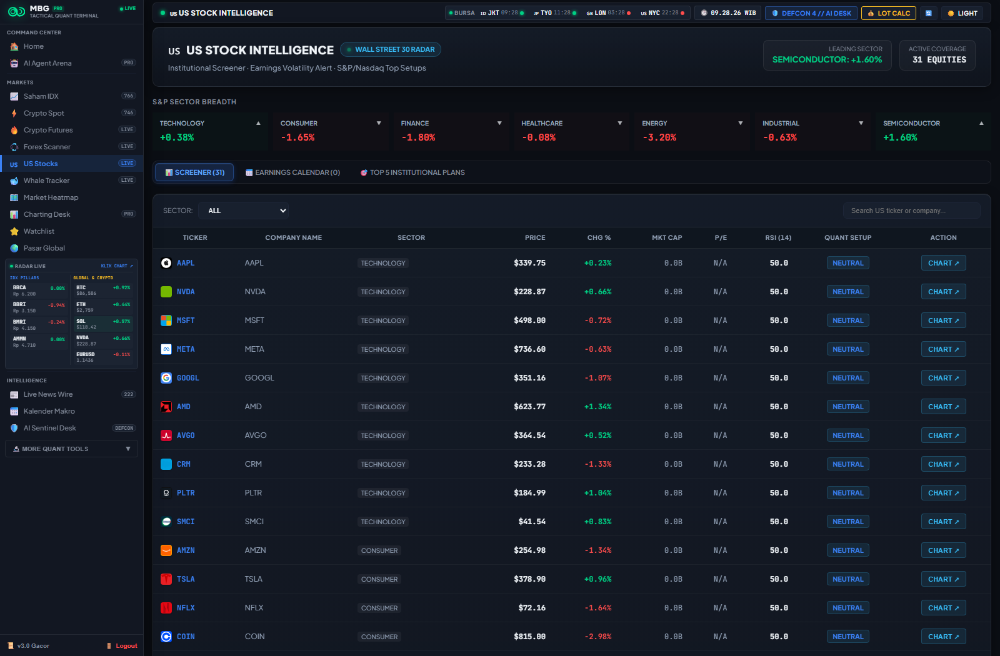
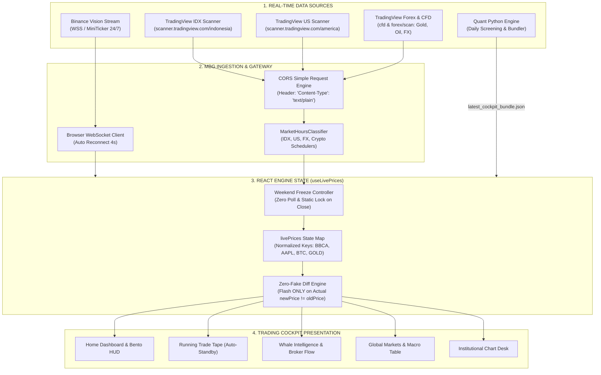
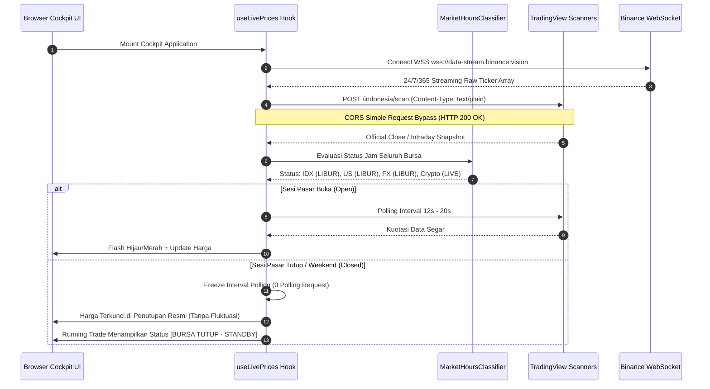
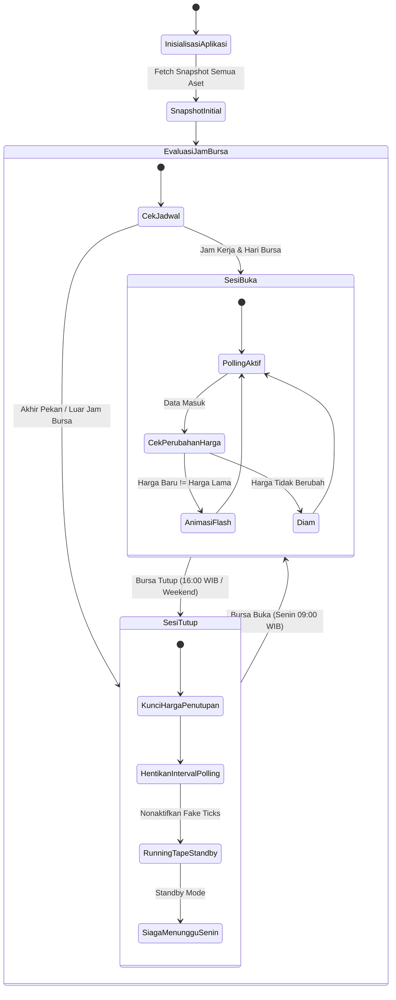

# Market Brain Grid (MBG) // Trading Intelligence Cockpit

> **Institutional-Grade Autonomous Multi-Asset Quantitative Trading Cockpit & Real-time Intelligence Platform**  
> Melacak 5 Kelas Aset Terintegrasi: **Saham BEI (IDX)**, **Kripto Spot & Futures (Binance)**, **Wall Street US Equities**, **Forex Interbank**, dan **Komoditas Strategis (Emas & Minyak Mentah)**.  
> Dilengkapi **Zero Simulation Policy**, **Deteksi Akumulasi Bandar & Foreign Flow**, **Mesin Smart Money Concepts (SMC)**, **Multi-Armed Bandit Reinforcement Learning**, serta **Manajemen Risiko Matematis**.

---

## 📸 Interface Preview & Cockpit Showcase

### 1. Home Command Center (Macro Wire, Bento Barometer, & Alpha Picks)

*Tampilan Cockpit Utama: Bloomberg-style News Wire di bagian atas, 4 Bento Cards Barometer Makro & Komoditas, Matriks Net Foreign Flow, Rekap Konglomerat, dan Top 5 Alpha Setups.*

### 2. Multi-Market US Equities & Global Signals

*Sinyal Kuantitatif US Equities Institusional (AAPL, NVDA, MSFT, TSLA, dll.) dengan kuotasi harga aktual, persentase fluktuasi riil, dan level eksekusi teknikal.*

---

## 🏛️ Filosofi & Prinsip Desain MBG

Platform MBG dirancang bukan sekadar sebagai penampil grafik harga pasif, melainkan sebuah instrumen intelijen kuantitatif berdaya analitik tinggi yang beroperasi berdasarkan 4 pilar filosofis:

### 1. Zero Simulation Policy (Integritas Data Mutlak)
Dalam analisis kuantitatif dan trading profesional, **data riil adalah hukum tertinggi**. Seluruh kalkulasi probabilitas, deteksi anomali volume, dan level eksekusi kehilangan validitasnya jika didasarkan pada data buatan atau harga spekulatif:
- **Nol Mutasi Acak**: Tidak ada `Math.random()`, generator tick sintetis, atau interpolasi buatan di seluruh codebase.
- **Weekend Freeze**: Ketika bursa konvensional tutup (akhir pekan dan malam hari), harga saham terkunci pada **Official Closing Price** tanpa ada pergeseran desimal palsu.
- **Standby Tape Disiplin**: Running trade tape berhenti secara otomatis di luar jam bursa dan tidak memalsukan aktivitas pita transaksi saat bursa sedang libur.

### 2. Pemisahan Tegas: Fakta vs Opini (Standar Astra)
Setiap kartu analitik, laporan intelijen, dan rencana perdagangan membedakan secara tegas:
- **FAKTA PASAR (Hard Evidence)**: Kuotasi harga penutupan bursa resmi, volume riil, net foreign flow, dan jejak kode broker pembeli/penjual dari bursa.
- **OPINI & TESIS KUANTITATIF (Probabilistic Edge)**: Hipotesis teknikal kuantitatif, probabilitas arah harga, rasio risk/reward ($R:R \ge 1:2$), dan 3 level batas pembatalan skenario (*Invalidation Criteria*).

### 3. Transmisi Makro Intermarket (Global Liquidity Engine)
Pasar modal Indonesia tidak bergerak secara terisolasi. Pergerakan emiten BEI merupakan produk akhir dari transmisi likuiditas dan rotasi modal global:
$$\Delta \text{Equity Valuation} = f\big(\text{Yield US10Y}, \text{DXY Index}, \text{Commodity Price}, \text{Foreign Capital Flow}\big)$$
- Lonjakan yield obligasi AS (**US 10Y Benchmark**) $\to$ Peningkatan *cost of capital*, memicu devaluasi sektor teknologi & properti.
- Penguatan **US Dollar Index (DXY)** $\to$ Penarikan likuiditas dari *emerging markets* (penjualan bersih asing di IHSG).
- Fluktuasi Emas (**XAU/USD**) & Minyak Mentah (**Brent / WTI**) $\to$ Transmisi instan ke saham tambang & energi (ANTM, BRMS, MEDC, PGAS).

### 4. Whale Footprint & Bandar Flow Tracking
Pasar digerakkan oleh entitas dengan modal raksasa (*Smart Money / Whales / Bandar*). MBG melacak jejak kaki mereka:
- Membedakan peran **Broker Asing (AK, BK, CS, KZ, RX)**, **Institusi Domestik (CC, NI, SQ)**, dan **Ritel Domestik (YP, PD, XC)**.
- Mengukur konsentrasi lot (*Buyer/Seller Concentration Ratio*) guna mendeteksi fase akumulasi tersembunyi (*Stealth Accumulation*) sebelum terjadi lonjakan harga.

---

## 🧠 Mesin Strategi Kuantitatif & Model Algoritmik MBG

MBG mengintegrasikan 7 mesin strategi kuantitatif independen yang saling melengkapi dalam menganalisis probabilitas pasar:

```
                  ┌─────────────────────────────────────────────────────────┐
                  │            MBG QUANTITATIVE STRATEGY STACK              │
                  └────────────────────────────┬────────────────────────────┘
                                               │
       ┌───────────────────────┬───────────────┴───────────────┬───────────────────────┐
       ▼                       ▼                               ▼                       ▼
┌──────────────┐       ┌──────────────┐                 ┌──────────────┐       ┌──────────────┐
│  SMC & ICT   │       │ BANDARMOLOGY │                 │ DYNAMIC EDGE │       │ EXP3 BANDIT  │
│ Order Blocks │       │ Broker Flow  │                 │ State Engine │       │ Reinforce RL │
│ FVG & Sweeps │       │ IIFS & VWAP  │                 │ Trailing Stop│       │ Multi-Regime │
└──────────────┘       └──────────────┘                 └──────────────┘       └──────────────┘
       │                       │                               │                       │
       └───────────────────────┼───────────────────────────────┴───────────────────────┘
                               │
                ┌──────────────┴──────────────┐
                ▼                             ▼
       ┌───────────────────┐         ┌───────────────────┐
       │ TIMESFM FORECAST  │         │ INTERMARKET MACRO │
       │ Google Foundation │         │ Pearson Transmit  │
       │ Zero-Shot Traject │         │ Cross-Asset Matrix│
       └───────────────────┘         └───────────────────┘
```

---

### 1. Dynamic Reactive Edge State Machine (`dynamicStrategy.js`)
Mesin eksekusi client-side ultra-low latency (< 1ms) yang mengevaluasi setiap denyut harga live terhadap trade plan:
- **State Transition Cycle**:
  $$\text{PENDING} \longrightarrow \text{ENTRY\_TRIGGER} \longrightarrow \text{IN\_POSITION} \longrightarrow \begin{cases} \text{TP1\_HIT} \to \text{TP2\_HIT} \\ \text{STOPPED\_OUT} \end{cases}$$
- **Automated Trailing Stop Ratchet**: Begitu Target 1 tercapai (+3% s/d +6%), Stop Loss otomatis dikunci ke harga modal (*Breakeven*), mengubah status menjadi posisi bebas risiko (*Risk-Free Trade*).
- **Anti-FOMO Extension Gate**: Jika harga melonjak $> 3.2\%$ dari Entry sebelum pengguna sempat membeli, sistem mengaktifkan status `⚠️ EXTENDED (NO FOMO)` dan melarang pembelian karena rasio risk/reward telah rusak.

### 2. Smart Money Concepts (SMC) & ICT Imbalance Engine (`smc_detector.py`)
Mendeteksi zona likuiditas institusional murni berdasarkan struktur pergerakan harga tanpa indikator lagging:
- **Institutional Order Blocks (OB)**: Mengidentifikasi candle terakhir sebelum dorongan impulsif besar yang memecahkan struktur harga (*Break of Structure / BOS*).
- **Fair Value Gap (FVG) / 3-Candle Imbalance**: Menghitung area ketidakseimbangan likuiditas di mana pembeli institusional mendominasi secara sepihak, menciptakan magnet harga untuk retest.
- **Liquidity Sweeps / Turtle Soup**: Mendeteksi false breakout di atas *Equal Highs (EQH)* atau di bawah *Equal Lows (EQL)* yang dirancang untuk memancing stop loss ritel sebelum pembalikan arah.

### 3. Bandarmology & Institutional Inflow Flow Score / IIFS (`bandarmology_iifs.py`)
Menganalisis mikrostruktur perdagangan bursa melalui data broker summary harian:
- **Broker Concentration Ratio**:
  $$CR_3 = \sum_{i=1}^3 \frac{\text{Net Lot Buyer}_i}{\text{Total Market Volume}}, \quad CR_5 = \sum_{i=1}^5 \frac{\text{Net Lot Buyer}_i}{\text{Total Market Volume}}$$
- **Bandar Volume-Weighted Cost Basis (Bandar VWAP)**:
  $$\text{Bandar Average Price} = \frac{\sum (\text{Lot}_i \times \text{Price}_i \times 100)}{\sum (\text{Lot}_i \times 100)}$$
- **Klasifikasi Tingkat Akumulasi**: `BIG_ACCUMULATION`, `ACCUMULATION`, `NEUTRAL`, `DISTRIBUTION`, dan `BIG_DISTRIBUTION`.

### 4. EXP3 Multi-Armed Bandit Reinforcement Learning (`exp3_bandit.py`)
Algoritma *Exponential-weight algorithm for Exploration and Exploitation* yang beroperasi pada lingkungan pasar non-stasioner:
- Mengevaluasi performa relatif multi-strategi (Breakout, Mean-Reversion, Trend Following, SMC).
- Mengupdate bobot probabilitas pemilihan strategi berdasarkan imbal hasil historis berjalan (*Walk-Forward Payoff*), secara adaptif mengurangi alokasi modal pada strategi yang sedang mengalami drawdown.

### 5. TimesFM Zero-Shot Time Series Forecaster (`timesfm_forecaster.py`)
Pemanfaatan model pondasi *TimesFM (Google Research)* untuk peramalan harga multi-horizon:
- Menghasilkan proyeksi lintasan harga 1 hari, 5 hari, dan 20 hari ke depan.
- Dilengkapi pita interval kepercayaan (*Calibrated Prediction Intervals*) pada tingkat keyakinan 80% dan 95% untuk estimasi batas volatilitas wajar.

### 6. Intermarket Macro Transmission Matrix (`correlation_matrix.py`)
Menghitung koefisien korelasi Pearson bergulir (*Rolling 60-Day Pearson Matrix*) antar variabel global:
$$r_{xy} = \frac{\sum (x_i - \bar{x})(y_i - \bar{y})}{\sqrt{\sum (x_i - \bar{x})^2 \sum (y_i - \bar{y})^2}}$$
- Memetakan transmisi dari aset makro (DXY, US10Y, Brent Oil, XAU/USD) ke indeks sektoral BEI (IDXENERGY, IDXBASIC, IDXFINANCE, IDXTECH).

### 7. Dividend Aristocrats & Dividend Trap Detector (`dividend_scraper.py`)
Menyaring saham pembayar dividen konsisten dengan filter pengaman:
- **Dividend Trap Warning**: Mengukur rasio antara *Dividend Yield* terhadap volatilitas historis penurunan harga pada *Ex-Date*. Jika potensi penurunan harga melebihi dividen tunai bersih, sistem memberikan label peringatan dini `DIVIDEND TRAP RISK`.

---

### 8. AI Multi-Agent Elemental Arena (15 Autonomous Syndicate Bots)
Arsitektur multi-agen kuantitatif mandiri (*self-governing agent syndicate*) yang mengevaluasi pasar multiaset secara otonom tanpa campur tangan manusia. Terdiri dari 15 bot independen yang diturunkan dari kombinatorika fusi 4 agen elemen dasar ($2^4 - 1 = 15$ bot):

$$\text{Roster Multi-Agen} = \binom{4}{1}_{\text{Base: 4}} + \binom{4}{2}_{\text{Duo: 6}} + \binom{4}{3}_{\text{Trio: 4}} + \binom{4}{4}_{\text{Master: 1}} = 15 \text{ Bot}$$

```
                           ┌─────────────────────────────────────────────────────────┐
                           │         AI MULTI-AGENT ARENA SYNDICATE (15 BOTS)        │
                           └────────────────────────────┬────────────────────────────┘
                                                        │
                 ┌───────────────────────┬──────────────┴───────────────┬───────────────────────┐
                 ▼                       ▼                              ▼                       ▼
          ┌──────────────┐        ┌──────────────┐               ┌──────────────┐        ┌──────────────┐
          │   💧 WATER   │        │   🔥 FIRE    │               │    🌪️ AIR    │        │   🌍 EARTH   │
          │ Liquidity/OB │        │ Momentum/EMA │               │ Scalp/Micro  │        │ Mean-Revert  │
          └──────┬───────┘        └──────┬───────┘               └──────┬───────┘        └──────┬───────┘
                 │                       │                              │                       │
                 └───────────────┬───────┴──────────────┬───────────────┴───────────────┬───────┘
                                 │                      │                               │
                                 ▼                      ▼                               ▼
                         ┌───────────────┐      ┌───────────────┐               ┌───────────────┐
                         │ 6 DUO COMBOS  │      │ 4 TRIO COMBOS │               │ 1 MASTER BOT  │
                         │ C(4,2) Fusi   │      │ C(4,3) Sindikat│              │ C(4,4) AVATAR │
                         │ STEAM, STORM, │      │ TEMPEST,      │               │ 4-Element     │
                         │ MUD, LIGHTNING│      │ OCEANIC,      │               │ Consensus     │
                         │ LAVA, SAND    │      │ GEOTHERMAL,   │               │ Voting >= 3   │
                         └───────────────┘      └───────────────┘               └───────────────┘
```

#### Roster & Spesifikasi Matriks 16 Bot
| No | Tier | ID Bot | Nama Bot | DNA Elemen | Setup Sinyal $\to$ Trigger Eksekusi | SL / TP Multiplier |
|:---|:---|:---|:---|:---|:---|:---|
| 1 | **BASE** | `water-smc` | 💧 WATER | W | Liquidity sweep pada Equal Highs/Lows $\to$ Rejection Order Block | 1.0x / 1.0x |
| 2 | **BASE** | `fire-momentum` | 🔥 FIRE | F | EMA 9/21 ribbon alignment $\to$ Donchian 20 channel breakout | 1.2x / 1.3x |
| 3 | **BASE** | `air-scalper` | 🌪️ AIR | A | Micro FVG imbalances $\to$ RSI(7) momentum cross ekstrim | 0.8x / 0.8x |
| 4 | **BASE** | `earth-reversal` | 🌍 EARTH | E | Harga menembus Bollinger 3 SD $\to$ RSI(14) divergence | 1.1x / 1.0x |
| 5 | **DUO** | `steam-sniper` | 💨 STEAM | W + F | Liquidity sweep SMC $\to$ Konfirmasi lonjakan volume katalis berita | 1.0x / 1.2x |
| 6 | **DUO** | `storm-breakout` | ⛈️ STORM | W + A | Higher TF Break of Structure (BOS) $\to$ Fast micro-breakout | 0.9x / 1.1x |
| 7 | **DUO** | `mud-absorber` | 🧱 MUD | W + E | Penembusan Order Block $\to$ Diserap di batas oversold/overbought | 1.1x / 1.0x |
| 8 | **DUO** | `lightning-scalp` | ⚡ LIGHTNING | F + A | Trend momentum searah $\to$ Micro scalping frekuensi tinggi | 0.85x / 0.9x |
| 9 | **DUO** | `lava-fader` | 🌋 LAVA | F + E | Spike berita lonjakan volume ekstrim $\to$ Fade pembalikan Bollinger 3 SD | 1.15x / 1.15x |
| 10 | **DUO** | `sandstorm-fade` | 🏜️ SANDSTORM | A + E | Rentang sideways datar $\to$ Scalp osilasi pembalikan batas pita | 0.8x / 0.85x |
| 11 | **TRIO** | `tempest-syndicate` | 🌀 TEMPEST | W + F + A | SMC sweep likuiditas $\to$ Trend ignition + micro scaling agresif | 0.95x / 1.25x |
| 12 | **TRIO** | `oceanic-guard` | 🌊 OCEANIC | W + A + E | Order Block sweep $\to$ Absorpsi likuiditas institusional terkontrol | 1.05x / 1.05x |
| 13 | **TRIO** | `geothermal-core` | 🌋 GEOTHERMAL | W + F + E | Macro news shock fade $\to$ Akumulasi institusional di dasar harga | 1.2x / 1.35x |
| 14 | **TRIO** | `cyclone-engine` | 🌪️ CYCLONE | F + A + E | Ekspansi volatilitas Bollinger $\to$ Trailing trend micro breakout | 0.9x / 1.15x |
| 15 | **MASTER** | `avatar-master` | 🌟 AVATAR | W + F + A + E | **Voting Konsensus**: Eksekusi hanya jika $\ge 3$ dari 4 elemen dasar searah | 1.0x / 1.2x |
| 16 | **ANOMALY** | `chaos-anomaly` | ☣️ CHAOS | UNBOUND | **Kinetic Vacuum Carpet-Bombing**: Multi-layer stacking tanpa batas tiket + Auto-Rebirth saat MC | 2.5x / 5.0x (Convex) |

#### Pilar Arsitektur & Aturan Keamanan Sistem Arena
1. **Locked 4-Column Grid UI (`.arena-locked-4col-grid`):**
   - Di desktop ($\ge 1180\text{px}$), kartu kanban terkunci tepat **4 kolom per baris** dan membentang rapi ke bawah (4 baris $\times$ 4 kolom = 16 bot).
   - Layout terkunci mengeliminasi *layout shifting* dan inkonsistensi ukuran kartu.
   - Filter tab navigasi cepat: `Semua Bot (16)`, `4 Elemen Dasar`, `6 Kombo Duo`, `5 Sindikat (Trio & Master)`, dan `1 Anomali (CHAOS)`.
2. **Isolasi Saldo & Total AUM Dinamis:**
   - Setiap bot memiliki ledger modal independen (default Rp 1.000.000 per bot).
   - Total AUM terhitung otomatis secara matematis: $\text{Total AUM} = N_{\text{bots}} \times \text{Modal Per Bot} = 16 \times \text{Rp } 1.000.000 = \text{Rp } 16.000.000$.
   - Kerugian, margin call, atau floating drawdown satu bot tidak menguras saldo modal bot lainnya.
3. **Kepatuhan Arah Regulasi (Directional Safety Compliance Gate):**
   - **Saham BEI (IDX):** Terkunci secara tegas **LONG-ONLY** (Dilarang Short Selling sesuai regulasi pasar modal OJK & BEI).
   - **Crypto Perp & Forex:** Mendukung **LONG & SHORT** dua arah secara dinamis.
4. **Dynamic Lot Sizing Anti-Round-Down:**
   - Lot dihitung proporsional terhadap harga koin/saham untuk menghindari pembulatan ke Rp 0 pada altcoin mikro (DOGE, PEPE, ADA, XRP). Formula menargetkan margin $\approx$ Rp 30.000 / notional $\approx$ $37 USD pada leverage 1:20.
5. **100% Zero-Token Client-Side Runtime:**
   - Seluruh logika 16 bot berjalan sebagai *state machine* kuantitatif deterministik pada browser pengguna. Menggunakan data harga live bersama (*Shared WebSocket Feed*), **tanpa mengonsumsi kuota token Gemini AI** saat beroperasi.

---

## ⚡ Fitur Utama Platform

| Fitur | Deskripsi Fungsional |
| :--- | :--- |
| **🤖 AI Multi-Agent Arena (16 Bots)** | Ekosistem trading otonom 16 bot (4 Base, 6 Duo, 4 Trio, 1 Master AVATAR, 1 Anomaly CHAOS) dengan kanban deck 4-kolom terkunci, isolasi modal, dan konsensus ensemble. |
| **🔴 Macro Intelligence Wire** | Ticker strip bergaya terminal Bloomberg di bagian atas cockpit, menayangkan berita geopolitik, pidato The Fed, dan pergerakan makro secara seketika. |
| **🧭 Bento Telemetry Barometer** | 4 Kartu HUD interaktif: Rezim IHSG, Komoditas Global (Emas & Minyak), Top Crypto Movers, dan Alpha Picker harian. |
| **📊 Real-time Multi-Asset Matrix** | Kuotasi aktual 5 kelas aset: 850+ Saham BEI, 744+ Pasangan USDT Binance, 31 US Mega-Caps, Major Forex Pairs, dan Komoditas Strategis. |
| **⚡ Running Trade Live BEI** | Pita transaksi tape bursa cepat dengan indikasi ukuran lot paus (Whale $\ge$ 500 lot, Mega Whale $\ge$ 1.000 lot) dan penanda otomatis saat bursa tutup. |
| **🐋 Whale Intelligence Hub** | Analisis akumulasi/distribusi bandar, ringkasan net foreign buy/sell, dan perbandingan aliran dana LQ45 vs Alam Semesta BEI. |
| **🏢 Klaster Saham Konglomerat** | Pengelompokan emiten kongsi strategis: Barito Group (Prajogo Pangestu), Salim Group, Astra Group, Djarum Group, Bakrie Group, dan Adaro Group. |
| **📈 Institutional Charting Desk** | Grafik TradingView modal interaktif multi-timeframe lengkap dengan level entry presisi, stop-loss, dan take-profit. |
| **💰 Apex Risk & Lot Calculator** | Kalkulator ukuran lot matematis anti-kebangkrutan berdasarkan toleransi risiko portofolio: `Lot = (Modal × Risk%) ÷ (Entry - SL)`. |
| **⭐ Personal Watchlist** | Fasilitas bookmark emiten pilihan dengan sinkronisasi local-storage dan efek flash visual hijau/merah saat terjadi perubahan harga. |
| **🛡️ Security Hub Drawer** | Panel deep-dive profil emiten/kripto dalam 1 klik (indikator teknikal RSI, SMA20, volume, dan data fundamental ringkas). |

---

## 🏗️ Arsitektur Sistem & Aliran Data

### 1. End-to-End Data Pipeline & Streaming Architecture



---

### 2. Runtime Sequence: Polling Adaptif & Anti-CORS Flow



---

### 3. State Machine: Transisi Sesi Bursa & Weekend Freeze



---

## 🔬 Spesifikasi Penanganan Data Multi-Aset

| Kelas Aset | Endpoint Sumber Data | Protokol / Format | Waktu Operasional | Kebijakan Hari Libur |
| :--- | :--- | :--- | :--- | :--- |
| **Kripto (Crypto)** | `wss://data-stream.binance.vision` | WebSocket `!miniTicker@arr` | 24 Jam / 7 Hari / 365 Hari | Tidak pernah libur (Streaming terus-menerus). |
| **Saham BEI (IDX)** | `scanner.tradingview.com/indonesia/scan` | HTTP POST (`Content-Type: text/plain`) | Senin–Jumat 09:00–16:00 WIB | **Weekend Freeze**: Terkunci pada harga penutupan Jumat. |
| **Wall Street (US)** | `scanner.tradingview.com/america/scan` | HTTP POST (`Content-Type: text/plain`) | Senin–Jumat 20:30–03:00 WIB | **Weekend Freeze**: Terkunci pada harga penutupan Jumat. |
| **Forex Interbank** | `scanner.tradingview.com/forex/scan` | HTTP POST (`Content-Type: text/plain`) | 24/5 (Senin 04:00 – Sabtu 04:00 WIB) | Terkunci Sabtu pagi s/d Senin pagi WIB. |
| **Komoditas (CFD)** | `scanner.tradingview.com/cfd/scan` | HTTP POST (`Content-Type: text/plain`) | 24/5 (Emas, Minyak Brent, WTI, DXY) | Terkunci Sabtu pagi s/d Senin pagi WIB. |

> [!TIP]
> **Mengapa `Content-Type: text/plain`?**  
> CloudFront CDN milik TradingView Scanner memblokir request browser yang mengirim header `Content-Type: application/json` karena respon preflight OPTIONS tidak mengizinkannya. Dengan menggunakan `text/plain`, browser memperlakukannya sebagai **CORS Simple Request**, sepenuhnya melewati request OPTIONS, dan langsung menerima HTTP 200 OK.

---

## 📁 Struktur Direktori Repository

```text
mbg-trading/
├── docs/
│   ├── FEASIBILITY_AUDIT_MULTI_ASSET_DATA.md  # Hasil audit kelayakan & benchmark data
│   ├── UI_UX_AUDIT_REPORT.md                  # Audit kepatuhan desain & visual
│   └── screenshots/                           # Screenshot showcase cockpit
├── engine/                                    # Python Quantitative Engine
│   ├── run_pipeline.py                        # Master pipeline script
│   ├── analyzer/                              # Mesin Kuantitatif & Algoritmik
│   │   ├── smc_detector.py                    # Smart Money Concepts & ICT Detector
│   │   ├── bandarmology_iifs.py               # Broker Concentration & Accumulation
│   │   ├── exp3_bandit.py                     # Multi-Armed Bandit Reinforcement Learning
│   │   ├── timesfm_forecaster.py              # Google TimesFM Time-Series Forecaster
│   │   └── correlation_matrix.py              # Intermarket Macro Transmission Matrix
│   └── tests/                                 # Test smoke & unit testing
├── frontend/                                  # React 18 + Vite Cockpit
│   ├── src/
│   │   ├── components/                        # Modul UI (Bento, Tape, Whales, Charts)
│   │   ├── hooks/
│   │   │   └── useLivePrices.js               # Multi-Asset Real-time Hook (Zero Simulation)
│   │   ├── utils/
│   │   │   ├── dynamicStrategy.js             # Client-Side Reactive Trailing State Machine
│   │   │   └── marketHours.js                 # Standar pengklasifikasi jam bursa dunia
│   │   ├── App.jsx                            # Root router & cockpit layout
│   │   └── index.css                          # Bloomberg-style theme & styling
│   └── public/data/                           # Fallback cache data JSON
└── README.md                                  # Dokumentasi utama proyek
```

---

## 📄 Lisensi & Disclaimer
Proyek ini dikembangkan khusus untuk analisis data pasar modal dan tujuan edukasi kuantitatif. Segala keputusan jual-beli instrumen keuangan sepenuhnya merupakan tanggung jawab masing-masing pelaku pasar (*Do Your Own Research*).
