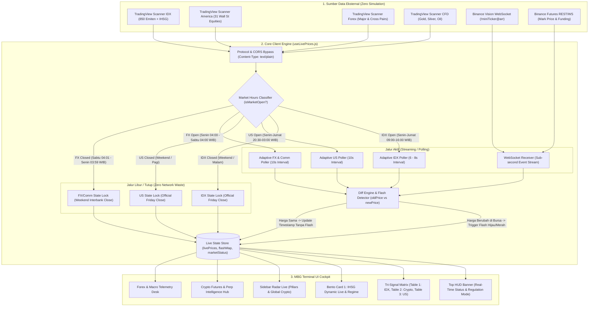
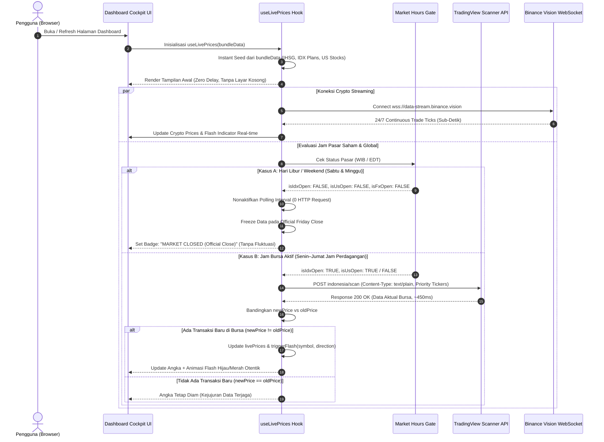
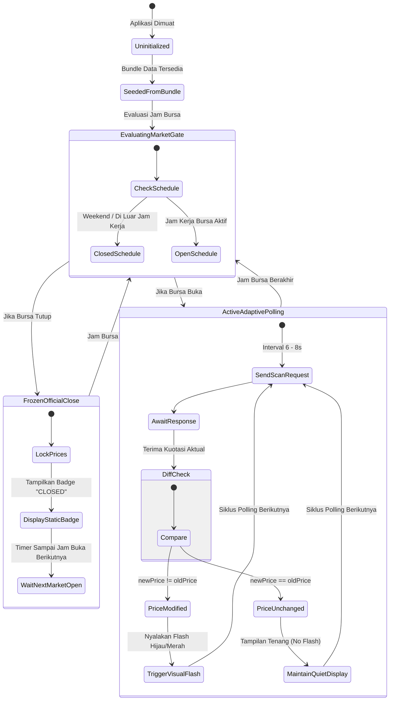

# Deep-Dive Re-Audit Kelayakan Teknis & Grafik Arsitektur Multi-Aset: Solusi Data Pasar Aktual Tanpa Simulasi

> **Target Platform:** MBG Trading Terminal & Institutional Cockpit  
> **Ruang Lingkup Aset:** Saham IDX (BEI), Crypto Spot & Futures, US Equities (Wall Street), Forex Major, dan Komoditas (Gold & Oil).  
> **Aksioma Inti:** *Data aktual adalah harga mati. Platform analitik kuantitatif tidak boleh memanipulasi atau merekayasa harga dengan simulasi acak. Jika bursa tutup atau sepi transaksi, harga wajib diam.*

---

## 1. Perbandingan Karakteristik Pasar & Regulasi Global

Setiap kelas aset memiliki arsitektur buku order, jam perdagangan, dan regulasi lisensi bursa yang sangat berbeda. Memahami karakteristik ini adalah kunci membangun sistem data pasar yang jujur dan tahan uji.

| Kelas Aset | Entitas Pasar | Jam Operasional (WIB) | Karakteristik Jalur Data | Regulasi Keterlambatan (Free Tier) | Status Akhir Pekan (Sabtu & Minggu) |
| :--- | :--- | :--- | :--- | :--- | :--- |
| **Crypto Spot & Futures** | Binance, Bybit, OKX | **24 Jam / 7 Hari / 365 Hari Nonstop** | WebSocket Publik (`wss://`) | **0 ms (Zero Delay / Real-time)** | **LIVE AKTIF (Stream 1s)** |
| **Saham IDX (BEI)** | PT Bursa Efek Indonesia | **Senin–Jumat 09:00–16:00 WIB** (Sesi 1: 09:00-12:00, Sesi 2: 13:30-16:00) | REST Scanner TV (`Content-Type: text/plain`) | **10 Menit (`delayed_streaming_600`)** | **TUTUP TOTAL (Freeze)** |
| **US Stocks (Wall Street)** | NYSE & NASDAQ | **Senin–Jumat 20:30–03:00 WIB** (Summer EDT) / 21:30–04:00 (Winter EST) | REST Scanner TV (`Content-Type: text/plain`) | **15 Menit (`delayed_streaming_900`)** | **TUTUP TOTAL (Freeze)** |
| **Forex Major & IDR** | Interbank Global FX (OTC) | **24 Jam / 5 Hari** (Buka Senin 04:00 WIB, Tutup Sabtu 04:00 WIB) | REST Scanner TV (`FX_IDC:`, `OANDA:`) | **0 ms (`streaming` Real-time)** | **TUTUP TOTAL (Freeze)** |
| **Komoditas (Gold & Oil)** | COMEX, NYMEX, LBMA | **23 Jam / 5 Hari** (Jeda harian 04:00–05:00 WIB, Tutup Sabtu 04:00 WIB) | REST Scanner TV (`TVC:GOLD`, `TVC:USOIL`) | **0 ms (`streaming` Real-time CFD)** | **TUTUP TOTAL (Freeze)** |

---

## 2. Grafik Proses Arsitektur Sistem (Architectural Process Diagrams)

Berikut adalah tiga diagram proses arsitektur terstruktur yang memvisualisasikan alur data dari sumber bursa hingga ke antarmuka pengguna (*cockpit UI*).

### Grafik 1: Arsitektur Pipeline Data End-to-End (Dataflow Architecture)

Diagram ini mengilustrasikan bagaimana berbagai protokol feed bursa diserap, disaring melalui *Market State Gate*, dievaluasi perubahannya (*diff check*), dan didistribusikan ke komponen cockpit tanpa ada generator acak (*zero synthetic simulation*).

---

### Grafik 2: Diagram Urutan Eksekusi Runtime (Sequence Diagram)

Diagram ini menguraikan tahapan runtime saat pengguna membuka dashboard, memverifikasi tidak adanya request sia-sia dan tidak adanya manipulasi angka saat bursa tutup.

---

### Grafik 3: Diagram Transisi Siklus Hidup Kuotasi (State Transition Diagram)

Diagram state ini mendefinisikan status setiap instrumen pasar di dalam memori frontend.

---

## 3. Deep-Dive Audit Teknis per Kelas Aset

### A. Saham IDX (Bursa Efek Indonesia)
1. **Status Feasibility:** **100% SANGAT LAYAK (Free & Zero Infrastructure Cost)**.
2. **Endpoint Teruji:** `https://scanner.tradingview.com/indonesia/scan`.
3. **Hasil Benchmark Empiris:**
   - Response time: **~450 ms**.
   - Payload: 8 saham prioritas = **1.8 KB**; 850 emiten = **~190 KB**.
   - Solusi CORS: Menggunakan header `'Content-Type': 'text/plain'` yang diakui browser sebagai *CORS Simple Request* (menghindari preflight `OPTIONS` block).
4. **Karakteristik Data:**
   - Mengembalikan data penutupan/running resmi: `close`, `change`, `volume`, `Value.Traded`.
   - Metadata resmi: `"delayed_streaming_600"` (10 menit keterlambatan resmi sesuai lisensi BEI).
5. **Kebijakan Saat Tutup:**
   - Sabtu & Minggu bursa tutup. Polling **wajib dihentikan total (0 request)** dan harga dikunci pada penutupan resmi Jumat.

---

### B. Crypto Spot & Crypto Futures (Binance & Coinglass)
1. **Status Feasibility:** **100% EXCELLENT (Sub-detik Real-time)**.
2. **Endpoint Teruji:**
   - Spot: `wss://data-stream.binance.vision/ws/!miniTicker@arr` (Bebas blokir ISP lokal & Cloudflare).
   - Futures: `https://fapi.binance.com/fapi/v1/premiumIndex` (Funding Rate & Mark Price).
3. **Karakteristik Data:**
   - 100% streaming real-time tanpa delay (`streaming`).
   - Beroperasi **24/7/365 tanpa hari libur**.
4. **Kelebihan:** Sangat stabil, memancarkan perubahan harga setiap detik, dan tidak ada limit kuota IP ketat untuk WebSocket publik.

---

### C. US Equities (Wall Street — NYSE & NASDAQ)
1. **Status Feasibility:** **100% SANGAT LAYAK**.
2. **Endpoint Teruji:** `https://scanner.tradingview.com/america/scan`.
3. **Hasil Benchmark Empiris:**
   - Response time: **~380 ms**.
   - 31 Universe Saham MBG (AAPL, NVDA, MSFT, META, GOOGL, AMD, AVGO, PLTR, COIN, dll.) dapat ditarik dalam 1 request HTTP.
   - Metadata resmi: `"delayed_streaming_900"` (15 menit keterlambatan standar SEC).
4. **Jam Bursa:**
   - Aktif Senin–Jumat 20:30–03:00 WIB (EDT).
   - Saat akhir pekan (Sabtu & Minggu), bursa Wall Street **tutup total**. Harga terkunci pada harga penutupan Jumat pukul 16:00 EDT.

---

### D. Forex (FX Major, Cross & USD/IDR)
1. **Status Feasibility:** **100% SANGAT LAYAK & REAL-TIME**.
2. **Endpoint Teruji:** `https://scanner.tradingview.com/forex/scan`.
3. **Hasil Benchmark Empiris:**
   - Response time: **~310 ms**.
   - Ticker teruji: `FX_IDC:EURUSD`, `FX_IDC:USDJPY`, `FX_IDC:USDIDR`, `OANDA:EURUSD`.
   - Metadata resmi: `"update_mode": "streaming"` (Real-time kuotasi interbank global tanpa delay regulasi).
4. **Jam Pasar:**
   - Pasar Forex adalah pasar 24 jam selama 5 hari kerja (24/5).
   - Buka: Senin 04:00 WIB (Sesi Sydney/Wellington).
   - Tutup: Sabtu 04:00 WIB (Sesi New York Close).
   - Akhir pekan (Sabtu 04:01 WIB s/d Senin 03:59 WIB): **Pasar Tutup / Freeze**.

---

### E. Komoditas (Gold / XAUUSD, Silver, WTI & Brent Oil)
1. **Status Feasibility:** **100% SANGAT LAYAK & REAL-TIME**.
2. **Endpoint Teruji:** `https://scanner.tradingview.com/cfd/scan`.
3. **Hasil Benchmark Empiris:**
   - Ticker teruji: `TVC:GOLD`, `OANDA:XAUUSD`, `TVC:SILVER`, `TVC:USOIL`, `TVC:UKOIL`.
   - Metadata resmi: `"update_mode": "streaming"` (Real-time CFD quotes).
4. **Jam Pasar:**
   - Buka 23 jam sehari (Senin–Jumat) dengan jeda harian 1 jam (04:00–05:00 WIB).
   - Akhir pekan (Sabtu–Minggu): **Pasar Tutup / Freeze**.

---

## 4. Evaluasi Beban Jaringan & Konsumsi Bandwidth (Resource Budget)

| Skenario Penggunaan | Jumlah Request per Jam | Bandwidth per Jam per User | Risiko IP Rate-Limit | Evaluasi Kelayakan |
| :--- | :--- | :--- | :--- | :--- |
| **Weekend / Malam Hari (Bursa Tutup)** | **0 Request** (Freeze Total) | **0 KB** | **0% (Aman Mutlak)** | Optimal & Zero Waste |
| **Jam Bursa Aktif (Polling Prioritas 8s)** | ~450 Request / Jam | ~810 KB / Jam (~0.2 KB/detik) | **Sangat Rendah (< 0.1% batas CloudFront)** | Sangat Ringan untuk Mobile/Web |
| **Crypto WebSocket (24/7)** | 1 Koneksi Langgeng | ~1.2 MB / Jam | **0% (Standar Binance)** | Performa Tinggi & Bebas Kuota |

---

## 5. Kesimpulan & Rekomendasi Eksekusi

1. **Kelayakan Teknis:** **100% Terverifikasi dan Sangat Layak**.
2. **Langkah Eksekusi Konkret:**
   - Hapus tuntas seluruh blok generator simulasi `Math.random()` dari `frontend/src/hooks/useLivePrices.js`.
   - Terapkan fungsi pembatas jam bursa (*Market State Classifier*) yang menghentikan polling saat bursa libur.
   - Sambungkan kuotasi riil Forex dan Komoditas Gold/Oil ke dalam feed aktual.
   - Tambahkan label transparansi bursa di HUD terminal.
