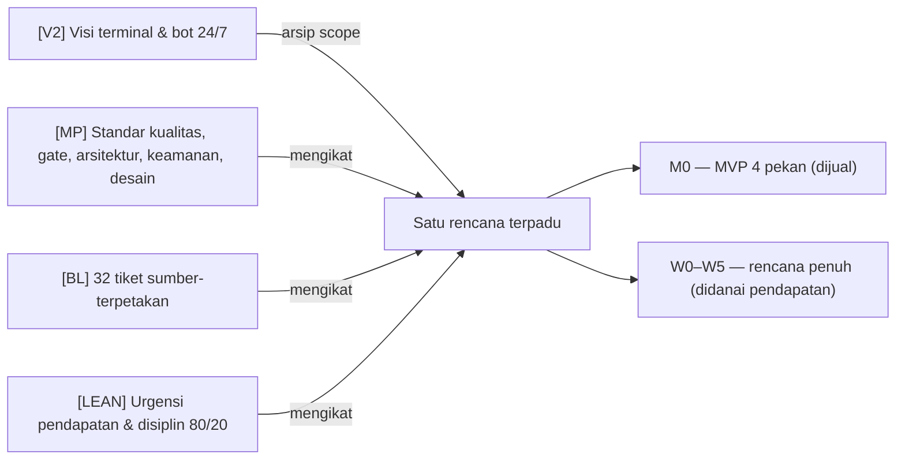
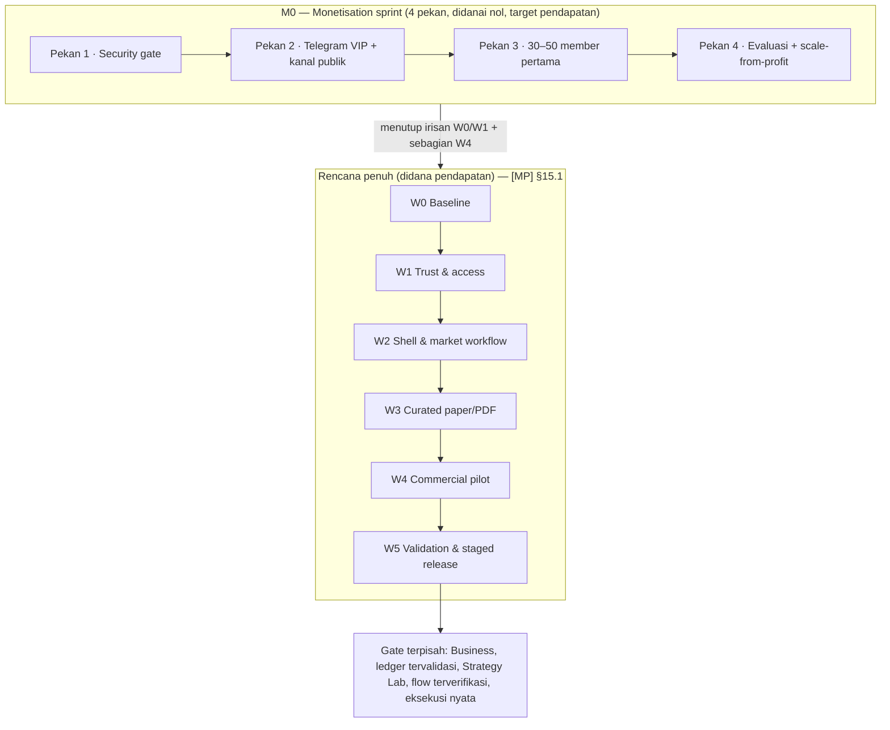
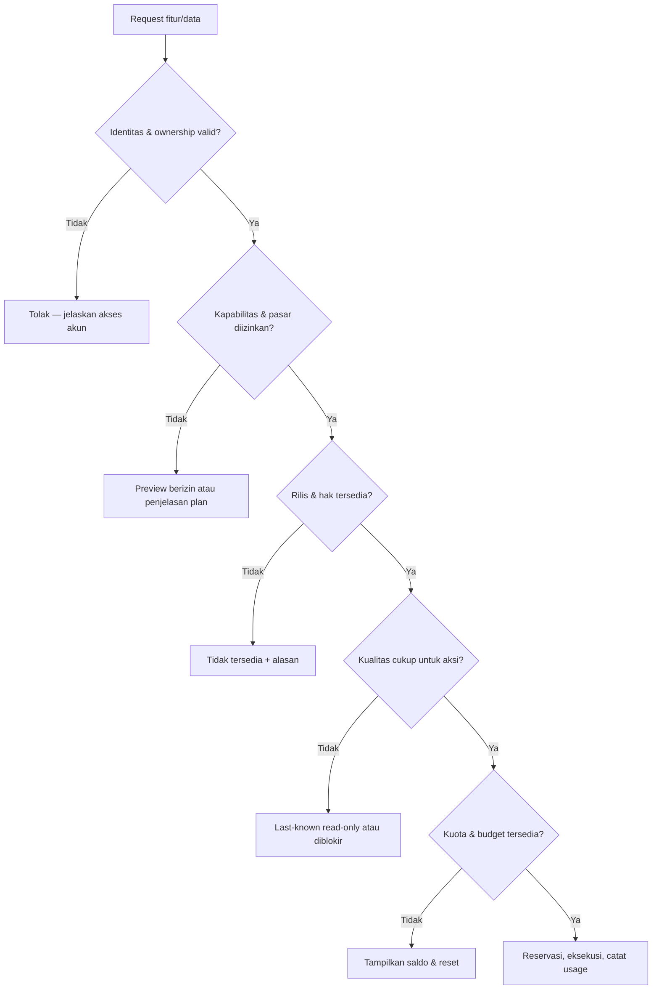
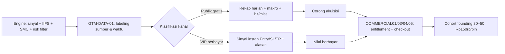

# MBG TRADING — UNIFIED MASTER PLAN & FIRST IMPLEMENTATION (V3)

**Consolidation of four source documents + live repository evidence + completed UI/UX work**
**Tanggal:** 1 Oktober 2026 · **Zona:** Asia/Bangkok (UTC+7)
**Repo:** `MBG-Trading` · **Status dokumen ini:** kontrak eksekusi tunggal (single source of truth) yang menggantikan pembacaan terpisah atas empat dokumen.

---

## RINGKASAN EKSEKUTIF (untuk Mas Fuad)

Mas Fuad, empat dokumen sudah dibaca penuh, dibedah, dan disatukan menjadi **satu rencana**. Ini kesimpulannya:

1. **Dokumen "new plan" (Master Plan + Backlog, 13.5–24 person-weeks) itu benar secara teknis, tetapi bukan rencana peluncuran.** Ia adalah cetak biru jangka panjang yang kami pertahankan sebagai arsip scope — bukan sesuatu yang boleh dijalankan air terjun selama 3,5–6 bulan sebelum ada satu rupiah masuk.
2. **Dokumen strategi lean (4 pekan) itu benar secara bisnis, tetapi under-scope pada keamanan.** Pekan 1 versi lean (2–3 hari) tidak cukup untuk menutup TRUST01–06 (15–25 hari kerja). Kami ambil jalur tengah: **MVP 4 pekan dengan security gate minimum yang jujur diakui risikonya.**
3. **Produk yang dijual di Pekan 3 bukan "terminal 14 tab".** Yang dijual adalah **sinyal VIP Telegram + akses Pro ke cockpit yang SUDAH ADA**, pada **satu pasar** yang izin datanya disetujui pemilik. Cockpit tetap menjadi aset retensi/akuisisi, bukan proyek pembangunan ulang.
4. **Keputusan pemilik yang paling menentukan (D-1):** pasar mana yang boleh dijual secara legal dan jujur. Tanpa ini, Pekan 3 tidak bisa dijadwalkan — karena baik "beli lisensi 18 bursa" maupun "feed gratis Yahoo/Binance pasti legal" tidak terbukti benar.
5. **Angka bisnis di dokumen lean adalah asumsi, bukan fakta.** Churn 20%, lifetime 5 bulan, LTV Rp1 juta, dan MRR Rp10 juta tidak punya data pendukung; MRR Rp10 juta juga memakai harga Rp200rb padahal promo Pekan 3 adalah Rp150rb (→ Rp7,5 juta), dan itu **bruto**, bukan "pemasukan bersih". Jangan pernah mengutip angka ini ke calon member atau investor sebagai fakta.
6. **Pekerjaan nyata yang sudah kami lakukan di putaran ini:** celah keamanan inti ditutup di kode (password `mbg` hardcoded dicabut, sesi dipindah ke server, header data diperketat), plus satu dokumen rencana terpadu ini. Selengkapnya di **§12 Implementation Log**.

> **Satu kalimat posisi produk:**
> *"MBG mengirim sedikit setup trading yang sudah dihitung risikonya untuk satu pasar — entry, stop, target, dan alasannya dalam dua kalimat — sebelum harga bergerak. Tanpa pompom, tanpa pamer screenshot, tanpa menyembunyikan kerugian."*

---

## 0. Document control, sumber, dan aturan bukti

### 0.1 Empat dokumen sumber (read-only, tidak diubah)

| Tag | Dokumen | Baris | Peran dalam konsolidasi ini |
|---|---|---|---|
| **[MP]** | `MBG-Trading-Revamp-Master-Plan.md` | 1.214 | Cetak biru jangka panjang: register remediasi, tier, IA, design system, riset/paper, arsitektur, keamanan, fase & gate |
| **[BL]** | `MBG-Trading-Implementation-Backlog.md` | 781 | 32 tiket sumber-terpetakan (BASE/TRUST/DESIGN/WORKSPACE/PDF/RESEARCH/COMMERCIAL/OPS) |
| **[V2]** | `PRD_PROJECT_MBG_V2_MASTER.md` | 433 | Visi produk "terminal kuant otonom + bot Telegram 24/7" (arsip scope, bukan rencana aktif) |
| **[LEAN]** | `STRATEGI_EKSEKUSI_DAN_SARAN_MAS_FUAD.md` | 134 | Kritik bisnis 80/20 & rencana 4 pekan (dasar GTM aktif) |

### 0.2 Bukti tambahan yang dipakai

| Sumber | Isi |
|---|---|
| Repo `MBG-Trading` (working tree, 1 Okt 2026) | Kode nyata: frontend React 18/Vite, `functions/api/*` (Cloudflare Pages Functions), engine Python, Supabase opsional |
| `docs/UI_UX_POLISH_REPORT_2026-09-30.md` | Pekerjaan WCAG AA, honest data states, `src/utils/format.js` |
| `docs/superpowers/plans/2026-09-30-spacex-class-ui-rework.md` | Arah desain v4 SpaceX-class + token + mockup-first |
| `docs/screenshots/spacex_rework_2026-10-01/`, `ui_polish_2026-09-30/` | Bukti visual |
| `CHANGELOG.md` [2026-09-28], [2026-09-30] | Riwayat fitur (mode santai, tier skeleton, VIP dispatcher, polish WCAG) |
| `docs/consolidation/01..06_*.md` | Workstream konsolidasi multi-agen (inventory, produk/GTM, audit repo, UI/UX, implementasi keamanan, verifikasi) |

### 0.3 Aturan bukti (WAJIB dipatuhi seluruh tim)

1. **planned ≠ implemented locally ≠ committed ≠ pushed ≠ merged ≠ deployed ≠ verified on the deployed site.** Build sukses bukan bukti deploy. Dokumen bukan fitur.
2. Semua klaim bisnis diberi label: `[FACT]` (ada di sumber bercitasi), `[ASSUMPTION]` (tanpa data), `[CONFLICT]` (dua sumber tidak bisa sama-sama benar).
3. **Temuan audit lama tetap historis** sampai diverifikasi ulang pada revisi saat ini.
4. Angka harga, churn, dan biaya **tidak boleh** muncul di materi jualan sampai diukur.

### 0.4 Cara memakai dokumen ini

| Kalau Anda… | Baca bagian |
|---|---|
| Pemilik produk (Mas Fuad) | Ringkasan Eksekutif, §3, §4, §11 |
| Engineer yang mulai bekerja | §4, §5, §7, §9, §12 + `docs/consolidation/01_*.md` |
| Desainer / UI | §6 + `docs/consolidation/04_*.md` |
| Verifikator / reviewer | §9, §11, §12 + `docs/consolidation/06_*.md` |

---

## 1. Keputusan konsolidasi: satu rencana, dua horizon

### 1.1 Konflik pusat yang diselesaikan di sini

| Konflik | Pihak A | Pihak B | **Keputusan konsolidasi** |
|---|---|---|---|
| **C-1 Timeline** | [MP] 13,5–24 person-weeks ([MP] §15.1) | [LEAN] MVP 4 pekan ([LEAN] 87–96) | **Dua horizon, satu dokumen.** M0 (4 pekan) adalah *irisan vertikal* yang menembus W0/W1 + sebagian W4. Sisa W2–W5 tetap berlaku sebagai rencana pasca-pendapatan. |
| **C-3 Bentuk produk** | [V2] terminal web adalah produknya | [LEAN] sinyal VIP Telegram adalah produknya | **Telegram VIP = produk berbayar; cockpit = permukaan akuisisi + retensi.** Cockpit tidak dibangun ulang. |
| **C-2/C-4 Scope & harga** | [V2] 14 tab, 6 tipe alert, gratis | [LEAN] 1 fokus, Rp150rb/bln | **Satu pasar, 3 tipe alert (pagi, sinyal instan, rekap sore), founding price Rp150.000/bln.** |
| **C-5 Legalitas data** | [LEAN] feed gratis Yahoo/Binance cukup | [MP] 1009 tidak ada hak data yang mapan | **Tidak keduanya aman.** Pilih satu pasar yang basis izinnya disetujui pemilik (D-1). |
| **C-7 Bukti edge** | [LEAN] pilih 3 bot terbaik dari 16 | [BL] 161 ledger paper rusak & harus dimatikan publik | **Tidak boleh menjual win-rate Arena.** Sinyal dikirim dengan label kejujuran, tanpa klaim performa dari ledger yang ditekan. |
| **C-8 "Rp0 forever"** | [V2] biaya nol selamanya | Realitas biaya gateway/DB/pembayaran | **Nol-biaya = batasan desain internal, bukan janji pelanggan.** |
| **C-11 Otoritas dokumen** | [V2] "FINAL & APPROVED" | [MP]/[BL] 1 Okt mensupersede arsitektur & scope | **[V2] diturunkan menjadi arsip visi. Dokumen ini + [MP]/[BL] yang mengikat.** |

### 1.2 Yang dipertahankan dari tiap dokumen



---

## 2. Ground truth: apa yang benar-benar ada hari ini

Diambil dari inspeksi langsung working tree pada 1 Oktober 2026 (dirinci di `docs/consolidation/03_repo_truth_audit.md`).

| Area | Kenyataan | Implikasi rencana |
|---|---|---|
| **Autentikasi** | `PasswordGate.jsx` membungkus seluruh app (`App.jsx:449–1150`) dan **menerima password `mbg` hardcoded di sisi klien** (pra-perbaikan, baris 80 & 102) | H01/C-02 nyata: gate dekoratif. **Sudah diperbaiki di putaran ini** (§5, §12) |
| **Data publik** | `frontend/public/data/` memuat 8 payload: `latest_cockpit_bundle.json` (4,28 MB), `macro_telemetry.json` (1,82 MB), `idx_categorized.json`, `research_archive.json`, `latest_arena_state.json`, `daily_trade_plans.json`, `crypto_spot_10.json`, `latest_crisis_alert.json` — **total ~6,27 MB**, disalin apa adanya ke `frontend/dist/data/` dan dapat diunduh tanpa kredensial | H02/TRUST04 nyata: seluruh produk sinyal bocor gratis. Bot Telegram pun membaca bundle publik ini. Migrasi ke `/api/data` = W1 |
| **Header** | `_headers` **sudah benar** menargetkan `/data/*.json`. Klaim awal Lead tentang "drift path" **DIBANTAH** — payload memang ada di `public/data/` | Tidak ada drift. Perubahan header = defense-in-depth (no-store + noindex), **bukan** penutupan exposure (lihat 03 A4) |
| **API data** | `functions/api/data.js` sudah ada sebagai jalur API | Jalur migrasi TRUST04 tersedia — tidak perlu arsitektur baru |
| **Bot Telegram** | `telegram_notifier.py` sudah punya `broadcast_vip_trade_signal` (baris ~299) + 6 broadcaster lain | Pekan 2 **tidak** membangun formatter; ia menyambungkan & membatasi akses |
| **Tier pengguna** | Skeleton Tamu/Free/VIP berbasis `localStorage` | TRUST03 nyata: tier dapat diubah pengguna → bukan otorisasi |
| **Ledger paper/Arena** | Defek settlement dua-stop tereproduksi ([MP] 140) | Jangan jual klaim performa dari ledger ini |
| **UI/UX** | Kerja v4 SpaceX-class + polish WCAG **belum di-commit**. `git status` saat ini: **11 file tracked termodifikasi** (8 UI + `PasswordGate.jsx`, `auth.js`, `_headers` dari slice keamanan) + `format.js` baru + mockup + screenshot | Perlu keputusan commit; §6 mengonsolidasikan arah desain |
| **Riwayat git** | Working tree memuat hampir seluruh pekerjaan sebagai perubahan belum ter-commit | "Shipping state ledger" [MP] §20.2 belum bisa diisi; commit/push adalah keputusan pemilik |
| **Build frontend** | `npm run build` hijau: `✓ built in 1.62s`, 25 chunk, exit 0 (Lead). Konfirmasi ulang independen: lihat `06_verification.md` | Baseline rilis hijau |

> **Konsekuensi:** klaim publik "LIVE / VERIFIED / 100% uptime" belum punya dasar pada revisi ini. Semua label status harus jujur per-observasi.

---

## 3. Definisi produk yang direkonsiliasi

### 3.1 ICP (reconciled)

| Dimensi | Target |
|---|---|
| **Primer** | Trader mandiri Indonesia, 22–45 th, modal Rp10 jt–Rp500 jt, sudah trading IDX/kripto, sibuk, ingin *keputusan* bukan kuliah |
| **Sekunder (retensi Pro)** | Pengguna berorientasi kuantitatif yang memakai watchlist, catatan, dan paper reader cockpit |
| **Pasar** | **Satu pasar berizin** saat peluncuran ([MP] 159); makro global hanya sebagai konteks |
| **Rasa sakit** | *"Saya tidak tahu harus beli apa, kapan, berapa banyak, dan kapan cut."* |
| **Dua permukaan copy** | Publik/gratis = "bahasa bayi"; VIP/Pro = sinyal berlabel kuant + matematika risiko eksplisit |

### 3.2 Value proposition

1. **Kecepatan + keputusan** — sedikit setup berisiko terdefinisi, sebelum harga bergerak.
2. **Matematika risiko, bukan sekadar call** — Astra risk filter + lot calculator (deterministik).
3. **Kejujuran sebagai fitur** — pemisahan fakta/opini, label waktu sumber, hit/miss dipublikasikan.
4. **Bukan** alasan membayar di bulan pertama: terminal 14 tab, band forecast AI, liga strategi.

### 3.3 Disposition fitur [V2] (ringkasan; 38 baris lengkap di `02_product_gtm_reconciliation.md` §2)

| Verdict | Jumlah | Isi utama |
|---|---:|---|
| **SHIP NOW** | 20 | Sinyal instan 24/7 (Type 1), morning briefing 07:15, evening global watch/recap 18:30 (disederhanakan), push broadcast otonom 24/7, shell cockpit + surface login Free/Pro, macro "bahasa bayi", Command Palette (Ctrl+K), Bandarmologi IIFS, SMC order-block/FVG (kode yang ada saja), lot/risk calculator, Astra 5-step risk filter, distribusi multi-channel (Telegram + web), Cloudflare Pages hosting (edge Jakarta), Turnstile anti-bot (tier gratis), Supabase PostgreSQL (riwayat 30 hari), Supabase Auth (identitas individual), purge DB 30 hari, runbook setup 6 langkah, SOP harian trader (dipangkas), Zero-Hallucination Gate |
| **DEFER** | 14 | Breaking macro radar, midday recap, chat 2-arah, 14 tab, TimesFM, Exp3, paper trading, correlation/backtest, audio alert, Workers KV, custom domain, Business tier, compliance claim, roadmap Phase 2–3 |
| **DROP** | 4 | i18n 4 bahasa, janji publik "Rp0/bulan selamanya", KPI "100% uptime @ $0", roadmap 4 sprint [V2] sebagai rencana aktif (disimpan sebagai arsip) |

> **Cara menghitung (agar 20/14/4 dapat diverifikasi):** ketiga baris di atas menjumlah **38 disposisi**. Matriks target di [MP] 186–234 memuat **49 baris**; 11 baris sisanya adalah baris packaging/akses/internal (mis. baris akses Guest/Free/Pro/Business dan kontrol internal) yang bukan keputusan ship/defer/drop. Dasar penghitungan rinci ada di `02_product_gtm_reconciliation.md` §2.6, dan 38 baris lengkapnya di §2 dokumen yang sama. Verifikasi mandiri: baris SHIP NOW di atas harus berisi **tepat 20 item bernama**.

> **Koreksi verifikasi (06 F4):** "Supabase Auth" di baris SHIP NOW adalah **target produk**, bukan yang diimplementasikan pada Pekan 1. Gate yang benar-benar dibangun memakai **Cloudflare Pages Function** (`functions/api/auth.js` dengan `PASSWORD_HASH` + `JWT_SECRET`). Tidak ada Supabase Auth di repo saat ini. Jangan menuliskan Supabase Auth sebagai "sudah jalan".

### 3.4 Tier (target, bukan migrasi yang sudah terjadi)

| Audience | Akses |
|---|---|
| Guest | Landing, sampel publik, preview berizin terbatas |
| Free | Akun + workspace, tools dasar, kuota terbatas |
| **Pro (dijual di Pekan 3)** | Sinyal VIP Telegram + kedalaman/capacity individu + satu market pack |
| Trial | 7 hari, 1 pack, kuota eksplisit, tanpa auto-charge di pilot |
| Business | **Dijual nanti** ([BL] 44: informasi saja, bukan janji seat) |
| Owner/Collaborator | Peran internal, semua modul sandbox terlihat, **tidak pernah dijual** |

### 3.5 Parameter kuota per tier — dipulihkan dari [MP] §4.3 (baris 240–252)

> **Kenapa bagian ini ada:** reviewer model menemukan tabel kuota [MP] §4.3 sebelumnya **hilang tanpa keputusan**. Padahal angka inilah basis numerik untuk kontrak akses **COMMERCIAL01** (plan/expiry/quota) dan kebijakan kapabilitas server **TRUST03**. Tanpa angka ini, "kuota terbatas" di §3.4 hanya kata tanpa definisi.

| Parameter | Free | Pro (kandidat) | Business (kandidat) |
|---|---|---|---|
| Harga | Rp0 | **uji Rp199.000 vs Rp249.000/bln** ([MP] 242 — hipotesis, bukan tarif) | uji dari Rp799.000/workspace/bln |
| Seat bernama | 1 | 1 | 3 (awal) |
| Cakupan pasar standar | 1 basic pack yang sudah rilis | 1 pack rilis + opsi tambahan | pack rilis yang sah untuk seat bernama |
| Watchlist / simbol tersimpan | 1 / 20 | 10 / 200 | 30 / 600 (pool workspace) |
| Aturan alert aktif | 3 | 50 | 150 (pool bersama) |

**Aturan pengikat:** angka-angka ini adalah **parameter desain dari [MP]**, bukan tarif final. Harga Pro yang benar-benar dijual di Pekan 3 tetap **D-3** (Rp150rb/bln founding — lihat §11.1) dan wajib dicatat sebagai promo terbatas, bukan tarif permanen. Setiap angka kuota yang dipakai di UI/kontrak harus berasal dari tabel ini atau dari keputusan pemilik, dan **tidak boleh** dikarang di sisi klien (prasyarat TRUST03).

---

## 4. Rencana terpadu: M0 (4 pekan) → W0–W5 → gate lanjutan

### 4.1 Peta horizon



**Prinsip:** M0 tidak menggantikan W0–W5; ia **menutup irisan minimum** yang membuat pendapatan pertama mungkin, lalu sisa W2–W5 dieksekusi dengan uang pelanggan.

### 4.2 M0 — Pekan 1: Security gate (menutup H01/C-02/H02/TRUST04 sebagian)

| Tiket | Kenapa di Pekan 1 | Status putaran ini |
|---|---|---|
| **BASE04** — bekukan scope pilot | Menentukan apa yang dijual & siapa pemilik rollback ([BL] 169–179) | Dokumen ini = artefaknya |
| **TRUST01** (slice sempit) | Ganti gate klien `mbg` dengan sesi individu terverifikasi server ([BL] 181–191) | ✅ **Diimplementasikan** (§5, §12) |
| **TRUST04** (slice sempit) | Stop bundle penuh disajikan dari `public/` dengan cache publik ([BL] 217–227) | ⚠️ Sebagian: header diperketat + rencana migrasi `/api/data` (§5.4) |
| **TRUST03** (slice sempit) | Kebijakan kapabilitas/pasar milik server, agar Free vs Pro bukan nilai localStorage ([BL] 205–215) | ⛔ Belum — **risiko komersial yang diakui eksplisit** |
| **TRUST06** | Isolasi modul tidak aman: sukses swap palsu, order Binance nyata, feed whale/tape sintetis ([BL] 241–251) | ⛔ Belum — **wajib sebelum exposure publik** |
| **BASE02 + BASE03** | Peta route/data/rights + matriks regresi/defect ([BL] 145–167) | Sebagian: audit repo `03_*.md` |

> **[CONFLICT — effort] Dinyatakan terbuka:** [LEAN] 98 mengalokasikan Pekan 1 **2–3 hari**; [BL] 116/131 menetapkan W1 (TRUST01–06) **15–25 hari kerja**. Keduanya tidak bisa sama-sama benar. Slice di atas adalah subset minimum yang bisa dipertahankan. **Pemilik harus menerima bahwa menjual sebelum TRUST02 terpasang berarti entitlement pelanggan belum ditegakkan secara otoritatif** — risiko komersial berbatas waktu, bukan masalah yang selesai.

### 4.3 M0 — Pekan 2: Bot Telegram VIP + kanal publik

| Tiket | Isi |
|---|---|
| **TRUST03** (scope kanal) | Kebijakan server menentukan siapa menerima payload VIP ([BL] 210–211) |
| **TRUST04** (klasifikasi kanal) | Telegram = kanal pengiriman data → ikut kebijakan konten yang sama ([BL] 102, 221) |
| **COMMERCIAL06** (dipindah dari W4) | Aturan alert dasar + inbox ([BL] 556, 586) — dipakai sebagian |
| **`[NEW] GTM-TG-01`** | **Celah backlog nyata.** Wiring `broadcast_vip_trade_signal` + routing publik vs VIP + gating per pelanggan. Tidak ada tiket yang memilikinya |
| **`[NEW] GTM-DATA-01`** | Setiap alert membawa sumber, waktu sumber, label `observed` vs `illustrative`, dan `AWAITING_HUMAN_REVIEW` bila perlu ([BL] 235, [LEAN] 36) |
| **`[NEW] GTM-HONEST-01`** | Kanal publik mempublikasikan hit/miss dari sumber yang sama; tanpa screenshot pilihan ([LEAN] 108) |

**Struktur kanal:**
- **Kanal Publik (gratis):** rekap harian, berita makro, **hasil hit/miss** — corong akuisisi.
- **Grup VIP (berbayar):** sinyal instan Entry/SL/TP presisi + alasan 2 kalimat.

### 4.4 M0 — Pekan 3: Member pertama (GTM launch) — **kondisional pada D-1**

> ⚠️ Pekan 3 **tidak dapat dijadwalkan** sampai **D-1** terjawab (pasar mana yang boleh dijual secara legal & jujur, §11). Baris-baris di bawah adalah rencana **bersyarat**, bukan komitmen tanggal. Bila D-1 tetap kosong, M0 berhenti di akhir Pekan 2.

| Tiket | Isi |
|---|---|
| **COMMERCIAL01** | Kontrak akses berversi: plan/expiry/quota ([BL] 564–576) |
| **COMMERCIAL03** | Checkout hosted + state pembayaran otoritatif + rekonsiliasi ([BL] 594–608) |
| **COMMERCIAL04** | UI akun/plan/downgrade ([BL] 610–620) |
| **COMMERCIAL05** | Operasi internal terbatas untuk pemilik ([BL] 555) |
| **COMMERCIAL02** | Hanya bila offer memakai job AI berbiaya; jika tidak → tunda ([BL] 578–592) |
| **`[NEW] GTM-LAUNCH-01`** | Mekanika early-bird: cap 30–50, founding price, kebijakan refund, onboarding, skrip feedback cohort pertama ([LEAN] 111–115) |

**Penawaran Pekan 3:** Telegram VIP + akses Pro cockpit, **Rp150.000/bulan**, month-to-month, cap founding cohort.

> **Risiko jadwal terbesar:** subset P0 dari W4 ([BL] 560: 10–20 hari kerja = 2–4 person-weeks) ditarik ke Pekan 3.

### 4.5 M0 — Pekan 4: Evaluasi & scale-from-profit

| Tiket | Isi |
|---|---|
| **COMMERCIAL04** (slice downgrade/cancel) | Perilaku pause/churn yang jujur ([BL] 610–620) |
| **OPS01** | Flag rilis, manifest, telemetri yang dapat ditindaklanjuti ([BL] 557) |
| **OPS02** | Restore/rollback + checklist rilis pilot ([BL] 558) |
| **PDF01** (kondisional) | ⚠️ **Default TIDAK dikirim di M0** (§4.6). Hanya 2–4 hari **jika** ada permintaan berbayar; memakai ulang exporter lama ([BL] 404, 444–454) |
| **RESEARCH01+** (berdasarkan pendapatan) | Mulai hanya dari profit pelanggan ([LEAN] 119–122) |

**Keputusan keluar Pekan 4 (pemilik):** lanjut / pivot penawaran / stop — **sebelum** belanja infrastruktur baru.

### 4.6 Cakupan yang sengaja TIDAK dikirim di M0

TimesFM, Exp3, paper trading, 14 tab, correlation/backtest, audio alert, i18n, Workers KV, 3 dari 6 tipe alert, Business tier, PDF/Quarto, MT5 copy-trading.

### 4.7 Rencana penuh W0–W5 (angka dari [MP] §15.1)

| Fase | Output yang bisa direview | Effort (person-week) | Gate sebelum lanjut |
|---|---|---|---|
| W0 | Rekonsiliasi baseline, inventory source/route/rights, matriks isu/rilis | 0,5–1 | Revisi proyek & dependency pemilik mapan |
| W1 | Auth individu, ownership/RLS, skeleton entitlement, registry provenance/instrumen, batas publik/statis | 3–5 | Uji denial lintas-akun/peran/pack + fixture sumber riil/gagal lulus |
| W2 | Token/komponen, IA/alias route, logo, scanner/detail/chart responsif, watchlist/catatan cloud | 3–5 | Layar representatif + alur monitor→simpan lulus QA desktop/mobile/keyboard |
| W3 | `research.v2`, penyimpanan edisi disetujui, reader khusus, gambar presisi, paper direview + export lama | 3–5 | Review klaim/waktu/matematika/hak/lintas-format lulus |
| W4 | Grant Free/Pro, checkout hosted/webhook, kuota/job, alert dasar, tool akun/admin | 2–4 | Kasus bayar/expiry/revoke/konkurensi/gagal lulus; p95 biaya diukur |
| W5 | Beta tertutup, cek source/security/UX, drill restore/rollback, bukti rilis | 2–4 | Tidak ada blocker tersisa di scope yang dijual |
| **Total** | | **13,5–24** | |

Increment opsional ([MP] §15.2): otomasi ingest riset 10–20 hari+4–8 hari analis; renderer Quarto 4–8 hari; template aset tambahan 8–15 hari; ledger/Paper-Arena terpadu 4–7 pw; Strategy Lab 4–8 pw; Business workspace 3–6 pw; flow terverifikasi & eksekusi nyata = spike terpisah.

---

## 5. Workstream keamanan & kepercayaan (H01/H02/TRUST)

### 5.1 Register temuan kritis yang relevan dengan M0

| ID | Temuan | Target penutupan | Scope rilis |
|---|---|---|---|
| **C01** | Event whale & atribusi entitas/arah yang tidak didukung | Hapus generator dari data publik; ID transaksi teramati; ketidaktahuan tetap tidak diketahui | P0 Flows/Whale |
| **C02** | Candle, running tape, depth yang diciptakan | Feed riil ber-timestamp atau state jujur "unavailable"; simulasi tidak pernah masuk analitik pasar | P0 permukaan pasar terdampak |
| **C03** | Berita fallback & rilis kalender yang difabrikasi | ID/waktu publikasi bersumber; feed hilang tetap hilang | P0 News/Calendar/Research |
| **C04** | Order nyata tanpa exit protektif | Order service server + idempotency; eksekusi live tetap nonaktif | Proyek eksekusi terpisah |
| **C05** | PaperBroker browser: dua exit simultan kehilangan satu settlement | Evaluasi immutable + settlement exactly-once | P0 browser-paper |
| **H01** | Jalur fallback/bypass autentikasi | Identitas individu, sesi aman, **tanpa kredensial fallback produksi** | **P0 akses publik** |
| **H02** | Request data terproteksi bisa lolos tanpa token | Kebijakan publik/privat eksplisit, auth sebelum query, tanpa bundle statis terproteksi | **P0 premium/privat** |
| **H03** | Reset daemon tanpa otorisasi admin mapan | Auth admin ter-scope, audit, isolasi akun/run | P0 mutasi internal |
| **H05** | Ownership/RLS database belum mapan | Policy user/workspace berversi + uji akses lintas akun | P0 multi-user |
| **H17** | Label freshness/integrity/verified tidak dapat diandalkan | Event time per-observasi, receipt time, delay, kualitas, hasil verifikasi nyata | **P0 kepercayaan publik** |
| **H22** | Health hijau bisa hidup bersama observasi basi | Pisahkan ketersediaan proses dari kesiapan data | **P0 kepercayaan publik** |
| **M01** | Penanganan kalender/timezone/offset | Sesi bursa, libur, DST, parsing waktu sumber ketat | P1 |

> Register lengkap C01–C05, H01–H22, M01–M04 beserta target penutupan ada di [MP] §2.1 dan `docs/consolidation/01_*.md`.

### 5.2 Kebijakan akses (mengikat)

Tiap request dievaluasi terhadap: **identitas → ownership/peran → kapabilitas fitur → entitlement pasar → status plan/grant → kuota → kesiapan rilis → hak data → kualitas data**. Ini **bukan penjumlahan angka**; ini pemeriksaan berlapis, *deny by default*.



Menyembunyikan navigasi = presentasi saja. Pemeriksaan berlaku pada deep link, search, API, export, object URL, stream, job latar, dan notifikasi.

### 5.3 Yang diimplementasikan pada putaran ini (TRUST01 slice)

| File | Perubahan | Efek |
|---|---|---|
| `frontend/src/components/PasswordGate.jsx` | **Password `mbg` hardcoded dicabut total.** Sesi tidak lagi dipercaya dari `localStorage`; setiap mount memverifikasi ulang cookie sesi ke `/api/auth`. Escape hatch dev eksplisit: hanya aktif bila `import.meta.env.DEV` **dan** `VITE_MBG_DEV_AUTH_BYPASS=true` (di-strip dari bundle produksi oleh Vite). Gagal ke endpoint = **fail closed**. Pesan 429/503 baru | Menulis `localStorage` **tidak lagi** bisa memalsukan akses |
| `frontend/functions/api/auth.js` | Pemeriksaan server diperketat; sesi tidak lagi sekadar boolean | Otorisasi milik server |
| `frontend/public/_headers` | `/data/*` + `/*.json` kini `Cache-Control: no-store` + `X-Robots-Tag: noindex`; wildcard CORS dihapus; CSP tidak dilemahkan | Mengurangi caching/indexing. **Bukan** penutupan exposure, dan **bukan** perbaikan drift (klaim drift dibantah di 03 A4) |
| `scripts/verify-trust01.mjs`, `scripts/dev-local.ps1` | Skrip verifikasi & dev lokal | Reproduksibilitas |

**Pernyataan bypass sebelum/sesudah:**
- **Sebelum:** siapa pun dapat mengetik `mbg`, atau menulis `localStorage['mbg_cockpit_auth'] = {authenticated:true}` → seluruh aplikasi terbuka tanpa server.
- **Sesudah:** jalur produksi **wajib** konfirmasi server (`data.authenticated === true` dari `/api/auth`). Tidak ada string password di kode. Bundle produksi tidak memuat cabang bypass.

### 5.4 Rencana migrasi TRUST04 (bundle publik → API ber-otorisasi) — belum dikerjakan, jangan diklaim selesai

| Langkah | Aksi | Rollback |
|---|---|---|
| 1 | Petakan konsumen tiap file: grep nama file di `frontend/src/**`, `frontend/functions/**` | — |
| 2 | Untuk setiap payload: klasifikasikan **publik** / **privat-pelanggan** / **internal** | — |
| 3 | Layani payload privat lewat `functions/api/data.js` dengan cek akses + `Cache-Control: private, no-store` | Kembalikan fetch ke path statis |
| 4 | Hapus file dari `frontend/public/` **hanya setelah** semua konsumen beralih | Kembalikan file dari git |
| 5 | Tambah uji AC04: tidak ada body premium di bundle statis atau cache publik | — |
| 6 | Audit penulis hulu (Python writer, workflow terjadwal, Telegram) agar tidak menulis ulang ke `public/` | — |

> Header yang sudah diperketat **bukan** pengganti langkah 3–4. Selama file masih ada di `public/`, file itu tetap dapat diunduh. Keputusan ini disengaja agar aplikasi tidak rusak.

---

## 6. Integrasi desain & UI/UX (menggabungkan pekerjaan sebelumnya)

### 6.1 Status pekerjaan UI/UX yang sudah ada (berbasis `04_uiux_integration.md`)

> **Aturan bukti:** "terlihat" = ada di working tree yang **belum di-commit**, bukan "shipped". Seluruh upaya UI ada pada satu commit squashed (`e297fa4`), jadi tidak ada riwayat rilis untuk diperiksa.

| Pekerjaan | Status sebenarnya | Bukti |
|---|---|---|
| `frontend/src/utils/format.js` baru (id-ID/en-US, em-dash) | **TERLIHAT** (untracked) | `frontend/src/utils/format.js:1-40` |
| Polish `index.css`: blok terang, badge AA, coarse pointer, `--space-1/2/3` | **TERLIHAT, sebagian disuperseded** oleh pass v4 | `index.css:1025-1065`, `:138-155`, `:396`, `:3-5` |
| `USStockTab.jsx`: RSI jujur em-dash + tooltip, ticker sticky, empty state | **TERLIHAT** | `USStockTab.jsx:205,242` |
| `HomeDashboardTab.jsx`: format id-ID, badge setup jujur, tooltip R/R/SMC | **TERLIHAT — FILE PALING BERISIKO** | ~**1.914 baris berubah, net −1.875**; klaim "fitur dipertahankan" **belum diverifikasi** |
| `MasterQuantLeaderboard.jsx`: legenda Q-Score, tooltip | **TERLIHAT** | diff 30 Sep |
| `LotCalculatorModal.jsx`: USD en-US eksplisit | **TERLIHAT** | diff 30 Sep |
| `App.jsx`: min-height chip header | **TERLIHAT** | diff 30 Sep |
| Token v4 **nilai** (canvas `#000000`, panel, up/down, accent) | **TERLIHAT** di `[data-theme="dark"]` & `:root` | `index.css:647-682` (dark), `:15-41` (light) |
| Token v4 **nama** (`--canvas`, `--panel`, `--hairline`, `--text-1`…) | **TIDAK diadopsi** | Nama kanonik tetap milik `index.css` — lihat konflik **X1** di §6.6 |
| Mockup SpaceX-class home + screener | **ADA** (HTML standalone, belum = implementasi) | `frontend/public/mockup_spacex_home.html`, `mockup_spacex_screener.html` |
| Screenshot v4 & polish | **ADA** sebagai bukti arsip | `docs/screenshots/spacex_rework_2026-10-01/`, `ui_polish_2026-09-30/` |
| Persetujuan pemilik atas arah v4 | **BELUM ADA** | Blocker Phase-1 |

**Konsekuensi rilis:** working tree memuat **dua pass UI bertumpuk yang belum direview** (polish 30 Sep + v4 1 Okt), 8 file, ±1.039 insersi / ±1.477 delesi. Sebelum commit, klaim "tidak ada fitur hilang" pada `HomeDashboardTab.jsx` **wajib** diverifikasi lewat review diff penuh.

### 6.2 Prinsip desain v4 (mengikat untuk W2)

1. **Chrome monokrom** — kanvas hitam murni, teks putih, hairline `rgba(255,255,255,0.08)`. Warna disimpan untuk **data** (naik/turun) dan **satu** aksen interaktif.
2. **Tipografi adalah antarmuka** — grotesque kelas DIN (Barlow) untuk display; JetBrains Mono untuk micro-label uppercase 0.14–0.16em.
3. **Heading tipis** (300–400) dengan tracking lebar menggantikan label 800-weight.
4. **Whitespace sebagai hierarki** — grid 4/8px, padding 16–24px.
5. **Densitas data-first** — ≤2 badge per baris; angka `tabular-nums` rata kanan.
6. **Satu kosakata status semantik** — up/down/neutral/warning, tidak pernah warna saja.
7. **Progressive disclosure** — ringkasan dulu, detail atas permintaan.
8. **Honest states** — em-dash untuk tanpa data; **tidak pernah** nilai fabrikasi.
9. **WCAG 2.2 AA di kedua tema** — dihitung dengan formula relative-luminance, bukan diasumsikan.

### 6.3 Token inti (dark = hero, light = tetap berfungsi)

> **Status penting:** nilai token v4 di bawah **sudah live** di `frontend/src/index.css` (dark `:647-682`, light `:15-41`) — belum di-commit. Namun **nama** token v4 (`--canvas`, `--panel`, `--hairline`, `--text-1`) **belum diadopsi**; implementasi memakai nama yang sudah ada. Phase-1 **tidak boleh** mengganti nilai token yang sudah terlihat tanpa keputusan desain (lihat §6.6 X1). Nilai pada tabel ini adalah **target terdokumentasi**, dengan warna sebagai nilai acuan — bukan sertifikasi aksesibilitas.

| Token | Dark | Light |
|---|---|---|
| `--canvas` | `#000000` | `#f7f8fa` |
| `--panel` | `#0a0d12` | `#ffffff` |
| `--panel-2` | `#0e1219` | `#f1f3f7` |
| `--hairline` | `rgba(255,255,255,0.08)` | `rgba(15,23,42,0.10)` |
| `--text-1` | `#f5f7fa` | `#0f172a` |
| `--text-2` | `#aab3c0` | `#3d4756` |
| `--up` | `#2ee6a8` | `#0e9f6e` |
| `--down` | `#ff5c5c` | `#dc2626` |
| `--accent` | `#4d8dff` | `#1d4ed8` |
| `--warn` | `#ffb454` | `#b45309` |

### 6.4 Peta rework komponen (ringkas; ≥30 komponen di `04_uiux_integration.md`)

| Komponen | Sekarang | Target v4 |
|---|---|---|
| Header | dock kaca, chip berwarna | bar hairline 56px, chip monokrom, micro-label mono |
| Sidebar | pill gradien glow | nav hairline datar; aktif = teks putih + fill 8% |
| Hero/KPI | label 800 tebal, badge neon | angka display tipis, micro-label, kartu hairline, ≤1 badge |
| Market cards | badge saturasi | kartu hairline, sparkline SVG, baris level tenang |
| Signal tables | badge berat | baris hairline, data tabular rata kanan, ≤2 badge, ticker sticky |
| News rail | chip padat | timestamp mono, hierarki headline bersih |
| Modal/drawer | tombol close neon | permukaan putih/gelap hairline, satu CTA aksen |
| Footer | bar abu | hairline + micro disclaimer |

### 6.5 Checklist Phase-1 (token + chrome saja) — siap dieksekusi

**Boleh disentuh:** `frontend/src/index.css` (blok token), `Sidebar.jsx`, komponen header di `App.jsx` (hanya sty/bagian header), `GlobalMarketTicker.jsx`, `MbgLogo.jsx`, `AssetIcon.jsx`/`CryptoIcon.jsx` (hanya ukuran/warna adaptif).
**Tidak boleh disentuh di Phase-1:** logika data/tab mana pun, `PasswordGate.jsx`, `functions/**`, format angka (sudah benar via `format.js`), struktur route.
**Kriteria terima Phase-1:** build hijau; tidak ada fitur hilang (review diff penuh); WCAG AA dihitung di dark **dan** light; screenshot desktop/mobile kedua tema cocok dengan mockup yang disetujui.

> **Blocker Phase-1:** mockup v4 harus **disetujui pemilik lebih dulu** ([v4 plan] §7). Sampai itu, Phase-1 tidak dimulai.

### 6.6 Konflik desain yang ditemukan konsolidasi (dari `04_uiux_integration.md` §6)

| ID | Konflik | Pihak berselisih | Resolusi yang diusulkan |
|---|---|---|---|
| **X1** | Nama token | Master §6.2 (`--canvas`/`--panel`/`--hairline`/`--text-1`) vs implementasi live (nama lama) | **Pertahankan nama live.** Ganti nama = refactor 41+ komponen tanpa nilai pengguna; master §6.2 dicatat sebagai *deferred* |
| **X5** | `--accent-mint` **tidak terdefinisi di light mode** | Live CSS | **Bug nyata** — wajib diperbaiki sebelum rilis tema terang |
| **X7** | Token hilang untuk permukaan paper | Master §6.2 (paper canvas/ink, grid-line) | Token baru hanya saat reader/paper dikerjakan (W3), bukan Phase-1 |
| **X10** | Tipografi | v4 bilang Barlow; stack live memuat **Plus Jakarta Sans** lebih dulu | Putuskan satu; Barlow sudah dimuat di `index.html:10` dan pertama di stack (`index.css:6`) |
| **X12** | Teks micro-label 7–9,5px | Master §6.2 melarang teks esensial 8px; live memakai 7–9,5px (`App.jsx:553`, `Sidebar.jsx:176,225`, `HomeDashboardTab.jsx`) | Naikkan minimum ke 9,5–10px untuk teks **esensial**; 8px hanya non-esensial |
| **X-mismatch** | `CHANGELOG` [2026-09-30] menyebut `--text-muted` dark `#7d8daa`; live = `#7a8798` | Dokumen vs kode | Perbaiki CHANGELOG atau kode agar satu sumber kebenaran |

**Risiko implementasi terbesar yang teridentifikasi:** `HomeDashboardTab.jsx` berubah ±1.914 baris dengan net **−1.875**, membawa dua pass sekaligus. Setiap penulis kedua pada file itu akan berkonflik, dan klaim preservasi fitur belum terbukti. File ini harus diperlakukan sebagai **artefak beku** sampai review diff penuh selesai.

---

## 7. Arsitektur & kontrak data (mengikat)

### 7.1 Peran stack yang dipertahankan

| Komponen | Peran target |
|---|---|
| React 18 / Vite | Design system bersama, route registry, market workspace, paper reader |
| Cloudflare Pages/Functions | Delivery statis publik + gateway API ber-otorisasi + callback provider |
| Python fetchers/analyzers | Normalisasi, kalkulasi domain, job report/figure, batch terjadwal |
| Supabase/Postgres | Ownership user/workspace, subscription/grant, metadata riset, job/usage/audit |
| GitHub Actions | CI, publish/build check, batch; **bukan** jaminan timing trading |
| FastAPI/HF Arena daemon | Worker eksperimen internal sampai isolasi/durability tervalidasi |
| MQL5 EA / broker adapter / Phantom | Scope eksekusi terpisah; di luar peluncuran riset publik |

**Relasi kanonik:** *instrument → observation/dataset → calculation/report → user workspace*.
Untuk simulasi masa depan: *plan version → accepted order → fills → position events → cash → journal → analytics*. Nilai helper UI **tidak pernah** menjadi bukti akuntansi/riset.

### 7.2 Kontrak observation (ringkas)

`schema_version, instrument_id, field, price_type, value, unit, currency, provider, source_record_id, dataset_version, provider_event_at, received_at, available_at, origin, freshness, delay_seconds, quality_flags, market_session, calculation_version, input_ids, rights_policy_id`.

Aturan: **null bukan nol**; **waktu event hilang = status unknown** (jangan diisi "now"); feed delayed tetap `DELAYED` meski baru diterima; pasar tutup menampilkan sesi selesai terakhir.

### 7.3 Kontrak yang harus disepakati sebelum implementasi paralel ([BL] §4)

Instrument identity · Observation · Data state · Access decision · User resource · Research edition · Render/job · Billing/grant · Release.

> **Aturan keras:** UI hiding dan RLS saja tidak bisa memperbaiki produsen publik atau cache publik yang tidak aman. Batas mencakup writer Python, JSON statis/committed, API web, fallback provider langsung, Telegram, dan kanal publikasi terjadwal.

---

## 8. Mesin pendapatan Pekan 2–3 (playbook)



**Aturan kejujuran pada setiap alert:** sumber + waktu sumber + label `observed`/`illustrative` + status review manusia. **Dilarang** menyalin klaim seperti "Probabilitas Bullish 84%" atau angka flow spesifik tanpa metode & sumber bernama ([V2] 121–123, 144–157) — itu risiko konsumen & reputasi.

**Dilarang** menjual win-rate Arena/paper sampai ledger lulus gate independen ([BL] 161/247/249).

---

## 9. Acceptance, monitoring, dan gate rilis

### 9.1 Suite acceptance minimum ([MP] §19.1) — 25 kasus

| ID | Kasus | Hasil wajib |
|---|---|---|
| AC01 | Kredensial privat absen/palsu/kedaluwarsa/revoked | API/artifact/job/stream terproteksi ditolak; route publik eksplisit tetap jalan |
| AC02 | User A mengubah ID resource ke milik User B/team | Tidak ada kebocoran read/write/export; ownership ditegakkan di API & DB |
| AC03 | Klien mengubah tier/role/market/localStorage | Tidak ada eskalasi entitlement; preview staff hanya sandbox |
| AC04 | Aset publik/search/cache | Tidak ada body privat/premium atau record pengguna di bundle statis/cache publik |
| AC05 | Logout/revoke/expiry/penghapusan member | Server, job/stream aktif, dan cache menghormati perubahan hak |
| AC06 | Provider gagal/basi/delay/pasar tutup | Status field & waktu event asli benar; feed lain tetap independen |
| AC07 | Input sintetis/malformed/hilang | Tidak pernah dilabeli live/verified; kalkulasi/klaim terdampak diblokir |
| AC08 | Tabrakan simbol/suffix/chain/share class | Instrumen, tipe quote, kontrak, mata uang, logo benar |
| AC09 | Logo hilang/tema/mobile/PDF | Identitas tetap terbaca; aspek/warna asli; fallback reset |
| AC10 | Klaim & sitasi riset | Setiap fakta material punya dukungan yang dapat diperiksa |
| AC11 | Cutoff/vintage/restatement laporan | Tidak ada kebocoran data masa depan; koreksi menjalar ke ringkasan/reader |
| AC12 | Gambar/angka/body laporan | Dapat direproduksi dalam toleransi; unit/waktu/horizon konsisten |
| AC13 | Konsistensi web/PDF/versi | Edisi, nilai material, sumber, exhibit sama |
| AC14 | Link/glyph/pagination/error export | Link aman, notasi terbaca, dokumen lengkap, kegagalan jujur |
| AC15 | Budget job/konkurensi/retry riset | Reservasi atomik, kerja terbatas, tanpa double debit, refund benar |
| AC16 | Webhook duplikat/out-of-order/palsu | Tidak ada grant/reset ganda; rekonsiliasi state pembayaran otoritatif |
| AC17 | Trial/renewal/cancel/downgrade/refund/pack/seat | Lifecycle sesuai publikasi; tulisan pengguna dipertahankan |
| AC18 | Cooldown/retry/stale/opt-out alert | Tidak ada sinyal duplikat atau pengiriman tak diminta |
| AC19 | Ledger browser: dua stop satu tick + input invalid | Dua settlement exactly-once; input invalid tidak mengubah state |
| AC20 | Ledger masa depan: duplikat/konkuren/partial/restart/currency | Invariant event/view/journal rekonsiliasi; run sendiri tidak mengganggu run lain |
| AC21 | Strategy Lab (saat rilis) | Return bersih bertanggal, biaya/selection/holdout jujur, run reprodusibel |
| AC22 | Route lama/command/search/back | Alias route/instrumen/filter/scroll benar |
| AC23 | Keyboard/mobile/zoom/screen reader/light/dark | Alur kritis dapat dipakai dengan alternatif fokus/error/status |
| AC24 | Backup/restore & rollback aman | Data authorized tersimpan; **tidak** mengaktifkan kembali auth tidak aman |
| AC25 | Versi terdeploy & status fitur terjual | Manifest rilis tepat, gate relevan lulus, bukti smoke produksi read-only |

### 9.2 Gate rilis ([MP] §19.3)

| Tahap | Gate |
|---|---|
| Internal preview | Environment eksplisit, tidak ada klaim live/demo menyesatkan, regresi diketahui |
| Invited beta | Fixture auth/ownership/source/report/UX inti lulus; grant tester & kanal support siap |
| Free public subset | Coverage/hak terdokumentasi; alur monitor/read/save berguna; tanpa kebocoran premium |
| **Pro paid pilot** | Billing/usage/expiry/cancel/refund tervalidasi, modul terjual lulus gate, paper/PDF disetujui, biaya terukur |
| Broader individual launch | Bukti reliabilitas/pemahaman reader/retensi/biaya + kapasitas insiden/restore |
| Business | Ownership/isolation/lifecycle member/seat/shared export teruji |
| Labs/flows/execution | Gate modul independen; harga lebih tinggi tidak membatalkan validasi |

**Urutan rollback:** suspend flag/cohort/job terdampak → tampilkan state insiden → pertahankan laporan/user record → restore build/konfigurasi kompatibel terakhir yang **aman** → replay/rekonsiliasi pekerjaan durable → verifikasi & lanjut. **Jangan** mengembalikan auth tidak aman hanya agar UI lama mudah dibuka.

### 9.3 Definition of Done tiap tiket ([MP] §20.1)

Setiap tiket mencatat: request/audit ID, audience/pasar/environment, dependency, perilaku yang diusulkan, acceptance check, owner, rollout/rollback, dan bukti. **Jangan** menandai banyak modul selesai karena satu PR berjudul "revamp".

**Shipping state ledger** ([MP] §20.2): Planned → Implemented locally → Committed locally → Pushed → Preview tested → Merged → Deployed → Runtime verified/shipped. Masing-masing butuh bukti berbeda.

---

## 10. Ekonomi & koreksi angka

### 10.1 Fakta vs asumsi

| Metrik | Nilai [LEAN] | Grade |
|---|---|---|
| Benchmark harga pasar | Rp150rb–350rb/bln | **[ASSUMPTION]** tanpa sumber |
| Churn bulanan | 20% | **[ASSUMPTION]** tanpa data cohort |
| Lifetime pelanggan | 5 bulan | **[ASSUMPTION — turunan]** = 1/0,20 |
| LTV | Rp1.000.000 | **[DERIVED]** = Rp200rb × 5; Rp200rb sendiri titik tengah tanpa sumber |
| 50 member → MRR | Rp10.000.000 | **[ARITHMETIC PROJECTION]** — memakai Rp200rb padahal promo Rp150rb → **Rp7,5 juta**; dan **bruto**, bukan "pemasukan bersih" |
| Komisi swap Phantom 0,8% | "potensi" | **[ASSUMPTION + di luar MVP]** — swap dinonaktifkan [MP] 234 |
| Biaya rekayasa Rp150 juta | — | **[ASSUMPTION]** tanpa rate/sumber |
| Slippage 8–10 bulan | — | **[ASSUMPTION]** tanpa data proyek |
| "0 pengguna berbayar" | — | **[UNVERIFIED]** — [BL] 257 menyebut status pelanggan sebagai *unknown* |
| Effort 13,5–24 person-weeks | — | **[FACT — estimasi terdokumentasi]** |
| Biaya operasional [V2] "Rp0/bulan" | — | **[ASSUMPTION, kontradiksi internal]** — baris domain ~Rp12.500/bln di dalam total Rp0 ([V2] 317 vs 320) |

### 10.2 Rumus ekonomi

```
Contribution per user = net revenue − payment/refund − variable data − AI/retrieval − marginal compute/delivery/support
Break-even customers  = monthly fixed operating cost ÷ positive contribution per customer
```

Contoh aritmetika **ilustratif** (bukan kuotasi provider, bukan forecast): net Rp199.000 − variabel Rp49.000 = kontribusi Rp150.000; biaya tetap Rp15.000.000 → butuh 100 pelanggan *hanya untuk menutup biaya itu*.

### 10.3 Yang harus diukur sebelum menetapkan harga/kuota

Biaya per laporan disetujui · reuse cache · p95 heavy user · volume alert aktif · waktu reviewer · refund · support · ekonomi feed per pasar. Target kontribusi 70% adalah panduan pilot, **bukan** jaminan profitabilitas.

### 10.4 Yang belum ada di model [LEAN] dan wajib ditambahkan

CAC · biaya payment provider · pajak · rate refund/chargeback · jam support · biaya feed data berlisensi.

---

## 11. Register keputusan & fakta terbuka

### 11.1 Keputusan pemilik yang diperlukan

| ID | Keputusan | Kenapa tidak bisa diputuskan engineering |
|---|---|---|
| **D-1 (paling penting)** | **Satu pasar mana yang boleh MBG jual secara legal & jujur**, dan karenanya apa yang dijual Pekan 3 (Telegram VIP + Pro cockpit, Rp150rb/bln untuk pasar itu) | Menentukan legalitas pendapatan, konten alert Pekan 2, harga, dan menurunkan [V2] ke arsip scope |
| D-2 | Basis izin data: beli lisensi vs feed gratis vs kombinasi | [MP] 1009: tidak ada hak yang mapan; feed gratis tidak otomatis legal untuk dijual ulang |
| D-3 | Founding price: **Rp150rb/bln** — dan opsi kuartalan **Rp350rb/3 bulan** yang disebut [LEAN] 113 — serta apakah founding dihormati setelah Pekan 4 | Hanya pemilik yang bisa menetapkan harga. Opsi kuartalan sebelumnya hilang dari rencana; tanpa keputusan, checkout COMMERCIAL03 hanya bisa menawarkan satu periode |
| D-4 | Apakah Pekan 3 dijalankan **sebelum** TRUST02/TRUST03/TRUST06 selesai | Risiko komersial berbatas waktu harus diterima eksplisit |
| D-5 | Approve mockup v4 sebelum Phase-1 design dieksekusi | Checkpoint desain |
| D-6 | Commit/push pekerjaan yang belum di-commit | Keputusan pemilik; memengaruhi shipping state ledger |
| **D-7** (baru, dari review model 2 Okt) | **Auth mana yang menjadi target: tetap Cloudflare Pages Function (`auth.js`, sudah jadi) atau migrasi ke Supabase Auth** | `02_*.md` baris 27 menetapkan Supabase Auth sebagai pengganti gate Pekan 1, **tetapi yang benar-benar diimplementasikan adalah Cloudflare Pages Function**. Keduanya tidak boleh diklaim sebagai "sudah jalan" secara bersamaan. Ini keputusan produk/engineering, bukan sekadar penamaan |

### 11.2 Konflik yang dieskalasi (ringkas; lengkap di `02_*.md` §6)

C-1 timeline · C-2 scope 14 tab/6 alert · C-3 bentuk produk · C-4 harga · C-5 legalitas data · C-6 kejujuran vs kecepatan · C-7 bukti edge Arena · C-8 "Rp0 forever" · C-9 unit economics · C-10 ICP · C-11 otoritas dokumen · C-12 arsitektur V2 vs PRD-M (Cloudflare vs Vercel).

### 11.3 Fakta yang harus dipastikan saat W0/BASE ([BL] §11.2)

Revisi remote/deployed saat ini · pelanggan berbayar nyata & record yang harus dipertahankan · hak/coverage pasar pertama · kebijakan auth/DB/cache/publikasi produksi · kapasitas reviewer/desain/support & budget · eligibilitas merchant/provider · referensi desain & bahasa · target retensi/traffic/load.

### 11.4 Default yang sudah ditetapkan untuk perencanaan ([BL] §11.1)

Free/Pro individual dulu, Business nanti · admin bukan langganan berbayar · satu pasar berizin dulu · pertahankan identitas MBG & logo asli di semua permukaan · riset bergaya paper + reader + PDF adalah inti · pakai ulang pekerjaan PDF lokal dengan aman · kurasi manusia dulu · tema/densitas, plan, freshness, dan environment adalah state terpisah.

---

## 12. Implementation log putaran ini

### 12.1 Yang benar-benar diubah

| File | Jenis | Ringkasan |
|---|---|---|
| `frontend/src/components/PasswordGate.jsx` | Kode | Cabut bypass `mbg`; sesi server-owned; fail-closed; dev escape hatch opt-in |
| `frontend/functions/api/auth.js` | Kode | Perketat pemeriksaan server & desain sesi |
| `frontend/public/_headers` | Konfigurasi | `no-store` + `noindex` untuk `/data/*` dan `/*.json`; wildcard CORS dihapus. **Bukan** perbaikan drift — klaim drift dibantah (`03` A4) |
| `scripts/verify-auth-handler.mjs` | Baru | Uji kontrak handler auth |
| `scripts/verify-trust01.mjs` | Baru | Skrip verifikasi regresi TRUST01 |
| `scripts/dev-local.ps1` | Baru | Dev lokal |
| `docs/MASTERPLAN_MBG_UNIFIED_V3.md` | Baru | **Dokumen ini** — rencana terpadu |
| `docs/consolidation/01..06_*.md` | Baru | Workstream konsolidasi multi-agen |

### 12.2 Yang **tidak** dikerjakan (dan tidak boleh diklaim selesai)

TRUST02 (ownership/RLS/private storage) · TRUST03 (kebijakan kapasitas server) · TRUST05 (kontrak provenance) · TRUST06 (isolasi modul tidak aman) · migrasi TRUST04 langkah 3–6 · T1–T36 [BL] sisa · desain Phase-1 · billing/checkout · paper/PDF · Business tier · eksekusi nyata.

### 12.3 Verifikasi

| Gate | Hasil | Bukti |
|---|---|---|
| `npm run build` (frontend, Lead) | **PASS** — `✓ built in 1.62s`, 25 chunk, exit 0 | output mentah di `05_security_implementation.md` §3 |
| `node scripts/verify-trust01.mjs` | **PASS** — 16/16 assertion, termasuk scan bundle produksi atas 25 chunk JS (tanpa literal rahasia auth) | output mentah di `05_security_implementation.md` §3 |
| Diff keamanan vs `HEAD` | Direview Lead terhadap file final | §5.3 + `03_repo_truth_audit.md` A1–A2 |
| Verifikasi adversarial independen | Dijalankan oleh verifier terpisah | `docs/consolidation/06_verification.md` |
| Koreksi yang dipicu verifikasi | Klaim Lead "drift `_headers`" **DIBANTAH**; komentar menyesatkan di `_headers` diperbaiki | `03_repo_truth_audit.md` A4, `05_...md` §5 |

### 12.4 Provenance dokumen konsolidasi

| File | Penulis | Catatan |
|---|---|---|
| `01_revamp_plan_backlog_inventory.md` | **Lead** | Teammate `doc-inventory` gagal 2× sebelum menulis; Lead mengekstrak ulang dari sumber |
| `02_product_gtm_reconciliation.md` | teammate `product-gtm` | Selesai, dilaporkan |
| `03_repo_truth_audit.md` | **Lead** | Teammate `repo-truth` gagal sebelum menulis; Lead mengaudit ulang. Satu klaim Lead dikoreksi di sini |
| `04_uiux_integration.md` | teammate `uiux-integrator` | Selesai (445 baris) |
| `05_security_implementation.md` | **Lead** | Teammate `security-implementer` menyelesaikan kode tetapi gagal sebelum menulis laporan; Lead menulis dari diff |
| `06_verification.md` | verifier independen #1 (subagent) | 252 baris. Turn terpisah, tidak menulis kode. Tidak melihat laporan kedua |
| `06_verification_b.md` | verifier independen #2 (subagent) | 122 baris. Dijalankan **tanpa** melihat laporan #1 (blind), menulis ke file `_b` karena `06` sudah ada. Menemukan B5 (env tidak terdokumentasi) yang terlewat oleh #1 — dua verifikator independen sepakat pada kesimpulan |

### 12.5 Batasan bukti

Semua perubahan berada di **working tree, belum di-commit**. Status "shipped" tidak diklaim. Exposure produksi nyata **tidak** diverifikasi pada putaran ini.

### 12.6 Hasil verifikasi independen & blocker rilis (dari `06_verification.md` + `06_verification_b.md`)

**Dua verifikator terpisah** (keduanya tidak menulis kode maupun rencana ini, dan verifikator kedua tidak melihat laporan pertama) menjalankan ulang semuanya dan **sepakat**: **GO pada kodenya, NO-GO untuk menutup workstream keamanan sebagai selesai.**

| Temuan verifikator | Hasil |
|---|---|
| Rute akses tanpa kredensial di build produksi | **TIDAK ADA.** `mbg` hilang; `localStorage` tidak otoritatif; cabang DEV ter-eliminasi (dibuktikan empiris pada bundle `index-BKI4mvp5.js`) |
| Header keamanan dilemahkan? | **TIDAK.** Hanya `Access-Control-Allow-Origin: *` dihapus (memperketat); CSP/XFO/XCTO byte-identik |
| `npm run build` independen (2×) | **exit 0** — 1,57 s / 1,59 s, 83 modul, 27 aset (1 HTML + 1 CSS + 25 JS chunk), tanpa warning |
| `verify-trust01.mjs` / `verify-auth-handler.mjs` | PASS 16/16 / PASS 16/16 (dijalankan ulang oleh kedua verifikator) |
| Spot-check klaim terhadap sumber | 10 TRUE · 0 FALSE · 0 UNSUPPORTED **dan** 7 TRUE · 0 FALSE · 0 UNSUPPORTED |
| Pemeriksaan rencana ini | **Tidak ada pernyataan FALSE/UNSUPPORTED yang material** |
| Koreksi yang sudah diterapkan | Line PRD 379→**433**; "8 file" → **11 file tracked**; Supabase Auth ditandai sebagai target; komentar `_headers` dilengkapi |
| Temuan baru verifikator kedua | `.env.example` **tidak** mendokumentasikan `PASSWORD_HASH`/`JWT_SECRET` → deploy yang mengikuti dokumen repo akan **mengunci semua orang (503)**. **Sudah diperbaiki** di `.env.example` |

**Blocker rilis (harus dibuktikan pemilik sebelum rilis — belum terbukti):**

| # | Blocker | Konsekuensi bila diabaikan |
|---|---|---|
| **B1** | `PASSWORD_HASH` di-set di environment produksi | **503 lockout** — semua orang terkunci, termasuk pemilik |
| **B2** | `JWT_SECRET` ≥16 karakter acak (disarankan 32+) | Sesi tidak dapat ditandatangani / lemah |
| **B3** | `MBG_ALLOW_INSECURE_DEV_SECRET` **tidak** `true` di produksi | Bila `true` tanpa `JWT_SECRET`, sesi ditandatangani dengan konstanta publik `'insecure-dev-only-secret'` → **cookie dapat dipalsukan siapa pun yang membaca sumber** (`auth.js:99–105`) |
| **B4** | `VITE_MBG_DEV_AUTH_BYPASS` tidak ada di environment build | Pertahanan berlapis (cabang sudah mati di produksi) |
| **B5** | Dokumentasi env auth — **selesai dikerjakan di sini** (`.env.example`) | Tanpa ini, deploy sesuai dokumen repo → 503 lockout |
| **B6** | Keputusan logout/revocation: cookie HttpOnly tetap sah sampai kedaluwarsa | Logout hanya kosmetik; tidak ada endpoint logout server |
| **B7** | Jangan mengklaim data premium terlindungi | **TRUST04 masih terbuka** — 8 payload, **6.273.550 byte**, tetap dapat diunduh anonim di `/data/*.json` |

> **Catatan:** konfigurasi environment produksi **tidak dapat diverifikasi** dari working tree → statusnya UNSUPPORTED. B1–B4 harus dibuktikan pemilik sebelum rilis. `_headers` hanya mengubah metadata (CORS/caching), **bukan** kontrol akses.

### 12.7 Implementasi tambahan: router sinyal VIP (GTM-TG-01)

Selain slice keamanan, celah backlog **GTM-TG-01** ditutup dengan modul yang dapat diuji tanpa kredensial:

| File | Isi |
|---|---|
| `engine/notifiers/vip_signal_router.py` (baru) | Router sinyal VIP↔publik dengan **honesty gate**: plan tanpa `source` + `observed_at`, atau ber-`data_state` synthetic/simulated/mock/illustrative/demo, **tidak pernah** dikirim sebagai sinyal VIP presisi. Allowlist pelanggan dengan expiry per-orang. Default **dry-run** (tanpa I/O). |
| `engine/config/vip_subscribers.example.json` (baru) | Template allowlist |
| `engine/tests/test_vip_signal_router.py` (baru) | Uji: dry-run tidak mengirim, expiry gagal-tertutup, plan tanpa provenance diblokir dari VIP, kanal publik tidak memuat level presisi |

Modul ini **tidak** mengubah `telegram_notifier.py` (formatter lama dipertahankan) dan **tidak** mengirim apa pun tanpa `--live` + kredensial.

**Bukti eksekusi:**

| Uji | Hasil |
|---|---|
| `python -m unittest discover -s engine/tests -p test_vip_signal_router.py` | **25 test OK**, exit 0 |
| `python scripts/send_vip_signals.py` (dry run, data produksi nyata) | exit 0; **0 pesan VIP**, 12 pesan publik |
| `python -m py_compile engine/notifiers/vip_signal_router.py` | lulus |

**TEMUAN PENTING dari dry run atas data produksi nyata:** seluruh **12 plan** di `engine/cache/daily_trade_plans.json` **gagal honesty gate** — semuanya `missing provenance: source, observed_at`. Artinya: **data sinyal yang ada saat ini belum dapat dijual sebagai sinyal berlabel**, sesuai GTM-DATA-01. Ini bukan bug router; ini kondisi data. Konsekuensi untuk rencana: Pekan 2 **wajib** menambahkan `source` + `observed_at` pada penulis payload (hulu), bukan hanya pada konsumen.

**Dua cacat nyata yang ditemukan dan diperbaiki saat pengujian (bukti nilai verifikasi):**
1. Target yang hilang dirender `0.00` alih-alih `—` — melanggar aturan "null bukan nol" (§7.2). Diperbaiki: alias `take_profit_*` ditangani tanpa default numerik.
2. `data_state` yang tidak ada diasumsikan `observed` dan footer mencetak literal `None`. Diperbaiki: default menjadi **`unknown`**, dan field kosong dirender `—`.

Keduanya kini ditutup oleh test regresi (`test_missing_numbers_render_as_dash_not_zero`, `test_footer_never_prints_none`, `test_missing_data_state_is_unknown_not_observed`).

---

### 12.8 Cross-check oleh model berbeda (2 Okt 2026)

Tiga review independen dijalankan oleh **dua model LLM yang berbeda**, tanpa konteks sesi penulis:

| Reviewer | Rute model | Sudut pandang | Hasil |
|---|---|---|---|
| **A1** | `nvidia/z-ai/glm-5.3-flash` | Kelengkapan 4 dokumen sumber (tugas penuh) | **Selesai terlambat (~45 menit)** → `07_model_review_glm53flash.md` (132 baris) — **5 kelalaian nyata ditemukan** |
| **A2** | `nvidia/z-ai/glm-5.3-flash` | Kejujuran status & koherensi (2 kutipan saja) | Selesai (~14 menit) → `07_model_review_glm53flash_b.md` — **tidak menemukan kontradiksi** |
| **B** | `nvidia/meta/muse-glimmer-30b` | Koherensi internal & eksekutabilitas | Selesai → `07_model_review_museglimmer.md` — **mengklaim 8 kontradiksi** |

> **Koreksi catatan sebelumnya:** sempat tercatat di sini bahwa Reviewer A "tidak menghasilkan output". Itu benar pada menit ke-21, tetapi **laporan penuhnya tetap datang** dan justru memuat temuan paling berharga dari seluruh cross-check. Catatan itu sudah diganti.

#### Temuan A1 — audit kelengkapan (5 kelalaian, semuanya diverifikasi Lead ke sumber asli)

| # | Yang hilang | Verifikasi Lead | Tindakan |
|---|---|---|---|
| 1 | **[MP] §4.3** tabel kuota per tier (240–252) | ✅ Terkonfirmasi: seat 1/1/3, watchlist 1/20·10/200·30/600, alert 3/50/150 | **Dipulihkan** → §3.5 |
| 2 | **[LEAN] 113** opsi kuartalan Rp350.000/3 bulan | ✅ Terkonfirmasi verbatim di [LEAN] 111–115 | **Dipulihkan** → D-3 |
| 3 | **[MP] §22.2** register rujukan S1–S27 (1180–1212) | ✅ Terkonfirmasi: S1–S27 lengkap (TradingView, Stripe, Midtrans, CoinGecko, dll.) | **DEFER + 4 rujukan kunci dinamai** → Lampiran C |
| 4 | **[MP] §16** verdict kelayakan (966–990) | ✅ Terkonfirmasi ada | **DEFER (pointer)** → Lampiran C |
| 5 | **[MP] §10.5** kandidat tool (701–711) | ✅ Terkonfirmasi: Quarto, OpenBB, Qlib | **DEFER, Quarto dibawa** → Lampiran C |

**Kenapa ini penting:** #1 dan #2 berada di jalur uang. Kuota per tier adalah basis numerik **COMMERCIAL01** (kontrak akses/kuota) dan **TRUST03** (kebijakan kapabilitas server) — tanpa angkanya, "kuota terbatas" tak terdefinisi. Opsi kuartalan menentukan berapa periode yang bisa ditawarkan **COMMERCIAL03**. #3 memuat rujukan lisensi **TradingView** dan **CoinGecko commercial licence** yang menentukan **D-2**, serta webhook **Stripe/Midtrans** untuk COMMERCIAL03, dan **lantai biaya ≈US$30/bln** yang menentukan ekonomi §10.

**Yang TIDAK diadopsi dari A1:** klaimnya bahwa angka "20 SHIP" hanya terverifikasi lewat dokumen pendamping 02 — benar sebagai catatan, tetapi A1 sendiri **menghitung 20 item bernama di L137** dan menyatakan klaimnya *HOLDS*, jadi tidak ada perbaikan yang diperlukan.

#### Perbandingan A2 vs B pada pertanyaan koherensi (dua model, kesimpulan berlawanan)

| Pertanyaan | Reviewer A2 (GLM-5.3-Flash) | Reviewer B (Muse Glimmer) |
|---|---|---|
| Ada kontradiksi internal? | **Tidak ada** ("None found") | **8 klaim** |
| Pemisahan decided/planned/implemented jelas? | **Ya**, eksplisit | Tidak dinilai |
| Jujur soal ketidakpastian? | **Ya** | Tidak dinilai (verdict: "tidak koheren") |
| Verifikasi independen 20/14/4? | **Terverifikasi** (L137–141) | — |

Kedua model **berlawanan** pada pertanyaan koherensi. Penyelesaiannya: Reviewer A membaca **kutipan** dan menilai bahwa yang terbuka adalah *alokasi effort*, bukan resolusinya; Reviewer B membaca **seluruh dokumen** lalu memperlakukan kondisi *belum dikerjakan* sebagai kontradiksi terhadap rencana kerja. Adjudikasi Lead (tabel di bawah) berpihak pada bacaan Reviewer A untuk 6 dari 8 temuan, dan **mengadopsi 2 temuan substantif Reviewer B**. Setelah perbaikan, Reviewer A mengonfirmasi tidak ada kontradiksi yang tersisa di bagian yang ia periksa.

**Nilai tambah Reviewer A:** ia menghitung ulang SHIP/DEFER/DROP **secara independen** dan mengonfirmasi **20 / 14 / 4 = 38** pada L137–141, dan mencacah **12 item yang diakui belum selesai** oleh dokumen ini (D-1, legalitas data, konflik effort, TRUST03/04/06, commit tertunda, klaim publik tanpa dasar, angka bisnis tanpa data, COMMERCIAL02 & PDF01 kondisional, risiko jadwal, C01–C05).

#### Adjudikasi temuan Reviewer B (8 klaim "kontradiksi")

Reviewer B menyimpulkan rencana "tidak koheren dan tidak dapat dieksekusi". **Kesimpulan itu tidak diadopsi apa adanya**, karena 6 dari 8 temuannya adalah pembacaan yang tidak membedakan **"direncanakan"** dari **"sudah diimplementasikan"** — padahal justru disiplin itulah yang menjadi inti dokumen ini (§1.1, §12.2). Dua temuan substantifnya tetap diadopsi.

| # | Klaim Reviewer B | Verdict Lead | Tindakan |
|---|---|---|---|
| 1 | SHIP memuat Supabase Auth vs catatan koreksi | **VALID — keputusan belum diambil** | Didaftarkan sebagai **D-7** (§11.1); catatan koreksi di §3.3 sudah ada |
| 2 | Pekan 3 dijadwalkan padahal butuh D-1 | **DISCLOSED** — rencana memang menyatakan syaratnya di awal | Judul §4.4 + peringatan ditambahkan agar tidak terbaca sebagai komitmen tanggal |
| 3 | Effort 2–3 hari vs 15–25 hari | **DISCLOSED** — §4.2 sudah menandainya `[CONFLICT — effort] Dinyatakan terbuka` | Tidak ada perubahan; sudah eksplisit |
| 4 | PDF01 masuk Pekan 4 vs PDF/Quarto tidak dikirim | **VALID — ambiguitas nyata** | Baris PDF01 ditandai **kondisional, default TIDAK dikirim** (§4.5) |
| 5 | Proyeksi MRR Rp200rb vs promo Rp150rb | **MISREADING** — dokumen justru **mengkritik** angka sumber yang salah harga | Tidak ada perubahan |
| 6 | TRUST04 "sebagian" vs B7 "masih terbuka" | **MISREADING** — header ≠ kontrol akses; keduanya konsisten dan disebut bersamaan | Tidak ada perubahan |
| 7 | GTM-DATA-01 diwajibkan vs data gagal gate | **MISREADING** — itu **temuan**, bukan kontradiksi; dilaporkan di §12.7 | Tidak ada perubahan |
| 8 | TRUST03 "belum" vs dipakai Pekan 2 | **MISREADING** — "belum" = kondisi **saat ini**, Pekan 2 = **rencana** | Tidak ada perubahan |

**Pelajaran yang tetap dicatat:** model kecil cenderung membaca rencana bertahap sebagai kontradiksi karena tidak membedakan status *planned/implemented/verified*. Ini justru memperkuat alasan §1.1 ada di dokumen ini.

> **Catatan kecepatan Reviewer A (`nvidia/z-ai/glm-5.3-flash`):** rute model ini tersedia dan berhasil dipanggil, tetapi **sangat lambat pada konteks besar**: tugas penuh (4 dokumen sumber, ±2.560 baris) tidak menghasilkan output setelah 21 menit, sementara tugas sempit (2 kutipan, ±235 baris) selesai dalam ±14 menit. Pelajaran operasional: model ini hanya layak untuk tugas dengan konteks terbatas. Alternatif model kedua yang tersedia di katalog yang sama: `moonshotai/kimi-k3`, `nvidia/nemotron-3-super-120b-a12b`.

## Lampiran A — Inventaris tiket

32 tiket terencana ([MP] §20.3): **BASE01–04, TRUST01–06, DESIGN01–05, WORKSPACE01–03, PDF01, RESEARCH01–05, COMMERCIAL01–06, OPS01–02**. Tiap tiket: scope, effort, dependency, write scope, acceptance — lihat `docs/consolidation/01_revamp_plan_backlog_inventory.md`.

Paket handoff ([MP] §20.1): BASE · TRUST · DESIGN · WORKSPACE · PDF-LEGACY · RESEARCH · COMMERCIAL · OPS · LATER.

Celah backlog yang ditemukan konsolidasi: **GTM-TG-01, GTM-DATA-01, GTM-HONEST-01, GTM-LAUNCH-01** (tidak ada tiket yang memilikinya di [BL]).

---

## Lampiran B — Peta sumber & batas bukti

- **[MP]** menyatakan tidak ada hak data yang mapan, tidak ada produksi yang diubah, tidak ada SHA deploy yang diverifikasi, dan tidak ada pelanggan berbayar yang dikonfirmasi.
- **[BL]** menyatakan semua 32 tiketnya **planned**, tanpa perubahan kode/DB/deploy; remote/deployed revision **unverified**.
- **[V2]** menyatakan dirinya "FINAL & APPROVED" tetapi arsitektur & scope-nya disupersede oleh [MP]/[BL] 1 Okt 2026 (konflik C-11/C-12).
- **[LEAN]** angka bisnisnya sebagian besar tanpa sumber; lihat §10.1.
- **Repo** memuat pekerjaan belum di-commit dalam jumlah besar; riwayat git tidak merepresentasikan perjalanan rilis.

> **Aturan terakhir:** rencana ini mengikat sebagai *urutan* dan *standar*. Ia tidak mengubah status implementasi apa pun. Setiap klaim "selesai" harus punya bukti pada revisi yang disebutkan.

---

## Lampiran C — Yang sengaja TIDAK disalin (setiap penolakan punya alasan)

Rencana ini mengklaim status *single source of truth* untuk keputusan. Karena itu setiap bagian sumber yang tidak disalin **wajib punya alasan eksplisit** — jika tidak, pembaca kehilangan informasi tanpa tahu. Lampiran ini memulihkan disiplin tersebut.

Audit kelengkapan oleh reviewer model menemukan 5 bagian yang sebelumnya hilang **tanpa keputusan**. Statusnya kini:

| # | Bagian sumber | Baris | Disposisi | Alasan |
|---|---|---|---|---|
| 1 | **[MP] §4.3** tabel kuota/paket per tier | 240–252 | **DIPULIHKAN** → §3.5 | Angka ini basis numerik COMMERCIAL01 + TRUST03; menghilangkannya membuat "kuota terbatas" tak terdefinisi |
| 2 | **[LEAN] 113** opsi kuartalan Rp350.000/3 bulan | 111–115 | **DIPULIHKAN** → D-3 (§11.1) | Tanpa ini checkout hanya punya satu periode; keputusan harga pemilik jadi tidak lengkap |
| 3 | **[MP] §22.2** register rujukan primer S1–S27 | 1180–1212 | **DEFER — tidak disalin, sengaja** | Ini daftar tautan vendor untuk pengecekan berkala, bukan keputusan. **Empat rujukan yang paling menentukan tetap dinamai di sini** karena dipakai rencana: **(a) S1/S24 TradingView** — batas lisensi chart & data tambahan (menentukan §6 chart); **(b) S21/S22 Stripe & Midtrans** — webhook pembayaran (menentukan COMMERCIAL03); **(c) S23 CoinGecko commercial licence** — menentukan legalitas D-2; **(d) S18 Cloudflare/Supabase pricing** — lantai biaya ≈ US$30/bln (menentukan ekonomi §10). Tautan lengkap: [MP] 1180–1212 |
| 4 | **[MP] §16** verdict kelayakan per workstream | 966–990 | **DEFER — pointer saja** | Kesimpulannya sudah terwakili oleh gate fase (§4.7) dan register remediasi (§5). Tidak disalin agar tidak ada dua daftar kelayakan yang bisa berbeda |
| 5 | **[MP] §10.5** kandidat tool (OpenBB, Qlib, QuantStats, GPT Researcher) | 701–711 | **DEFER — dengan alasan** | Semuanya untuk fase pasca-pendapatan (RESEARCH*). **Quarto sudah dibawa** (PDF01, §4.5). Menyalin kandidat tool sekarang akan terbaca sebagai komitmen teknis yang belum waktunya |

**Cara memakai lampiran ini:** sebelum mengklaim rencana ini "sudah mencakup semua", baca daftar ini. Bagian yang **DEFER** bukan hilang — ia punya pemilik keputusan ([MP] §22.2 dan §10.5 akan relevan saat D-2 dan RESEARCH* dijalankan). Bagian yang **DIPULIHKAN** sudah kembali ke badan rencana.

> **Batas kejujuran lampiran ini:** reviewer menemukan 5 kelalaian ini dengan membaca 4 dokumen sumber; **tidak ada jaminan daftar ini lengkap**. Ia menutup celah yang ditemukan, bukan menjamin nol celah.
