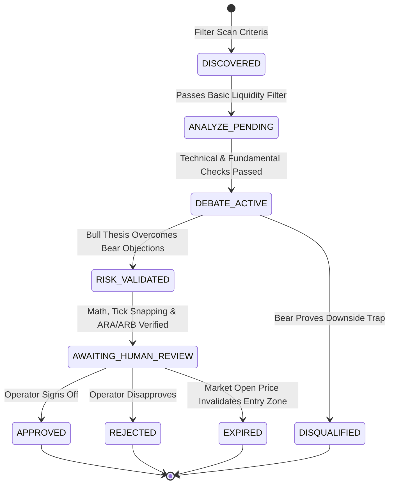
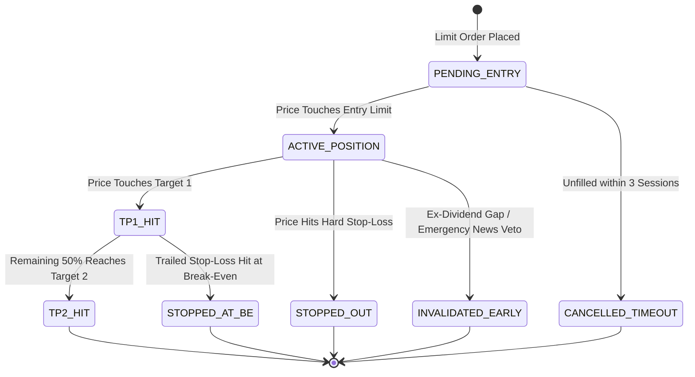

# MARKET BRAIN GRID (MBG) // MASTER PRODUCT REQUIREMENTS DOCUMENT (PRD)
## Autonomous Quant Research Desk, Cross-Asset Intelligence Cockpit & Human-Gated Decision System

**Document Identifier:** `MBG-PRD-MASTER-V2.5-INSTITUTIONAL`  
**Classification:** Institutional-Grade Technical Architecture & Product Specification  
**Governing Standard:** Astra 5-Step Factual Separation · Zero-Hallucination Gate · OJK/IDX Regulatory Standard  
**Operating Regime:** Research-First & Paper-First Desk · Human Review Mandatory (`AWAITING_HUMAN_REVIEW`)  
**Effective Date:** 2026-09-09T12:00:00+07:00 (WIB)  
**Authorship:** Lead Technical Product Manager & Financial Systems Architect  
**Target Environments:** GitHub Actions (Cron Engine) · Supabase (PostgreSQL State Plane) · Vercel (React 18 / Vite Cockpit) · Telegram (Push Notification Desk)

---

## 1. Document Control, Metadata & Authoritative Lineage

### 1.1 Document Provenance & Synthesis Baseline
This Master Product Requirements Document represents the definitive, exhaustive specification for the **Market Brain Grid (MBG)** Trading Intelligence Cockpit. It consolidates, reconciles, and formalizes six independent architectural lineages, historical codebases, and quant references:

| Lineage / Source Reference | Core Architectural Provenance Incorporated | Reconciliation & Master PRD Status |
| :--- | :--- | :--- |
| **Astra Research Workflow (`AITradingBotChatGPTAstra`)** | 5-Step Pipeline (`SCAN` $\to$ `ANALYZE` $\to$ `RESEARCH` $\to$ `RISK` $\to$ `PLAN`), strict separation of visible facts from subjective opinion, mandatory `AWAITING_HUMAN_REVIEW` execution gating, visible arithmetic sizing. | **Adopted as Immutable Operational Doctrine** for every agent, pipeline node, and generated Trade Plan Card. |
| **TradingAgents (arXiv:2412.20138)** | Multi-agent specialist fan-out, adversarial Bull vs. Bear debate topologies, risk committee synthesis, portfolio manager veto authority. | **Core Debate Topology** integrated into autonomous research pipeline before plan finalization. |
| **AutoHedge Framework** | Deterministic JSON contracts, clean state-machine life cycle, strict boundary between LLM reasoning and execution engines. | **Standardized Schemas**: Formalized in Candidate & Execution State Machines and PostgreSQL contracts. |
| **Vibe-Trading System** | Data-quality gating, walk-forward out-of-sample validation, Monte Carlo simulation, fee/slippage modeling. | **Quant Backtest Lab**: Standardized within execution simulator and risk engine. |
| **Moss Strategy Factory** | Bounded parameter drift ($\pm 30\%$ max exploration), immutable personality cores, bit-exact backtest-to-live parity. | **Meta-Learner Architecture**: Adopted into the Exp3 Multi-Armed Bandit strategy weight evolution. |
| **GLM v1.1 & Gemini v5.0 Unified Specs** | Verified 2025/2026 IDX microstructure (symmetric ARA/ARB, tick sizes, Friday sessions, T+2), OJK crypto transition (POJK 27/2024 & POJK 23/2025), Econometric proofing (DSR, PBO), Bandarmology $IIFS$. | **Market Microstructure Standard**: Hardcoded as deterministic validation constraints in engine data pipelines. |

### 1.2 System Purpose & Operational Boundary
Market Brain Grid (MBG) is an institutional-grade intelligence and research desk. It is engineered to transform high-frequency, complex cross-asset market data into structured, auditable, and mathematically sound trading plans.
- **The LLM Proposes and Explains**: Natural language models formulate theses, synthesize news, and articulate risks.
- **Deterministic Code Governs and Gates**: Python services calculate risk math, validate tick sizes, enforce auto-rejection boundaries, simulate fees/slippage, and record immutable audit ledgers.
- **No Direct Broker Order Path**: No language model output or autonomous cron job possesses the authority to transmit a live exchange order. Every trade plan concludes with `STATUS: AWAITING_HUMAN_REVIEW`.

---

## 2. Executive Summary, North-Star Metric & Core Value Proposition

### 2.1 Executive Summary
The **Market Brain Grid (MBG)** operates across three primary investment universes:
1. **Indonesian Equities (IDX / BEI)**: Comprehensive tracking of six dominant Indonesian Conglomerate Empires (*Konglomerasi BEI*), high-yield Dividend Aristocrats, and institutional Net Foreign Flow dynamics.
2. **Spot Cryptocurrency (USDT)**: Operating exclusively on 15 high-liquidity, OJK/Bappebti-compliant spot pairs with hard asymmetric risk/reward profiles ($\text{R:R} \ge 1:2.0$), structural stop-losses, and zero liquidation risk.
3. **24/7 Global Macro & US Impact Radar**: Continuous real-time tracking of US macroeconomic transmission channels (XAU Gold, Brent Crude Oil, US Dollar Index DXY, US 10-Year Treasury Yields, Federal Reserve monetary policy, and US Presidential/geopolitical trade actions) and their mathematical transmission to Indonesian domestic sectors.

MBG runs on a **Zero-Cost Serverless Infrastructure Plane** (GitHub Actions cron orchestrator, Supabase PostgreSQL state plane, and Vercel React/Vite web cockpit), delivering hedge-fund-caliber intelligence without recurring cloud server costs.

### 2.2 The North-Star Metric (NSM)
$$\mathbf{NSM} = \frac{\text{Verified Profitable Executed Plans with Risk-Reward } \ge 2.0}{\text{Total Generated Setups}} \times \left(1 - \text{Max Drawdown}_{\text{Paper}}\right)$$

The guiding mathematical objective is **Positive Mathematical Expectancy ($E_R$) & Downside Capital Preservation**:
$$E_R = (\text{Win Rate} \times \text{Avg Win}) - (\text{Loss Rate} \times \text{Avg Loss}) > 0$$

The system enforces zero tolerance for unmitigated downside risk. An alert or plan that prevents catastrophic capital impairment during an adverse macroeconomic shock is measured as an equal success to a winning trade.

### 2.3 Core Value Proposition
- **Institutional Depth for Retail Capital**: Replaces emotional, fragmented retail decision-making with structured, multi-agent adversarial intelligence.
- **Zero Hallucination & Fact/Opinion Segregation**: Eliminates generative AI delusions by strictly partitioning verified data (price, volume, foreign net buy, earnings) from speculative interpretations.
- **Microstructure Compliance**: Automatically eliminates orders that violate exchange tick fractions, fall inside auto-rejection limit bands, or risk dividend trap ex-date collapses.
- **Zero-Trust Human Execution Boundary**: The LLM analyzes and proposes; deterministic algorithms calculate risk and format tickets; human intelligence retains final execution authority.

---

## 3. Universal Safety, Compliance & Factual Integrity Rules

### 3.1 The Astra 5-Step Factual Separation Doctrine
Every autonomous agent, pipeline analyzer, and generated output card must strictly comply with the **Astra 5-Step Research Workflow**:

```
   [MARKET DATA INGESTION] (Dated, Sourced, Timestamped)
              │
              ▼
   ┌──────────────────────┐
   │ 1. SCAN              │ ──> Filter universe to top candidates based on clarity of setup (not projected return)
   └──────────┬───────────┘
              ▼
   ┌──────────────────────┐
   │ 2. ANALYZE           │ ──> Read chart mechanics: Trend, Momentum, Support, Resistance, Price Action
   └──────────┬───────────┘
              ▼
   ┌──────────────────────┐
   │ 3. RESEARCH          │ ──> Business health: Financials, Earnings Beat/Miss, Catalysts, News Verification
   └──────────┬───────────┘
              ▼
   ┌──────────────────────┐
   │ 4. RISK              │ ──> Hard Stop-Loss, Sizing Math, R:R >= 2.0, 3 Invalidations, Weakest Assumption
   └──────────┬───────────┘
              ▼
   ┌──────────────────────┐
   │ 5. PLAN              │ ──> Formulate 1-Page Structured Card: STATUS = AWAITING_HUMAN_REVIEW
   └──────────────────────┘
```

### 3.2 Strict Hallucination Elimination Rules
1. **Deterministic Data Grounding**: No agent or prompt is permitted to estimate or hallucinate historical prices, volume metrics, corporate actions, or dividend yields. If a data field is unavailable from the fetcher layer, the value must explicitly state `"NOT PROVIDED — verify manually"`.
2. **Mandatory Separation of Facts and Opinions**:
   - **FACTS**: Strictly objective data points with exact numerical values, sources, and timestamps (e.g., `Close = Rp 9,800`, `20-day Volume = 45.2M`, `Net Foreign Buy = Rp +84.2B`, `RSI(14) = 32.4`).
   - **OPINIONS**: Subjective technical theses, chart pattern interpretations, and speculative projections (e.g., `"Consolidating above support"`, `"Potential cup-and-handle formation"`, `"Bullish divergence"`).
3. **Prohibition of Direct Execution / Financial Advice**:
   - The system is an intelligence and decision-support desk, not an autonomous broker.
   - Outputs must never use promissory language (e.g., `"Guaranteed breakout"`, `"Easy 10x"`, `"Must buy now"`).
   - Every generated trade plan must terminate with:
     `STATUS: AWAITING_HUMAN_REVIEW — Nothing is executed until approved by the operator.`

---

## 4. Comprehensive Market Microstructure Specifications

```
                       ┌───────────────────────────────────────────────┐
                       │       MARKET BRAIN GRID MICROSTRUCTURE        │
                       └───────────────────────┬───────────────────────┘
                                               │
               ┌───────────────────────────────┴───────────────────────────────┐
               ▼                                                               ▼
┌──────────────────────────────┐                               ┌──────────────────────────────┐
│     IDX / BEI EQUITIES       │                               │      SPOT CRYPTO (USDT)      │
├──────────────────────────────┤                               ├──────────────────────────────┤
│ • Symmetric ARA / ARB        │                               │ • Spot Only (No Leverage)    │
│ • Official 5-Tier Tick Grid  │                               │ • OJK / Bappebti Whitelist   │
│ • 1 Lot = 100 Shares         │                               │ • Hard R:R >= 1:2.0          │
│ • T+2 Settlement Constraints │                               │ • Hard Structural Stop-Loss  │
│ • Conglomerate Cascades      │                               │ • Zero Liquidation Risk      │
│ • Dividend Trap Radar        │                               │ • USDT Liquidity Dominance   │
└──────────────────────────────┘                               └──────────────────────────────┘
```

### 4.1 Indonesia Stock Exchange (IDX / BEI) Architecture

#### 4.1.1 Symmetric Auto-Rejection Bands (ARA / ARB)
Following the complete post-pandemic normalization enacted by the Indonesia Stock Exchange, auto-rejection bands for the Regular and Cash Markets operate under **symmetric percentage thresholds**:

| Reference Price Tier (IDR) | Auto Rejection Atas (ARA) | Auto Rejection Bawah (ARB) | Exchange Board Type |
| :--- | :--- | :--- | :--- |
| **Rp 50 – Rp 200** | $+35.0\%$ | $-35.0\%$ | Main Board & Development Board |
| **> Rp 200 – Rp 5,000** | $+25.0\%$ | $-25.0\%$ | Main Board & Development Board |
| **> Rp 5,000** | $+20.0\%$ | $-20.0\%$ | Main Board & Development Board |
| **Any Price** (Papan Akselerasi) | $+10.0\%$ (Max Rp 1 floor) | $-10.0\%$ (Max Rp 1 floor) | Acceleration Board |
| **Any Price** (Watchlist Board / FCA) | $+10.0\%$ (Periodic Call Auction) | $-10.0\%$ (Periodic Call Auction) | Special Monitoring Board (FCA) |

**Deterministic Algorithmic Guards**:
- **ARA Rejection Shield**: The engine strictly forbids proposing buy limit orders within $1.5\%$ of the calculated ARA price to prevent trapped liquidity where execution is impossible.
- **ARB Liquidity Lock Guard**: The engine warns and invalidates any long setup where the proposed stop-loss sits within $1.0\%$ of the calculated ARB band, recognizing that an ARB-locked stock cannot be liquidated due to bid absence.

#### 4.1.2 Official Tick Size Matrix (Fraksi Harga) & Maximum Steps
All price proposals, limit orders, and stop levels must snap mathematically to the official 5-tier IDX tick size schedule (Keputusan Direksi PT BEI No. Kep-00023/BEI/03-2020):

| Price Range Tier (IDR) | Tick Fraction (*Fraksi Harga*) | Maximum Price Movement (*Maksimum Perubahan*) | Valid Price Example | Invalid Price Example |
| :--- | :--- | :--- | :--- | :--- |
| **< Rp 200** | **Rp 1** | Rp 20 (20 ticks) | Rp 115, Rp 116 | Rp 115.5 (Fractional) |
| **Rp 200 – < Rp 500** | **Rp 2** | Rp 40 (20 ticks) | Rp 340, Rp 342 | Rp 341 (Odd tick) |
| **Rp 500 – < Rp 2,000** | **Rp 5** | Rp 100 (20 ticks) | Rp 1,250, Rp 1,255 | Rp 1,252 (Non-5 tick) |
| **Rp 2,000 – < Rp 5,000**| **Rp 10** | Rp 200 (20 ticks) | Rp 3,420, Rp 3,430 | Rp 3,425 (Non-10 tick) |
| **$\ge$ Rp 5,000** | **Rp 25** | Rp 500 (20 ticks) | Rp 9,800, Rp 9,825 | Rp 9,810 (Non-25 tick) |

**Mathematical Snapping Algorithm**:
```python
def snap_idx_tick(price: float) -> int:
    """Snaps any raw price to the nearest official IDX tick size"""
    p = round(price)
    if p < 200:
        tick = 1
    elif p < 500:
        tick = 2
    elif p < 2000:
        tick = 5
    elif p < 5000:
        tick = 10
    else:
        tick = 25
    return int(round(p / tick) * tick)
```

#### 4.1.3 Trading Sessions & Auction Schedules
The engine aligns all scans and state transitions with official IDX market phases (Western Indonesia Time / WIB = UTC+7):

- **Monday through Thursday**:
  - `08:45:00 – 08:59:00 WIB`: Pre-Opening Auction (Order entry for LQ45/selected stocks)
  - `08:55:00 – 08:59:59 WIB`: Pre-Opening Order Allocation & Price Formation
  - `09:00:00 – 12:00:00 WIB`: **Continuous Trading Session I**
  - `12:00:00 – 13:30:00 WIB`: Mid-Day Intermission
  - `13:30:00 – 15:49:59 WIB`: **Continuous Trading Session II**
  - `15:50:00 – 16:00:00 WIB`: Pre-Closing Auction (Order entry for closing price formation)
  - `16:00:01 – 16:04:59 WIB`: Closing Price Allocation
  - `16:05:00 – 16:15:00 WIB`: Post-Trading Session (Execution at closing price only)
  - `16:15:00+ WIB`: Market Closed; EOD Broker Summary Released

- **Friday Compressed Schedule**:
  - `08:45:00 – 08:59:59 WIB`: Pre-Opening Auction
  - `09:00:00 – 11:30:00 WIB`: **Continuous Trading Session I** (Closes 30 mins earlier)
  - `11:30:00 – 14:00:00 WIB`: Extended Friday Prayer Intermission (2.5 hours)
  - `14:00:00 – 15:49:59 WIB`: **Continuous Trading Session II**
  - `15:50:00 – 16:15:00 WIB`: Pre-Closing, Allocation, and Post-Trading

#### 4.1.4 Settlement Architecture & Lot Sizing
- **Lot Size Standard**: $1\text{ Lot} = 100\text{ Shares}$ (*lembar saham*). Fractional shares are relegated to the Odd Lot Market (*Pasar Negosiasi*) and are strictly excluded from MBG trading plans.
- **T+2 Settlement Cycle**: Equity purchases settle on trade date plus 2 exchange business days ($T+2$). Intraday buying power granted by local brokers does not represent cleared cash. The risk calculator enforces a T+2 cash drag simulation in paper portfolio equity tracking.

#### 4.1.5 Foreign Net Flow & Post-2021 Broker Code Masking Realities
Following the IDX regulation enacted in December 2021 (masking broker codes during live trading hours) and February 2022 (masking investor domestic/foreign type intraday):
- Intraday flow must be estimated via price-volume participation algorithms.
- **End-of-Day (EOD) Reconciliation**: At 16:15 WIB, the engine parses official EOD data to calculate actual **Net Foreign Buy (NFB)** and **Net Foreign Sell (NFS)** across all tracked tickers, calculating the **IDX Institutional Flow Score ($IIFS$)**:
$$IIFS = w_1 \cdot Z_{\text{NFB}} + w_2 \cdot \text{Ratio}_{\text{Top3 Broker}} + w_3 \cdot \left(\frac{P_{\text{close}} - P_{\text{foreign\_avg}}}{P_{\text{close}}}\right)$$

#### 4.1.6 Dividend Trap Radar & Ex-Date Protection
Indonesian commodity and state-owned banking equities frequently distribute exceptional dividend yields ($8.0\% - 18.0\%$). However, on **Ex-Dividend Date**, share prices historically gap down equal to or greater than the distributed dividend per share (the "Dividend Trap").

```
  Cumulative Price Action
            ▲
            │                 [Cum-Date Close: Rp 4,000]
            │                       ▲
            │                      /│
            │                     / │  [DIVIDEND TRAP GAP DOWN]
            │                    /  │  Dividend = Rp 450 (11.25%)
            │  [Pre-Dividend    /   │
            │   Accumulation]  /    │
            │                 /     ▼
            │                      [Ex-Date Open: Rp 3,500 (-12.5%)]
            │                      ─────────────────────────────────
            └──────────────────────────────────────────────────────────► Time
```

**Dividend Trap Defense Matrix**:
1. **Ex-Date Quarantine**: Any ticker within 5 trading days prior to its Ex-Date is flagged with `DIVIDEND_TRAP_ALERT`.
2. **Setup Invalidation**: If the proposed Stop-Loss distance is narrower than the expected dividend yield percentage, the setup is automatically disqualified.
3. **Capture Arbitrage Filter**: The engine only permits dividend capture swing setups if:
$$\text{Projected Rebound Momentum Score} > 0.75 \quad \text{AND} \quad \text{Free Cash Flow Payout Ratio} < 70\%$$

#### 4.1.7 Indonesian Conglomerate Clusters (*Konglomerasi BEI*)
Equities on the IDX are deeply intertwined with domestic conglomerate families. A liquidity squeeze, regulatory investigation, or asset rotation in one flagship ticker cascades rapidly into sister companies. MBG systematically segments and tracks six primary conglomerates:

```
┌──────────────────────────────────────────────────────────────────────────────────────────────┐
│                             BEI CONGLOMERATE EMPIRES (KONGSI)                                │
├──────────────────────────────┬──────────────────────────────┬────────────────────────────────┤
│ 1. BARITO GROUP (Prajogo P.) │ 2. SALIM GROUP (Anthoni S.)  │ 3. ASTRA GROUP (Jardine M.)    │
│ • BREN (Renewable Energy)    │ • INDF (Consumer / Food)     │ • ASII (Automotive & Holding)  │
│ • TPIA (Petrochemical)       │ • ICBP (Packaged Goods)      │ • UNTR (Heavy Equip / Mining)  │
│ • BRPT (Petrochem Holding)   │ • MEDC (Oil & Gas E&P)       │ • AUTO (Auto Components)       │
│ • CUAN (Coal Mining)         │ • AMMN (Copper & Gold)       │                                │
│ • PTRO (Mining Contractor)   │                              │                                │
├──────────────────────────────┼──────────────────────────────┼────────────────────────────────┤
│ 4. DJARUM GROUP (Hartono)    │ 5. BAKRIE GROUP (A. Bakrie)  │ 6. ADARO GROUP (Boy Thohir)    │
│ • BBCA (Commercial Banking)  │ • BRMS (Gold Minerals)       │ • ADRO (Thermal Coal / Energy) │
│ • TOWR (Telecom Towers)      │ • BUMI (Thermal Coal)        │ • ADMR (Metallurgical Coal)    │
│ • BELI (Digital Commerce)    │ • ENRG (Oil & Gas E&P)       │                                │
│                              │ • VKTR (EV Commercial)       │                                │
└──────────────────────────────┴──────────────────────────────┴────────────────────────────────┘
```

---

### 4.2 Spot Cryptocurrency (USDT) Architecture

#### 4.2.1 Spot-Only Strict Mandate
- **Zero Margin, Zero Leverage**: MBG trades exclusively on the Spot Market. Trading perpetual futures, quarterly delivery contracts, or synthetic margin is strictly forbidden.
- **Immunity to Liquidation**: Because positions are $100\%$ asset-backed spot holdings, the risk of exchange liquidation cascades is mathematically zero. Capital preservation is governed exclusively by software-level hard stop-loss exits.

#### 4.2.2 Indonesian Regulatory Compliance (OJK & Bappebti Whitelist)
Under Indonesian Law No. 4/2023 (UU P2SK) and official regulatory circulars (POJK No. 27/2024 and POJK No. 23/2025), supervisory authority over digital financial assets transferred from Bappebti to the Financial Services Authority (*Otoritas Jasa Keuangan* - OJK).

MBG restricts its algorithmic scanning universe exclusively to assets listed within the official Indonesian Crypto Asset Whitelist (545 whitelisted tokens), focusing on the **Top 15 Ultra-Liquid Pairs** paired against USDT:
1. `BTC/USDT` (Bitcoin)
2. `ETH/USDT` (Ethereum)
3. `SOL/USDT` (Solana)
4. `BNB/USDT` (BNB)
5. `SUI/USDT` (Sui Network)
6. `NEAR/USDT` (NEAR Protocol)
7. `AVAX/USDT` (Avalanche)
8. `LINK/USDT` (Chainlink)
9. `RENDER/USDT` (Render Token)
10. `FET/USDT` (Artificial Superintelligence Alliance)
11. `DOGE/USDT` (Dogecoin)
12. `XRP/USDT` (XRP)
13. `ADA/USDT` (Cardano)
14. `APT/USDT` (Aptos)
15. `PEPE/USDT` (Pepe)

#### 4.2.3 Asymmetric Risk-Reward Mandate ($\text{R:R} \ge 1:2.0$)
Every crypto recommendation must provide a minimum mathematical risk-to-reward ratio of $1:2.0$ to Target 1:
$$\text{R:R} = \frac{\text{Take Profit}_1 - \text{Entry Price}}{\text{Entry Price} - \text{Stop Loss}} \ge 2.0$$
- **Hard Structural Stop-Loss**: Placed strictly below verified structural support (typically $2.5\% - 3.5\%$ below entry). Mental stops are strictly prohibited.
- **Two-Tier Take-Profit Execution**:
  - **TP1 (Target 1)**: Set at $+5.0\% \dots +8.0\%$. Upon execution, $50\%$ of the position is realized, and the stop-loss for the remaining $50\%$ is automatically trailed to **Break-Even ($P_{\text{entry}}$)**.
  - **TP2 (Target 2)**: Set at $+10.0\% \dots +18.0\%$ for trend extension.

---

### 4.3 24/7 Global Macro & US Impact Radar

#### 4.3.1 Macro Transmission Channels to IDX & Crypto
The Global Macro Radar monitors international bellwethers 24/7, streaming macroeconomic shifts through cross-asset transmission channels directly into affected Indonesian sectors:

```
┌───────────────────────────────┐
│     GLOBAL MACRO DRIVER       │
└───────────────┬───────────────┘
                │
                ├──────────────────────────────────────┬──────────────────────────────────────┐
                ▼                                      ▼                                      ▼
    ┌────────────────────────┐             ┌────────────────────────┐             ┌────────────────────────┐
    │  GOLD RALLY (XAU > 0)  │             │ BRENT OIL SURGE (OIL)  │             │ DXY & US 10Y SPIKE     │
    ├────────────────────────┤             ├────────────────────────┤             ├────────────────────────┤
    │ • Transmission: Metals │             │ • Transmission: Energy │             │ • Transmission: FX Out │
    │ • ANTM, BRMS, MDKA (▲) │             │ • MEDC, ENRG, ELSA (▲) │             │ • BBCA, BBRI, BMRI (▼) │
    │ • Safe-Haven Inflow    │             │ • Airlines/Cement (▼)  │             │ • Coal Exporters (▲)   │
    └────────────────────────┘             └────────────────────────┘             └────────────────────────┘
```

#### 4.3.2 Quantitative Cross-Asset Elasticity Matrix
The Macro Engine models the cross-asset sensitivity ($\beta_{i,m}$) and expected price drift ($\Delta \hat{P}_i$) across Indonesian sectors:

| Macro Variable | Benchmark Ticker | Primary IDX Transmission Channel | Bullish Beneficiaries | Bearish Vulnerabilities | Crypto Impact |
| :--- | :--- | :--- | :--- | :--- | :--- |
| **Gold (XAU/USD)** | `GC=F` | Commodity inflation & safe-haven hedging | `ANTM`, `BRMS`, `MDKA`, `PSAB` | Consumer discretionary | Bullish store-of-value proxy (BTC) |
| **Brent Crude Oil** | `BZ=F` | Global energy costs & fuel subsidies | `MEDC`, `ENRG`, `ELSA`, `AKRA` | `GIAA`, `SMGR`, `INTP`, Transport | Neutral to Bearish (Cost inflation) |
| **US Dollar (DXY)** | `DX-Y.NYB` | Emerging market FX outflow (IDR weakness)| USD-earners: `ADRO`, `ITMG`, `MEDC` | Import-heavy: Consumer, Pharma, Big Banks | Bearish risk asset headwind |
| **US 10Y Yield** | `^TNX` | Global discount rates & equity risk premium | None (Systemic drag) | Rate-sensitive: `BBRI`, `BMRI`, Property | Bearish liquidity squeeze |
| **Fed Rate (FOMC)** | Fed Funds | Global monetary policy stance | Dovish: Banking, Property, Infra | Hawkish: Highly leveraged firms | Dovish = Crypto expansion cycle |
| **US Trade Tariffs**| Policy Index | Export protectionism & trade war risks | Domestic-only consumer goods | Nickel/Battery exporters (`NCKL`, `MBMA`)| High volatility spillover |

---

## 5. Autonomous Multi-Agent Hierarchy & Workflow

```
                               ┌──────────────────────────────────────────────┐
                               │        ORCHESTRATOR / PIPELINE RUNNER        │
                               └──────────────────────┬───────────────────────┘
                                                      │
                       ┌──────────────────────────────┴──────────────────────────────┐
                       ▼                                                             ▼
        ┌─────────────────────────────┐                               ┌─────────────────────────────┐
        │     MACRO RADAR AGENT       │                               │   IDX & CRYPTO INGESTION    │
        └──────────────┬──────────────┘                               └──────────────┬──────────────┘
                       │                                                             │
                       └──────────────────────────────┬──────────────────────────────┘
                                                      │
                                                      ▼
                                       ┌─────────────────────────────┐
                                       │     SPECIALIST ANALYSTS     │
                                       │  • Technical / SMC Agent    │
                                       │  • Foreign Flow Agent (IIFS)│
                                       │  • Dividend Aristocrat Agent│
                                       └──────────────┬──────────────┘
                                                      │
                                                      ▼
                                       ┌─────────────────────────────┐
                                       │   ADVERSARIAL DEBATE LAB    │
                                       │    [BULL]  vs.  [BEAR]      │
                                       └──────────────┬──────────────┘
                                                      │
                                                      ▼
                                       ┌─────────────────────────────┐
                                       │   DETERMINISTIC RISK &      │
                                       │      SIZING ENGINE          │
                                       └──────────────┬──────────────┘
                                                      │
                                                      ▼
                                       ┌─────────────────────────────┐
                                       │     SYNTHESIS VERDICT       │
                                       │  STATUS: AWAITING_REVIEW    │
                                       └─────────────────────────────┘
```

### 5.1 Agent Specialist Roster & Functional Responsibilities

1. **Macro Radar Agent (`agent-macro-radar`)**:
   - Ingests live prices of Gold (`GC=F`), Brent Oil (`BZ=F`), US Dollar Index (`DX-Y.NYB`), and US 10Y Treasury Yield (`^TNX`).
   - Scrapes Google News RSS feeds for macroeconomic, Federal Reserve, and geopolitical headlines.
   - Computes sector-level sentiment scores and flags high-severity flash events.

2. **Technical Pattern & Smart Money Concepts (SMC) Agent (`agent-quant-smc`)**:
   - Computes moving averages (MA20, MA50, MA200), RSI-14, volume expansion factors, and price ranges.
   - Executes algorithmic SMC detection:
     - **Order Blocks (OB)**: Unmitigated institutional supply and demand zones.
     - **Fair Value Gaps (FVG)**: 3-candle price imbalances with Consequent Encroachment (50% midpoint).
     - **Market Structure Shifts**: Break of Structure (BOS) and Change of Character (CHoCH).
     - **Liquidity Sweeps (*Turtle Soup*)**: False breakouts grabbing stop orders above/below key pivots.

3. **Foreign Flow & Liquidity Agent (`agent-foreign-flow`)**:
   - Ingests daily volume and net foreign institutional transaction data.
   - Computes the **IDX Institutional Flow Score ($IIFS$)** and flags institutional accumulation vs. distribution.

4. **Dividend Aristocrat & Fundamental Agent (`agent-dividend-aristocrat`)**:
   - Evaluates estimated dividend yields, historical payout stability, and balance sheet cash reserves.
   - Evaluates Ex-Date proximity and executes the Dividend Trap Protection filter.

5. **Deterministic Risk & Sizing Calculator (`engine-risk-math`)**:
   - Executes purely deterministic, hardcoded mathematical formulas (non-LLM).
   - Validates exchange tick sizes and auto-rejection bands.
   - Computes exact position sizing in whole IDX lots (100 shares) and crypto units.

### 5.2 Adversarial Bull vs. Bear Debate Engine
Before any asset is accepted into the candidate queue, it is subjected to an autonomous **Adversarial Debate Protocol**:

- **The Bull Advocate**:
  - Builds the most compelling, evidence-backed long thesis based on technical breakout clarity, institutional volume accumulation, macro tailwinds, and corporate catalysts.
- **The Bear Red-Teamer**:
  - Rigorously attacks the thesis. Scrutinizes overhead resistance, volume fading, impending Ex-Dividend date drops, foreign distribution anomalies, macroeconomic headwinds (DXY/Yield surges), and downside gap vulnerabilities.
- **The Debate Resolution Matrix**:
  - If the Bear identifies an unmitigated structural flaw (e.g., overhead major resistance sits closer than $2 \times \text{Stop-Loss}$ distance), the setup is **VETOED** and marked `NO_TRADE`.
  - Only setups that survive red-team cross-examination with clear asymmetric risk/reward advance to final synthesis.

---

## 6. Technical Architecture & Zero-Cost Cloud Infrastructure

```
┌──────────────────────────────────────────────────────────────────────────────────────────────┐
│                            ZERO-COST SERVERLESS ARCHITECTURE PLANE                           │
├──────────────────────────────────────────────────────────────────────────────────────────────┤
│                                                                                              │
│   [GITHUB ACTIONS CRON]                                                                      │
│     ├── Hourly (`0 * * * *`)       ──> Hourly Crypto (15 Pairs) + US Macro & Commodity Feed  │
│     └── Daily  (`15 0 * * 1-5`)    ──> 07:15 WIB Daily IDX Market Scanner + Trade Plan Engine│
│                 │                                                                            │
│                 ▼                                                                            │
│   [PYTHON BACKEND ENGINE]                                                                    │
│     ├── Fetchers: `yfinance`, `requests` (Binance API), Google News RSS XML, `curl_cffi`     │
│     ├── Analyzers: `LLMBrain` (Gemini 2.5/Astra), SMC Detector, IIFS Calculator              │
│     └── Sizing: Hard Deterministic Math, Tick Snapping, ARA/ARB Clamping                     │
│                 │                                                                            │
│                 ├──────────────────────────────────────┬─────────────────────────────────────┤
│                 ▼                                      ▼                                     ▼
│        [SUPABASE POSTGRESQL]                  [TELEGRAM BOT ALERTS]                 [VERCEL SPA]     │
│        • Free Tier (500MB Limit)              • 07:15 WIB Morning Brief             • React 18 + Vite│
│        • In-Place Upsert Strategy             • Real-Time Flash Alerts              • SHA-256 Gate   │
│        • 30-Day Rolling Purge Cron            • Zero Polling / Push Only            • TradingView TV │
│                                                                                              │
└──────────────────────────────────────────────────────────────────────────────────────────────┘
```

### 6.1 GitHub Actions Workflow Orchestration
The engine operates autonomously without a dedicated VPS using two scheduled GitHub Actions workflows:

1. **Hourly Crypto & Macro Radar** (`.github/workflows/hourly_crypto_macro.yml`):
   - **Cron**: `0 * * * *` (Every 60 minutes, 24/7).
   - **Execution Scope**: Ingests Binance 24hr tickers, checks Gold/Oil/DXY/US10Y, evaluates flash macro thresholds, and pushes high-severity alerts to Telegram.
2. **Daily IDX Pre-Market Engine** (`.github/workflows/daily_idx_morning.yml`):
   - **Cron**: `15 0 * * 1-5` (00:15 UTC = 07:15 WIB, Monday through Friday).
   - **Execution Scope**: Scans all 6 Conglomerate groups, Dividend Aristocrats, and Foreign Flow leaders; executes Bull/Bear debates; generates daily Astra trade plans; syncs Supabase DB; and pushes the Daily Morning Briefing to Telegram.

### 6.2 Python Backend Engine & Data Ingestion
- **Equities Ingestion**: High-efficiency extraction via `yfinance` with rate-limiting backoff and localized disk caching (`engine/cache/`).
- **Crypto Ingestion**: Direct zero-auth public REST polling against Binance API (`https://api.binance.com/api/v3/ticker/24hr`), fetching real-time 24-hour bid/ask, volume, and high/low stats.
- **Macro & News RSS Ingestion**: Standard library `urllib.request` and `xml.etree.ElementTree` parsing of live Google News RSS feeds with automated market tagging (`IHSG`, `METALS`, `ENERGY`, `BANKING`, `MACRO`).

### 6.3 Supabase PostgreSQL State Plane & Rolling Purge Policy
To remain permanently within Supabase's **500MB Free Tier**, the storage engine enforces two immutable data architecture patterns:

1. **In-Place Upserting**:
   - Primary tables (`macro_telemetry`, `idx_categorized`, `crypto_spot_10`) utilize deterministic fixed primary keys (`GLOBAL_LATEST`, ticker symbol, rank ID), executing `ON CONFLICT (primary_key) DO UPDATE` to eliminate row accumulation.
2. **30-Day Rolling Table Purge**:
   - Historical trade plans and execution logs older than 30 days are automatically pruned via a scheduled PostgreSQL stored procedure:
```sql
CREATE OR REPLACE FUNCTION purge_old_records() RETURNS void AS $$
BEGIN
    DELETE FROM daily_trade_plans WHERE created_at < NOW() - INTERVAL '30 days';
    DELETE FROM system_state WHERE updated_at < NOW() - INTERVAL '30 days';
END;
$$ LANGUAGE plpgsql;
```

### 6.4 Vercel React/Vite Dashboard & Security Gate
- **Client-Side SHA-256 Authentication**:
  - Protected by a client-side Web Crypto API password gate (`PasswordGate.jsx`).
  - Passwords are never stored in plaintext. Verification calculates `SHA-256(input)` against the pre-compiled hash:
    `e8f49553ef78888b64e5c5ea70d1066c61f224982f6e91f1d9bfab8b248a3bf8`
  - Anti-brute force lockout triggers after 5 failed attempts (15-minute freeze). Authenticated sessions persist for 24 hours in encrypted local storage.
- **Embedded TradingView Advanced Charts**: Interactive charting directly embedded for IDX and Crypto symbols.

### 6.5 Telegram Automated Notification Engine
- **Daily Morning Briefing (07:15 WIB)**: Pushes structured markdown briefings containing Top 5 IDX Opportunities, Top 5 Spot Crypto Setups, and Global Macro Headwinds directly to the user's mobile device.
- **Instant Flash Macro Surge Alerts**: Fired during hourly cron runs if high-volatility thresholds are breached:
  - Gold intraday move $\ge 1.5\%$
  - Brent Crude intraday move $\ge 3.0\%$
  - US Dollar Index (DXY) intraday move $\ge 0.8\%$

---

## 7. State Machines, Contract Schemas & Data Models

### 7.1 Candidate Discovery & Evaluation State Machine
Every potential trade idea moves through a strict 6-stage lifecycle:



### 7.2 Paper Trading & Forward Execution State Machine
Once approved, paper portfolio positions transition through an event-driven execution lifecycle:



### 7.3 Canonical Recommendation JSON Schema
Every generated trade setup adheres to the following strict JSON contract:

```json
{
  "$schema": "https://json-schema.org/draft/2020-12/schema",
  "title": "MBG_Trade_Recommendation",
  "type": "object",
  "required": [
    "plan_id", "symbol", "clean_ticker", "market", "direction",
    "entry_price", "stop_loss", "target_1", "target_2",
    "position_size_math", "risk_reward_ratio", "facts_summary",
    "opinion_thesis", "three_invalidations", "weakest_assumption",
    "status", "created_at"
  ],
  "properties": {
    "plan_id": { "type": "string", "example": "PLAN-IDX-BBCA-20260909" },
    "symbol": { "type": "string", "example": "BBCA.JK" },
    "clean_ticker": { "type": "string", "example": "BBCA" },
    "market": { "type": "string", "enum": ["IDX", "CRYPTO"] },
    "direction": { "type": "string", "enum": ["LONG"] },
    "entry_price": { "type": "number", "minimum": 0 },
    "stop_loss": { "type": "number", "minimum": 0 },
    "target_1": { "type": "number", "minimum": 0 },
    "target_2": { "type": "number", "minimum": 0 },
    "position_size_math": { 
      "type": "string", 
      "example": "(Porto Rp 100M × 1% Risk = Rp 1M) ÷ (Entry Rp 9800 - SL Rp 9500 = Rp 300) = 33 Lot" 
    },
    "risk_reward_ratio": { "type": "number", "minimum": 2.0 },
    "technical_signal": { 
      "type": "string", 
      "enum": ["BREAKOUT", "ACCUMULATION", "OVERSOLD_REBOUND", "PULLBACK", "CONSOLIDATION"] 
    },
    "facts_summary": { "type": "string" },
    "opinion_thesis": { "type": "string" },
    "three_invalidations": {
      "type": "array",
      "items": { "type": "string" },
      "minItems": 3,
      "maxItems": 3
    },
    "weakest_assumption": { "type": "string" },
    "status": { "type": "string", "const": "AWAITING_HUMAN_REVIEW" },
    "created_at": { "type": "string", "format": "date-time" }
  }
}
```

### 7.4 Astra Standard 1-Page Trade Plan Card Specification
Every plan displayed in the dashboard and Telegram output formats according to the standardized **Astra 1-Page Trade Plan Template**:

```text
================================================================================
TRADE PLAN — [TICKER] — [YYYY-MM-DD]
================================================================================
THESIS:           [One crisp sentence defining the core technical/catalyst driver]
DIRECTION/TF:     LONG · [Swing 3–15 Days / Positional]
ENTRY ZONE:       Rp [Price] (Condition: Limit order at support retest)
HARD STOP-LOSS:   Rp [Price] (Structural reasoning: 2 ticks below swing low)
TARGET 1 / 2:     TP1: Rp [Price] (+X.X%) · TP2: Rp [Price] (+XX.X%)
POSITION SIZE:    [X] Lots · Rp [Notional] · [X.X]% of Account · Rp [Risk Amt] at risk
SIZING FORMULA:   (Account Rp 100M × 1.0% Risk) ÷ (Entry Rp [P] - SL Rp [P]) = [X] Lots
RISK / REWARD:    [X.XX] : 1.0 (Minimum 2.0x required)
--------------------------------------------------------------------------------
THREE INVALIDATIONS (Setup voided if any occurs):
  1. [Technical]: Daily candle close below Rp [SL Price]
  2. [Flow/Volume]: Institutional foreign net outflow exceeds Rp [X] Billion
  3. [Macro/Market]: Benchmark IHSG breaks below critical psychological support
--------------------------------------------------------------------------------
KEY DATES:        Earnings: [Date] · Dividend Cum-Date: [Date] · Macro FOMC: [Date]
WEAKEST ASSUMPTION: [Explicit identification of the most fragile analytical link]
CONFIDENCE LEVEL: [HIGH / MEDIUM] (Degrades to LOW if volume fails to expand)
NUMBERS TO VERIFY:[Verify closing price, tick fraction adherence, and lot arithmetic]
================================================================================
STATUS: AWAITING_HUMAN_REVIEW — Nothing is executed until operator approval.
================================================================================
```

### 7.5 Mathematical Position Sizing & Capital Allocation Formulas

#### 7.5.1 Equity Position Sizing (IDX Fixed-Fractional Risk Model)
For an equity account with total portfolio equity $E$, target risk percentage per trade $R_{\%}$ (standard: $1.0\% \dots 2.0\%$), planned entry price $P_{\text{entry}}$, and structural stop-loss $P_{\text{stop}}$:

1. **Calculate Maximum Allowable Capital at Risk ($C_{\text{risk}}$)**:
   $$C_{\text{risk}} = E \times R_{\%}$$
2. **Calculate Risk Per Share ($\Delta P_{\text{share}}$)**:
   $$\Delta P_{\text{share}} = P_{\text{entry}} - P_{\text{stop}}$$
3. **Calculate Raw Share Quantity ($Q_{\text{shares}}$)**:
   $$Q_{\text{shares}} = \left\lfloor \frac{C_{\text{risk}}}{\Delta P_{\text{share}}} \right\rfloor$$
4. **Convert to Floored IDX Standard Lots ($L_{\text{IDX}}$)**:
   $$L_{\text{IDX}} = \left\lfloor \frac{Q_{\text{shares}}}{100} \right\rfloor$$
5. **Compute Actual Invested Capital Notional ($N_{\text{invested}}$)**:
   $$N_{\text{invested}} = L_{\text{IDX}} \times 100 \times P_{\text{entry}}$$
6. **Portfolio Exposure Ceiling Check**:
   $$\text{If } N_{\text{invested}} > (E \times 0.20), \quad L_{\text{IDX}} = \left\lfloor \frac{E \times 0.20}{100 \times P_{\text{entry}}} \right\rfloor$$
   *(No single equity position may exceed $20\%$ of total portfolio equity).*
   $$\text{If } L_{\text{IDX}} < 1, \quad \text{REJECT SETUP (Account undercapitalized for safe risk management)}.$$

#### 7.5.2 Spot Crypto Position Sizing (USDT Notional Model)
For a crypto portfolio sized in USDT ($E_{\text{crypto}}$), risk percentage $R_{\%}$ (standard $1.0\%$), entry price $P_{\text{entry}}$, and stop-loss $P_{\text{stop}}$:
$$U_{\text{crypto}} = \frac{E_{\text{crypto}} \times R_{\%}}{P_{\text{entry}} - P_{\text{stop}}}$$
$$\text{Clamped to Exchange Minimum Step Size and Minimum Notional (5 USDT)}.$$

---

## 8. Quantitative Validation, Backtesting & Meta-Learning Framework

### 8.1 Event-Driven Intra-Bar Backtesting Simulator
The backtesting engine models real-world exchange frictions with zero lookahead bias:
1. **Intra-Bar Slippage**: Modeled across bid-ask spreads. Equities snap to the nearest tick fraction ($fraksi\ harga$); Crypto incorporates a $0.05\%$ simulated market impact.
2. **Realistic Transaction Fee Matrix**:
   - **IDX Equities**: Buy Fee = $0.15\%$ · Sell Fee = $0.25\%$ (inclusive of exchange levy, KPEI, and $0.1\%$ final sales tax).
   - **Spot Crypto**: Buy Fee = $0.10\%$ · Sell Fee = $0.10\%$ (standard Binance spot tier).
3. **Execution Priority Modeling**: Orders inside the pre-opening/closing auction and auto-rejection limits are strictly checked to prevent unrealistic fills on limit-up locked stocks (ARA).

### 8.2 Institutional Performance Metrics
The Backtest Lab evaluates all historical strategies against hedge-fund quantitative benchmarks:
- **Annualized Sharpe Ratio**:
  $$S = \frac{\mu_R - R_f}{\sigma_R} \times \sqrt{252}$$
- **Sortino Ratio** (Penalizing only downside volatility $\sigma_D$):
  $$\text{Sortino} = \frac{\mu_R - R_f}{\sigma_D} \times \sqrt{252}$$
- **Maximum Drawdown (MDD)**:
  $$\text{MDD} = \max_{t \in [0, T]} \left( \frac{\text{Peak}_t - \text{Trough}_t}{\text{Peak}_t} \right)$$
- **Deflated Sharpe Ratio (DSR)**:
  Corrects for selection bias, non-normal return distributions (skewness/kurtosis), and multi-trial overfitting across multiple backtested parameter sets.

### 8.3 Exp3 Multi-Armed Bandit Strategy Evolution
To prevent strategy decay and adapt to changing market regimes (e.g., Bull trending vs. Sideways consolidation vs. Macro shock bear), MBG implements an **Exp3 (Exponential-weight algorithm for Exploration and Exploitation)** meta-learning reinforcement loop:

1. Each strategy archetype $k$ (e.g., `SMC_ORDER_BLOCK`, `IIFS_FOREIGN_FLOW`, `DIVIDEND_VALUE`, `MOMENTUM_BREAKOUT`) maintains an adaptive weight $w_k(t)$.
2. Strategy probability distribution:
   $$p_k(t) = (1 - \gamma) \frac{w_k(t)}{\sum_{j} w_j(t)} + \frac{\gamma}{K}$$
   *(where $\gamma \in (0, 0.15]$ guarantees continuous exploration).*
3. When paper positions close, payoff rewards update the weights:
   $$\hat{r}_k(t) = \frac{r_k(t)}{p_k(t)} \cdot \mathbb{I}(\text{strategy } k \text{ chosen})$$
   $$w_k(t+1) = w_k(t) \exp\left( \frac{\eta \hat{r}_k(t)}{K} \right)$$
4. **Incubation & Conviction Gates**:
   - If a strategy archetype drops below $E_R < 0$ or Win Rate $< 38\%$, it is relegated to `INCUBATION_MODE` (recommendations hidden from daily briefs).
   - Only archetypes with $E_R > 0.60$ and Sortino $> 1.8$ are awarded the `HIGH_CONVICTION` banner.

---

## 9. Acceptance Criteria, Success KPIs & Implementation Roadmap

### 9.1 Phase-Gated Verification Matrix

| Component | Automated Acceptance Criteria | Verification Method |
| :--- | :--- | :--- |
| **IDX Tick Snapping** | Every equity entry, SL, and TP strictly matches the 5-tier fraksi harga. | Unit test verifying zero odd-fraction outputs across 1,000 synthetic prices. |
| **ARA/ARB Clamping** | Zero orders placed within $1.5\%$ of ARA or $1.0\%$ of ARB. | Boundary test on simulated limit-up/limit-down tickers. |
| **Position Sizing** | Calculated lots match `floor((Account * Risk%) / (Entry - SL) / 100)`. | Mathematical regression assertions across all generated plans. |
| **Free-Tier Purge** | Supabase database storage stays strictly $< 100\text{ MB}$ over 365 days. | Execution of `purge_old_records()` verifying 30-day retention ceiling. |
| **Password Gate** | Client-side SHA-256 hash matching; 5 failed attempts locks UI for 15 mins. | Web Crypto API automated test suite in Vitest. |
| **Telegram Delivery** | Morning Briefing arrives $\le$ 07:18 WIB; Flash Macro triggers within 5 mins of hourly cron. | End-to-end integration test against Telegram Bot API. |

### 9.2 Success Key Performance Indicators (KPIs)
- **Zero Execution Breaches**: $0$ unapproved live trades; $100\%$ compliance with `AWAITING_HUMAN_REVIEW`.
- **Mathematical Expectancy**: Paper portfolio maintains $E_R \ge 0.50$ across rolling 90-day windows.
- **Maximum Drawdown**: Paper portfolio equity drawdown capped at $< 8.5\%$.
- **Zero Infrastructure Cost**: Continuous $100\%$ operational uptime with $\$0.00$ billed server costs.

### 9.3 Comprehensive Multi-Phase Engineering Roadmap

```
2026 Q3 (Current)              2026 Q4                         2027 Q1
Phase 1: Core Intelligence    Phase 2: Paper Trading Lab      Phase 3: Institutional Expansion
┌─────────────────────────┐   ┌─────────────────────────┐   ┌─────────────────────────┐
│ • Complete Engine v1.0  │──►│ • Exp3 Meta-Learner     │──►│ • TimesFM 2.5 AI Model  │
│ • Password Gate Cockpit │   │ • Virtual Forward Porto │   │ • OJK Direct Broker API │
│ • Telegram Flash Alerts │   │ • Backtest Performance  │   │ • Full Multi-User Auth  │
│ • 6 Conglo + Crypto 10  │   │ • Historical Slippage   │   │ • Mobile PWA Native     │
└─────────────────────────┘   └─────────────────────────┘   └─────────────────────────┘
```

- **Phase 1 (Production Baseline - Completed)**:
  - Full implementation of Python engine (`engine/run_pipeline.py`).
  - Categorized IDX conglomerates, dividend hunters, and net foreign flow.
  - Binance 24hr crypto spot scanner (15 whitelisted pairs).
  - Supabase schema with in-place upsert and 30-day rolling purge.
  - Vercel React/Vite dashboard with client-side SHA-256 authentication gate.
  - Telegram Morning Briefing & Instant Flash Macro push notifiers.
- **Phase 2 (Paper Trading Lab & Meta-Learning - Next Sprint)**:
  - Algorithmic Smart Money Concepts (`smc_detector.py`) and Bandarmology (`bandarmology_iifs.py`).
  - Virtual Paper Portfolio state machine tracking with live PnL telemetry.
  - Exp3 Multi-Armed Bandit strategy evolution loop.
  - Event-Driven Backtest Lab with Deflated Sharpe Ratio calculation.
- **Phase 3 (Institutional Foundation & AI Expansion - Future)**:
  - Zero-shot probabilistic price path forecasting via Google TimesFM 2.5.
  - Compliance-reviewed read-only Open Broker API integration for automatic portfolio sync.

---

## 10. Appendix: Regulatory Compliance, Disclaimers & Operational Rules

### 10.1 Regulatory Disclaimer & Educational Scope
The **Market Brain Grid (MBG)** software, documentation, and telemetry outputs are engineered solely for educational, quantitative research, and decision-support purposes. MBG does not constitute financial, investment, legal, or tax advice. 

The software holds no custody of client funds, does not accept customer deposits, and transmits no unauthorized live market orders. Past performance in backtests and paper trading portfolios is not indicative of future market returns. Investing and trading in equities and cryptocurrencies involves substantial risk of permanent capital loss. Every trade decision remains the sole responsibility of the human operator.

### 10.2 Emergency Operator Kill-Switch
If anomalous market conditions, exchange API corruption, or black-swan geopolitical shocks occur, the human operator can instantly freeze all system operations using the **Emergency Kill-Switch**:
1. **GitHub Actions Freeze**: Disable workflows via GitHub CLI:
   ```bash
   gh workflow disable hourly_crypto_macro.yml
   gh workflow disable daily_idx_morning.yml
   ```
2. **Database Emergency Lockdown**: Set global maintenance state in Supabase:
   ```sql
   UPDATE system_state SET val = '{"EMERGENCY_KILL_SWITCH": true, "REASON": "Manual freeze"}' WHERE key = 'GLOBAL_CONFIG';
   ```
3. **Cockpit UI Banner**: The web cockpit immediately renders an un-dismissible red emergency banner, suspending all paper trade tracking and invalidating active plans.

================================================================================  
**END OF MASTER PRODUCT REQUIREMENTS DOCUMENT — MARKET BRAIN GRID (MBG)**  
================================================================================
