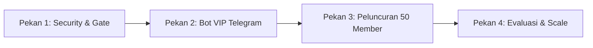

# 🧭 ANALISIS STRATEGIS & SARAN TINDAKAN: REVIEW MASTER PLAN REVAMP MBG TRADING

**Dokumen Khusus untuk:** Mas Fuad & Tim Founder MBG Trading  
**Tanggal:** 1 Oktober 2026  
**Penulis:** Partner Diskusi Teknis & Komersial (Quantitative AI Engineering)  
**Status Dokumen:** Rekomendasi Aksi & Validasi Bisnis (Lean Execution)

---

## 📌 Executive Summary (Ringkasan Eksekutif untuk Mas Fuad)

Mas Fuad, kami sudah membaca dan membedah tuntas dokumen **`new plan`** yang baru masuk:
1. `MBG-Trading-Revamp-Master-Plan.md` (140 KB / 1.214 baris)
2. `MBG-Trading-Implementation-Backlog.md` (781 baris)

Secara teknis, dokumen ini **sangat luar biasa dan sangat mendalam**. Tim yang menyusunnya sangat teliti dalam mencatat setiap kelemahan sistem dari audit C01–C05 dan H01–H22.

**NAMUN, ADA JEBAKAN BESAR DARI KACAMATA BISNIS & EKSEKUSI LEAN (THE PONYTAIL & GTM TRAP):**
> Dokumen tersebut memperkirakan estimasi waktu pengerjaan **13.5 hingga 24 minggu kerja (3.5 – 6 bulan)** hanya untuk merilis produk pertama. Dalam realita software development, 24 minggu hampir selalu molor menjadi **8–10 bulan**.
> 
> Membangun sistem raksasa selama 6–8 bulan untuk platform yang saat ini **masih memiliki 0 pengguna berbayar** adalah resep paling ampuh untuk **kehabisan bensin, kehilangan momentum pasar, dan burnout**.

**Rekomendasi Utama Kita:**
**JANGAN JALANKAN RENCANA 24 MINGGU SECARA AIR TERJUN (WATERFALL).**  
Gunakan prinsip Pareto 80/20:
* **Ambil 20% inti dokumen:** Perbaikan integritas data, keamanan password/API, dan kejelasan sinyal.
* **Buang/Tunda 80% fitur raksasa:** Sistem skripsi/paper PDF 7 halaman bergaya akademis, workspace korporat multi-seat, dan birokrasi dewan redaksi.
* **Luncurkan MVP dalam 7–14 hari:** Fokus jualan **Sinyal VIP Telegram (Gold, BTC, IDX)** + akses **Web Cockpit Dribbble Clean** yang sudah kita buat hari ini. Uji pasar ke 20–50 orang pertama!

---

## 🔍 Bagian 1: Bedah Dokumen "New Plan" (Apa yang Bagus vs Apa yang Over-Engineered)

### ✅ Poin Emas yang WAJIB Kita Ambil (The True Value)
1. **Audit Integritas Data (Register Masalah C01–C05 & H01–H22):**
   * Poin ini 100% benar: jangan menampilkan data buatan (*synthetic*) seolah-olah itu data live asli tanpa penafian. Kita sudah mulai bereskan ini di `whale_tracker.py` dan `bandarmology_iifs.py`.
2. **Kerapian Keamanan (H01 & H02):**
   * Password bypass `mbg` di client-side harus dicabut.
   * File data sinyal di folder `public/` harus dilindungi agar tidak bisa di-download gratis via inspect element.
3. **Pemisahan Peran yang Jelas:**
   * Perbedaan hak akses antara Tamu (*Guest*), Pengguna Terdaftar (*Free*), dan Pelanggan Berbayar (*Pro/VIP*).

---

### ❌ Poin Over-Engineering yang WAJIB DIBUANG / DITUNDA (The Waste)

| Fitur di "New Plan" | Mengapa Harus Dibuang/Ditunda? | Rekomendasi Ponytail |
|---|---|---|
| **Sistem Paper/Tesis Akademis 7 Halaman (RQ10, RQ11, Quarto PDF)** | Trader retail Indonesia **TIDAK AKAN** membaca paper riset setebal skripsi sebelum beli saham/kripto. Mereka butuh sinyal ringkas: *Entry, SL, TP, dan Alasan 2 kalimat*. | Ganti dengan **Daily Market Brief ringkas** (format bullet point 5 baris di web/Telegram). Selesai dalam 1 hari koding. |
| **Business Tier Multi-Seat & Tim Korporat (Seksi 4.1)** | Kita belum punya klien institusi (Sekuritas/Manajer Investasi) yang mau beli langganan multi-kursi. Membangun sistem RBAC tim sekarang adalah *premature optimization*. | Tunda sampai ada perusahaan beneran yang mengetuk pintu minta akun tim. Saat ini fokus B2C (trader perorangan). |
| **Birokrasi Dewan Redaksi & Retraction Policy** | Mengatur proses kurasi artikel bergaya jurnal ilmiah Wall Street. Untuk tim beranggotakan 2 orang, ini membuang waktu. | Mas Fuad & tim yang pegang kendali langsung (kurasi mandiri). |
| **Pengadaan Lisensi Bursa 18 Negara** | Biaya lisensi real-time feed dari 18 bursa dunia bisa mencapai puluhan ribu dolar per bulan. | Gunakan feed yang legal, gratis, dan stabil (Yahoo Finance / Binance API / Mempool / RSS agregator) seperti yang saat ini berjalan. |

---

## 🧠 Bagian 2: Analisis Bisnis, GTM & Finansial

### 1. First Principles & Mental Models (`/mental`)
* **Apa Nilai Utama yang Sebenarnya Dibeli Pengguna?**
  Konsumen retail tidak peduli berapa baris kode di backend atau seberapa tebal file PDF yang dihasilkan. Mereka hanya peduli pada 3 hal:
  1. *Apakah sinyal ini menghasilkan profit dan punya kalkulasi risiko yang masuk akal?*
  2. *Apakah platform ini mudah digunakan dan tidak bikin pusing (Mode Santai)?*
  3. *Apakah pengembangnya transparan dan jujur (bukan penipu screenshot)?*
* **Inversion Thinking (Cara Menjamin Kegagalan):**
  Jika kita menghabiskan waktu 6 bulan mengutak-atik kode tanpa pernah menjual sepeser pun sinyal, kita akan kehabisan semangat, kehilangan momentum tren pasar, dan produk akan mati sebelum lahir.

### 2. Validasi Pasar & The Mom Test (`/gtm`)
* **Siapa Ideal Customer Profile (ICP) MBG Trading?**
  * **BUKAN:** Fund Manager korporat di SCBD atau akademisi finansial.
  * **TARGET SEJATI:** Trader mandiri (usia 22–45 tahun, modal Rp 10 Juta – Rp 500 Juta) yang butuh panduan trading saham BEI, Emas (XAUUSD), dan Kripto, lelah dengan grup pom-pom, dan mengapresiasi analisis berbasis algoritma kuantitatif.
* **Pertanyaan Validasi untuk Mas Fuad (Tanyakan ke Calon Member):**
  > *"Selama ini kalau langganan sinyal atau tools, kamu bayar berapa per bulan? Apa masalah terbesarmu di grup sinyal yang lama? Fitur apa yang bikin kamu betah langganan terus?"*

### 3. Perhitungan Bisnis & Unit Economics (`/marketing-analytics`)
* **Tolok Ukur Harga Pasar (Indonesia):**
  * Grup VIP Telegram Retail: **Rp 150.000 – Rp 350.000 per bulan**.
  * Churn Rate Bulanan (tingkat berhenti langganan): rata-rata **20% per bulan**.
  * Rata-rata masa aktif pelanggan (*Customer Lifetime*): **5 bulan**.
  * **LTV (Lifetime Value) per Pelanggan:** $\text{Rp } 200.000 \times 5 = \mathbf{\text{Rp } 1.000.000}$.
* **Simulasi Arus Kas:**
  * **50 Member VIP Pertama:** $50 \times \text{Rp } 200.000 = \mathbf{\text{Rp } 10.000.000\text{ / bulan}}$ pemasukan bersih berulang (*MRR*).
  * Ditambah potensi komisi swap Phantom memecoin yang baru kita buat (0.8% komisi).
  * **Pesan Finansialnya:** Jangan habiskan biaya rekayasa senilai Rp 150 Juta (24 minggu waktu kerja) untuk sesuatu yang belum terbukti menghasilkan Rp 10 Juta pertama!

---

## 🚀 Bagian 3: Roadmap Nyata 4 Pekan (The 80/20 Lean Plan)

Daripada menghabiskan 24 minggu tanpa pemasukan, ini rencana aksi 4 pekan yang langsung menghasilkan produk siap jual dan uang riil:

### Pekan 1: Amankan Pintu & Kunci Data (Est. 2-3 Hari Kerja)
* Cabut password hardcoded `mbg` dari sisi browser (`PasswordGate.jsx`).
* Pasang autentikasi Supabase Auth gratis (login Google / Email).
* Pindahkan file JSON sinyal dari folder `public/` ke endpoint API agar tidak bisa dicuri gratis.
* *Output:* Sistem aman, tidak bocor, dan siap menerima pengguna publik.

### Pekan 2: Sambungkan Bot Juara ke Grup Telegram VIP (Est. 3 Hari Kerja)
* Pilih 3 bot terbaik dari 16 bot Arena (misal: 1 Spesialis Gold, 1 Spesialis BTC, 1 Spesialis Saham IDX).
* Aktifkan fungsi `broadcast_vip_trade_signal` yang sudah kita buat di `telegram_notifier.py`.
* Buat Channel Telegram:
  * **Channel Publik (Gratis):** Berisi rekap harian, berita makro, dan hasil performa bot (sebagai corong promosi).
  * **Grup VIP (Berbayar):** Berisi sinyal instan *real-time* dengan Entry, Stop Loss, dan Take Profit presisi.

### Pekan 3: Validasi Penjualan Pertama (GTM Launch)
* Mas Fuad membuka pendaftaran *Early Bird* untuk 30–50 orang pertama:
  * Harga promo: Rp 150.000/bulan (atau Rp 350.000 per 3 bulan).
  * Paket yang didapat: Akses Channel Sinyal VIP Telegram + Akun Pro di Web Cockpit MBG.
* Uji respons member: Apakah sinyalnya mudah diikuti? Apakah mereka merasa tertolong?

### Pekan 4: Evaluasi Pasar & Pengembangan Lanjutan
* Hitung uang yang masuk dan evaluasi masukan member asli.
* Dari uang langganan tersebut, baru kita putuskan:
  * Apakah member butuh fitur ekspor PDF? (Jika iya, aktifkan modul PDF yang sudah siap).
  * Apakah member butuh copy-trading otomatis MT5? (Jika iya, mulai garap integrasi MT5).
  * Semua pengembangan dibiayai dari **profit pelanggan**, bukan membakar waktu dan modal di awal.

---

## 🤝 Penutup untuk Mas Fuad

Mas Fuad, dokumen *Master Plan* yang dibuat tim adalah **cetak biru jangka panjang yang sangat bagus untuk diarsipkan**. Dokumen itu membuktikan bahwa kita tahu persis bagaimana membangun platform trading kelas dunia.

Tetapi sebagai pengusaha, **kecepatan validasi pasar adalah raja**. 

Platform web kita hari ini sudah sangat cantik (UI Dribbble clean, Mode Santai untuk pemula, Phantom Wallet terpasang, Bandarmology sudah terintegrasi). Langkah paling bijak sekarang adalah **mengunci celah keamanannya dalam hitungan hari, lalu segera buka grup VIP-nya dan mulai cari pemasukan nyata.**

Mari kita eksekusi langkah ringkas ini bersama! 🚀
