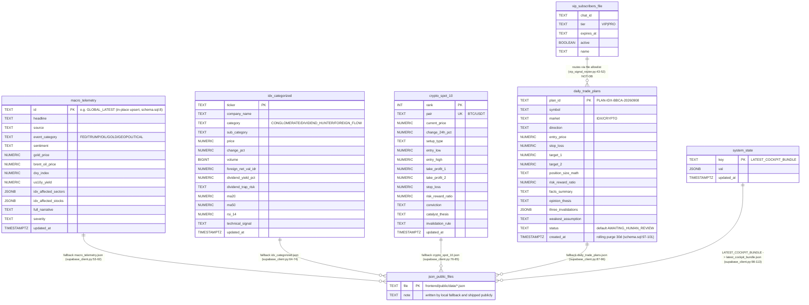
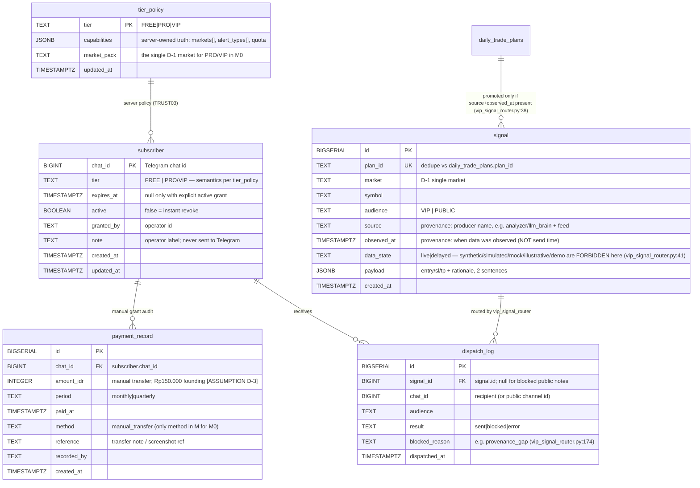

# ERD — MBG Trading (M0, 2026-10-02)

<!-- Reverse-engineered from engine/database/schema.sql, engine/database/supabase_client.py, and top-level keys of frontend/public/data/*.json. Dirty-tree truth; planned ≠ implemented. -->

## Part A — CURRENT state

### A.1 Diagram (as-is)



### A.2 Public JSON payloads (top-level keys; heads of `frontend/public/data/*.json`)

| File | Shape | Top-level keys (head, ~first 40 lines) | Sensitivity |
|---|---|---|---|
| `latest_cockpit_bundle.json` (4.2 MB) | object | `last_updated`, `data_sources`, `macro_telemetry`, `conglomerates`, `dividend_hunters`, `foreign_flow`, `crypto_spot_10`, `daily_trade_plans`, `technical_analysis`, `smc_analysis`, `bandarmology_iifs`, `broker_summary`, `forecasts`, `paper_portfolio`, `strategy_rankings`, `backtest_lab`, `correlation_matrix`, `whale_intelligence`, `crypto_futures`, `forex_intelligence`, `us_stocks`, `arena_state`, `mode`, `section_timestamps`, `execution_duration_sec`, `live_news` | **Whole signal product, anonymous download** (V3 B7) |
| `crypto_spot_10.json` | array | `pair`, `symbol`, `current_price`, `change_24h_pct`, `high_24h`, `low_24h`, `rsi_14`, `sma20`, `volume_quote`, `market`, `currency`, `setup_type`, `entry_low`, … | Paid (if D-1 crypto) |
| `daily_trade_plans.json` | array | `plan_id`, `symbol`, `clean_ticker`, `market`, `direction`, `entry_price`, `stop_loss`, `target_1`, `target_2`, `position_size_math`, `risk_reward_ratio`, `technical_signal`, `facts_summary`, … | Paid |
| `idx_categorized.json` | array | `ticker`, `full_ticker`, `company_name`, `category`, `sub_category`, `ownership_type`, `catalyst_thesis`, `price`, `change_pct`, `volume`, `foreign_net_val_idr`, `dividend_yield_pct`, `dividend_trap_risk`, … | Mixed |
| `latest_arena_state.json` | object | `agents[]` (`id`, `name`, `role`, `strategy`, `avatar`, `color`, `tier`, `generation`, `resetCount`, `dnaTraits`, …) | Internal (C-7: never marketed) |
| `latest_crisis_alert.json` | object | `is_crisis`, `severity`, `headline`, `summary`, `affected_tickers[]`, `recommended_action`, `evaluated_at` | Public OK |
| `macro_telemetry.json` | object | `id`, `headline`, `headlines[]` (`title`, `category`, `severity`), `source`, … | Public sample OK |
| `research_archive.json` | array | `id`, `title`, `source`, `link`, `pub_date`, `timestamp_ms`, `source_published_at`, `source_time_utc`, `published_str`, `published_date`, `published_time`, `date_iso`, `scope`, … | Teaser/paid split |

Notes of record:
- `supabase_client.py` never removes the public fallback: every upsert also writes to `frontend/public/data` (lines 36-51) — this **is** the TRUST04 leak mechanism.
- `vip_subscribers.json` (schema in `engine/config/vip_subscribers.example.json`) is a **file**, not a table: "file-based entitlement … stopgap until server entitlement (TRUST03) lands" (`vip_signal_router.py:16-17`).
- Every workflow that needs plans reads these JSON files; the Telegram webhook also reads the public bundle (`telegram-webhook.js:36-37` cache).

## Part B — TARGET additions for M0 (VIP) — minimal, no deferred-feature entities

Design rule (YAGNI): one grant row = chat_id ↔ tier ↔ expiry. No wallets, no invoices entity, no Business seats, no teams — those are deferred (WORKSPACE01–03, COMMERCIAL01–06) and intentionally absent.



### Field table

| Entity | Fields (type, key) | Motivating ticket |
|---|---|---|
| `subscriber` | `chat_id BIGINT PK`, `tier TEXT`, `expires_at TIMESTAMPTZ`, `active BOOLEAN`, `granted_by TEXT`, `note TEXT`, `created_at/updated_at` | TRUST03, GTM-TG-01; mirrors `Subscriber` dataclass (`vip_signal_router.py:59-66`) so the file allowlist becomes a table |
| `payment_record` | `id BIGSERIAL PK`, `chat_id FK`, `amount_idr INT`, `period TEXT`, `paid_at`, `method TEXT` (manual_transfer OK), `reference`, `recorded_by` | COMMERCIAL01 (access contract basis), D-3 pricing; audit trail for W4 metrics |
| `signal` | `id BIGSERIAL PK`, `plan_id UK`, `market`, `symbol`, `audience`, `source`, `observed_at`, `data_state` (non-live values forbidden), `payload JSONB`, `created_at` | TRUST05 (provenance contract), GTM-DATA-01 (honesty); §6.2 data-honesty gate in PRD |
| `dispatch_log` | `id BIGSERIAL PK`, `signal_id FK`, `chat_id`, `audience`, `result`, `blocked_reason`, `dispatched_at` | GTM-DATA-01 audit: every blocked signal has a recorded reason (PRD metric row "signals blocked") |
| `tier_policy` | `tier PK`, `capabilities JSONB`, `market_pack`, `updated_at` | TRUST03 (server-owned capability policy; kills localStorage tier at `App.jsx:186-195`); quota params from [MP] §4.3 restore (V3 §3.5) |

Deliberately **NOT** created in M0: user/identity table beyond chat_id (auth target undecided, D-7), invoice/checkout (COMMERCIAL03 deferred), seats/teams (Business deferred), Arena performance tables (C-7 ban).

## Part C — Migration: public JSON → private (TRUST04 split of `latest_cockpit_bundle.json`) + minimal SQL

### C.1 Split decision (bundle top-level keys → serving tier)

| Bundle key (Part A.2) | M0 serving tier | Reason |
|---|---|---|
| `macro_telemetry`, `latest_crisis_alert` content, headline of `live_news` | **Public sample** (stale-labelled, delayed) | Free funnel content; low sensitivity |
| `crypto_spot_10`, `daily_trade_plans`, `technical_analysis`, `strategy_rankings`, `forecasts` | **Private (PRO/VIP via `/api/data`)** | This IS the paid signal (Entry/SL/TP) |
| `bandarmology_iifs`, `broker_summary`, `foreign_flow`, `conglomerates`, `dividend_hunters`, `whale_intelligence` | **Private** (or drop from bundle; IDX market pending D-1 anyway) | Data-rights sensitive (C-5) |
| `arena_state`, `paper_portfolio`, `backtest_lab`, `correlation_matrix` | **Internal only** (not in public OR paid bundle) | C-7: defective ledger, never marketed |
| `crypto_futures`, `forex_intelligence`, `us_stocks`, `smc_analysis` | **Deferred markets → excluded in M0** | One-market rule (C-2/C-3) |
| `mode`, `section_timestamps`, `execution_duration_sec`, `last_updated` | **Internal meta**; expose `observed_at`-style freshness per section to all tiers | Honesty labelling (§6.2) |

Mechanics: stop the unconditional public fallback in `sync_complete_bundle` / `_save_local_fallback` (`supabase_client.py:36-51, 98-113`); `/api/data` (`frontend/functions/api/data.js:50-80`) already reads `system_state.LATEST_COCKPIT_BUNDLE` — add the tier filter there (REMOVE the `'fallback-secret-for-dev'` at `data.js:52`, TRUST01 consistency) and serve a stripped public projection without auth.

### C.2 Minimal SQL (Postgres/Supabase)

```sql
-- M0 VIP extensions (idempotent). Applies AFTER existing engine/database/schema.sql.

CREATE TABLE IF NOT EXISTS subscriber (
    chat_id     BIGINT PRIMARY KEY,
    tier        TEXT NOT NULL CHECK (tier IN ('FREE','PRO','VIP')),
    expires_at  TIMESTAMPTZ,                         -- NULL only with explicit active grant
    active      BOOLEAN NOT NULL DEFAULT TRUE,
    granted_by  TEXT,
    note        TEXT,                                -- operator label, never sent to Telegram
    created_at  TIMESTAMPTZ DEFAULT NOW(),
    updated_at  TIMESTAMPTZ DEFAULT NOW()
);

CREATE TABLE IF NOT EXISTS payment_record (          -- manual transfer OK for M0
    id          BIGSERIAL PRIMARY KEY,
    chat_id     BIGINT NOT NULL REFERENCES subscriber(chat_id),
    amount_idr  INTEGER NOT NULL,                    -- Rp150.000 founding [ASSUMPTION D-3]
    period      TEXT NOT NULL CHECK (period IN ('monthly','quarterly')),
    paid_at     TIMESTAMPTZ NOT NULL,
    method      TEXT NOT NULL DEFAULT 'manual_transfer',
    reference   TEXT,                                -- transfer note / screenshot ref
    recorded_by TEXT,
    created_at  TIMESTAMPTZ DEFAULT NOW()
);

CREATE TABLE IF NOT EXISTS signal (                  -- TRUST05 provenance contract, output side
    id          BIGSERIAL PRIMARY KEY,
    plan_id     TEXT UNIQUE,
    market      TEXT NOT NULL,                       -- D-1 single market only
    symbol      TEXT NOT NULL,
    audience    TEXT NOT NULL CHECK (audience IN ('VIP','PUBLIC')),
    source      TEXT NOT NULL,                       -- producer + feed name (required)
    observed_at TIMESTAMPTZ NOT NULL,                -- when data was observed (required)
    data_state  TEXT NOT NULL DEFAULT 'live'
                CHECK (data_state NOT IN ('synthetic','simulated','mock','illustrative','demo')),
    payload     JSONB NOT NULL,                      -- entry/sl/tp + 2-sentence rationale
    created_at  TIMESTAMPTZ DEFAULT NOW()
);

CREATE TABLE IF NOT EXISTS dispatch_log (            -- honesty audit log
    id             BIGSERIAL PRIMARY KEY,
    signal_id      BIGINT REFERENCES signal(id),     -- NULL for blocked provenance-less notes
    chat_id        BIGINT,
    audience       TEXT NOT NULL CHECK (audience IN ('VIP','PUBLIC')),
    result         TEXT NOT NULL CHECK (result IN ('sent','blocked','error')),
    blocked_reason TEXT,
    dispatched_at  TIMESTAMPTZ DEFAULT NOW()
);

CREATE TABLE IF NOT EXISTS tier_policy (             -- TRUST03 server-owned capability policy
    tier         TEXT PRIMARY KEY CHECK (tier IN ('FREE','PRO','VIP')),
    capabilities JSONB NOT NULL,                     -- markets[], alert_types[], quotas from [MP] 4.3 / D-3
    market_pack  TEXT,
    updated_at   TIMESTAMPTZ DEFAULT NOW()
);

CREATE INDEX IF NOT EXISTS idx_payment_sub    ON payment_record(chat_id);
CREATE INDEX IF NOT EXISTS idx_dispatch_sig   ON dispatch_log(signal_id);
CREATE INDEX IF NOT EXISTS idx_dispatch_time  ON dispatch_log(dispatched_at DESC);

-- Seed policy (parameters from [MP] 4.3 via V3 3.5; price stays D-3, not stored here):
INSERT INTO tier_policy (tier, capabilities, market_pack) VALUES
  ('FREE', '{"markets":[],"alert_types":["public_recap"],"watchlist_symbols":20,"alert_rules":3}', NULL),
  ('PRO',  '{"markets":["<D-1>"],"alert_types":["pagi","sinyal_instan","rekap_sore"],"watchlist_symbols":200,"alert_rules":50}', '<D-1>'),
  ('VIP',  '{"markets":["<D-1>"],"alert_types":["pagi","sinyal_instan","rekap_sore"],"watchlist_symbols":200,"alert_rules":50}', '<D-1>')
ON CONFLICT (tier) DO NOTHING;

-- Future (TRUST02, NOT in M0): enable RLS on subscriber/payment_record and
-- scope /api/data to the caller's tier once individual auth lands (D-7).
```

### C.3 Cutover checklist
1. Write new tables (SQL above). 2. Migrate `vip_subscribers.json` rows into `subscriber`; keep file as read-cache only. 3. `/api/data`: verify JWT **and** tier from `subscriber`/`tier_policy`; serve stripped projection when anonymous. 4. Stop public-fallback writes of paid keys. 5. Delete/restrict paid JSON in `public/data/` (probe proves no anonymous download). 6. Point `telegram-webhook.js` bundle cache at `/api/data`-equivalent store. Each step ships independently; claim nothing as done before its probe passes (planned ≠ deployed).

