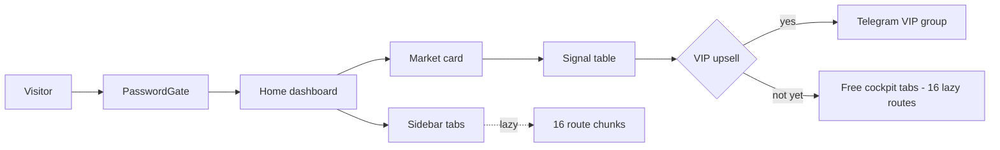
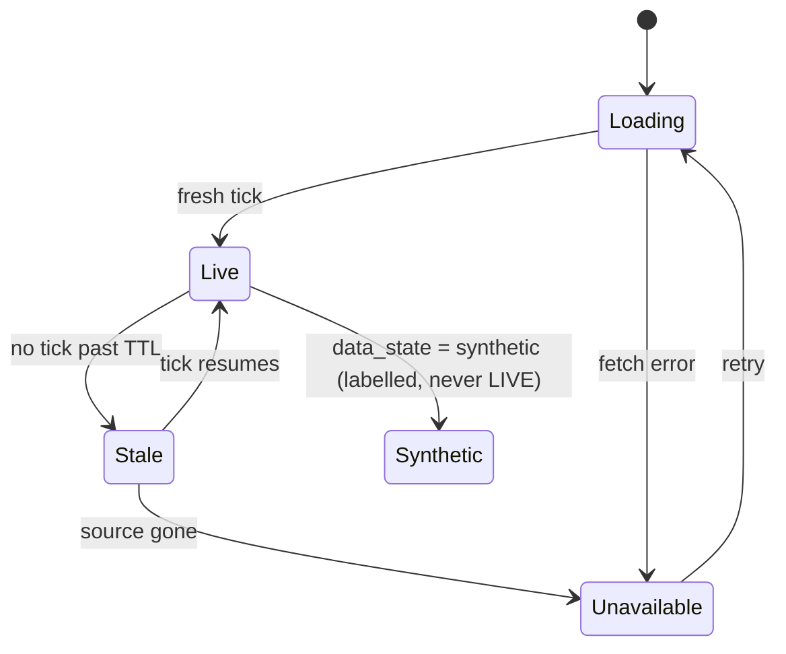

# 05 — Design System: MBG Cockpit v4 (SpaceX-class) — from the live code, 2026-10-02

**Source of truth:** frontend/src/index.css (read today, token values verbatim) + frontend/src/App.jsx + components + frontend/src/utils/format.js.
**Marking:** VERIFIED(file) = read in the working tree today · CLAIMED = from prior reports, not re-verified.

---

## 1. Principles

1. **Honest data states** — stale is stale, unavailable is an em-dash, synthetic is labelled; no decorative VERIFIED badges.
2. **Minimal** — hairline borders, one accent per theme, no gradient noise; pure-black dark canvas.
3. **No pompom** — no win-rate marketing, no fake screenshots; numbers carry provenance (source + observed_at).
4. **Accessibility first** — WCAG AA contrast in both themes, 44px touch targets (CLAIMED), tabular numerals for money.

## 2. Tokens (extracted from index.css today)

### 2.1 Light theme (:root)

| Token | Value | Note |
|:---|:---|:---|
| --bg-canvas | #f7f8fa | page background |
| --bg-panel | #ffffff | card surface |
| --bg-panel-subtle | #f1f3f7 | inset surface |
| --text-primary | #0f172a | headings/body |
| --text-secondary | #3d4756 | |
| --text-muted | #5c6673 | labels |
| --accent-primary | #1d4ed8 | single accent |
| --accent-green / gold / rust / orange | #0e9f6e / #d97706 / #dc2626 / #d97706 | semantic (badge TEXT variants overridden for contrast, see 2.4) |
| --shadow-sm / md / lg | 0 2px 6px / 0 8px 24px / 0 16px 36px (6-12% black) | elevation |
| --glass-surface | rgba(255,255,255,.88) | glass panels |

### 2.2 Dark theme ([data-theme="dark"]) — SpaceX-class

| Token | Value | Note |
|:---|:---|:---|
| --bg-canvas | #000000 | **pure black** (comment in CSS: SpaceX-class) |
| --bg-panel | #0a0d12 | hairline panel |
| --bg-panel-subtle | #0e1219 | inset surface |
| --bg-panel-dark | #05070a | |
| --text-primary | #f5f7fa | |
| --text-secondary | #aab3c0 | |
| --text-muted | #7a8798 | ~5.3:1 on panel (CSS comment) |
| --accent-primary | #4d8dff | single accent |
| --accent-green / mint | #2ee6a8 | ~12:1 on panel (CSS comment) |
| --accent-rust | #ff5c5c | ~6.4:1 on panel (CSS comment) |
| --accent-gold / orange | #ffb454 | |
| --shadow-sm / md / lg | 0 2px 8px / 0 8px 24px / 0 16px 40px (50-65% black) | deeper elevation for black canvas |
| --glass-surface | rgba(5,7,10,.85) | |

### 2.3 Typography, spacing, radius

| Token | Value |
|:---|:---|
| --font-sans | Barlow, Plus Jakarta Sans, system-ui stack |
| --font-mono | JetBrains Mono, DM Mono, Roboto Mono, ui-monospace |
| base font-size | 13px, -webkit-font-smoothing: antialiased |
| numeric rendering | font-feature-settings: cv02/cv03/cv04 + tnum 1; font-variant-numeric: tabular-nums on data tables |
| --space-1/2/3 | 4px / 8px / 16px |
| --radius-xs..full | 4 / 6 / 8 / 10 / 12 / 9999px |

### 2.4 Verified contrast overrides (in-code comments, WCAG fixes of 2026-09-30)

| Element | Was | Now | Ratio |
|:---|:---|:---|:--:|
| green badge on tint | var(--accent-green) | #166534 | 6.3:1 |
| red badge on tint | var(--accent-rust) | #be123c | 5.5:1 |
| orange badge on tint | var(--accent-orange) | #92400e | 6.7:1 |

## 3. Layout & breakpoints

- Breakpoint: single @media (max-width: 768px) — mobile collapse (smaller type 12px/10px, hamburger menu `.mobile-header-hamburger`).
- Home: bento row with staggered entrance animation (0.05s/0.1s/0.15s delays).
- Tables: `.table-scroll-container` (overflow-x auto, -webkit-overflow-scrolling touch), sticky columns (`.sticky-col-num`, `.sticky-col-ticker`; dark: #121722 / #18202e).
- Drawers: slideInRight animation (Security Hub).

## 4. Component inventory (39 files, all reachable — verified by import graph + Vite chunk emission)

| Group | Components | Status |
|:---|:---|:---|
| Shell | App.jsx, PasswordGate, Sidebar, MbgLogo, GlobalMarketTicker | USED (App.jsx static imports) |
| Home | HomeDashboardTab, BloombergNewsWire, RunningTradeWidget (via WhaleIntelligenceTab) | USED |
| Lazy routes (16) | TradingViewModal, LotCalculatorModal, OrderExecutionModal, SolanaSwapModal, FlowProcessTab, ChangelogTab, ChartingDeskTab, WhaleIntelligenceTab, CryptoFuturesTab, ForexCommandTab, USStockTab, MarketHeatmapTab, NewsDetailModal, SecurityHubDrawer, AiAgentArenaTab, AiIntelligenceDrawer | USED (dynamic imports in App.jsx) |
| Modals/drawers | CommandPaletteModal, DataIntegrityModal, ComplianceRiskModal | USED |
| Legacy bundle (via MasterQuantLeaderboard.jsx:11-15) | QuantAcademyTab (85.1 kB), EconomicCalendarTab (35.3 kB), GlobalMarketsTab (26.9 kB), OrderBookSimulator (20.4 kB), TestingHubTab (+ BacktestPerformanceLab, VirtualForwardPortfolio), NewsTab, PearsonCorrelationWidget, AssetIcon (7 importers), CryptoIcon | REACHABLE but heavy — cut the legacy imports if v4 nav does not link them (~200 kB bundle reduction, audit section 5) |

## 5. Data-state patterns

| State | Pattern | Copy (exact) |
|:---|:---|:---|
| Loading | skeleton/skeleton row | (skeleton shimmer) |
| Live | LIVE badge + real tick only | LIVE |
| Stale | dimmed + timestamp | data as of {observed_at} |
| Unavailable | em-dash cell + tooltip | — (no data) |
| Synthetic | explicit label | SIMULATION / synthetic |
| Tier gate | locked affordance | PRO |

> Verified in code: format.js utilities (src/utils/format.js) + honest-state work of the 2026-09-30 polish report (docs/UI_UX_POLISH_REPORT_2026-09-30.md). WCAG AA computed-in-both-themes is CLAIMED from the prior session record; the three contrast overrides above are VERIFIED in CSS comments.

## 6. Accessibility

| Item | Status |
|:---|:---|
| Badge contrast overrides (3 fixes) | VERIFIED (index.css comments, section 2.4) |
| Dark-theme muted text ~5.3:1, green ~12:1, rust ~6.4:1 | VERIFIED (CSS comments) |
| 44px touch targets | CLAIMED (prior report) |
| WCAG AA full audit both themes | CLAIMED (prior session record) — re-verify before launch |
| Focus states | VERIFIED (telemetry-btn:hover / focus patterns in index.css) |

## 7. Telegram message design (3 alert types, honesty rules binding)

| Type | When | Template skeleton |
|:---|:---|:---|
| Morning briefing | 07:15 WIB (manual or cron — see 06 section 2) | Pagi {date} — {market}: 2-3 setup ringkas, tiap baris: pair · arah · entry · SL · TP · alasan (2 kalimat) · sumber · observed_at |
| Instant signal | event-driven (provenance-gated) | Sinyal {pair}: entry {low}-{high}, SL {stop}, TP1 {tp1}, TP2 {tp2} · sumber: {source} · observed_at: {observed_at} · RR {rr} |
| Evening recap | 18:30 WIB | Rekap {date}: apa yang terjadi, apa yang miss (jujur), hasilnya vs rencana · tanpa klaim win-rate |

**Rules (binding, from vip_signal_router.py):** every signal carries source + observed_at; plans without provenance are downgraded to public notes and recorded as blocked; synthetic/simulated/mock/illustrative/demo states are NEVER sent as live signals; URL = mbg-trading.pages.dev; no win-rate claims (C-7).

## 8. Gaps & recommendations (ranked)

1. WCAG AA full audit is CLAIMED, not re-verified — run a computed contrast pass on both themes before launch.
2. LCP/INP/CLS p75 unmeasured — add to launch QA (CWV).
3. Legacy bundle via MasterQuantLeaderboard (~200 kB) — cut imports if unused in v4 nav.
4. Dark-theme sticky-col backgrounds are hardcoded (#121722/#18202e) instead of tokens — minor, align with --bg-panel-subtle.
5. Logo-resolver registry + route-registry aliases (W2 slim, per prior review).

## 9. Diagrams

### 9.1 Main user navigation

### 9.2 Data card state machine

