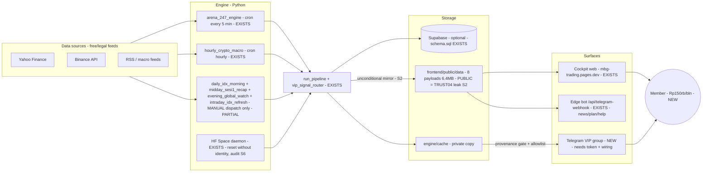
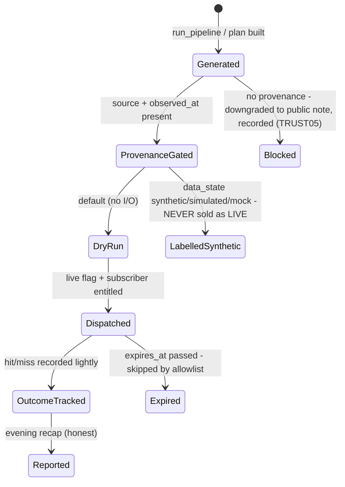
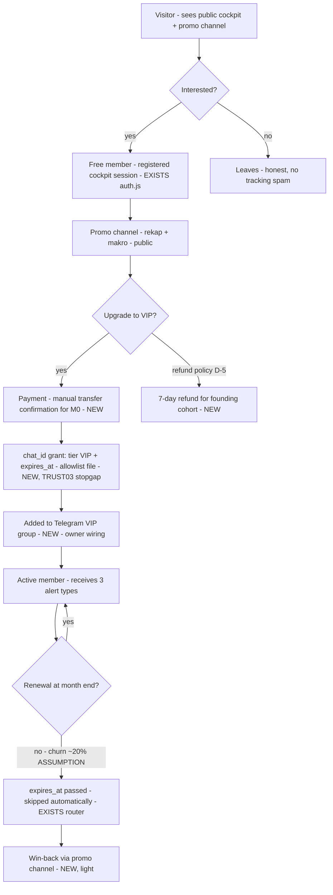
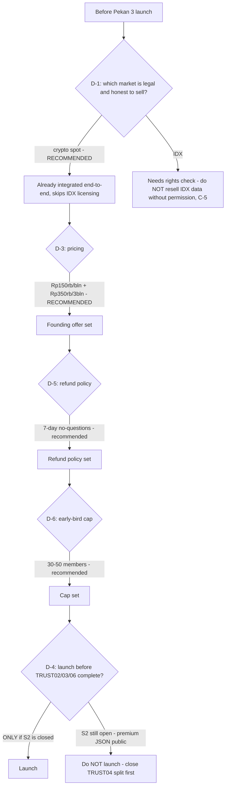

# 06 — Business Process: what will happen, end to end (2026-10-02)

**Purpose:** the owner (Mas Fuad) can see the whole machine — what runs automatically, what is manual, where money enters, and where decisions are needed.
**Evidence tags:** EXISTS(file) = implemented in the working tree · PARTIAL · NEW. Schedules verified in .github/workflows/*.yml today.
**CRITICAL FACT (verified today): only 2 of 7 workflows run on a schedule** — arena_247_engine (every 5 min) and hourly_crypto_macro (hourly). The IDX morning/session-1/evening/intraday workflows are workflow_dispatch (manual) ONLY. The "automatic daily briefing" is currently a manual step, not automation.

---

## 1. System context (what the machine looks like)



**Legend:** every arrow is a real code path (file cited on the node). The PUB mirror arrow is the TRUST04 leak (supabase_client.py:36-51): it fires even when Supabase is configured. The TGVIP arrow exists in code (vip_signal_router.py) but the group/token wiring is NEW.

## 2. Daily operating cycle (Waktu Indonesia Barat)

```mermaid
sequenceDiagram
  participant C as Cron/Manual trigger
  participant E as Engine (run_pipeline + router)
  participant S as Storage (Supabase/cache/public)
  participant T as Telegram (VIP + public)
  participant O as Owner (Mas Fuad)
  Note over C: 07:15 - morning briefing: workflow_dispatch ONLY (manual today)
  O->>C: trigger daily_idx_morning (or re-enable cron)
  C->>E: fetch IDX + build plans
  E->>S: upsert + mirror (provenance: source + observed_at)
  E->>T: morning brief (alert type: pagi)
  Note over C: every 5 min - arena state (AUTOMATIC)
  C->>E: arena_247 multi-tick update
  Note over C: hourly - crypto + macro (AUTOMATIC)
  C->>E: hourly_crypto_macro
  E->>S: upsert + mirror
  Note over C: 12:15 - sesi 1 recap (MANUAL today)
  O->>C: trigger midday_sesi1_recap
  Note over C: intraday refresh (MANUAL today)
  O->>C: trigger intraday_idx_refresh
  Note over C: 18:30 - evening global watch (MANUAL today)
  O->>C: trigger evening_global_watch
  C->>E: global watch + recap
  E->>T: rekap sore (honest: apa yang miss, tanpa win-rate)
  Note over E,T: IF data stale or pipeline fails: honest fallback - stale = stale, unavailable = em-dash; NEVER fabricated
```

**What happens when things fail (honest, not fabricated):** the router downgrades plans without provenance to public notes and records them as blocked (vip_signal_router.py); the frontend shows stale/unavailable states; nothing invents numbers.

## 3. Signal lifecycle



**Implemented by:** engine/notifiers/vip_signal_router.py (REQUIRED_PROVENANCE_KEYS, NON_LIVE_STATES, Subscriber.is_entitled, dry_run default) + scripts/send_vip_signals.py. 41 pytest green.

## 4. Member journey & funnel



**NEW steps marked:** payment confirmation, chat-id grant, VIP group wiring, win-back, refund. Everything else EXISTS in code today.

## 5. Owner decision gates



## 6. 4-week M0 timeline (gantt)

```mermaid
gantt
  title M0 - start Mon 2026-10-06 (Asia/Bangkok)
  dateFormat YYYY-MM-DD
  section Pekan 1 - security gate
  TRUST01 done, commit it              :done, t1, 2026-10-06, 1d
  Git hygiene S7 + commit + push + deploy :crit, t2, 2026-10-06, 1d
  data.js fallback secret S8 fix       :t3, after t2, 1d
  TRUST06 release flags (fake swap S4) :t4, after t3, 2d
  section Pekan 2 - Telegram VIP
  TRUST04 split (D-2 backend decision) :crit, w2a, 2026-10-13, 3d
  TRUST03 server tier policy           :w2b, after w2a, 2d
  Channel wiring (user: token, groups) :w2c, 2026-10-13, 3d
  Workflow cron re-enable or manual SOP :w2d, after w2c, 1d
  section Pekan 3 - launch (conditional D-1)
  Founding offer + early-bird cap (user) :w3a, 2026-10-20, 2d
  Onboarding script ([V2] setup guide) :w3b, after w3a, 2d
  Launch to 30-50 founding members     :milestone, m3, after w3b, 0d
  section Pekan 4 - evaluate
  Track outcomes + churn + feedback    :w4, 2026-10-27, 5d
  W4 review: scale-from-profit decisions :milestone, m4, after w4, 0d
```

## 7. Unit economics (every number labelled)

| Item | Value | Label |
|:---|:---|:---|
| Founding price | Rp150.000/bln | [FACT — the plan of record, V3 L237] |
| Standard price (post-founding) | Rp200.000/bln | [ASSUMPTION — validate in W4] |
| Quarterly option | Rp350.000/3 bulan | [FACT — from [LEAN] 113] |
| Infra floor | ~US$30/mo (Cloudflare $5 + Supabase $25) | [ASSUMPTION — [MP] S18] |
| Payment fee (manual transfer M0) | Rp0 | [FACT for M0; gateway fees later] |
| Churn (monthly) | 20% | [ASSUMPTION — [LEAN]; measure in W4] |
| Customer lifetime | 5 months | [ASSUMPTION — derived from churn] |
| LTV | Rp200k x 5 = Rp1.000.000 | [ASSUMPTION — midpoint price, no data] |

**Corrected MRR math:** 50 members x Rp150k = **Rp7.500.000 GROSS/month** (the often-quoted Rp10M used the Rp200k price AND called gross "net" — both wrong, V3 L547). Net = gross minus infra (~Rp500k) and payment fees (Rp0 in M0) = **~Rp7.0M**.

### Sensitivity (gross MRR at snapshot; churn changes LIFETIME, not the snapshot)

| Members | Gross MRR | Lifetime at churn 10% | 20% | 30% |
|:--:|:--:|:--:|:--:|:--:|
| 20 | Rp3.0 jt | 10 mo | 5 mo | 3.3 mo |
| 50 | Rp7.5 jt | 10 mo | 5 mo | 3.3 mo |
| 100 | Rp15.0 jt | 10 mo | 5 mo | 3.3 mo |

> Break-even vs the infra floor (~US$30/mo): ~1 member covers it. The real risk is refill speed (members lost per month at 20% churn = 10 of 50), not unit margin.

## 8. Launch checklist (Pekan 3) + daily SOP

### Launch checklist
1. S2 closed: premium payloads out of public/ (TRUST04 split done + verified).
2. S8 closed: data.js fallback secret removed (fails closed).
3. S4 closed: fake swap hash removed/labelled (TRUST06 flags).
4. Git: S7 fixed, explicit staging, committed, pushed, deployed (nothing is committed today).
5. Telegram: bot token + VIP group + promo channel live; chat-id grant map populated.
6. Webhook: signed/unsigned POST pair verified (S3 enforcement).
7. Cadence: cron re-enabled OR manual SOP accepted by owner.
8. CWV + WCAG AA re-verified on the deployed site.
9. D-1..D-6 answered and recorded in V3/V4.

### Daily 15-minute SOP (owner)
1. (2 min) Trigger daily_idx_morning (or verify cron fired) — check the public cockpit loads fresh data with observed_at.
2. (2 min) Trigger midday_sesi1_recap at 12:15; evening_global_watch at 18:30.
3. (3 min) Read the VIP group: are the 3 alert types out? any blocked-by-router notices (provenance gaps)?
4. (3 min) Check engine cache vs public payloads for drift (the S2 mirror disappears after TRUST04).
5. (3 min) Answer member questions honestly; log any missed signal in the outcome sheet.
6. (2 min) Payment check: new transfers confirmed -> chat_id grant + expiry updated.