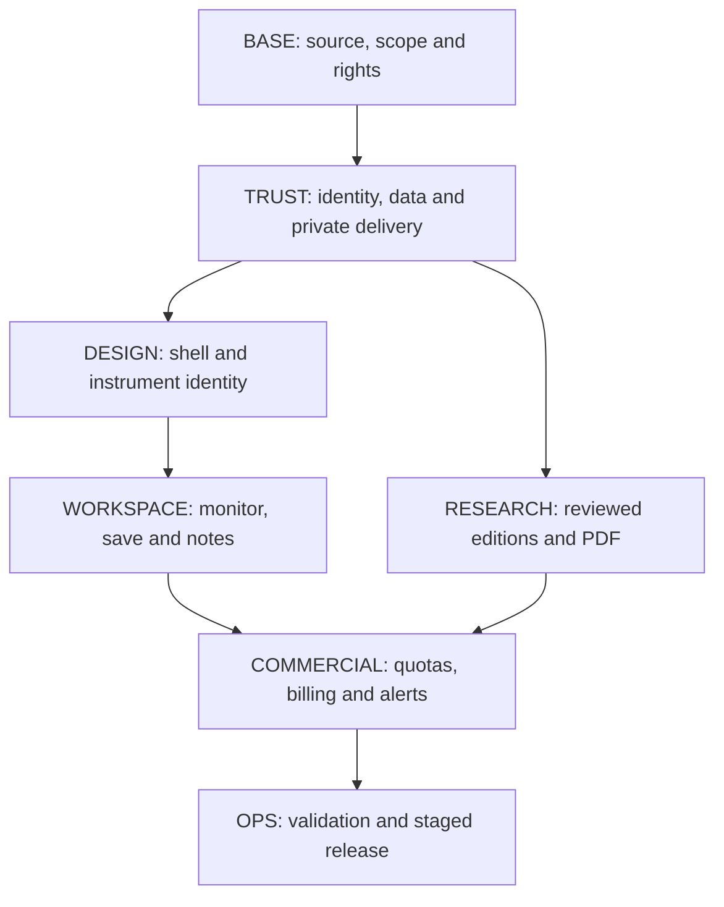

# 01 — Revamp Plan + Implementation Backlog: Cited Inventory

**Workstream:** ticket/remediation inventory (task-1) · **Date:** 2026-10-01/02 (Asia/Bangkok)
**Repo:** `MBG-Trading` · **Method:** read-only extraction from the two source attachments; no source modification.

**Sources (never modified):**
- **[MP]** `MBG-Trading-Revamp-Master-Plan.md` (1.214 lines)
- **[BL]** `MBG-Trading-Implementation-Backlog.md` (781 lines)

**Evidence rule:** every row cites the source section/line. Where the two documents disagree, both positions are recorded rather than reconciled silently. All [BL] tickets are explicitly **planned only** — [BL] 8, 110, 537, 541 state that no code/DB/deployment was changed and the remote/deployed revision is unverified.

---

## 1. Remediation register (carried forward from the audits)

**Priority rule ([MP] 84):** **P0** = block release of the affected feature until corrected or isolated; **P1** = required for dependable public research/subscription workflows; **P2** = advanced/later scope. Closure requires new evidence, not an absent mention in a later audit.

| ID | Finding carried forward | Required closure evidence | Release scope | [MP] line |
|---|---|---|---|---|
| **C01** | Generated whale events and unsupported entity/direction attribution | Remove generators from public data; observed transaction IDs and provenance; unknown stays unknown; watermark demos | P0 Flows/Whale | 90 |
| **C02** | Invented candles, running tape and depth | Timestamped real feeds or honest unavailable states; simulations never enter market analytics | P0 affected market surfaces | 91 |
| **C03** | Fabricated fallback news and fixed calendar releases | Sourced publication IDs/times; actual scheduled/released data; missing feed stays missing | P0 News/Calendar/Research | 92 |
| **C04** | Real orders lack the requested protective exits | Dedicated server order service, acknowledged protective orders, sizing, idempotency, reconciliation; keep live execution disabled | Separate execution project | 93 |
| **C05** | Browser PaperBroker: two simultaneous exits can lose one settlement | Immutable evaluation and exactly-once settlement; two stops → two journal/cash settlements; Arena engines reconciled separately | P0 browser-paper release | 94 |
| **H01** | Authentication fallback/bypass paths | Individual identity, secure sessions, no production fallback credentials; logout/revocation tested | **P0 public access** | 95 |
| **H02** | Protected data request can proceed without a token | Explicit public/private policies, auth before query, no protected static bundle; direct API tests | **P0 premium/private access** | 96 |
| **H03** | Daemon reset lacks established admin authorization | Scoped admin authentication, impact review, audit, account/run isolation | P0 internal mutation | 97 |
| **H04** | Exchange secrets in the browser | Remove browser secret custody; server-only restricted credentials and redaction | Separate execution project | 98 |
| **H05** | Database ownership/RLS not established in source | Versioned user/workspace ownership and RLS policies; cross-account access tests | P0 multi-user launch | 99 |
| **H06** | Invalid/non-finite numeric input corrupts accounting | Finite/positive/unit validation before any mutation; invalid request leaves balances unchanged | P0 paper/risk | 100 |
| **H07** | Order type/side semantics inconsistent | Explicit supported state machine, matching policy, order-type fixtures | P0 paper/execution | 101 |
| **H08** | Target status can override a stop/terminal position state | State keyed to account+position+event; terminal state cannot revive | P0 paper/risk | 102 |
| **H09** | Currency and market classification unsafe | Typed instrument/quantity/money/FX contract; no mixed-currency summation | P0 accounting/risk | 103 |
| **H10** | AI veto/model error can fail open | Deterministic approval/safety gates; missing/model-failed evidence cannot authorize action | P0 affected automation | 104 |
| **H11** | Confidence/strategy labels imply unsupported certainty | Explain heuristic scores; calibrated probabilities only with evidence; no decorative VERIFIED | P1 all analytics | 105 |
| **H12** | Untrusted feed text can influence prompts/control | Treat sources as evidence, not instructions; constrained outputs; numerical verification | P1 AI/research | 106 |
| **H13** | Split ledgers and incompatible schemas | One canonical account/order/fill/position/journal contract; migrate/reconcile legacy stores | P0 performance products | 107 |
| **H14** | Arena synchronization can be stale/inconsistent | One writer/authority per run/account; versioned updates; replay/restart checks | P0 Arena | 108 |
| **H15** | Backtest portfolio metrics not soundly constructed | Dated portfolio/equity series, exposure and costs; rerunnable methodology | P2 Strategy Lab gate | 109 |
| **H16** | Profit factor/trials/return can be invented or mislabelled | Calculate from recorded run; undefined metrics explained, not fixed values | P1 analytics | 110 |
| **H17** | Freshness/integrity/verified labels unreliable | Per-observation event time, receipt time, delay, quality, actual verification results | **P0 public trust** | 111 |
| **H18** | Spot quotes overwrite futures mark semantics | Separate last/bid/ask/mark/index/settlement by venue and contract | P0 derivatives research | 112 |
| **H19** | RSI initialization and precision defects | Independently calculated reference vectors; full precision internally, display rounding separately | P1 calculation foundation | 113 |
| **H20** | Correlation aligned by array position rather than dates | Join return series by time; define calendar/frequency/missingness/sample; test mismatched holidays | P1/P2 risk tools | 114 |
| **H21** | Low-price stops can round to zero | Tick/step-aware rounding with positive supported price and unchanged risk bounds | P0 risk tools | 115 |
| **H22** | Green health can coexist with stale observations | Separate process availability from data readiness; downstream quality gates | **P0 public trust** | 116 |
| **M01** | Calendar/timezone/offset handling | Exchange sessions, holidays, DST, strict source-time parsing; separate event/source/receipt times | P1 markets/calendar | 117 |
| **M02** | Wrong range/flow/fundamental definitions | True 52-week sample or correctly named shorter range; turnover ≠ ETF net flow; fundamentals dated/sourced | P1 research/data | 118 |
| **M03** | Persistence/schedule failures hidden | Atomic publish, job state/retry/dead-letter, durable storage, verified restore, schedule monitoring | P1 operations | 119 |
| **M04** | MT5 restart/minimum-lot risk behaviour | Persistent baselines, contract-aware fail-closed sizing; test separately before live scope | Separate MT5 project | 120 |

### 1.1 Additional 28 Sep–1 Oct issues ([MP] 122–139)

| Item | Required action | [MP] line |
|---|---|---|
| Portfolio/performance hero | Reconcile every hero metric to actual account/run/source; labelling does not fix numbers | 126 |
| Solana swap | Keep as explicit internal demo or remove public action; real signing only in a separate validated scope | 127 |
| Tier foundation | Move preview switch to admin sandbox; server owns paid entitlement | 128 |
| User-owned storage | Cloud ownership, logout/account-switch isolation, consented import | 129 |
| Research payload | Remove fixed BBCA/ANTM levels and allocation contamination | 130 |
| Research reader | Canonical paper reader + evidence checks; remove false quantitative precision | 131 |
| Research archive/refresh | Explicit archive pagination/version/retention and queued job semantics; button says what it does | 132 |
| Headline extraction/classification | Unit-aware parsing, ticker/entity disambiguation, curated relevance fixtures | 133 |
| Routes | One route registry and tested aliases/deep links (`TESTING_LAB`/`QUANT_ACADEMY` mismatch) | 134 |
| Logo resolver | Verified identity registry and neutral fallback; reset failures on instrument change | 135 |
| Public claims | Marketing uses deployed features and measured costs; remove unproved absolute claims | 136 |
| Public/private distribution channels | Classify content, enforce approved projections/private delivery across every producer, scheduled writer, cache and channel | 137 |
| Reader/Copy/audio/PDF parity | Same authorized edition and complete body across reader, Copy, opted-in audio and paper PDF | 138 |

**Reproduction note ([MP] 140):** the two-stop defect was reproduced again in the browser PaperBroker (in-memory storage): both positions disappeared, only one close/journal entry recorded. It does not establish the same reproduction in every independent Arena engine. The old 16-test/build result belongs to its historical revision and is not a new full-suite certification.

---

## 2. Ticket inventory — 32 planned tickets

**Effort units:** focused **engineering days**, excluding owner/vendor/reviewer waiting time ([BL] 116). All tickets are **Planned** ([BL] 110).

### 2.1 W0 — baseline and trust prerequisites ([BL] 108–179)

| Ticket | Scope / reviewable slice | Days | Dependencies | Acceptance |
|---|---|---:|---|---|
| **BASE01** | Truthful revision/deploy/local-work release record | 0.5–1 | Authorized account evidence | AC25 baseline prerequisite; label/screenshot cannot fill SHA; unknown remote/deploy identifiers remain blockers ([BL] 141) |
| **BASE02** | Map every route, data producer and delivery channel; source/route/data/rights map | 0.75–1.25 | BASE01 known source base | AC04/06/08/22 inventory prerequisites; trace report/archive through producer, public build, app/modal/export and Telegram ([BL] 153) |
| **BASE03** | Defect and regression evidence matrix | 0.75–1.5 | BASE01–02 | Maps AC01–09, AC10/13/14, AC19/22/24/25; build success cannot close accounting/access findings ([BL] 165) |
| **BASE04** | Freeze bounded pilot: one market, surfaces, sandbox modules, rights, identity/storage, rollback criteria | 0.5–1.25 | BASE01–03 | AC24/25 planning prerequisites; unknown licences have a disabled fallback + named owner ([BL] 177) |
| | **W0 total: 2.5–5 days = 0.5–1 person-week** | | | ([BL] 116) |

### 2.2 W1 — trust and access ([BL] 181–257). **W1 total 15–25 days = 3–5 person-weeks.**

| Ticket | Scope / reviewable slice | Days | Dependencies | Acceptance |
|---|---|---:|---|---|
| **TRUST01** | Individual session + mandatory private API authentication; no production fallback credential | 3–5 | BASE04; identity setup | AC01/05, partial AC03/23: no/forged/expired/revoked token denied; forged storage never authenticates; missing production config denied; logout/expiry stops delivery ([BL] 189) |
| **TRUST02** | Minimal ownership schema/RLS + private storage baseline | 3–5 | BASE04; TRUST01 identity contract | AC02/04/05; AC24 schema prerequisite: two users/workspaces cannot read/change/list/export each other's fixtures; no RLS disable to restore convenience ([BL] 201, 203) |
| **TRUST03** | Server-owned capability and market policy (grants, expiry, market, readiness, rights, sandbox roles) | 2–3 | TRUST01–02; BASE02 catalog | AC01–05/08: editing tier/role/market/storage cannot reach entitled payloads or internal modules ([BL] 213) |
| **TRUST04** | Stop full-bundle public distribution at producer and delivery | 2–4 | TRUST01–03; BASE02 | AC04 + AC01–05/10/13: private sentinel absent from public build, JSON, cache, search, previews, Telegram, unauthorized export ([BL] 225) |
| **TRUST05** | Normalize pilot instrument/observation provenance and honest failures | 3–5 | BASE02–04; TRUST03–04 contracts | AC06–09/10/12 for pilot: stale receipt never refreshes event age; synthetic never LIVE; spot never mark; logos retain identity ([BL] 237) |
| **TRUST06** | Public unsafe-module isolation + sandbox release flags | 2–3 | BASE03–04; TRUST01/03; release catalog | AC01–05/07/22/24/25 boundary subset: deep link/API/action cannot load or mutate disallowed module; no fake revenue/success ([BL] 249) |

**W1 exit record ([BL] 253–257):** combine candidate revisions/policy/schema/flags + coverage-rights record; AC01–08 plus affected AC09/10/22 and staging AC24 subset must pass across producer, API, static assets and alternate channels. Unknowns with named owners: remote/deployed SHA; hosting/daemon/RLS exposures; provider contracts; identity/storage domains, SMTP, recovery; current customers; artifact retention/revocation; owner/collaborator access; first-market dataset availability.

### 2.3 W2 — design and personal workspace ([BL] 259–392). **W2 total 16–25 days ≈ 3.2–5 person-weeks** ([BL] 267).

| Ticket | Scope | Days | Traceability | Acceptance |
|---|---|---:|---|---|
| **DESIGN01** | Semantic tokens, primitives, truthful status anatomy (4 independent status concepts) | 1.5–2.5 | RQ17; F01; AC06–07, AC23 | Mixed-feed fixture states remain independent; essential metadata readable; missing numbers stay null; measured contrast, keyboard focus, reduced-motion pass ([BL] 290) |
| **DESIGN02** | Shell, route registry, command search, context (Overview/Markets/Intelligence/Workspace/Learn) | 2.5–4 | RQ04–06, RQ17; AC03–05, AC22–23 | Aliases, unknown route, collision, direct link, refresh/back, forbidden/revoked transitions pass ([BL] 302) |
| **DESIGN03** | Canonical identity and original-logo migration | 1.5–2.5 | RQ18; F02; AC08–09 | Identity, theme, network-failure, reused-row cases pass; export handoff supplies portable approved assets ([BL] 314) |
| **DESIGN04** | Representative screens + market-detail/chart interactions (8 screen specifications) | 2.5–4 | RQ17; F01–02; AC06–09, AC22–23 | AC06–09/22–23 plus blocked-widget and account-switch behaviour ([BL] 337) |
| **DESIGN05** | Browser/keyboard/mobile QA, usability, rollout evidence (32 baseline frames: 8 screens × 2 sizes × 2 themes) | 2–3 | RQ15, RQ17–18; AC22–25 | AC22–25 with AC06/09 evidence; no blocked critical monitor/save/note task ([BL] 347) |
| **WORKSPACE01** | Cloud-owned watchlists and membership | 3–4 | F04; AC01–05, AC08, AC17 | Two users, two devices, failed/retried write, conflicting revision, deletion, quota, revoke ([BL] 357) |
| **WORKSPACE02** | Personal notes, saved views, return context | 2–3 | F04–05; AC02–05, AC17, AC22–23 | Interrupted save, conflict, reopening on another device, keyboard editing, expired source reference, own-text export ([BL] 367) |
| **WORKSPACE03** | Consented legacy import and bounded migration | 1–2 | Legacy migration requirement; AC02–05, AC08–09, AC24 | Mixed-market legacy input, duplicates, unknowns, cancellation, quota, failed batch/retry, safe undo ([BL] 377) |

**W2 non-engineering ([BL] 267):** designer ~4–6 days; domain/analyst review 1–2 days; participant recruitment and procurement waits separate.

### 2.4 W3 — reviewed research papers and PDF ([BL] 394–537). **W3 total 15–25 days = 3–5 engineer weeks** ([BL] 410).

| Ticket | Scope | Days | Dependencies | Acceptance |
|---|---|---:|---|---|
| **PDF01** | Recover existing legacy-record exporter (flag `legacy_research_pdf`); label remains "stored record" | 2–4 | W0 verified target/diff; W1 approved public/private boundary | **AC14** main gate (six existing tests pass, build passes, real browser download opens, long record preserves final narrative, glyphs/links/pagination/errors checked); full-paper AC13 stays open ([BL] 452) |
| **RESEARCH01** | Define `research.v2`, evidence and edition contracts | 2–3 | W0 source/rights inventory; W1 instrument IDs + access policy | Fixtures for valid descriptive paper, legacy note, missing material support, late/unknown availability, bank-only vs consolidated scope, conflicting versions ([BL] 472) |
| **RESEARCH02** | Store immutable editions; manual editorial publication | 3–5 | RESEARCH01; W1 identity/RLS/private storage/scoped editor role | Invalid/unsupported draft cannot publish; non-editor cannot approve; cross-user/private access fails; duplicate publish = one result; failed render leaves old version usable ([BL] 484) |
| **RESEARCH03** | Dedicated paper catalog and reader | 3–5 | RESEARCH01; W2 route/design/logo primitives; RESEARCH02 API | Selected version fixed through tabs/copy/download; body complete; citation opens inspectable support; back preserves list/filter; unauthorized never leaks body ([BL] 496) |
| **RESEARCH04** | Reproducible pilot tables and figures (Indonesian banks, historical/descriptive) | 2–3 | RESEARCH01; analyst-approved inputs/methods | Analyst approves transcription against source locators; historical/illustrative legends unmistakable; chart values reconcile to tables; run reproduces within tolerance ([BL] 510) |
| **RESEARCH05** | Paper PDF, correction/access lifecycle, end-to-end gates | 3–5 | RESEARCH02–04; PDF01 lessons; W1 protected delivery | Approved historical edition; web/PDF manifest parity; corrected/withdrawn/private-denied states; bounded duplicate/retry results ([BL] 524) |

**W3 non-engineering ([BL] 412):** ~3–5 analyst days plus 1–2 reviewer days. **Quarto is explicitly a later spike, not a W3 prerequisite** ([BL] 516).

**Shared acceptance ledger ([BL] 526–536):** AC10 (claim traceability), AC11 (cutoff/vintage/restatement), AC12 (reproducible tables/units), AC13 (web/PDF edition parity), AC14 (downloadable PDF quality), AC15 (**W3 partial** — paid atomic debit/reservation/refund belongs to W4).

### 2.5 W4/W5 — commercial pilot and operations ([BL] 539–688)

| Ticket | Phase/priority | Scope | Days | Master acceptance |
|---|---|---|---|---:|
| **COMMERCIAL01** | W4 / P0 | Server access contract: capability, market, expiry, quota | 1.5–3 | AC01–AC05, AC15, AC17 |
| **COMMERCIAL02** | W4 / P0 | Atomic usage reservations and bounded processing | 1.5–3 | AC05, AC15, AC17–AC18 |
| **COMMERCIAL03** | W4 / P0 | Hosted payment lifecycle, authoritative state, reconciliation | 2.5–5 | AC03, AC16–AC17 |
| **COMMERCIAL04** | W4 / P1 | Account/usage/downgrade/retained-access UI | 1.5–3 | AC05, AC17, AC22–AC23 |
| **COMMERCIAL05** | W4 / P0 | Minimal scoped internal commercial administration | 1–2 | AC01–AC05, AC17 |
| **COMMERCIAL06** | W4 / P1 | Basic price-threshold rules + in-app inbox | 2–4 | AC02, AC05–AC08, AC17–AC18, AC23 |
| **OPS01** | W5 / P0 | Versioned rollout flags, release manifest, actionable telemetry | 4–8 | AC04–AC07, AC15–AC18, AC25 |
| **OPS02** | W5 / P0 | Backup/restore, safe rollback, final pilot release checklist | 6–12 | AC01–AC18, AC22–AC25 as applicable |
| | | **W4 total 10–20 days = 2–4 pw · W5 total 10–20 days = 2–4 pw** | | ([BL] 560) |

**Priority tradeoffs ([BL] 686):** keep one market, one hosted purchase path, curated papers and simple price-threshold/in-app alerts. Prioritize signed authoritative payments, atomic quota settlement, cancellation, retained writing and dependable baseline/dedup alerts ahead of coupons, yearly billing, external senders, polished admin dashboards or new market bundles.

---

## 3. Critical path, effort envelope and first ten working days

### 3.1 Critical path ([BL] 57–66)

Design exploration and editorial examples may begin during BASE. Production ownership, data delivery and shared contracts must stabilize before dependent features are enabled. The small legacy PDF recovery may proceed earlier where its input/access/rights boundary is safe ([BL] 68).

### 3.2 Effort envelope

| Phase | Person-weeks ([MP]) | Ticket scope ([BL]) | [BL] days |
|---|---|---|---|
| W0 | 0.5–1 | BASE01–04 | 2.5–5 |
| W1 | 3–5 | TRUST01–06 | 15–25 |
| W2 | 3–5 | DESIGN01–05 + WORKSPACE01–03 | 16–25 |
| W3 | 3–5 | PDF01 + RESEARCH01–05 | 15–25 |
| W4 | 2–4 | COMMERCIAL01–06 | 10–20 |
| W5 | 2–4 | OPS01–02 + cross-stream validation | 10–20 |
| **Core total** | **13.5–24** | One released market, curated Free/Pro only | ([MP] 935, [BL] 82) |

Ticket ranges partition the phase estimates and **are not added again** ([MP] 1142, [BL] 84).

### 3.3 First ten working days ([BL] 690–703)

| Window | Engineer output | Owner/reviewer dependency | End-of-window proof |
|---|---|---|---|
| Day 1 | Establish candidate repo/source and hosting linkage; preserve local PDF diff and known findings | Repository/hosting read access, project identity | Baseline record with verified and unresolved facts, **not a guessed SHA** |
| Days 1–2 | Inventory routes, payload producers/readers, public assets, direct provider calls, release/secret classes | First-market priority, source-use agreements | Coverage/rights/channel inventory + initial public/private manifest |
| Days 2–3 | Assemble isolated regression fixtures; map each issue to repair / disabled scope / later project | Clarify existing customers/data to preserve | Reproduction evidence; no unsupported closure or copied credentials |
| Days 3–5 | Freeze instrument/observation/access/report contracts; pick W1 migrations and safe rollout sequence | Named owner/collaborator identities; staging/auth/database choices | Small reviewable W1 ticket set, dependency owners, acceptance scope, rollback record |
| Days 6–8 | Begin identity/session and public/private publishing boundary; prepare additive ownership migrations | Authorized staging config and secret entry by owner | Inspectable changes on the selected base and isolated policy fixtures |
| Days 9–10 | Integrate first direct-API ownership/entitlement denial cases; test source failure/freshness | Approved feed/sample evidence and review time | Limited staging gate report; unresolved blockers remain visible |

Day-ten review must show **what remains denied and why**, verified identity, permitted source reading, the real data condition and a preserved instrument logo. Source/privacy fixes take priority over a paid pricing launch ([BL] 703).

---

## 4. Target first product and pilot manifest ([BL] 24–51)

**Target first product:** one licensed market, individual Free/Pro, cloud-owned watchlist/notes, sourced news/calendar/charts, a curated human-reviewed paper MVP with PDF, minimal scoped internal admin, hosted payment and pilot operations. Excluded from the estimate: automated multi-asset institutional research, advanced quant/backtests, full Arena/ledger products, Business seats, real execution/swap/MT5, procurement delays, and separate design/analyst/support staffing ([MP] 922–924).

**Pilot availability manifest** ([BL] 32–51): the backlog supplies an availability manifest distinguishing *existing* versus *proposed* touchpoints per module; paths marked **proposed** are reviewable future modules, **not files already present** ([BL] 112).

---

## 5. Subscription packaging and target feature matrix ([MP] §4)

**Recommended packaging ([MP] 165):** **Free → Pro → Business**. Paid **Basic is not a launch tier**. Subscription capability and market scope are separate. This is a proposal, not a declaration that customers have been migrated.

| Audience | Identity / access ([MP] 169–178) |
|---|---|
| Guest | Public landing, intentionally public samples, limited licensed previews; no persistent private workspace |
| Registered Free | Personal account/workspace, basic tools, limited quotas |
| Pro | Individual paid depth/capacity + entitled market scope |
| Business | Paid team workspace; admin of its own team, never platform admin |
| Trial | Temporary safe Pro subset with visible expiry; proposed 7 days, 1 pack, no pilot auto-charge |
| Invited tester | Cohort-specific feature/action/market/quota grant with expiry |
| Owner | Internal platform role; all module visibility, scoped production controls |
| Collaborator | Invited named internal account; sandbox modules, explicit production privileges, audit, revocation |

**Feature matrix:** the full **49-row** target matrix is at [MP] 186–234 (columns Guest / Free / Pro / Business / Internal-release-condition). Only **release-ready rows** may appear as included in an actual sale ([MP] 182).

**Quota/price hypotheses ([MP] 240–256)** — explicitly **test hypotheses, not present tariffs**:

| Parameter | Free | Pro | Business |
|---|---|---|---|
| Price | Rp0 | Test Rp199.000 vs Rp249.000/month | Test from Rp799.000/workspace/month |
| Named seats | 1 | 1 | 3 initially |
| Watchlists / saved symbols | 1 / 20 | 10 / 200 | 30 / 600 pool |
| Active alert rules | 3 | 50 | 150 shared |
| Monthly AI credits | 5 bounded briefs | 100 | 300 shared |
| Trial | 7 days, 1 pack, 15 credits, 10 alerts | same subset | team demo separate |

Extra market pack: test Rp49.000–99.000/month after rights/cost are known. **Avoid** per-button DLC, hidden overages, lifetime AI deals and unmeasured unlimited plans ([MP] 256).

---

## 6. Decisions, defaults and unresolved unknowns

### 6.1 Settled defaults ([BL] 746–754)

- Free/Pro individual launch, Business later; admin access is not a paid subscription.
- One rights-approved first market; additional markets enabled individually.
- Preserve MBG identity and original instrument logos across market surfaces, watchlists, research and PDF.
- Paper/thesis-style research with a dedicated reader and PDF is **core**, not cosmetic.
- Reuse the local PDF work where safe; recovering its download button ≠ the full research product.
- Human-reviewed curation first; autonomous research and advanced simulation/execution need separate gates.
- Treat UI theme/density, account plan, data freshness and environment as separate states.

### 6.2 Master-plan decisions and defaults ([MP] 1146–1160)

| Decision | Proposed default | What could change it |
|---|---|---|
| Core product | Research/monitoring/read/save/review | Evidence of another valuable safe workflow |
| Tier names | Free, Pro, Business later | Actual paid-customer migration or tested positioning |
| Markets | One standard focus pack; bundles/add-ons | Rights/cost permit simpler all-standard offering |
| First market | IDX if licensed; else bounded Crypto Spot pilot | Procurement/quality/demand evidence |
| Trial | Seven days, one safe pack, explicit quota, no auto-charge | Measured cost and activation |
| Internal admin | Owner + invited named collaborators | Explicit production roles/scope; never paid |
| Display style | Restrained dark terminal + complete light theme | Representative-screen usability/brand |
| "freebuff"/"command code" | FreeBuf editorial / terminal interaction assumptions | Exact user reference clarified at design checkpoint |
| Logos | Preserve original marks with verified registry/fallback | Correcting wrong/unknown identity or rights |
| Research production | Human-reviewed curated papers first | Narrow automation passes evidence/time/math/cost gates |
| Export | Recover local jsPDF first; canonical full paper next | Demonstrated need for richer renderer (Quarto) |
| Chart product | Supported widgets / own-data library scope | Appropriate Advanced Charts terms + measured need |
| Business/quant/flows/execution | Separate later gated scopes | Data/ownership/method/protection readiness |

### 6.3 Facts BASE must resolve ([BL] 758–767)

| Fact | Why it matters | Evidence owner |
|---|---|---|
| Current remote/deployed revision and access | Selects base; reveals shipped fixes | Engineer + repository/hosting owner |
| Real users, paid customers, retained records | Determines policy migration, ownership, downgrade promises | Product owner + engineering |
| First-market rights/coverage and export/storage rules | Determines public preview, Pro value, paper/PDF content | Product/data owner |
| Production auth/database/cache/publication policy | Determines access migrations and exposure boundary | Engineer + infrastructure owner |
| Reviewer/design/support capacity and budget | Determines editorial throughput and pilot size | Product owner |
| Merchant/provider eligibility and methods | Determines payment adapter and launch timing | Business owner |
| Exact design references and required languages | Tunes screens and typographic/reader QA | Product/design owner |
| Retention, traffic/load, operational targets | Determines storage/cache/restore and cost limits | Product/infrastructure owner |

**Open facts ([MP] 1162):** current remote HEAD and deployed SHA; which historical fixes are truly deployed; actual production auth/RLS/storage policy; paid customers and merchant eligibility; provider coverage/display/export rights; exact inspiration references; allowed budget/staff/reviewer time; required languages; performance load target and retention policy.

---

## 7. Quality gates, acceptance suite and launch gates

### 7.1 Minimum meaningful acceptance suite — AC01–AC25 ([MP] 1057–1083)

See `docs/MASTERPLAN_MBG_UNIFIED_V3.md` §9.1 for the full table. Summary of what each protects:

| AC | Protects |
|---|---|
| AC01–AC05 | Access: absent/forged/expired/revoked credentials, cross-user leakage, tier escalation, public cache leakage, revocation propagation |
| AC06–AC09 | Data honesty and identity: provider failure/staleness, synthetic/malformed input, symbol collision, logo identity |
| AC10–AC15 | Research integrity: claim support, cutoff/vintage, reproducible figures, web/PDF parity, export quality, budget/concurrency |
| AC16–AC18 | Commercial: webhook forgery/duplicates, lifecycle/downgrade, alert cooldown/opt-out |
| AC19–AC21 | Ledger/method: two-stop settlement, future ledger invariants, Strategy Lab reproducibility |
| AC22–AC25 | Experience and operations: route/back context, accessibility, backup/restore, deployed version fidelity |

**Planning-turn note ([MP] 1055):** only the existing six PDF tests and the isolated browser-ledger defect check were rerun; no full production/security suite was executed.

### 7.2 Launch gates ([MP] 1093–1101)

| Stage | Gate |
|---|---|
| Internal preview | Explicit environments, no misleading live/demo claims, known regressions and scoped controls |
| Invited beta | Core auth/ownership/source/report/UX fixtures pass; tester grants and support channel ready |
| Free public subset | Coverage/rights documented; useful monitor/read/save workflow; no premium leakage |
| Pro paid pilot | Billing/usage/expiry/cancel/refund validated, sold modules passed, approved papers/PDF, measured costs/support |
| Broader individual launch | Reliability/reader comprehension/retention/cost evidence + incident/restore capacity |
| Business | Team ownership/isolation/member lifecycle/seats/shared exports tested |
| Labs/flows/execution | Independent module gates; higher price does not waive validation |

**Rollback order ([MP] 1103):** suspend affected flag/cohort/new jobs → show incident state → preserve approved reports/user records → restore last **safe** compatible build/config → replay/reconcile durable work → verify and resume. **Do not restore insecure auth merely to make an old UI easier to open.**

### 7.3 Ticket closure packet ([BL] 715–724)

Identity · Source (base + commit/diff, actual vs proposed modules) · Behavior (trigger, resulting state, failure/denial, migration) · Validation (AC IDs, fixtures, visual evidence) · Boundaries (rights, ownership, flags, cache effect, measured cost) · Migration (additive schema/import/backfill/parity) · Release (preview/deploy ID + manifest) · Recovery (rollback/suspend, restore/replay, known limitations).

### 7.4 Shipping state ledger ([MP] 1125–1134)

Planned → Implemented locally → Committed locally → Pushed → Preview tested → Merged → Deployed → Runtime verified/shipped. Each state requires different proof; **none of the website features moved to a new shipping state in these planning documents** ([BL] 726).

---

## 8. Relationship between the two documents

[MP] is the complete product/design/research/feasibility specification and request recap (RQ01–RQ19). [BL] supplies ticket detail and implementation handoff. Audit/request IDs, AC IDs, price/quota hypotheses and phase estimates refer to [MP]. **If an expanded ticket conflicts with those standards, reconcile the contract and record the decision before implementation; do not silently weaken source, ownership, logo or paper-quality requirements** ([BL] 779).

---

## 9. Verified counts

| Item | Count | Source |
|---|---:|---|
| Planned tickets | **32** | [MP] 1140; enumerated BASE01–04, TRUST01–06, DESIGN01–05, WORKSPACE01–03, PDF01, RESEARCH01–05, COMMERCIAL01–06, OPS01–02 |
| Audit findings with IDs | **31** (C01–C05 = 5; H01–H22 = 22; M01–M04 = 4) | [MP] 90–120 |
| Additional 28 Sep–1 Oct issues | **13** | [MP] 126–138 |
| Acceptance cases | **25** | [MP] 1057–1083 |
| Requested items (RQ) | **19** | [MP] 50–70 |
| Feature upgrade ideas (F) | **23** | [MP] 719–741 |
| Phase envelopes | **6** (W0–W5) | [MP] 928–933 |
| Core effort envelope | **13.5–24 person-weeks** | [MP] 935; [BL] 82 |
