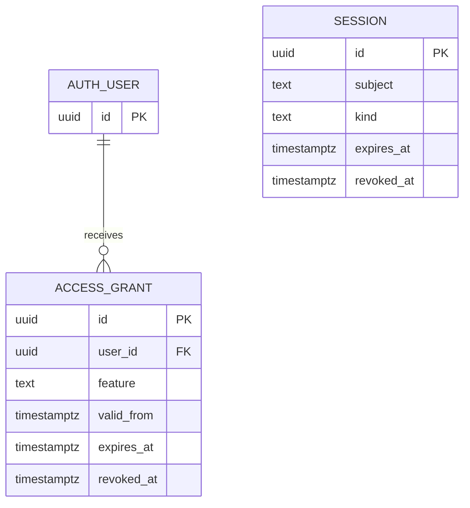

# P0 implementation: private snapshots and server access

Date: 2026-10-03. Base: `dfb235962868b2543b76bad2106ba2eeede9664e`. Branch: `fix/private-access-p0`.

This patch closes the first access/storage slice from the October 3 audit. It does not implement all P0 findings or claim production readiness. Database migrations, credential rotation, state seeding, deployment, and production checks have not been performed.

## Result and scope

| Audit area | Implemented behavior | Remaining boundary |
| --- | --- | --- |
| AUD01, session signing | No embedded password hash or deterministic signing fallback. Independent configured signing secret required; malformed, expired and legacy cookies rejected. | Operator must rotate credentials previously exposed in public history. Isolate-local throttles require deployment-level distributed rate limits. |
| AUD02, access | Owner gate produces INTERNAL access. Subscribers sign in through confirmed Supabase email identities. Current feature grants determine access at every protected request. Expired/revoked grants deny access. Client tier and identity metadata cannot confer rights. | Staff provision grants manually. Billing, payment verification, recovery, MFA, market-specific packages and customer administration remain planned. |
| AUD03/AUD04, endpoint data | Shared verification for data, arena, research, EA and scanner. Responses are private/no-store. Private storage errors and absent snapshots return 503. Actual empty archives remain successful empty lists. Public/static fallbacks and cookie-less origin self-calls removed. Missing EA returns unavailable rather than placeholder source. | Detailed market data provenance/freshness, schema validation of every nested field and stale-data policy remain planned. The EA source still exists in the public source repository; an authenticated download does not make that source exclusive. |
| AUD19, public repository | Ten runtime snapshot files removed from tracked tree; all cache/static runtime paths ignored. Workflows stop committing snapshots and use private persistence. Engine output is redirected to a runner-local log rather than public Actions output; no log artifact is uploaded. | Prior commits, copies, downloaded data and cached CDN content remain exposed. This patch does not rewrite Git history or purge third-party copies. |
| AUD12, browser order path | Production modal offers paper execution only. Discontinued Binance adapter rejects calls without storing credentials or contacting a broker. Old local credential record is removed on application startup. | MT5 execution source and other external execution systems need their own reviewed server authorization/risk boundary. No server live-order gateway is implemented. |
| AUD15, delivery | Webhook reads private storage and answers only a configured owner direct message. Groups and unbound users receive no payload and trigger no data reads. Exact VIP_LIVE opt-in replaces truthiness; timezone import fixed. | Automated notifications still use the existing separate recipient allowlist/notifier paths. They are not yet unified with account grants. Subscriber webhook account/chat verification remains disabled. |

## Identity, session and grants

The `/api/auth` contract is:

- `POST {email, password}`: confirmed Supabase subscriber identity; provider user metadata is ignored for authorization. Session TTL is bounded by the identity provider access lifetime and 24 hours. Provider access/refresh tokens are neither returned to the browser nor retained by this implementation; reauthentication is required after expiry.
- `POST {password}`: configured internal owner gate. The existing configured password remains an operator choice. There is no packaged default.
- `GET`: authenticated status, computed tier, active features and actual expiration. A missing or invalid cookie returns 401; unavailable/configuration-failed auth storage returns 503.
- `DELETE`: revokes the persisted session and expires the HttpOnly cookie. A copied revoked cookie stops working. Storage failure does not falsely report successful logout.

Cookies are HttpOnly, Secure, SameSite=Strict, Path=/ with bounded Max-Age. JWTs require HS256, an exact three-part token, issuer/audience, authenticated flag, UUID session ID, kind, subject, issued time and expiration. The password version is keyed by the independent signing secret; changing the owner password invalidates old owner sessions. Paid rights are never cached in JWT claims. Request origin is checked exactly for login/logout/scanner mutations when present.

`mbg_sessions` stores session ID, subject, OWNER/SUBSCRIBER kind, creation, expiry and revocation. `mbg_access_grants` stores a Supabase user foreign key, named feature, validity interval and revocation. Both tables and all five existing snapshot tables enable RLS and revoke browser/public roles; only the trusted backend service role is granted access. The legacy maintenance purge function also loses public execution rights.

| Feature | Protected endpoint | Payload scope |
| --- | --- | --- |
| cockpit.read | GET /api/data | Entire shared cockpit bundle, including all its market and strategy sections |
| arena.read | GET /api/arena-state | Entire shared arena snapshot |
| research.read | GET /api/research-archive | Entire shared research archive |
| ea.download | GET /api/ea | Configured EA source download |
| scanner.indonesia | POST /api/scanner?market=indonesia | Allowed Indonesia scanner request |
| scanner.america | POST /api/scanner?market=america | Allowed America scanner request |
| scanner.forex | POST /api/scanner?market=forex | Allowed Forex scanner request |
| scanner.cfd | POST /api/scanner?market=cfd | Allowed CFD scanner request |

**Do not assign cockpit.read to a market-only subscriber.** This capability deliberately authorizes the full existing bundle. Separate market projections are not implemented. Arena and research are similarly whole-snapshot features. Without cockpit.read the UI shows an access screen and links to any specifically granted EA/archive/arena endpoint, rather than exposing the cockpit. A subscriber with no grants is FREE. An owner is INTERNAL. Any active subscriber feature produces the display tier PRO, but every endpoint checks its specific feature; the display label grants nothing.



Session subject intentionally supports both the internal owner and individual subscriber UUIDs; it is not a foreign key to auth.users. Subscriber grants are foreign keyed and cascade on user deletion. Server session revocation is the immediate account/session control for this implementation; provider refresh, upstream ban synchronization and device session management need subsequent work. Already downloaded data cannot be recalled by grant revocation.

## Private persistence

All scheduled/manual pipeline jobs set MBG_REQUIRE_PRIVATE_PUBLISH=true. Missing private credentials or failed master publication cause job failure. The continuous arena restores LATEST_ARENA_STATE from private storage before evaluating and writes it after each tick. Failed/malformed private state does not silently reset the arena. Initial absence can initialize a new state; seed existing state before resuming scheduling.

The pipeline restores/publishes its private paper portfolio, EXP3 state, research archive, macro fallback, evaluator arena and VIP deduplication ledger. Partial market cycles merge against the private LATEST_COCKPIT_BUNDLE instead of depending on files included in a git checkout. Intraday refresh preserves previous plans and timestamps, updates observed prices, and refuses to fabricate a replacement if the prior bundle is absent. Pipeline jobs share a concurrency group. The continuous arena has a separate group and storage key.

The pipeline evaluator and continuous runner remain separate simulation authorities. This patch preserves their existing state; it does not reconcile their trading math, accounting or authority. Browser paper positions are still locally stored and are not a server account ledger.

The storage adapter accepts a configured sb_secret_* key or a legacy JWT whose role is service_role, never a browser anon key. It uses only the configured private HTTPS origin and sends generic failures without exposing provider response bodies. New secret keys are sent as apikey; legacy service keys also use Bearer authorization. All reads/writes have bounded request timeouts. Local-only experimentation can omit private credentials; CI requires them. Private cache write failures propagate.

## Rollout prerequisites and sequence

Perform this sequence in a maintenance window; this patch makes missing configuration fail closed rather than leaving access open. Do not restore the former public fallback to resolve a configuration error.

1. Pause scheduled publishers while migrating. Export current private state or retain an operator-local cache outside a public repository. Inspect the export date and contents without printing trade plans/credentials to public logs. A clean checkout of this branch intentionally contains no runtime cache.
2. Apply `engine/database/schema.sql` if the base tables do not exist, then `engine/database/migrations/20261003_private_access.sql` to the intended Supabase project. The migration is transactional and repeatable; validate table privileges and anonymous/browser read failures in staging.
3. Configure **server secrets** for Cloudflare Functions: SUPABASE_URL, SUPABASE_SERVICE_ROLE_KEY (or legacy SUPABASE_KEY holding a service-role key), independent random JWT_SECRET of at least 32 bytes, and PASSWORD_HASH containing the 64-hex SHA-256 of the operator-chosen owner password. Rotate the previously exposed owner/signing values; never place secrets in VITE_* variables, git or client-side settings. Missing owner password configuration disables owner authentication.
4. Set Actions SUPABASE_URL and SUPABASE_KEY to private server credentials. An anonymous key intentionally fails validation. Jobs enforce MBG_REQUIRE_PRIVATE_PUBLISH=true. Keep automatic trading/delivery integrations under their existing reviewed recipient configuration; this patch does not authorize new real-money orders or message recipients.
5. Preview local state migration (no network):

   ```bash
   python -m engine.database.seed_private_cache --cache-dir /operator/private/mbg-cache
   ```

   After reviewing the filename/key list and configuring the private destination, seed **missing rows only**:

   ```bash
   python -m engine.database.seed_private_cache --cache-dir /operator/private/mbg-cache --apply
   ```

   Existing private rows are preserved. Storage updated_at records publication time; embedded observation timestamps are retained. Do not treat migrated old observations as fresh market evidence.
6. Ensure LATEST_COCKPIT_BUNDLE, LATEST_ARENA_STATE and RESEARCH_ARCHIVE exist with valid types. Set MT5_EA_SOURCE only to the reviewed source artifact, either privately in system_state or server environment. The API does not fetch the public source repository as a paid artifact.
7. Provision confirmed subscriber identities through Supabase Auth. Insert grant rows using trusted administration with real validity intervals. Do not use user metadata for grants. Example shape (substitute an actual confirmed account UUID and chosen expiry, not a payment assertion):

   ```sql
   INSERT INTO public.mbg_access_grants (user_id, feature, expires_at)
   VALUES ('<confirmed-user-uuid>', 'research.read', '<reviewed-expiry-timestamptz>');
   ```

   Revoke by setting revoked_at; revoke all relevant sessions by subject as appropriate. Expired sessions can be cleaned through a private administrative job, not a public RPC.
8. For owner webhook use, configure TELEGRAM_WEBHOOK_SECRET, TELEGRAM_BOT_TOKEN and TELEGRAM_OWNER_CHAT_ID for the owner's private user/chat ID. Existing group delivery via webhook is intentionally disabled until individual bindings/grants are implemented. Do not enable a new webhook or send a test to someone else without authorization.
9. Deploy the reviewed application/Functions, then resume workflows. Verify live anonymous denial, valid owner access, FREE denial, feature-specific access, revoked grants, expired/copy-revoked cookies, missing private snapshot behavior and absence of /data payloads. Validate actual HTTPS cookie/logout behavior and private response headers at Cloudflare. The migration and production behavior have not been live-tested in this workspace.
10. Separately review exposed Git history/CDN copies and decide a repository history cleanup or visibility policy. History rewriting is destructive and is outside this patch. Confirm redistribution rights before commercial feed access, and resolve the remaining audit findings before selling precise signals.

Rolling back to old source reintroduces public/default access weaknesses and would not restore revoked browser DB privileges automatically. Prefer fixing configuration forward. Keep exported state private; do not re-add cache files to git.

## Verification

Local checks performed in the execution workspace:

- JavaScript: 117 tests, including 30 Functions access tests and a disabled browser execution regression.
- Python: 50 tests, including private storage/state recovery failures and private intraday refresh behavior.
- Production React/Vite build passes; static output has no data directory.
- Cloudflare Pages Functions compile with Wrangler 4.147.0 without publishing.
- Source/patch whitespace check passes; tracked runtime cache is empty.

The added CI workflow repeats regressions, frontend build, Functions compilation and tracked/static snapshot absence checks without production secrets. Node 24 and Python 3.11 are specified in CI; the local Python runtime was 3.12. Dependency ranges in engine/requirements.txt remain unpinned, so CI may resolve newer versions than this workspace. Real Supabase migration execution, provider login integration, concurrent production writers, live edge caching, distributed throttles and MT5 risk enforcement are not verified by these mocked tests. Private engine logs on ephemeral runners are discarded at job teardown; durable private observability remains future work.

## Follow-up work retained from the update plan

Continue data truth/provenance cleanup (mock yields, funding/mark separation, OI conversion, US statistics, news confidence and synthetic execution tools), unify paper authorities, correct backtest accounting, unify recipient/account grants, implement market-specific bundle projection and payment lifecycle, and validate licensed data/broker ownership claims. Strategy work should retain the WA scope: support/resistance, double top/bottom and EMA cross, with deterministic sizing and execution controls outside an LLM.

The 11 supplied Threads/Instagram posts remain content-unverified; this patch does not claim their inaccessible contents were reviewed. They must be checked from accessible post text/media before incorporating claims into product requirements. The previously delivered update plan and complete project manual remain the baseline research/audit artifacts; this note records the implementation delta on current main.

## Primary implementation references

- [Supabase password identities](https://supabase.com/docs/guides/auth/passwords)
- [Supabase Auth REST API](https://supabase.github.io/auth/)
- [Supabase API keys and private service-role access](https://supabase.com/docs/guides/getting-started/api-keys)
- [Supabase row-level security](https://supabase.com/docs/guides/database/postgres/row-level-security)
- [Cloudflare Pages Functions compilation command](https://developers.cloudflare.com/workers/wrangler/commands/pages/)
