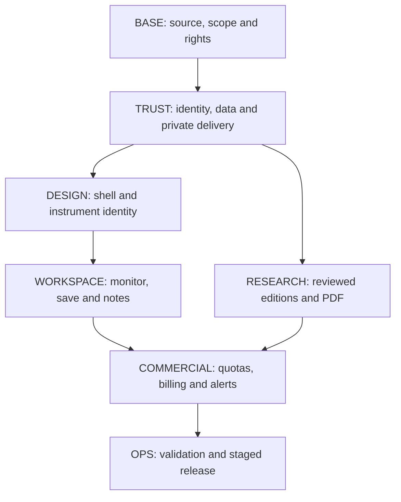

# MBG Trading — Source-Mapped Implementation Backlog

**Prepared:** 1 October 2026, Asia/Bangkok (UTC+7)  
**Document version:** 1.0  
**Companion:** [MBG-Trading-Revamp-Master-Plan.md](sandbox:/workspace/scratch/47430f68ad9b/MBG-Trading-Revamp-Master-Plan.md)  
**Purpose:** convert the completed revamp guideline into small, reviewable engineering packages with source touchpoints, dependencies, acceptance evidence and release gates.

This continuation remains **planning only**. Four agents expanded the technical baseline, product/access, design/workspace and research/PDF workstreams. No application code, database, payment configuration, branch, remote ref or deployment was changed. All tickets below are **planned**. Read-only source inspection informs the handoff; it does not establish that a finding is present in production or that a ticket is completed.

## 1. Baseline and scope

### 1.1 What was inspected

| Evidence | Verified state | Limitation |
|---|---|---|
| Local repository checkout | [MBG-Trading-pdf](sandbox:/workspace/scratch/6a95733977ec/MBG-Trading-pdf), branch `feat/research-pdf-export`, commit `b09ebff3b69700008d2cc243946044fe04ac0262`; clean working tree when inspected | Cached local source; no new remote fetch or deployment comparison |
| Local PDF work | Export utility, font assets, tests, modal integration and documentation exist in the local commit | Previously passed six export tests are historical verification from the preceding planning review; this continuation did not rerun them |
| Master plan | Full request/status recap, all audit IDs, UI/UX standards, logos, research standard, tiers and AC01–AC25 | This backlog elaborates that plan; neither document is an implementation |
| Earlier limited browser observation | The master plan records the 1 October homepage/one-note observation | No additional live-site/security/mobile audit was performed for this continuation |
| Current remote / deployed revision | **Unverified** | BASE01 must establish these before selecting an implementation base or claiming a release |

Existing source touchpoints identify code that needs inspection or adaptation. A **proposed** module, endpoint, table or artifact is future work and is not claimed to exist. File paths refer to the inspected local checkout; every future change must be checked against the selected fresh baseline. No secret values are required in these documents.

### 1.2 Target first product

The first release is an individual, one-market **monitor → save → research → review** workspace with Free/Pro access, reviewed paper-style research and PDF, useful cloud watchlists/notes, basic alerts and honest data states. It retains instrument logos and the existing React/Vite, Cloudflare and Python foundations where suitable.

The full visual direction remains SpaceX-inspired restraint, the assumed FreeBuf editorial hierarchy, command-driven navigation and TradingView-like market density. Exact “freebuff” and “command code” references remain a design-checkpoint question, not a reason to copy assets or defer the common system.

Business, expanded market packs, autonomous multi-asset research, a validated simulation ledger, Strategy Lab, verified flows and real execution are later, independently gated work. Their existing UI must not be mistaken for a released paid capability.

## 2. Pilot availability manifest

This is the intended release contract. It is not a statement about current production availability. Every enabled feature needs a named policy, rights coverage, quality rule and release flag.

| Audience / surface | Pilot target | Release condition |
|---|---|---|
| Guest | Public product/pricing/methodology/status, a complete permitted sample paper/PDF, and a bounded market preview only if approved | Explicit public payload; no private body hidden in browser assets |
| Free account | One released market, useful scanner/detail/chart, one cloud watchlist, user-written notes, allowed free reports, limited basic in-app alerts and limited validated operations | Individual identity, ownership, source/rights checks and published limits; alert delivery requires COMMERCIAL06 gates |
| Pro account | Released deeper research/archive/PDF, saved workspace capabilities and basic alerts; bounded AI operations only when their own gate passes | Server plan/pack/grant policy, billing lifecycle, cost limits and actual data/export rights |
| Trial | Seven-day, one-pack safe grant; candidate 15 credits and 10 alert rules | Expiry enforced by server; candidate limits remain test hypotheses; no automatic pilot charge |
| Invited tester | Explicit safe features, pack, quota and dates selected for a cohort | Tester grant is separate from subscription and platform-administrator privileges |
| Owner / internal collaborator | All module visibility in labelled sandbox, plus explicitly scoped operational/editorial permissions | Named identity, appropriate MFA/session policy, audit and separate production privileges |
| Business | Planned information only | No team purchase or seat promise until ownership/member/seat lifecycle is built and tested |
| Additional markets / labs / performance / flows / execution | Disabled or clearly unavailable in the public sold product | Independent coverage/method/ledger/protection gates; price never overrides them |

The candidate Free/Pro limits and prices remain those in master-plan section 4.3. Final quantities and prices are set from provider rights, measured cost and pilot evidence. A pricing page must not advertise a capability that is still disabled.

IDX is a candidate first pack if appropriate rights and coverage are established. A bounded Crypto Spot pilot is an alternative only after its own rights and quality checks. Missing procurement evidence means that pack is not released; it does not authorize a substitute scraper or a fake feed.

**Separate curated publishing from paid generation.** W3 produces reviewed papers and deterministic, bounded rendering. W4 can charge for released bounded operations after reservation/refund and editorial-capacity gates. Neither phase silently includes autonomous institutional research. A five-credit candidate paper debit is not a guarantee of a published paper; unapproved custom-paper jobs stay disabled.

## 3. Dependencies and capacity

### 3.1 Critical path

Design exploration and editorial examples can begin during BASE. Production ownership, data delivery and shared contracts must stabilize before their dependent features are enabled. The small legacy PDF recovery can proceed earlier where its input/access/rights boundary is safe; it does not close the full-paper reader or canonical-report tickets.

The graph shows final integration gates. Logging/redaction, private-storage recovery, backup and incident prerequisites begin during TRUST, before invited beta or paid access. OPS completes and validates those foundations in W5; operational safety is not postponed until billing is finished.

### 3.2 Effort envelope

| Phase | Engineer person-weeks from the master plan | Ticket scope |
|---|---|---|
| W0 | 0.5–1 | BASE01–04 |
| W1 | 3–5 | TRUST01–06 |
| W2 | 3–5 | DESIGN01–05 and WORKSPACE01–03 |
| W3 | 3–5 | PDF01 and RESEARCH01–05 |
| W4 | 2–4 | COMMERCIAL01–06, including narrow basic price alerts |
| W5 | 2–4 | OPS01–02, cross-stream validation and pilot remediation |
| Core total | **13.5–24** | One released market and curated Free/Pro product only |

One person-week means about five focused engineering days. Ticket ranges are estimates within these phase envelopes, not additional budget lines or a calendar commitment. Shared contract work, code review and cross-stream fixes must not be counted twice. W0 recalibrates the ranges against the fresh baseline. Designer, analyst/reviewer, vendor/merchant approval, account setup and support capacity are separate; adding engineers does not eliminate those dependencies.

## 4. Contracts to settle before parallel implementation

The following decisions keep the tickets compatible. They are design requirements, not new code or an assertion about installed provider functionality.

| Contract | Required agreement | Steward / dependent work |
|---|---|---|
| Instrument identity | Stable ID includes market, venue and contract/chain identity; aliases map explicitly; currencies, lot/tick steps and logo reference are typed | TRUST with DESIGN; quotes, chart, watchlist, alerts and paper |
| Observation | Preserve source event time, received time, historical availability, origin, price type, units, delay, quality and rights policy | TRUST; all market/research consumers |
| Data state | Connection, market session, source freshness and validation are independent; missing event time means unknown; null is not zero | TRUST with DESIGN; no blanket LIVE or VERIFIED badge |
| Access decision | Identity + ownership + capability + pack + grant status + release state + rights + quality + quota where applicable; server is authoritative | TRUST skeleton, COMMERCIAL catalog; API, search, jobs, exports, notifications |
| User resource | Owner/workspace ID and revision; denial and account-switch behavior; user text retained independently from premium vendor content | TRUST with WORKSPACE; watchlists/notes/import and future teams |
| Research edition | Immutable approved version/reference, evidence cutoff, inspectable claim support, methods/input versions, original figures and correction/withdrawal state | RESEARCH; catalog, reader, Copy, opted-in audio and PDF |
| Render / job | Idempotent owner-scoped request, bounded input/work, status, cancel/retry and failure; nonbillable curation vs paid usage kept explicit | RESEARCH with COMMERCIAL; no double reservation/debit |
| Billing / grant | Versioned plan policy and verified provider event history; no redirect or browser tier value grants access | COMMERCIAL; account/admin/cache/job revocation |
| Release | Commit/build/config/schema/policy/rights/catalog/flags recorded together; previous safe compatible manifest retained | BASE with OPS; staging, rollout and rollback |

Private responses and artifact delivery must follow the server policy; UI hiding and RLS alone cannot fix an unsafe public producer or public cache. The boundary includes Python output writers, committed/static JSON, web APIs, direct provider fallbacks, Telegram and any scheduled publication channel. No customer-specific content belongs in a public snapshot.

Rights, freshness, release and quota checks apply to the requested action. A suspended AI feature or stale market feed must not block reading/exporting the authenticated user's own writing. Retained writing export excludes premium attachments unless independently authorized. TRUST and COMMERCIAL reuse one `frontend/server/access-policy.js` design; it is a proposed shared module, not two independent implementations.

Public/denied/error states preserve useful user context without leaking another user's resource or private report body. A search snippet, notification, Copy action, audio action and downloadable artifact are data-delivery channels and use the same authorized content policy.

## 5. W0/W1 — baseline and trust

Planning continuation of `MBG-Trading-Revamp-Master-Plan.md`, prepared 1 October 2026. All ten tickets below are **planned**, not implemented or released. Read-only inspection used [.](sandbox:/workspace/scratch/6a95733977ec/MBG-Trading-pdf) at local `b09ebff3b69700008d2cc243946044fe04ac0262`, based on cached September 30 `origin/main`. The worktree was clean. No remote fetch/push, deployment, application change, reset, order, or destructive test occurred. Source observations do not establish a live exploit or the deployed revision.

AC numbers refer to the master plan §19.1. Existing touchpoints are verified files/functions in this snapshot. Paths marked **proposed** are reviewable future modules/documents, not files already present. Ticket closure requires exact base/candidate revision, reviewed diff, relevant test/deploy evidence and remaining blockers; an estimate or passing unrelated test is not closure.

### Scope, effort and order

Estimates use focused **engineering days**, excluding owner/vendor/reviewer waiting time. W0 totals **2.5–5 days = 0.5–1 person-week**; W1 totals **15–25 days = 3–5 person-weeks**, inside the master phase estimates. Integration and relevant QA are included, not added a second time. Assumptions: one licensed pilot market, hosted identity service selected, individual Free/Pro only, minimal sandbox admin, existing stack. Full account UX, watchlist/notes features, billing, paid job accounting, Business lifecycle, all-market ingestion and validated execution/ledger remain later phases.

| Ticket | Reviewable slice | Engineer owner | Days | Dependencies |
|---|---|---|---:|---|
| BASE01 | Revision/deploy/local-work release record | Release lead | 0.5–1 | Authorized account evidence |
| BASE02 | Source/route/data/rights map | Backend/data lead | 0.75–1.25 | BASE01 known source base |
| BASE03 | Defect and regression evidence matrix | QA + engineering lead | 0.75–1.5 | BASE01–02 |
| BASE04 | One-market scope, owner setup and release contract | Product/engineering lead | 0.5–1.25 | BASE01–03 |
| TRUST01 | Individual session and API authentication | Backend/security engineer | 3–5 | BASE04; identity setup |
| TRUST02 | Ownership schema/RLS and private storage baseline | Backend engineer | 3–5 | BASE04; TRUST01 identity contract |
| TRUST03 | Server feature/market grants and policy integration | Backend engineer | 2–3 | TRUST01–02; BASE02 catalog |
| TRUST04 | Public/static/private payload separation | Full-stack/data engineer | 2–4 | TRUST01–03; BASE02 |
| TRUST05 | Pilot instrument/observation provenance contract | Data/full-stack engineer | 3–5 | BASE02–04; TRUST03–04 contracts |
| TRUST06 | Public unsafe-module isolation + sandbox release flags | Full-stack/security engineer | 2–3 | BASE03–04; TRUST01/03; release catalog |

TRUST04/05 contract design and TRUST06 containment can start alongside identity/schema work; final integration depends on the shared policy. These are work packages, not six simultaneous independent rewrites. W1 closes when the **whole pilot boundary** passes its checks; W0 tickets and source-only findings never certify production. Missing rights/configuration keep the affected route disabled and the dependency visible.

### BASE01 — establish a truthful revision and release record

**Deliverable:** one versioned baseline record linking repository/branch, local work, hosting deployment, configuration/schema identifiers and feature availability. Preserve the PDF export as local committed work, not as a shipped feature. Capture observation time and evidence source for every revision; unavailable fields explicitly say unknown with an owner/action.

**Existing evidence/touchpoints:** local Git `b09ebff`, [docs/research-pdf-export.md](sandbox:/workspace/scratch/6a95733977ec/MBG-Trading-pdf/docs/research-pdf-export.md), [frontend/package.json](sandbox:/workspace/scratch/6a95733977ec/MBG-Trading-pdf/frontend/package.json)/lockfile, root [package.json](sandbox:/workspace/scratch/6a95733977ec/MBG-Trading-pdf/package.json), `.github/workflows/*.yml`. Local exporter comprises utility, fonts, modal integration and six tests. GitHub workflow telemetry commits are not feature-release evidence. The master records a limited live homepage/note observation without deployed SHA.

**Proposed:** `docs/revamp/baseline-release-record.md` and a redacted release-manifest schema. Fields: source/candidate/remote/deployed commit, artifact/build/deploy ID, environment, schema/policy/flag versions, completed gates, local-only commits, enabled modules, known limitations, owner and safe rollback target. Record configuration **names/version**, never secret values. Identify separate hosting/data/daemon projects rather than assuming one deploy controls them all.

**Acceptance:** AC25 baseline prerequisite: compare authorized remote evidence and hosting commit/build linkage when available; a label/screenshot alone cannot fill SHA. Record the earlier six-test result with its date and commit, without presenting it as full-suite proof. Unknown remote/deploy identifiers remain blockers for release certification.

**Dependencies/owner:** release lead gathers evidence; owner supplies appropriate read access/project identity. **Rollback/closure:** documentation change is reversible; retain prior versions. Close with the evidence-linked record, access blockers and explicit local exporter status. Preview/production AC25 completion belongs to the later candidate release, not this ticket alone.

### BASE02 — map every route, data producer and delivery channel

**Deliverable:** a compact catalog mapping feature/route → source field/provider → producer/storage → reader/channel → audience/rights → status/failure. Classify public samples, entitled reports/observations, user records, internal diagnostics and unsafe actions. Confirm first-market coverage; unknown license scope blocks distribution rather than being guessed.

**Existing:** [frontend/src/App.jsx](sandbox:/workspace/scratch/6a95733977ec/MBG-Trading-pdf/frontend/src/App.jsx) hash routing/`getTabFromHash`/`setActiveTab`; [frontend/src/components/Sidebar.jsx](sandbox:/workspace/scratch/6a95733977ec/MBG-Trading-pdf/frontend/src/components/Sidebar.jsx); [frontend/src/components/CommandPaletteModal.jsx](sandbox:/workspace/scratch/6a95733977ec/MBG-Trading-pdf/frontend/src/components/CommandPaletteModal.jsx); existing Pages Function files; [engine/run_pipeline.py](sandbox:/workspace/scratch/6a95733977ec/MBG-Trading-pdf/engine/run_pipeline.py):`main`; `DatabaseClient` in [engine/database/supabase_client.py](sandbox:/workspace/scratch/6a95733977ec/MBG-Trading-pdf/engine/database/supabase_client.py); `NewsResearchAgent` in [engine/agents/news_research_agent.py](sandbox:/workspace/scratch/6a95733977ec/MBG-Trading-pdf/engine/agents/news_research_agent.py); eight public JSON datasets; [frontend/public/_headers](sandbox:/workspace/scratch/6a95733977ec/MBG-Trading-pdf/frontend/public/_headers)/`_redirects`; GitHub schedules; [deploy/huggingface/app.py](sandbox:/workspace/scratch/6a95733977ec/MBG-Trading-pdf/deploy/huggingface/app.py) FastAPI daemon. Include logo mappings, quote-hook direct-provider calls and Telegram RESEARCH/PLAN branches. `engine/main.py` and `engine/orchestrator.py` do **not** exist here.

**Proposed:** `docs/revamp/source-route-rights-register.md`; machine-readable feature/route catalog seed consumed later. Capture existing `TESTING_LAB` versus `TESTING` and `QUANT_ACADEMY` versus `ACADEMY` aliases without changing routes in W0. Record scanner/Tokocrypto origin-substring matching as a policy review item; CORS is not account authorization.

**Acceptance:** AC04/06/08/22 inventory prerequisites: trace report/archive data through producer, public build, app/modal/export and Telegram; distinguish provider event time from receipt time and spot from futures mark. Mark existing/feed-capable/demo/unknown separately; collect provider display/storage/export/seat rights evidence or unresolved owner dependency.

**Owner/rollback/closure:** backend/data lead; owner owns contracts. Version the catalog, leave source untouched. Close when all launch-facing and bypass channels have a row with audience, source evidence and an assigned unresolved-rights owner. Full route migration remains W2.

### BASE03 — preserve regression cases and scope-specific blockers

**Deliverable:** one defect-to-acceptance matrix with smallest reproductions, affected module, severity, historical versus current-source status, and closure owner. Record assertions and sample inputs, not confidential user data. Turn important cases into future implementation fixtures; this planning ticket does not need a new production probe.

**Existing:** [engine/tests/test_smoke.py](sandbox:/workspace/scratch/6a95733977ec/MBG-Trading-pdf/engine/tests/test_smoke.py), [engine/tests/test_arena_runner_247.py](sandbox:/workspace/scratch/6a95733977ec/MBG-Trading-pdf/engine/tests/test_arena_runner_247.py), [engine/tests/test_mcp_server.py](sandbox:/workspace/scratch/6a95733977ec/MBG-Trading-pdf/engine/tests/test_mcp_server.py); [frontend/tests/researchPdf.test.mjs](sandbox:/workspace/scratch/6a95733977ec/MBG-Trading-pdf/frontend/tests/researchPdf.test.mjs); `PaperBroker.updatePositionsOnTick`/`closePosition` in [frontend/src/services/brokerGateway.js](sandbox:/workspace/scratch/6a95733977ec/MBG-Trading-pdf/frontend/src/services/brokerGateway.js); auth/data functions; research helpers/generator. Master evidence already includes six PDF tests and an in-memory two-stop reproduction: two positions disappear, one close/journal settlement survives. This case applies to browser PaperBroker, not every independent Arena engine.

**Proposed:** `docs/revamp/regression-evidence-matrix.md`; test specification entries for forged/expired/revoked session, cross-user ID, edited tier, public report sentinel, stale receipt, synthetic event, spot/mark mismatch, route aliases and logo collision. Future test code may live alongside existing frontend/engine suites and proposed gateway tests.

**Acceptance:** map AC01–09, AC10/13/14, AC19/22/24/25 to applicable source and expected result. Mark AC19/20/21 actual ledger/backtest remediation as later work with module disabled publicly until independently passed. Use exact revision and date for each past result. Build success cannot close accounting or access findings.

**Owner/rollback/closure:** QA/engineering lead. Retain baseline fixtures unchanged when fixes land; changes to expected results require methodological explanation. Close with a complete launch-blocker matrix and reproduce-or-investigate instructions; unresolved historical findings stay unresolved, not silently closed.

### BASE04 — freeze the bounded pilot and owner dependencies

**Deliverable:** one implementation scope/decision record: first market, public/Free/Pro surfaces, sandbox-only modules, retained assets, source rights, identity/storage choices, minimal admin role, safe rollback criteria and owners. Scope follows master defaults; actual paid-customer migration and vendor configuration are unknown until evidence arrives.

**Existing:** master §§3–4/15/18–21; original tier demo and display preference; existing logo resolver; local PDF work. Source [engine/database/schema.sql](sandbox:/workspace/scratch/6a95733977ec/MBG-Trading-pdf/engine/database/schema.sql) is telemetry-oriented, not proof of user tenancy. Current Cloudflare/Supabase/merchant setup cannot be inferred from environment variable names.

**Proposed:** `docs/revamp/pilot-scope-and-owner-setup.md` with a dependency checklist: repository/deploy access, staging/database/auth/SMTP redirects, source display/export rights, owner/collaborator identities/MFA, reviewer, budgets, private artifacts, monitoring and later payment sandbox. Engineer prepares precise setup instructions; owner controls accounts/contracts/secrets.

**Acceptance:** AC24/25 planning prerequisites: no unsupported module appears “included”; unknown licenses/configuration have a fallback disabled state and named resolution owner; define one-market internal/tester/Free/Pro rollout with approved pilot subset. Preserve logos and local PDF changes. Exclude autonomous research, Business, advanced quant, real orders/swaps and full paper-ledger repair from W1 estimate.

**Owner/rollback/closure:** product/engineering lead with owner decisions. Version scope changes and their effort/gate impact. Close with bounded deliverables, dependency assignments and safe-release conditions; blocked external prerequisites do not stop useful ticket preparation, but cannot be called completed configuration.

### TRUST01 — replace shared/browser-trusted authentication

**Deliverable:** individual hosted-identity session integration plus mandatory private API authentication. Provide minimum sign-in/session/logout/recovery integration for the pilot; account-page design expansion remains W2. No production fallback credential or development signing secret. Missing required identity configuration fails closed without locking an explicitly public sample behind a private gate.

**Existing evidence/touchpoints:** `PasswordGate.verifySession` trusts mutable local authenticated/expiry flags; `handleSubmit` permits test fallback. `api/auth.js:onRequestGet/onRequestPost` implements shared-password/JWT paths; [frontend/functions/api/data.js](sandbox:/workspace/scratch/6a95733977ec/MBG-Trading-pdf/frontend/functions/api/data.js):`onRequestGet` validates only when a token exists. `Sidebar.handleLogout` clears local keys rather than establishing server revocation. `App` starts `useLivePrices` before rendering PasswordGate, so presentation gating does not stop feed effects.

**Proposed:** `frontend/server/session.js`, shared Pages `frontend/functions/_middleware.js`, `frontend/src/services/authClient.js`, minimal authenticated session context and logout handler. Use validated provider sessions plus server session/revocation state appropriate to the chosen provider; strict issuer/audience/expiry checks. Define exact public/identity/webhook exceptions; Telegram/provider callbacks need their own verified service authentication, not user-login redirects. Cookie state-changing requests need origin/CSRF protection. Do not persist authoritative auth flags or secrets in browser preferences. Rate limits use an appropriate shared provider/service, not only a warm-isolate Map.

**Acceptance:** AC01/05, partial AC03/23: no/forged/expired/revoked token denied across private APIs; forged storage never authenticates; missing production config denied; logout/server expiry stops further protected delivery; public samples work; account switching clears stale private client state. Mock/staging provider failures and callback exceptions are tested without real order/payment/send.

**Dependency/owner:** backend/security engineer; owner configures identity domains/SMTP/MFA and staging access. TRUST02/03 add resource policy after verified identity. **Rollback/closure:** maintenance/public sample mode or last safe identity build; never restore the old fallback. Attach auth test cases, redacted session/config evidence, exact candidate and preview results. Entire AC05 membership/job lifecycle completes as later modules exist.

### TRUST02 — implement minimal ownership, RLS and private storage

**Deliverable:** additive schema for individual profile/workspace/membership, protected catalog/grants and future resource ownership; enforce authenticated owner/workspace boundaries in database and gateway. Establish a private report-artifact bucket/policy prototype. Business invitation/seat/departure UI and full watchlist/notes CRUD remain later slices.

**Existing:** [engine/database/schema.sql](sandbox:/workspace/scratch/6a95733977ec/MBG-Trading-pdf/engine/database/schema.sql) creates market telemetry/plans/system_state and purge function; no user ownership/RLS policies are defined in that file. Actual deployed policies are unknown. `DatabaseClient.__init__`/upserts use one service credential model and write market data; existing global `LATEST_COCKPIT_BUNDLE` cannot substitute user-owned records.

**Proposed:** `engine/database/migrations/001_identity_ownership.sql`, versioned policy fixtures, minimal server database wrapper. Use ownership keys/indexes and deny-by-default grants/RLS. Explicitly separate ingestion/admin tables from user-facing schemas and service-role responsibilities. Store role/grants in server-managed records; user-editable metadata cannot establish membership/subscription. Private artifact metadata records owner/audience/report version/checksum/rights; object delivery reauthorizes before issuing bounded URLs. Immediate revocation requirements determine proxy versus expiring URL policy; a signed URL is not permanently private after sharing.

**Acceptance:** AC02/04/05; AC24 schema/restore prerequisite: two seeded users/workspaces cannot read, change, list or export each other's protected fixtures, even via guessed IDs/direct Data API. Anonymous access matches explicit public projection only. Service-key handlers check actor/scope themselves; key is absent from build/logs. New schema can coexist with old telemetry and preserve baseline reports. No automatic 30-day purge applies to user writing/published versions.

**Dependencies/owner:** backend engineer, owner staging project/region/retention and backup access. **Rollback/closure:** additive migration, backfill checks, checkpoint and staging restore; revert readers while keeping policies, never disable RLS to restore convenience. Close with migration/policy diff, isolation matrix, bucket/direct-access results and a redacted recovery record. Production AC24 drill remains W5.

### TRUST03 — establish server-owned capability and market policy

**Deliverable:** one central policy for individual Free/Pro grants, expiry, pilot market, feature readiness, rights and internal sandbox roles. Seed safe test entitlements; no real billing checkout, subscription webhook or paid quota ledger is claimed here. Display preferences remain independent of subscription.

**Existing:** `App.userTier`/`cycleUserTier` reads/writes `mbg_user_tier`; sidebar badges are display labels. Scanner/Tokocrypto handlers proxy market/path requests without account/pack checks; their origin `.includes` checks do not implement identity. Quote-hook direct fallbacks and all-market prefetch can bypass intended MBG delivery policy. Telegram authenticates a webhook service request, not an individual subscriber's research/plan entitlement.

**Proposed:** `frontend/server/access-policy.js`, `/api/me/entitlements` handler, versioned feature/market catalog and test grants. Policy evaluates verified identity + ownership + active grant + market + released module + rights, then returns narrow payload/action or reason. Unknown feature/market defaults denied. Hook/search/deep links/export/background channels call the same boundary; limit provider query/path/symbol allowlists and quotas. Replace substring CORS checks with configured exact origins; CORS remains separate from authorization. Unlinked Telegram chats receive only deliberately public content; paid linking/delivery is a later commercial slice.

**Acceptance:** AC01–05/08: editing tier/role/market/storage cannot access entitled payloads or an internal module; expired grant fails subsequent request; requester cannot supply another owner ID; direct search/export/proxy calls preserve scope. Internal preview uses sandbox identity and visible environment, not an arbitrary customer plan switch. No entitled data is prefetched for hidden menus.

**Dependencies/owner:** backend engineer; TRUST01/02 and owner role/market policy. **Rollback/closure:** policy-version rollback to previous **safe** allowlist, revoke candidate grants and suspend affected feature; never trust client tier again. Close with permission matrix, route/channel coverage, expiry/cross-pack fixtures and candidate policy version. AC15–17 commercial accounting/lifecycle remains W4.

### TRUST04 — stop full-bundle public distribution at producer and delivery

**Deliverable:** explicitly approved public sample projection, authenticated pilot payload, and private legacy report/artifact delivery. Do not merely blur premium UI. Classify current legacy records before migration: their presence in source is a distribution pattern, not proof they were confidential or a production breach.

**Existing:** `DatabaseClient._save_local_fallback` is called by upserts/`sync_complete_bundle` and writes JSON into [frontend/public/data](sandbox:/workspace/scratch/6a95733977ec/MBG-Trading-pdf/frontend/public/data); `run_pipeline.main` reads/mutates that bundle. `NewsResearchAgent.archive_research_edition` writes cache and public archive; crisis alerts also sync public. `/api/data` returns public cache headers, `_headers` publicly caches data JSON with CORS `*`; App and `NewsTab.handleRefreshAiResearch`/archive effect fetch static fallback. Telegram RESEARCH/PLAN reads full public bundle. `NewsDetailModal.handleExportPdf` already exports the selected stored record, not a server entitlement.

**Proposed:** `frontend/server/public-projections.js`, separate public-preview/private-bundle/archive handlers, engine publishing policy and restricted storage path. Update every producer/scheduled writer and every reader/export/Telegram path together. An explicit sample may contain a whole approved public paper; everything else uses allowed projection. Private responses no-store/private; public cache holds only approved public data. Remove private artifacts/body from source/public build paths and metadata/search indexes. Plan authorized deployment cache invalidation/obsolete URL denial; previously published material is not made unseen by deleting one file.

**Acceptance:** AC04 plus AC01–05/10/13: fixtures place a private report sentinel in upstream data and show it absent from public build, JSON, cache, search, previews, Telegram and unauthorized export. Authorized record delivery works; outage cannot fall back to full public bundle. Valid public samples retain logos/source labels; legacy PDF source-only contract survives. No paid PDF body reaches browser before policy.

**Dependency/owner:** full-stack/data engineer with TRUST01–03 contracts; owner approved samples/storage/deploy access. **Rollback/closure:** keep private storage and public allowlist; rollback reader may show unavailable, never reinstate full-bundle fallback. Attach producer/read-channel inventory, sentinel tests, artifact scan and staging cache/download evidence. Current commit's export release QA remains W3, not closed by this boundary ticket.

### TRUST05 — normalize pilot identity, provenance and honest failures

**Deliverable:** one-market instrument registry and observation contract/adapter, sufficient for approved public/entitled pilot fields. Preserve stock/crypto/FX logo keys and aliases; unlaunched markets remain unavailable or explicit sandbox, not silently normalized from invented values. Full coverage expansion, derivative feed repair and paper calculations are independent work.

**Existing:** `useLivePrices` seeds plan-entry/bundle prices with `Date.now()` and uses receipt timestamp across feeds; `CryptoFuturesTab` overwrites mark with spot miniTicker. `AssetIcon`/`CryptoIcon` and stock/crypto/FX configs exist. `newsHelpers.getIntelligenceArtifact` produces score/driver narratives; `NewsResearchAgent.generate_research_note` and `sanitize_and_curate` attach fixed technical/allocation claims. `SecurityHubDrawer.MiniCandleChart`, tape/depth/whale generators produce synthetic data. These source observations require containment; future research.v2/editorial methods belong W3.

**Proposed:** shared `contracts/observation.v1.schema.json`, pilot instrument registry, Python normalization adapter and frontend observation selector. Require stable instrument/venue/contract/quote-type, unit/currency, source-record/dataset ID, original event time/received time, origin, freshness/delay, input/calculation versions and rights policy. Missing event time stays unknown. Reject/quarantine invalid fields; preserve safe last-known value with honest date/status. Separate connection/process status from data health. Remove unsupported “verified”/calibrated scores and factual fallback in launch-visible legacy research; label heuristic/illustrative content only where intentionally retained.

**Acceptance:** AC06–09/10/12 for pilot: stale receipt never refreshes event age; closed/delayed/missing feeds correct; unrelated feed remains independent; synthetic never LIVE; alias/collision/suffix resolve or ask; spot never mark; logos retain identity. Invalid units/nonfinite values block affected metrics; no dataset means unavailable, not a fabricated research fact.

**Dependencies/owner:** data/full-stack engineer plus source/rights and frontend policy contracts. **Rollback/closure:** last approved snapshot/registry version with original timestamps; suspend affected recommendations. Close with schema/adapter diff, fixture outputs, source IDs and sample status/logo screenshots. Calibration/institutional paper correctness is not claimed by schema compliance.

### TRUST06 — isolate unsafe modules and enforce sandbox release flags

**Deliverable:** public launch allowlist and internal sandbox boundary covering load, actions, data and direct endpoints. Owner/collaborators can inspect all modules in named sandbox accounts; production-changing capabilities require scoped privilege and their own module gates. Hiding sidebar items alone is insufficient.

**Existing:** `App` imports paper broker and exposes OrderExecution/SolanaSwap, Arena/Whale/lab branches; modal `handleExecuteSwap` generates fake success/hash/fee; Binance adapter can submit real signed browser orders. `PaperBroker` retains the reproduced settlement defect. [deploy/huggingface/app.py](sandbox:/workspace/scratch/6a95733977ec/MBG-Trading-pdf/deploy/huggingface/app.py) FastAPI `get_arena_state`/`reset_arena` defines no handler-level identity in inspected source; deployment exposure is unknown. Actions Arena writes public state JSON. Include command palette, instrument drawer actions and pipeline writers, not only primary navigation.

**Proposed:** server release catalog/flags, sandbox-only route/action guard and redacted internal-control audit events. Public pilot disables real Binance/MT5/swap execution, unvalidated paper-performance/Arena/backtest, synthetic whale/tape/depth and unrepaired futures semantics. Approved educational demo has persistent SIMULATION label and no claimed confirmed transaction/earned fee. Prevent automatic broker/Arena effects before audience checks. Internal reset/action scope identifies run/account/environment and requires authorized actor; never reset shared production from a demo toggle. Preserve all source work for later validation.

**Acceptance:** AC01–05/07/22/24/25 boundary subset: manual deep link/API/action/command cannot load or mutate disallowed module; network capture shows no broker-order, signing, daemon reset or synthetic feed during public monitor/read workflow. No fake revenue/success; scope/banner present internally. Record AC19–21 still open; disabling modules contains defects, does not fix math.

**Dependency/owner:** full-stack/security engineer with policy/catalog and baseline blockers; owner defines named internal roles. **Rollback/closure:** flag suspension defaults denied; do not reopen unsafe actions on reader rollback; durable records unchanged. Close with audience/action tests, public bundle/network evidence, scoped reset-policy fixtures, feature-state manifest and later-work links. Production verification occurs only during an authorized release.

### W1 exit record and remaining unknowns

Combine candidate revisions/policy/schema/flags and coverage-rights record; AC01–08 plus affected AC09/10/22 and staging AC24 subset must pass across producer, API, static assets and alternate channels. Identify exactly which later checks remain open. W1 is a trust foundation; W2–W5 still deliver usable workflows, approved papers, billing and launch validation.

Unknowns: remote/deployed SHA; actual hosting/daemon/RLS exposures; provider contracts; identity/storage domains, SMTP and recovery; current customers; artifact retention/revocation policy; owner/collaborator access; first-market dataset availability. Each has a named owner and a disabled/unknown behavior. Source findings, previous live observations and new acceptance evidence remain separate. No ticket is “shipped” until its actual release evidence satisfies master §20.2.

## 6. W2 — design and personal workspace

**State: planned only.** This handoff changes no application code and performs no push, deployment, external write, or usability test. Source inspected read-only: [.](sandbox:/workspace/scratch/6a95733977ec/MBG-Trading-pdf), local commit `b09ebff3b69700008d2cc243946044fe04ac0262`. Current authorized remote, deployment, production configuration, and fixes remain unverified. Reconcile them in BASE/W0 before implementation. Ticket references use the master plan's RQ, F, and AC IDs.

W2 delivers one entitled market's **find → inspect → save → write a note → return** workflow, a reusable visual foundation, and consented legacy import. Full research reader/PDF/editorial implementation belongs to RESEARCH/W3; billing and alert scheduling belong to COMMERCIAL/W4. W2 provides compatible entry points and honest unavailable states. Business collaboration, new market providers, ledger/Arena controls, and full-page redesign of every experimental module are later increments.

### Budget, ownership, and starting dependencies

Engineering estimates below total **16–25 focused days: approximately 3.2–5 person-weeks**, within the master plan's W2 3–5-week envelope. They are conditional on W1's authenticated identity, ownership enforcement, observation contract, instrument registry, and safe feature flags. Designer time of roughly 4–6 days, domain/analyst review of 1–2 days, participant recruitment, and procurement waits are separate; don't count them twice as engineering.

The frontend engineer owns DESIGN execution; the workspace/API engineer owns WORKSPACE execution. A designer reviews hierarchy, component behavior and usability; a domain reviewer checks identities, quote units and status meaning; security/QA reviewers close cross-account and release gates. One engineer may fill both implementation roles. A blocked W1 dependency permits clearly labelled fixture prototypes, not an authenticated-production claim.

| Ticket | Engineer days | Main traceability |
|---|---:|---|
| DESIGN01 | 1.5–2.5 | RQ17; F01; AC06–07, AC23 |
| DESIGN02 | 2.5–4 | RQ04–06, RQ17; AC03–05, AC22–23 |
| DESIGN03 | 1.5–2.5 | RQ18; F02; AC08–09 |
| DESIGN04 | 2.5–4 | RQ17; F01–02; AC06–09, AC22–23 |
| DESIGN05 | 2–3 | RQ15, RQ17–18; AC22–25 |
| WORKSPACE01 | 3–4 | User-owned storage finding; F04; AC01–05, AC08, AC17 |
| WORKSPACE02 | 2–3 | F04–05; AC02–05, AC17, AC22–23 |
| WORKSPACE03 | 1–2 | Legacy migration requirement; AC02–05, AC08–09, AC24 |

### DESIGN01 — tokens, primitives, and truthful status anatomy

**Existing touchpoints:** [frontend/src/index.css](sandbox:/workspace/scratch/6a95733977ec/MBG-Trading-pdf/frontend/src/index.css), repeated inline styles in [frontend/src/App.jsx](sandbox:/workspace/scratch/6a95733977ec/MBG-Trading-pdf/frontend/src/App.jsx), [frontend/src/components/Sidebar.jsx](sandbox:/workspace/scratch/6a95733977ec/MBG-Trading-pdf/frontend/src/components/Sidebar.jsx), [frontend/src/components/HomeDashboardTab.jsx](sandbox:/workspace/scratch/6a95733977ec/MBG-Trading-pdf/frontend/src/components/HomeDashboardTab.jsx), and [frontend/src/components/DataIntegrityModal.jsx](sandbox:/workspace/scratch/6a95733977ec/MBG-Trading-pdf/frontend/src/components/DataIntegrityModal.jsx); `hooks/useLivePrices.js` exposes connection state and receipt-style `updatedAt`. **Proposed:** semantic-token sheet, shared primitives under `components/ui/`, and an observation-status adapter. New paths are proposals, not existing modules.

Specify dark/light text, surface, focus and semantic-color pairings; typography, spacing, control heights and Simple/Advanced/Compact variants from master sections 6–7. Component states include hover, focus, active, disabled, invalid, loading, empty and forbidden. Start with Button, IconButton, Input/Combobox, Tabs, DataTable, Dialog/Drawer, InstrumentHeader, QuoteCell, SourceBadge and InlineError. Replace repeated styling incrementally.

Keep four independent concepts visible: provider **transport Connected/Polling/Disconnected**; observation **Current/Delayed/Last-session/Stale/Missing/Unknown**; resource **Public/Authorized/Sign-in-required/Forbidden**; feature **Released/Beta/Internal/Planned**. Session open/closed is separate again. `updatedAt=now` from polling cannot prove source freshness; absent event time yields Unknown. A connected crypto feed cannot color macro/research/IDX green. Planned features do not appear operational because the session is authenticated.

**Acceptance:** mixed-feed fixture states remain independent; essential metadata is readable; missing numbers stay null; measured contrast, keyboard focus and reduced-motion variants pass AC06–07/23. **Dependency:** TRUST observation and access contracts. **Rollback:** disable new component/style cohort without restoring false status labels or fallback auth; preserve safe adapters.

### DESIGN02 — shell, route registry, command search, and context

**Existing:** [frontend/src/App.jsx](sandbox:/workspace/scratch/6a95733977ec/MBG-Trading-pdf/frontend/src/App.jsx) hash/`?tab=` parsing, [frontend/src/components/Sidebar.jsx](sandbox:/workspace/scratch/6a95733977ec/MBG-Trading-pdf/frontend/src/components/Sidebar.jsx), [frontend/src/components/CommandPaletteModal.jsx](sandbox:/workspace/scratch/6a95733977ec/MBG-Trading-pdf/frontend/src/components/CommandPaletteModal.jsx), [frontend/src/main.jsx](sandbox:/workspace/scratch/6a95733977ec/MBG-Trading-pdf/frontend/src/main.jsx); palette IDs `TESTING_LAB`/`QUANT_ACADEMY` differ from renderer `TESTING`/`ACADEMY`; header cycles tier through localStorage. **Proposed:** one route/action registry, alias resolver, navigation-state controller and shared instrument/report search adapter.

Build Overview/Markets/Intelligence/Workspace/Learn groups, account/help footer and separate internal shell. Primary header holds workspace, search, scoped status, notifications and account; market controls move locally. Rename display preference Ringkas/Lanjutan/Compact; entitlement badge is read-only. Staff “view as” preview is sandbox-only. Relevant released-market navigation comes from server access/flags, with an Explore path instead of dozens of locks.

Registry records destination, supported legacy aliases, audience/release state, entitlement requirement and action type. Preserve `#testing`, `#academy`, Sentinel aliases and supported `?tab=` links. Store selected instrument ID, market, filters/sort, page and return location in non-sensitive navigation state; notes/private text never enter URLs. Define hash/query precedence and invalid/conflicting-input behavior. Back restores context and focus, not a fresh default scanner.

Command search groups Instruments/Papers/Pages/Actions; identity+logo+venue resolves collisions visibly. Ctrl/Cmd+K, arrows, Enter and Escape work with focus restoration. Enter navigates or opens a review; it never trades, resets, pays or grants access. Public search excludes private/premium payloads.

**Acceptance:** aliases, unknown route, collision, direct link, refresh/back and forbidden/revoked transitions pass AC03–05/22–23. **Dependency:** DESIGN01, TRUST registry/access. **Rollback:** retain safe legacy aliases and ownership checks while switching shell cohorts off.

### DESIGN03 — canonical identity and original-logo migration

**Existing:** [frontend/src/components/AssetIcon.jsx](sandbox:/workspace/scratch/6a95733977ec/MBG-Trading-pdf/frontend/src/components/AssetIcon.jsx), [frontend/src/components/CryptoIcon.jsx](sandbox:/workspace/scratch/6a95733977ec/MBG-Trading-pdf/frontend/src/components/CryptoIcon.jsx), `data/stock-icons.js`, [frontend/src/data/crypto-icons.js](sandbox:/workspace/scratch/6a95733977ec/MBG-Trading-pdf/frontend/src/data/crypto-icons.js), [frontend/src/data/forex-flags.js](sandbox:/workspace/scratch/6a95733977ec/MBG-Trading-pdf/frontend/src/data/forex-flags.js), [frontend/src/data/tv-helpers.js](sandbox:/workspace/scratch/6a95733977ec/MBG-Trading-pdf/frontend/src/data/tv-helpers.js); logo consumers include Sidebar, Home, scanners, heatmap and SecurityHubDrawer. **Proposed:** registry-to-logo manifest/resolver and one shared instrument label. WORKSPACE views adopt it as they migrate.

Maintain original color, aspect ratio and recognizable marks; use `contain` with optically safe padding, fixed dimensions and theme-aware backing surfaces. Keep ordered FX flags, stock share classes, crypto base/pair/venue and chain/address identity. Remove guessed unknown issuer domains. Bound approved-host fallback and reset error/source index when instrument identity changes. Replace incorrect marks with verified assets or a neutral monogram; never silently select another company/token.

Logo fixtures: BBCA/BBRI/AMMN; AAPL/NVDA/GOOG/GOOGL/BRK.A/BRK.B; BTC/ETH/SOL/BTCUSDT/BTCUSDT.P/1000PEPE contract; EURUSD/USDJPY/USDCNH; unknown asset and failed-logo→new-symbol. Use verified identities rather than assuming cleaner regex establishes them. Remote unavailable/offline must preserve name/ticker/venue without layout shift.

Prepare placement inventory and before/after contact sheet for search, scanner, watchlist, drawer/detail, heatmap where space permits, notes instrument chips and RESEARCH's web/PDF interface. Record asset source/version, usage rights, fallback and any required attribution. Adjacent complete name makes logo decorative; standalone uses an accessible name.

**Acceptance:** AC08–09 identity, theme, network-failure and reused-row cases; export handoff supplies portable approved assets without promising PDF completion. **Dependency:** TRUST instrument/asset policies; RESEARCH owns cross-format closure. **Rollback:** keep registry keys stable; restore previous verified assets, never guessed domains.

### DESIGN04 — representative screens and market-detail/chart interactions

**Existing:** HomeDashboardTab, MasterQuantLeaderboard, SecurityHubDrawer, TradingViewModal, ChartingDeskTab, GlobalMarketTicker; US/Forex components are regression references, not extra launch coverage. **Proposed:** instrument full page, shared market toolbar/header, one-pane chart adapter and contextual detail route.

Deliver these representative specifications before broad page migration:

| Screen | Required composition and interaction |
|---|---|
| Overview | Session/coverage context, changes, followed assets, permitted recent-paper cards, saved work; about six primary blocks. Empty account has no seeded portfolio claim |
| Scanner | Logo+ticker+name+venue, quote/source/time, signed change; right-aligned numbers; local search/filter chips/Clear, sort, pagination and saved view |
| Instrument preview/detail | 420–560 px desktop drawer or full page; mobile full page. Shared identity/quote header; Overview/Chart/Research/News/Notes, unavailable tabs explained |
| Basic chart | One pane, permitted widget controls, symbol/timeframe/source and loading/blocked states; separate hypothetical plan context, no fabricated execution HUD |
| Watchlist | Named personal list, membership state, same quote cells, inline note entry; empty/saving/synced/offline/conflict states |
| Note | Plain-text thesis, horizon, assumptions, invalidation/review date and permitted report-version reference; explicit save state |
| Search/status overlay | Grouped results, identity/permission state; inspect status with source event vs receipt time |
| Migration/account state | Import preview, denied resource, session expiry and draft recovery; no unreviewed account/tier toggles |

Tables keep identity visible, null distinct from zero, and filters recoverable. Drawer→chart→note carries instrument ID and returns to the source row. On mobile prioritize columns; intentional grid scrolling stays within a labelled region. Touch targets and focus remain usable.

TradingView logos/attribution/legal destinations remain intact. Saved MBG layouts mean symbol/timeframe/pane settings unless a supported API explicitly persists drawings/studies. No cross-iframe control, data scraping, or custom Pine functionality is assumed. Audio/TTS, where retained, is opt-in with Stop/Mute; Copy retains relevant source/report metadata. W2 introduces no live-order or wallet flow. Customer-owned future run controls remain scoped separately from platform release/secret/emergency controls.

**Acceptance:** AC06–09/22–23 plus blocked-widget and account-switch behavior. **Dependency:** DESIGN01–03; source/embedding rights. **Rollback:** disable chart preview independently and preserve lawful quote/context views.

### DESIGN05 — browser/keyboard/mobile QA, usability, and rollout evidence

**Existing:** local source and master evidence documents; earlier production observations are limited and do not establish today's revision. **Proposed:** W2 fixture catalog, screenshot/contact-sheet manifest, task script and release-state ledger. This ticket plans future tests; no results are claimed here.

Minimum review artifacts: (1) route/audience/status and source-touchpoint matrix; (2) token/component states plus eight-screen annotated prototype; (3) identity/logo contact sheet; (4) AC-results/usability report with exact build, flags, data fixture, devices and safe rollback reference. A single concise review bundle is sufficient; a new polished slide deck is unnecessary.

Capture eight representative screens at desktop 1440 px and mobile 390 px in dark/light: 32 baseline frames. Add targeted 360/768/1024 px, 320 CSS-pixel reflow/400% zoom, 200% text enlargement, dense state and key failure frames; do not multiply every viewport against every state without a reason. Inspect tab order, skip link, arrows, dialog trap/return, Back focus, form errors, meaningful screen-reader status and static chart/table alternatives. Check reduced motion and silent audio default.

**Acceptance:** AC22–25 with AC06/09 evidence; no blocked critical monitor/save/note task. Browser pass records the actually deployed manifest and authenticated availability separately from local build success. Early p75 performance requires enough real observations; a lab measurement is labelled lab evidence. **Dependency:** all W2 tickets and W1 denial gates. **Rollback:** suspend affected cohort/feature, preserve durable work, restore last safe compatible build/config, then verify; do not roll back to unsafe b09ebff defaults blindly.

### WORKSPACE01 — cloud-owned watchlists and membership

**Existing:** PersonalWatchlistTab reads/writes `mbg_user_watchlist`, stores ticker strings, defaults to example holdings and infers markets; no watchlist/notes tables or API appear in inspected [engine/database/schema.sql](sandbox:/workspace/scratch/6a95733977ec/MBG-Trading-pdf/engine/database/schema.sql) or [frontend/functions/api](sandbox:/workspace/scratch/6a95733977ec/MBG-Trading-pdf/frontend/functions/api). **Proposed:** additive personal-workspace/list/membership migrations, owner-scoped watchlist API, client service and sync hook. Their paths/schema must be agreed with TRUST before coding.

Create/rename/delete lists and add/remove canonical instruments through authenticated CRUD with quota checks, ownership/RLS and retry-safe request IDs. New accounts begin empty with separate optional suggestions. List membership uses instrument IDs; unauthorized market quotes are withheld even when user-owned membership is retained. Second device loads the same cloud state; account switching clears private client cache and subscriptions before loading the next owner.

Use revision/ETag-style conflict detection, explicit pending/synced/failed state, bounded retries and recoverable drafts. No false “Saved to cloud” when only browser persistence succeeded. Session expiry stops writes; preserve safe owner-specific drafts and offer reauthentication without displaying them to another account. Define downgrade excess-list behavior, preserving writing and ownership; do not silently delete lists.

**Acceptance:** AC01–05/08/17; two users, two devices, failed/retried write, conflicting revision, deletion, quota and revoke fixtures. **Dependency:** W1 identity/ownership, DESIGN03 identity UI. **Rollback:** cloud remains authoritative; additive tables/API persist and safe read-only view remains available. Never dual-write the old shared browser key.

### WORKSPACE02 — personal notes, saved views, and return context

**Existing:** browser-local market filters and expanded-row context in MasterQuantLeaderboard; no dedicated durable note service. **Proposed:** plain-text note and saved-view resources, permission-scoped API/client service and compact editor. Rich-text collaboration and performance analytics are excluded.

Capture instrument/question, user reasoning, horizon, assumptions, invalidation, optional review date and permitted report ID/version. Notes do not claim vendor-data ownership or invent financial results. Save explicitly or autosave with visible pending/error/version state; preserve cursor during retries. Conflicting edits offer recoverable versions, not silent last-write loss. New notes remain identifiable as user writing.

Saved views record market, entitled filter definitions, sort, visible columns and pagination choice. Opening a note/view restores selected instrument and return route; saved context cannot bypass current rights. A report reference remains a reference if the underlying report is expired/withdrawn. User-written notes remain readable/exportable after downgrade; exporting writing does not bundle premium evidence automatically.

**Acceptance:** AC02–05/17/22–23; interrupted save, conflict, reopening on another device, keyboard editing, expired source reference and own-text export. **Dependency:** WORKSPACE01 ownership/sync primitives, DESIGN02 route context; RESEARCH report-reference contract. **Rollback:** disable editing if necessary while preserving readable versions and authorized writing export.

### WORKSPACE03 — consented legacy import and bounded migration

**Existing:** shared browser ticker array and theme/density keys; authentication/tier and broker secrets are unrelated state. **Proposed:** browser-watchlist import preview and migration journal. CSV/team/portfolio import is a later ticket unless separately scoped.

Offer import only to the authenticated destination workspace. Show raw legacy symbols, proposed identities, duplicates, unresolved/colliding listings and resulting quota; require explicit selection/confirmation. The browser record has no reliable owner, so never attribute/import it automatically. Resolve unknown symbols visibly; preserve share classes/venue/pair identity and logos. Import membership only, not invented trading plans or old performance.

Commit a bounded validated batch with idempotent import ID; partial failure reports what succeeded and what remains, with retry without duplicates. Keep an authorized import record and original preview until reconciliation. Undo removes only membership/resources created by that import, never later edits or pre-existing entries. Clearing legacy storage is optional and explicit after success; account/tier/auth tokens, secrets and simulated swap hashes are never imported.

**Acceptance:** AC02–05/08–09/24; mixed-market legacy input, duplicates, unknowns, cancellation, quota, failed batch/retry and safe undo. **Dependency:** WORKSPACE01 and DESIGN03; authenticated migration UI. **Rollback:** stop new imports, preserve already owned cloud records and allow scoped undo; never reactivate shared-key writes.

### Migration sequence and first usability script

Order: W0 baseline → W1 contracts → DESIGN01/03 → DESIGN02 → DESIGN04 with WORKSPACE01 → WORKSPACE02/03 → DESIGN05. Begin internal fixture review, then authorized tester cohort; release only the selected safe market/workflow. Schema expansion precedes backfill/parity checks, cohort reader switch and retirement of old writes. RESEARCH receives shared InstrumentHeader, logo assets, route/source states and note/report-reference contract; it owns paper typography/content/export acceptance.

First practical usability session: 20–25 minutes per participant, with 5–8 mixed-experience users initially; record results and reasons, not statistical claims. Use preview accounts and approved fixtures, explain beta status, and ask participants to think aloud without telling them navigation labels.

1. Find a named instrument; explain identity/venue and whether its quote is current. Include connected crypto versus stale macro.
2. Filter/sort the scanner, open detail/chart, then return and identify the retained filter/row.
3. Save it to a new list; write a short thesis and invalidation/review note. Explain whether saving succeeded during a staged network failure.
4. Reopen on a second device/session; verify note/list. Inspect an expired report reference without losing writing.
5. Preview a legacy import containing a duplicate and an ambiguous symbol; resolve or skip, then cancel/retry safely.
6. Repeat search/detail/note navigation keyboard-only or mobile; identify permission-gated versus planned/unavailable features.

Measure unassisted task completion, critical mistakes, status comprehension, time, recovery and logo recognition. Fix task-blocking defects before cohort expansion. No order, wallet swap, payment, platform-control mutation or notification sending belongs in this usability script.

## 7. W3 — reviewed research papers and PDF

Planning only; no application change, fetch, rebase, push, merge, or deployment is performed by this document. Baseline inspected read-only: [.](sandbox:/workspace/scratch/6a95733977ec/MBG-Trading-pdf), clean local worktree at `b09ebff3b69700008d2cc243946044fe04ac0262`. Current remote/deployed revisions remain unverified. Requirements map to the master plan sections 1, 9–10, 15, and AC10–AC15 in section 19.

W3 builds one manually curated, human-reviewed historical paper, an evidence/version store, reader, figures, and downloadable paper PDF. It also recovers the existing legacy exporter. Automated multi-asset research, Quarto, backtests, current investment recommendations, and paid custom generation are later increments.

### Scope, estimates, and dependencies

| Ticket | Engineer days | Dependency |
|---|---:|---|
| PDF01 — Recover legacy record export | 2–4 | W0 verified target/diff; W1 approved public/private content boundary before exposure |
| RESEARCH01 — Contract, evidence adapter, availability validation | 2–3 | W0 source/rights inventory; W1 instrument IDs and access-policy contract |
| RESEARCH02 — Version storage and manual editorial publication | 3–5 | RESEARCH01; W1 identity/RLS/private storage/scoped editor role |
| RESEARCH03 — Paper reader, catalog, and legacy links | 3–5 | RESEARCH01; W2 route/design/logo primitives; RESEARCH02 API for final integration |
| RESEARCH04 — Reproducible pilot tables and figures | 2–3 | RESEARCH01; analyst-approved inputs/methods and permitted source use |
| RESEARCH05 — Paper PDF, correction lifecycle, and end-to-end gates | 3–5 | RESEARCH02–04; PDF01 lessons; W1 protected delivery |
| **W3 total** | **15–25 days / 3–5 engineer weeks** | Includes PDF01; do not add its recovery estimate again |

Separately reserve approximately 3–5 analyst days for historical-source verification, transcription, methods, captions, and narrative; 1–2 reviewer days for independent evidence/math/editorial review. These are planning estimates, not staffing commitments. Source rights/procurement, infrastructure access, broader UI design, and W4 commercial billing are external dependencies. RESEARCH03 can build against validated fixtures while RESEARCH02 completes; analyst work and figure preparation can overlap after the contract stabilizes.

AC15 spans W3 and W4: W3 closes bounded, idempotent, nonbillable publication/render jobs. W4 must close paid atomic reservation/debit/refund/concurrency checks before any paid custom request is enabled. W3 must not declare that entire acceptance case passed by testing an unbilled fixture.

### Local source map

| Existing touchpoint | Observed responsibility / required boundary |
|---|---|
| [frontend/src/utils/researchPdf.js](sandbox:/workspace/scratch/6a95733977ec/MBG-Trading-pdf/frontend/src/utils/researchPdf.js) | `buildResearchRecord`, `createResearchPdf`, `downloadResearchPdf`, `safeSourceUrl`, `plainText`, `pdfText`; stored-record export, not a paper renderer |
| [frontend/src/components/NewsDetailModal.jsx](sandbox:/workspace/scratch/6a95733977ec/MBG-Trading-pdf/frontend/src/components/NewsDetailModal.jsx) | `handleExportPdf` lazy-loads exporter; visible narrative still prefers `summary`; Copy/TTS uses generated intelligence helpers |
| [frontend/tests/researchPdf.test.mjs](sandbox:/workspace/scratch/6a95733977ec/MBG-Trading-pdf/frontend/tests/researchPdf.test.mjs), [frontend/package.json](sandbox:/workspace/scratch/6a95733977ec/MBG-Trading-pdf/frontend/package.json) | Six existing source/glyph/link/pagination tests; `test:research-pdf`; pinned jsPDF dependency |
| [frontend/src/assets/fonts](sandbox:/workspace/scratch/6a95733977ec/MBG-Trading-pdf/frontend/src/assets/fonts), [docs/research-pdf-export.md](sandbox:/workspace/scratch/6a95733977ec/MBG-Trading-pdf/docs/research-pdf-export.md) | Embedded DejaVu subsets/license and documented export limitations |
| [frontend/src/components/NewsTab.jsx](sandbox:/workspace/scratch/6a95733977ec/MBG-Trading-pdf/frontend/src/components/NewsTab.jsx) | `handleRefreshAiResearch`, static archive loading, archive filters; refresh is not a generation dispatch |
| [frontend/src/App.jsx](sandbox:/workspace/scratch/6a95733977ec/MBG-Trading-pdf/frontend/src/App.jsx), [frontend/src/components/MasterQuantLeaderboard.jsx](sandbox:/workspace/scratch/6a95733977ec/MBG-Trading-pdf/frontend/src/components/MasterQuantLeaderboard.jsx), [frontend/src/components/HomeDashboardTab.jsx](sandbox:/workspace/scratch/6a95733977ec/MBG-Trading-pdf/frontend/src/components/HomeDashboardTab.jsx), [frontend/src/components/BloombergNewsWire.jsx](sandbox:/workspace/scratch/6a95733977ec/MBG-Trading-pdf/frontend/src/components/BloombergNewsWire.jsx) | Current navigation/modal and news entry points; NEWS reaches NewsTab through MasterQuantLeaderboard |
| [frontend/src/components/AssetIcon.jsx](sandbox:/workspace/scratch/6a95733977ec/MBG-Trading-pdf/frontend/src/components/AssetIcon.jsx), instrument/icon data files | Existing instrument-logo identity to preserve through W2 registry |
| [frontend/src/components/newsHelpers.js](sandbox:/workspace/scratch/6a95733977ec/MBG-Trading-pdf/frontend/src/components/newsHelpers.js) | Derived/fallback intelligence; cannot become authoritative paper evidence |
| [engine/agents/news_research_agent.py](sandbox:/workspace/scratch/6a95733977ec/MBG-Trading-pdf/engine/agents/news_research_agent.py) | `generate_daily_brief`, `generate_research_note`, `sanitize_and_curate`, `archive_research_edition`; fixed-price/allocation contamination and edition-count FIFO |
| [engine/analyzer/llm_brain.py](sandbox:/workspace/scratch/6a95733977ec/MBG-Trading-pdf/engine/analyzer/llm_brain.py):`synthesize_institutional_research` | Headlines plus macro, 900-token synthesis; not the curated paper publisher |
| [engine/fetchers/news_macro.py](sandbox:/workspace/scratch/6a95733977ec/MBG-Trading-pdf/engine/fetchers/news_macro.py) | Calls `NewsResearchAgent.sanitize_and_curate`; legacy data-path compatibility |
| [engine/database/schema.sql](sandbox:/workspace/scratch/6a95733977ec/MBG-Trading-pdf/engine/database/schema.sql), [engine/database/supabase_client.py](sandbox:/workspace/scratch/6a95733977ec/MBG-Trading-pdf/engine/database/supabase_client.py) | Existing database/bundle storage; no dedicated paper/evidence/version tables |
| [frontend/functions/api/data.js](sandbox:/workspace/scratch/6a95733977ec/MBG-Trading-pdf/frontend/functions/api/data.js) | Existing optional-token/public-cache/static-fallback endpoint; must not deliver protected papers |

All new paths below are proposals. Follow the W2 route registry and W1 authorization interfaces rather than introducing unrelated routing/auth systems inside W3.

#### Small API/interface handoff

Agree these interfaces in RESEARCH01; implement delivery in RESEARCH02 and consume them in RESEARCH03/05. The catalog returns permitted metadata and pagination, never embedded private bodies. A version read returns the approved contract, resolved citation/exhibit references, and current edition status only after the audience check. An artifact request returns an authorized approved artifact or an explicit pending/failed/forbidden response; a storage key alone is not permission. Editor import/validate/review/publish/correct/withdraw actions use separate staff policy and audit events. Client inputs identify resources; they cannot declare their own subscription, reviewer role, rights grant, or publication status.

Errors distinguish invalid contract, insufficient evidence, unsupported version, forbidden audience, withdrawn/restricted material, renderer failure, and unavailable artifact. Public samples use a specifically approved public response. Short-lived private URLs remain subject to the chosen expiry/revocation model; restrict caching and acknowledge that already delivered bytes cannot be recalled. No protected-route error silently falls back to the public cockpit bundle.

Before implementation, W0 supplies a reviewable target revision and existing-export diff; W1 supplies tested identity/ownership, instrument mapping, rights/access policy, and private bucket/API helpers; W2 supplies route aliases, logo states, reading typography, and accessible primitives. If these interfaces are unfinished, use clearly labelled local fixtures for development and keep release gates open. Do not build temporary public premium endpoints to meet the W3 date estimate.

### PDF01 — Recover the existing legacy-record exporter

Owner: frontend/full-stack engineer. Audience: readers of permitted legacy news/brief records. Request mapping: RQ14; master PDF-LEGACY package. Feature flag: `legacy_research_pdf`.

Review the exact `b09ebff` changes against the future W0-authorized target; preserve narrative precedence, embedded supported notation, safe external-link filtering, pagination, and explicit missing metadata. Reconcile dependency/lockfile and font-license changes during the subsequent implementation task. Do not call `getIntelligenceArtifact` or generate new prices/scores while exporting. The label remains “stored record,” with source time and export time distinguished.

Touch existing utility, modal, test/script, fonts, and docs only as necessary. Keep legacy and `research.v2` entry points separate. A `#research-note` anchor is not external evidence. Existing upstream allocation/levels are unverified stored content; this exporter cannot repair them. W1 trust remediation must isolate misleading legacy content before it is promoted as current approved research.

Acceptance/evidence: existing six tests pass on the specified implementation base; build passes; a real browser download opens; a long record preserves its final narrative; safe filename, Greek/math glyphs, missing dates, unsafe schemes, duplicate links, unavailable sources, and visible export error are checked. Render pages and inspect extracted text. Verify busy/error state against record switching/closing the modal. AC14 is the main gate; full-paper AC13 stays open.

Release/rollback: may ship earlier on permitted legacy scope after relevant access/truthfulness gates; disable the flag on regressions. Record local/committed/pushed/preview/deployed/runtime states separately. This planning file does not advance them.

### RESEARCH01 — Define research.v2, evidence and edition contracts

Owner: full-stack engineer with analyst. Mapping: RQ10–12, master 10.1; AC10–AC12. Proposed files: `engine/research/contracts.py`, `legacy_adapter.py`, a shared JSON Schema artifact, and frontend `researchRecord` validation/adapter module.

Minimum implementable contracts:

- **Paper:** `schema_version=research.v2`, stable `report_id`, immutable `version_id`, parent version, type, title/question, instrument IDs, language, horizon, cutoff with precision, actual publication time, ordered sections, abstract, claim/evidence/dataset/figure/assumption IDs, limitations, review decision, access/rights policies, artifact manifest.
- **Section:** stable ID, heading/order, prose blocks, referenced claim/exhibit IDs, required-or-inapplicable status with reason. Summary and methods are views of this edition, not separately generated text.
- **Claim/evidence:** claim type/materiality/status; source/run IDs; exact extraction/passage reference; publisher/document URL/hash and page/table/section; permitted excerpt or retrievable locator; published/retrieved/available times and rights scope. Internal report links are cross-references, not external corroboration.
- **Dataset/run/figure:** input version/vintage, units/currency/scope/period/missingness, extraction/adjustment/availability policy; code/environment/parameters/tolerance/output hash; frozen plotted values, caption, alt text, figure ID and provenance.
- **Edition/artifact:** lifecycle, parent/change reason, named editor/reviewer, approved contract hash, renderer version, HTML/PDF/figure keys/checksums, distribution policy and current restriction/withdrawal state.

Timestamp precision is explicit: unknown exact availability remains null; a date-only source remains date-only rather than receiving invented midnight/now. Cutoff checks distinguish a historical descriptive study from a simulated trading decision. Unknown availability blocks point-in-time strategy claims. Publication cannot upgrade old observations to current data.

Adapt legacy records to `legacy_news_record`, preserving original metadata and uncertainty; do not assign fabricated reviewers, available timestamps, or `research.v2` verification. Do not import the 14-item file as a complete 14-day history. Reject dangling IDs, conflicting units/scope, duplicate section/exhibit IDs, unsupported material claims, and missing required metadata before approval.

Acceptance: fixtures for a valid descriptive paper, legacy note, missing material support, late/unknown availability, bank-only versus consolidated scope, and conflicting versions produce explicit results. Gate issues point to the specific claim/input; inconclusive conclusions are allowed. Outputs/evidence are validator fixtures and a reviewed field dictionary. No ingestion automation or larger LLM prompt belongs in this ticket.

### RESEARCH02 — Store immutable editions and support manual publication

Owner: full-stack engineer; analyst/editor owns the content decision. Mapping: master 10.1–10.2; AC10–AC11 and access prerequisites. Proposed modules: additive research migration, `engine/research/repository.py`, `editorial.py`, `publish.py`; protected research API routes; thin admin review/import panel.

Create report-series, report-version, evidence/dataset/run references, review-decision, artifact-manifest, and audit records. Use W1 owner/workspace/editor policy and private object storage; metadata/index pagination must not expose private body/source attachments. W1 shared auth helpers enforce APIs and database access; service-role use is server-only. Do not reuse `/api/data`'s optional-token/public-cache behavior.

MVP authoring is a structured file/import plus preview and review queue, not a complete CMS. Analyst registers permitted sources, transcribes/validates data, marks assumptions, writes the paper, and requests review. Reviewer inspects passages, calculations, timing, and narrative; model agreement does not substitute for this. Editor may approve, return issues, or reject. Record actual identity/time and unresolved material issues.

Publish only the approved contract and complete artifact manifest. Rendering occurs before the public index switch; failure preserves the previous published version. Idempotency key combines version and renderer/input hash; retries cannot create duplicate editions. Draft and review records stay private. The current `synthesize_institutional_research` path cannot auto-approve a paper or overwrite this store.

Acceptance: invalid/unsupported draft cannot publish; noneditor cannot approve; cross-user/private index/direct object access fails; duplicated publish request has one result; failed artifact upload/render leaves old version usable. Store original source times and morning/closing legacy identities separately where available. Evidence: additive migration, policy tests, approved/rejected fixture decisions, atomic-publication audit, and storage-key exposure review.

### RESEARCH03 — Dedicated paper catalog and reader

Owner: frontend engineer. Mapping: RQ10, RQ17–18; AC10–AC13 plus logo/navigation/accessibility checks. Proposed components: `ResearchLibrary`, `ResearchReader`, `ResearchTOC`, `CitationDrawer`, `ReportStatus`; `researchService` using protected/public policies.

Integrate `/app/intelligence/research` and `/app/research/:reportId` with an explicit version selector/URL. Route aliases come from W2. Catalog cards show question/type/instrument logo, evidence cutoff, publication/status/version; filters and pagination distinguish papers from legacy briefs. Approved public samples use a deliberate public policy; paid body is never preloaded into static JSON.

Reader provides Summary / Full Paper / Methods over the same edition, sticky desktop TOC, mobile chapter selector, numbered exhibits, exact source locators, assumptions, limitations, version/change notices, and download action. W2 `AssetIcon` identity survives headers/catalog/figures; dates distinguish source/cutoff/publication/export. Loading, unavailable, forbidden, withdrawn, superseded, rendering-failed, and no-source states are explicit.

Connect existing Home/Wire/News cards and modal to the full reader when an approved report reference exists. Correct `NewsDetailModal` summary-first behavior for stored long narrative; ensure Copy/TTS of authorized paper content uses the selected edition rather than `newsHelpers` fallback blocks. Rename static refresh truthfully and check HTTP/data versions; it cannot pretend to generate research. Fixed-price/fallback remediation remains W1's prerequisite, not an invitation to rewrite the entire legacy engine here.

Acceptance: selected version remains fixed through tabs/copy/download; body is complete; citation opens inspectable support; back navigation preserves list/filter state; logos and identity survive missing image; mobile/keyboard reading works; unauthorized endpoint/error never leaks body. Evidence: representative desktop/mobile reader screenshots, supported-claim walkthrough, route/parity checks, and independent-reader thesis/counterargument/assumption/trigger comprehension.

### RESEARCH04 — Build precise figures for the first historical pilot

Owner: engineer for reproducibility; analyst for inputs/methods/captions. Mapping: RQ12; AC11–AC12. Proposed `engine/research/pilots/indonesian_banks/`, versioned permitted input tables, `calculations.py`, `figures.py`, and manifest fixtures.

Use the existing seven-page `MBG-Research-Sample-Indonesian-Banks.pdf`, prepared 30 September, as a historical format reference. The file uses BCA 1Q2025 evidence, BI September 2024 context, and labelled hypothetical sensitivity. It is not a current-market report or the primary source for BCA's facts. First pilot title/brief: “Kapan penurunan suku bunga menguntungkan bank? Repricing, risiko kredit, dan valuasi,” explicitly historical/descriptive.

Analyst verifies the sample's cited primary documents and permitted use during implementation: BI's 18 September 2024 release, BIS Working Paper 514, and BCA Analyst Meeting 1Q25 dated 24 April 2025, especially income statement/ratio scope and footnotes. Exact source files/timestamps/rights are not supplied as fabricated datasets by this plan. If source access or reuse cannot be established, publish only allowed theory/sensitivity material or keep the pilot private.

Create one question-led paper with abstract, three transmission mechanisms, historical observations, stated data/method limits, hypothetical earnings sensitivity, hypothetical valuation sensitivity, counter-thesis, unweighted scenarios, monitoring questions, and bibliography. No current quote, target, allocation recommendation, estimated policy causality, backtest, or probability of success.

Planned exhibits: historical category comparison for the sample's available quarters without interpolation; hypothetical earnings waterfall; theoretical P/B assumption matrix; scenario/monitoring tables. The sample's bank-only NIM and consolidated NII/profit must retain their different scopes; no cross-scope mathematical reconciliation. Scenario inputs are illustrative assumptions, not BCA forecasts. Enforce relevant formula domains and basis-point/decimal units. Record code/input hashes and comparison tolerances; charts and tables consume the same calculated values.

Acceptance: analyst approves transcription against source locators; historical/illustrative legends and units are unmistakable; chart values reconcile to input/output tables; run reproduces within tolerance; absent inputs remain absent. Engineer effort covers one compact template and small validated calculations, not a panel of every bank or automated research platform.

### RESEARCH05 — Paper PDF and correction/access lifecycle

Owner: full-stack engineer with reviewer. Mapping: RQ14; AC10–AC15 integration. Proposed `engine/research/render.py`, paper-template adapter, artifact manifest/delivery endpoint, lifecycle operations and end-to-end fixtures.

Choose a lightweight structured-paper renderer using existing environment and verified capabilities; approved static PDF delivery is sufficient. Extend jsPDF only if sections/tables/frozen figures can remain reliable. Quarto is a later spike, not a W3 prerequisite. Legacy `createResearchPdf(news)` continues to export records; the paper renderer consumes only approved `research.v2` data. Do not feed papers through legacy object flattening, regenerate text on download, or screenshot a TradingView iframe.

Freeze title, full body, numbered sources/exhibits, cutoff/horizon/version, captions, and approved logo assets. HTML/PDF share the contract/manifest and calculated series. A4 pages have readable typography, safe links, pagination, financial notation, and complete final narrative/references. Public sample and protected export use their explicit policies; private render output is not served merely because a job finished. Recheck access/rights at delivery and use appropriate private caching.

Lifecycle: return material errors to review; publish correction as a new edition with parent/change summary; supersede the prior edition visibly; withdrawal/restriction stops promotion/download where policy requires and propagates to reader/catalog/card summaries. Rights-driven deletion can override raw-source/artifact retention while retaining permissible audit/status metadata. Already downloaded PDFs cannot be remotely revoked; distribute correction notices through the later approved notification workflow, not an impossible deletion promise.

Nonbillable manual jobs have owner/version, idempotency, resource/time cap, attempt cap, cancellation/error/result, and audit. Missing evidence or render failure cannot debit credits or publish a template. Paid custom generation endpoints stay disabled until W4 reservation/refund policy and concurrent accounting tests pass.

Evidence/closure: approved historical edition; web/PDF manifest/parity comparison; rendered-page contact sheet and extracted text; long-table/narrative/glyph/link/error fixtures; corrected/withdrawn/private-denied states; bounded duplicate/retry job results. Disable publication/export flags on failure while preserving the last safe approved edition and user notes.

### Shared acceptance ledger

| Case | Concrete W3 evidence | Closure boundary |
|---|---|---|
| AC10 | Reviewer traces material claims through passages/locators or runs; internal anchor rejected as external evidence | RESEARCH01–03/05; URL presence alone does not pass |
| AC11 | Cutoff/precision/availability fixtures, restatement/correction/withdrawal propagation | RESEARCH01–02/04–05; no inferred historical availability |
| AC12 | Source-approved tables, reproducible runs, units/scope/horizon checks and supported conclusion | RESEARCH04 plus analyst/reviewer decision |
| AC13 | Same immutable edition/body/key values/sources/exhibits in reader and paper PDF; final paragraph retained | RESEARCH03/05; legacy text export alone cannot close |
| AC14 | Actual downloadable PDFs, safe links/filename, supported glyphs, readable pagination and honest error | PDF01 and paper RESEARCH05 |
| AC15 | Nonbillable idempotency/retry/time/cancellation caps; paid request gate remains off | W3 partial; W4 owns atomic debit/reservation/refund/concurrent paid tests |

Each future ticket closes with actual implementation-base commit, relevant test/visual/content evidence, reviewer decision, enabled audience/flags, and recorded shipping state. No code delivery, approved new paper, remote release, current market finding, or dataset-rights grant is inferred from completing this backlog.

## 8. W4/W5 — commercial pilot and operations

Planning-only supplement to `MBG-Trading-Revamp-Master-Plan.md`, sections 13–20. Evidence: read-only local checkout `MBG-Trading-pdf` at `b09ebff`; this is not proof of current remote HEAD or deployment. Every ticket below is **Planned**. No source changes, billing configuration, invitations, push or deployment are authorized by this draft.

Launch scope is individual **Free/Pro**, one licensed market, curated approved research/paper PDF and cloud watchlist/notes. Business seats, public quant labs, Arena performance, live execution, swap and MT5 remain later independent programs. Guest, registered Free, expiring trial, invited tester and internal staff are distinct policies. Preserve instrument logos and readable/exportable user writing throughout. Vendor content and acquired report retention follow their actual rights.

### Dependency and effort budget

W4 assumes W1 identity/RLS/private-data boundaries, W2 owned resources, W3 approved reports/artifacts and W0 confirmed baseline/provider rights are already accepted. W1's boundary must cover public JSON producers, web readers, caches and Telegram/distribution paths, not frontend hiding alone. W3 can use bounded nonbillable render jobs; curated human-reviewed paper/PDF delivery does not imply autonomous paid custom research. Paid reservation/debit/refund AC15 enters W4 only for released bounded operations. W4 does not rebuild those foundations. Merchant eligibility, rights procurement and owner configuration are external prerequisites, not engineering days.

| Ticket | Phase / priority | Accountable owner | Included engineering allocation | Master acceptance |
|---|---|---|---|---|
| COMMERCIAL01 — Server access contract | W4 / P0 | Backend/auth engineer | 1.5–3 days | AC01–AC05, AC15, AC17 |
| COMMERCIAL02 — Atomic usage and bounded jobs | W4 / P0 | Backend/jobs engineer | 1.5–3 days | AC05, AC15, AC17–AC18 |
| COMMERCIAL03 — Hosted payment lifecycle | W4 / P0 | Backend/payments engineer; owner resolves merchant policy | 2.5–5 days | AC03, AC16–AC17 |
| COMMERCIAL04 — Account/usage/downgrade flows | W4 / P1 | Product/frontend engineer | 1.5–3 days | AC05, AC17, AC22–AC23 |
| COMMERCIAL05 — Scoped internal operations | W4 / P0 | Backend/admin engineer; owner approves role scopes | 1–2 days | AC01–AC05, AC17 |
| COMMERCIAL06 — Basic price rules and in-app inbox | W4 / P1 | Backend/jobs engineer with frontend support | 2–4 days | AC02, AC05–AC08, AC17–AC18, AC23 |
| OPS01 — Release flags/manifest/telemetry | W5 / P0 | Release/operations engineer | 4–8 days | AC04–AC07, AC15–AC18, AC25 |
| OPS02 — Restore/rollback and release validation | W5 / P0 | Release/QA engineer; owner owns launch decision | 6–12 days | AC01–AC18, AC22–AC25 as applicable |

Allocations sum to **W4 10–20 engineering days = 2–4 person-weeks** and **W5 10–20 days = 2–4 person-weeks**. They partition existing master estimates; do not add them again to the 13.5–24-person-week core. Testing, scoped fixes and integration are included. COMMERCIAL01 reuses W1 policy/ownership; COMMERCIAL02 extends W3 durable job/status/lease foundations only for paid accounting; COMMERCIAL03 uses one hosted offer/payment adapter with provider-managed refund/cancel; COMMERCIAL04 reuses W2 account/resource components. COMMERCIAL06 shares those same ownership, job, quota, status and UI foundations instead of building another scheduler/auth stack. OPS02 coordinates other streams' W5 checks rather than charging their effort again. Role titles may be one engineer; parallel staffing cannot remove dependencies. If durable source/job foundations are absent, provider methods need a bespoke billing engine, external senders become required, or alerts exceed one-feed price thresholds, trigger scope reduction or re-estimation; the range is conditional, not an arithmetic promise.

Proposed paths below are design candidates, not existing files. Shared server helpers should live outside route discovery, for example `frontend/server/*`, with the chosen deployment runtime verified during implementation.

### COMMERCIAL01 — Versioned capability, market, expiry and quota contract

**Links:** RQ04–RQ07; F09; audit tier foundation/static leakage. **Dependencies:** accepted W1 session verification/ownership/entitlement skeleton; W0 rights registry; W3 report delivery policy. **Owner/effort:** backend/auth engineer, 1.5–3 days.

Define one server evaluation contract for `subject`, `resource owner`, `action`, `feature`, `market`, environment, time and relevant data/report version. Resolve immutable `plan_version`, subscription paid-through status, temporary grant scope/expiry, release flags, dataset-use rights and quality, then quota policy. Do not combine security and plan checks into a score. Use server time; expiry is exclusive at its specified boundary. Revocation must invalidate cached authority within a documented small bound, with sensitive delivery rechecked immediately.

`/api/me/entitlements` returns a presentation-safe summary: plan/version, audience, feature/actions, packs, effective/expiry time, quotas/resets, applicable grant and policy version. It exposes no secrets or other users. Stable reason codes distinguish identity/ownership denial, plan/pack requirement, unreleased capability, license unavailable, stale evidence and exhausted budget. Only genuine paid-scope denials offer an upgrade. Free cannot retrieve premium data merely by changing its focus selector or `localStorage`.

**Existing touchpoints:** [frontend/src/App.jsx](sandbox:/workspace/scratch/6a95733977ec/MBG-Trading-pdf/frontend/src/App.jsx) tier state/toggle; [frontend/src/components/Sidebar.jsx](sandbox:/workspace/scratch/6a95733977ec/MBG-Trading-pdf/frontend/src/components/Sidebar.jsx); [frontend/functions/api/auth.js](sandbox:/workspace/scratch/6a95733977ec/MBG-Trading-pdf/frontend/functions/api/auth.js), [frontend/functions/api/data.js](sandbox:/workspace/scratch/6a95733977ec/MBG-Trading-pdf/frontend/functions/api/data.js), [frontend/functions/api/scanner.js](sandbox:/workspace/scratch/6a95733977ec/MBG-Trading-pdf/frontend/functions/api/scanner.js); [engine/database/schema.sql](sandbox:/workspace/scratch/6a95733977ec/MBG-Trading-pdf/engine/database/schema.sql). W1 replaces unsafe auth/static behavior; W4 reuses the approved replacement. **Proposed:** reuse W1 `frontend/server/access-policy.js` and `frontend/functions/api/me/entitlements.js` (serving `/api/me/entitlements`); add versioned commercial SQL migration and scope checks reused by research export/search/jobs/alerts.

**Acceptance:** table-driven AC01–AC05/AC17 audience/expiry/resource/pack cases; direct protected API and PDF delivery deny unauthorized scope; paid, trial and tester grants end correctly; staff visibility does not grant customer-data access. Database outage fails closed for protected access while deliberate public samples remain available. UI and API policy match.

**Rollout/evidence:** shadow-evaluate sanctioned test identities, then enable the server policy for the internal cohort. Store policy fixtures and exact plan version. Rollback removes paid enrollment; it never reinstates browser authority or public premium bundles.

### COMMERCIAL02 — Atomic usage reservations and bounded processing

**Links:** F09; master jobs/usage contract. **Dependencies:** COMMERCIAL01; W3 job/artifact contract; approved vendor budget and narrowly scoped AI capability, if enabled. **Owner/effort:** backend/jobs engineer, 1.5–3 days.

Create atomic database operations to reserve capacity, commit successful usage and release a reservation. Unique idempotency keys bind account/action/input version; repeated requests return the existing job/result. Record cycle, units, estimate, job ID, expiry/lease and final state. Under concurrency, remaining allowance cannot become negative. Do not use a browser counter, edge-process memory or read-then-write balance as authority.

Reserve only after scope and input checks. Bound retrieval/model/render scope, attempts, concurrency, timeout and spend per job. Custom-paper capability stays off unless editorial capacity, evidence rights, budget and job gates pass; no quota implies twenty guaranteed published papers. A job moving from reserved → running → succeeded/failed/canceled has one settlement; a retry does not debit again. Reconcile abandoned leases with recorded job authority before releasing them, so a restarted worker cannot spend a released reservation. An idempotent cycle-reset event follows the paid/granted cycle rather than every login. Entitlement removal stops future processing and rechecks delivery rights; already spent vendor cost is tracked separately from customer debit.

Maintain a published failure/cancellation policy: provider/render failures reconcile without double charge; user-cancellation cost is disclosed before execution. Approved-paper reading/PDF download, user-note export and deterministic regeneration/cache recovery of the **same approved edition** from its immutable permitted inputs consume no AI credits. Only separately released generation operations are debit-bearing; render/hosting costs remain internally metered. Unsupported automated deep research remains flagged off even if a plan has hypothetical credits. Alerts count active rules; notification duplicates do not become quota debits.

**Existing touchpoints:** [engine/agents/news_research_agent.py](sandbox:/workspace/scratch/6a95733977ec/MBG-Trading-pdf/engine/agents/news_research_agent.py), database client, W3 renderer/job interfaces, account UI. **Proposed:** SQL usage/reservation operations, `frontend/server/usage.js`, job-status/reconciliation worker and scoped usage endpoint.

**Acceptance:** AC15 concurrent final-credit race, replay, timeout, lease recovery, failed vendor/render, cross-cycle retry and quota reset; AC05 revoked jobs; AC17 trial/downgrade; AC18 alert scope. Vendor cost and remaining credit can be reconciled to events.

**Rollout/evidence:** internal synthetic-cost fixtures, then bounded tester jobs. Disable new job starts on budget breach; retain completed permitted artifacts and the immutable usage record. Prices/5–100-credit hypotheses remain experiment configuration until cost/review evidence validates them.

### COMMERCIAL03 — Hosted checkout, authoritative payment state and reconciliation

**Links:** RQ04/RQ07; master payment flow. **Dependencies:** COMMERCIAL01; COMMERCIAL02 for once-only resets; owner-selected eligible provider/sandbox/methods; versioned product/price/market-rights mapping. **Owner/effort:** payments engineer, 2.5–5 days; owner handles merchant approval/policies.

Use hosted provider checkout for a single Free→Pro purchase path, one approved market and monthly/prepaid term. Server maps a trusted product/price version and computes the offer; ignore client-submitted amounts, periods, role or subscription flags. Keep currency/minor-unit conventions explicit. Display total, renewal behavior, limits and effective dates before redirect. A manual-renewal/prepaid method cannot be described as recurring. Trial has no pilot autocharge without explicit enrollment.

Persist verified provider notifications durably before asynchronous processing. Validate authenticity and order/customer/product/amount binding; retain unique event/transaction references and normalized states. Distinguish pending, action-required, successful, failed, expired, canceled, refunded and disputed states. Activate or extend entitlement exactly once from authoritative successful state, not the return URL. Reconcile provider objects on ambiguity, duplicates, out-of-order events, missing callbacks and worker restart; event timestamps alone cannot establish order. Do not ignore later refund/cancel events merely because payment was once processed.

Use a provider adapter for offer creation, payment lookup, notification verification and cancellation/refund status. Implement recovery, disclosed grace, renewal/cancel and refund/dispute policy; separate entitlement state from provider status. Store immutable provider-reference/audit lineage. Keep credentials out of frontend, logs and reports.

**Existing touchpoints:** [frontend/src/App.jsx](sandbox:/workspace/scratch/6a95733977ec/MBG-Trading-pdf/frontend/src/App.jsx) account routing; W1 session API; existing schema. No complete billing integration was established in inspected source. **Proposed:** Pages Function files `frontend/functions/api/billing/checkout.js`, `frontend/functions/api/billing/webhook.js`, `frontend/functions/api/billing/status.js` serving `/api/billing/checkout`, `/api/billing/webhook`, `/api/billing/status`; shared `frontend/server/paymentAdapter.js`, payment-event/subscription migrations and a reconciliation worker.

**Acceptance:** AC16 forged/duplicate/out-of-order/replayed callback and fake successful redirect; AC17 first purchase, renewal, failure/grace, cancellation, paid-through expiry, refund and pack policy. Verify sandbox reports reconcile totals and access. A provider outage shows pending, never assumed success.

**Rollout/evidence:** sandbox before paid pilot; pricing disabled until merchant/rights/cost gates pass. Rollback blocks new checkout and billing offer changes while keeping notification ingestion, paid-user access, cancellation and reconciliation functioning.

### COMMERCIAL04 — Plan, usage, retained access and downgrade UI

**Links:** F09; Account/Checkout page specification. **Dependencies:** COMMERCIAL01–03; W2 private cloud resources and route components; W3 retained-report policy. **Owner/effort:** product/frontend engineer, 1.5–3 days.

Build account views for current plan/market, period/renewal/cancel, trial expiry, credits/active limits, reset dates, invoices/receipts, payment recovery and retained access. Fetch authoritative state; optimistic client transitions may show “processing” but cannot grant access. Return successful upgrades to the original instrument/report/filter context. Keep density/theme controls independent of plan, and preserve instrument-logo components in market selection and resource previews.

Show downgrade/cancel impact before confirmation: which alerts pause, which saved resources exceed capacity, which premium feeds stop, and when changes occur. Allow the user to select active resources to keep; otherwise use a disclosed deterministic rule, such as oldest enabled rules retained within the limit. Disable excess active processing without deleting notes/watchlists. Trial expiry returns to Free. User writing remains readable/exportable; vendor attachments, historical feeds and approved-paper retention follow the explicit rights policy. Expensive ongoing jobs receive consistent cancel/settlement behavior from COMMERCIAL02.

Separate plan limits, outage, unsupported instrument, missing license and unreleased feature messages. Free completes monitor→read→save→notes; Business is visibly planned and cannot be purchased. Top-ups/overages never charge automatically. Show current experiment price/quota only from its active offer version.

**Existing touchpoints:** [frontend/src/App.jsx](sandbox:/workspace/scratch/6a95733977ec/MBG-Trading-pdf/frontend/src/App.jsx), [frontend/src/components/Sidebar.jsx](sandbox:/workspace/scratch/6a95733977ec/MBG-Trading-pdf/frontend/src/components/Sidebar.jsx), [frontend/src/components/PersonalWatchlistTab.jsx](sandbox:/workspace/scratch/6a95733977ec/MBG-Trading-pdf/frontend/src/components/PersonalWatchlistTab.jsx), [frontend/src/components/NewsDetailModal.jsx](sandbox:/workspace/scratch/6a95733977ec/MBG-Trading-pdf/frontend/src/components/NewsDetailModal.jsx) local export. **Proposed:** `AccountPlanPage.jsx`, `UsagePanel.jsx`, `BillingResultPage.jsx`, `DowngradeReview.jsx` and a server-state hook in the W2 route structure.

**Acceptance:** AC17 trial/cancel/downgrade/resource-selection/retention; AC22 context/back/retry links; AC23 keyboard/mobile/error/loading; AC05 logout/account-switch isolation. Expired credentials and pending checkout never display usable premium actions. With a valid owned-user session, expired Pro plus a stale feed and suspended AI flags must still allow own-note read/export without premium attachments; quality, rights and quota gates are action-specific.

**Rollout/evidence:** visual and task-based sandbox review before Free/tester cohort. Record before/after resource selection and note-export checks. Rollback hides new paid enrollment UI while maintaining readable account state and support/cancel/export access.

### COMMERCIAL05 — Minimal scoped internal commercial administration

**Links:** RQ05–RQ06; section 13.2. **Dependencies:** W1 named staff/MFA/scoped permissions/audit; W3 editorial panel; COMMERCIAL01–03. **Owner/effort:** admin engineer, 1–2 days; owner assigns staff scope.

Add a small operational panel to existing approved internal components: audience/feature/market/action-limited temporary grants with reason/expiry; invitation/cohort state; sanitized subscription/payment reconciliation state; bounded quota adjustment through events; feature preview with a test identity. Owner and collaborator can inspect every module in sandbox. Production grant/release/reconciliation mutations require separately assigned permission, impact review and audit. Customer billing state cannot be arbitrarily overwritten; refunds follow provider authority and the disclosed process.

Keep guest policy, registered Free, trial and invited tester distinct. A staff support grant cannot remove a license gate or enable a public unsafe lab. No shared staff password, secret viewer, unrestricted customer journal access or Business-purchasable platform admin. Grant revocation reaches current jobs/streams and delivery paths.

**Existing touchpoints:** [frontend/src/components/SecurityHubDrawer.jsx](sandbox:/workspace/scratch/6a95733977ec/MBG-Trading-pdf/frontend/src/components/SecurityHubDrawer.jsx), [frontend/src/components/DataIntegrityModal.jsx](sandbox:/workspace/scratch/6a95733977ec/MBG-Trading-pdf/frontend/src/components/DataIntegrityModal.jsx), W1/W3 internal route/panel. **Proposed:** minimal commercial/admin section and `/api/internal/grants`/reconciliation handlers. Reuse role/audit foundations rather than adding a second authorization system.

**Acceptance:** AC01–AC05 staff denial/scope/revoke/preview fixtures; AC17 scoped grant expiry; audit actor/reason/before-after/outcome; unauthorized support actions fail. **Rollout/evidence:** owner-first sandbox, then named collaborator; audit fixtures saved. Disable mutation controls on rollback; keep scoped read-only incident data. A larger admin dashboard is outside this allocation.

### COMMERCIAL06 — Price-threshold alerts and in-app inbox

**Links:** F07; W4 basic alerts; AC18. **Dependencies:** W1 validated source/observation identity and rights; W2 instrument/watchlist/account UI; COMMERCIAL01 scope; COMMERCIAL02 job/lease/quota primitives; COMMERCIAL04 downgrade selection. **Owner/effort:** backend/jobs engineer with frontend support, 2–4 days, included in W4.

Implement narrow rule CRUD, enable/pause/delete and private inbox read/acknowledge for one approved market/feed. A personal rule stores owner, stable instrument/venue and quote type, finite tick-valid threshold, crossing direction, rule version, cooldown, explicit enabled/opt-in state and evaluation cursor. Creating/enabling a rule atomically checks active-rule quota; evaluation/delivery does not consume AI credits. Free/Pro limits remain versioned tests. Preserve logos/name/venue in rule and inbox views.

For each eligible new observation, the server worker verifies ownership, current pack/grant/release/license, valid market/source timestamp and sufficient quality. First usable event after creation, edit or resume arms the rule with a baseline; it does not immediately notify merely because price is already beyond threshold. Later below→at/above or above→at/below crossing creates one trigger. Sustained values beyond threshold cannot repeatedly fire; cooldown suppresses additional crossings without backfilling stale notifications. Unknown/closed/stale/partial events do not fabricate a crossing; show the pause/rearm reason. Reject duplicate/out-of-order observations. After a feed gap requiring suspension, resume by arming a fresh baseline rather than guessing an unseen crossing.

Update cursor/state and a unique trigger/outbox record atomically; bind trigger identity to rule version and actual observation event IDs. Restart/retry replays cannot create another inbox item. Recheck entitlement/opt-in at delivery, and use a unique trigger key for inbox insertion. Expired pack/grant, user opt-out, rule deletion and downgrade pause future evaluation/delivery; retain own rule definitions and lawful history. Excess active rules follow COMMERCIAL04's disclosed selection/defaults. Re-enabling starts a fresh baseline. Document feed delay plus measured evaluation/inbox latency; no exact-time or execution-price guarantee.

**Existing touchpoints:** [frontend/src/components/PersonalWatchlistTab.jsx](sandbox:/workspace/scratch/6a95733977ec/MBG-Trading-pdf/frontend/src/components/PersonalWatchlistTab.jsx), W2 instrument UI, current price hook for display only, database client/ingestion and account components. **Proposed:** scoped `/api/alerts` and `/api/inbox`, rules/evaluation-state/trigger/inbox migrations, resumable observation worker and compact `AlertRuleEditor`/`AlertInbox`. Reuse durable job/owner/status foundations. In-app delivery is core; opt-in external sender is optional only within remaining approved capacity, otherwise later. Compound/catalyst/earnings/unlock rules are later.

**Acceptance/evidence:** AC02/AC05 owner/expiry/pack/opt-out; AC06–AC08 source/identity/gap; AC17 quota race/downgrade; AC18 baseline, crossing, sustained-price, cooldown, duplicate/restart/retry/delivery-revoke; AC23 accessible editor/inbox. Inject recorded source events in isolated preview; no real external message. Rollout internal→tester→Free/Pro cohort; suspend evaluation/delivery safely while preserving definitions and readable permitted inbox. Missing durable worker/source prerequisites trigger re-estimation, not a browser interval substitute.

### OPS01 — Versioned rollout flags, manifest and actionable telemetry

**Dependencies:** all W4 interfaces; W1 release isolation; owner-defined operations contact/budget. **Owner/effort:** release engineer, 4–8 days within W5.

Define server-owned feature flags with environment, cohort, allowed audience/action/market, dependencies and emergency suspension. Client flags are explanatory. Default Business, public labs/Arena, unverified flow intelligence and execution off. Suspend stale-data-dependent research separately from unrelated healthy markets. Stage internal → invited tester → small Free → Pro paid pilot; do not skip eligibility because a build succeeds.

Create a release manifest identifying source SHA, build/deployment ID, schema/migration version, policy/plan/price versions, report/schema/template versions, released market coverage/rights references, model/prompt adapters if used, feature flags and cohort size. Include delivery scope for web, public sample JSON, private storage and Telegram/other existing distribution; no producer may bypass publication/access rights. Mark curated/nonbillable rendering versus any separately gated paid-generation operation explicitly. Track each feature's Planned/local/pushed/preview/merged/deployed/runtime-verified evidence independently. Preserve `b09ebff` exporter lineage without claiming it is deployed.

Instrument access-denial reasons, dataset event age, schema rejection, report/render failures, reservation imbalance, jobs/dead-letter, webhook backlog/reconciliation, alert duplicates, usage/vendor cost and privileged actions. Separate process uptime, connection health and usable data/research readiness. Redact secrets, payment sensitive data and private manuscript content; correlate by request/job/report/event version rather than logging payloads. Set provisional budget/error thresholds from measured pilot cadence; sample size and p95 calculation limitations remain visible. Every alert has a designated operator and recovery runbook.

**Existing touchpoints:** [frontend/src/components/DataIntegrityModal.jsx](sandbox:/workspace/scratch/6a95733977ec/MBG-Trading-pdf/frontend/src/components/DataIntegrityModal.jsx), engine logs/database client/public-JSON producer, [frontend/functions/api/telegram-webhook.js](sandbox:/workspace/scratch/6a95733977ec/MBG-Trading-pdf/frontend/functions/api/telegram-webhook.js) and existing Telegram publication path, `.github/workflows/*.yml`, deploy documentation. Scheduled ingestion is not an exact-timing alert guarantee. **Proposed:** manifest generator, minimal verified build stamp, server telemetry helper, internal health view, flag registry and incident runbooks.

**Acceptance/evidence:** AC04–AC07 public/private/quality states; AC15–AC18 injected job/payment/alert failures generate redacted actionable events; AC25 manifest matches preview runtime. Suspension stops new work but keeps payment reconciliation and lawful writing access. Rollback restores last safe policy-compatible build, not stale unsafe claims.

### OPS02 — Backup/restore, safe rollback and final pilot release checklist

**Dependencies:** OPS01 candidate manifest; all accepted W1–W4 scope; isolated staging and owner-approved retention/recovery targets. **Owner/effort:** release/QA engineer, 6–12 days within W5; owner owns commercial launch decision.

Define recoverable data: identities/membership/ownership, subscriptions/grants, usage/payment/audit events, notes/watchlists, jobs and approved report metadata/artifacts. Back up database and permitted private objects with checksums and restore instructions. Provider/auth secrets are separately recoverable through secure configuration, not copied into a data archive. W0 establishes actual plan/provider backup capabilities; write a fallback only when needed.

Run an isolated staging restore and event replay. Compare resource ownership, writing/report checksums, subscription paid-through values, once-only usage/payment settlement and publication versions. Restored workers must not send notifications, charge users or resume vendor-spending jobs until explicitly reconciled. Reconcile provider state before restoring paid entitlements; a backup is not current payment truth. Keep restored research index/artifact delivery suspended until latest correction, withdrawal and rights-restriction events are replayed and current edition/rights policy revalidated. If current authority cannot be established, remain suspended: an old valid backup cannot resurrect restricted research. Preserve authorized user writing separately. Avoid destructive down-migrations: prefer backward-compatible schema and a forward fix, with a documented reader/policy compatibility window.

Release checklist:

1. Exact authorized baseline/candidate SHA and manifest recorded; no current remote/deploy status inferred from cached checkout.
2. Relevant AC01–AC18/AC22–AC23 pass in isolated preview; truthful data states, logos, paper/PDF equivalence and real browser download verified.
3. One-market coverage/display/export rights, released Free/Pro offer, retention/grace/refund terms, merchant approval and reviewer/support capacity documented.
4. Private assets/logs/keys/RLS/caches reviewed; billing idempotence, expiry/revoke, quota races and stale-input failures exercised.
5. Restore, feature suspension and rollback drill pass AC24, including a restored previously approved paper whose current state is corrected/withdrawn/restricted; all delivery paths obey current policy. Unresolved scope blockers remain release blockers.
6. Owner configuration and concrete release candidate are ready for the later authorized publishing action; this planning request does not perform that action.
7. After a later authorized release, record actual deployment/schema/policy/flags; read-only production smoke verifies coverage, account access, readable notes and approved reader/PDF. Do not trigger real payment, trade, reset or invitation as a smoke test.

**Existing touchpoints:** schema/database client, existing workflow/deploy docs, frontend/export tests. **Proposed:** backup/restore/rollback runbooks, evidence ledger and scoped release-validation suite. **Acceptance/evidence:** AC24–AC25 plus relevant scope ACs, restoration report, manifest/runtime comparison and named incident owner. If smoke fails, suspend affected capability/new sales and reconcile; never declare shipped on deployment status alone.

### Priority tradeoffs

Keep one market, one hosted purchase path, curated papers and simple price-threshold/in-app alerts to make W4 achievable. Reuse W1 authorization/W3 editorial and job foundations; prioritize signed authoritative payments, atomic quota settlement, cancellation, retained writing and dependable baseline/dedup alert behavior ahead of coupons, yearly billing, external sender integration, polished admin dashboards or new market bundles. W5 validates the sold scope and proves recoverability; it does not absorb Business, full automated hedge-fund research or real execution. Data rights, merchant readiness or failed foundation checks can block launch independently of engineering progress.

## 9. First ten working days

This example assumes one engineer, with owner access and a reviewer available when needed. It is a sequencing guide, not a promise that the full TRUST phase fits into two weeks. If an external dependency is unavailable, continue read-only inventory, contracts and non-production design work while keeping affected release gates closed.

| Window | Engineer output | Owner / reviewer dependency | End-of-window proof |
|---|---|---|---|
| Day 1 | Establish candidate repository/source and hosting linkage; preserve local PDF diff and known findings | Correct repository/hosting read access and project identity | Baseline record with verified and unresolved facts, not a guessed SHA |
| Days 1–2 | Inventory routes, payload producers/readers, public assets, direct provider calls and all release/secret classes | First-market priority and source-use agreements | Coverage/rights/channel inventory and initial public/private manifest |
| Days 2–3 | Assemble isolated regression fixtures and map each issue to core repair, disabled scope or later project | Clarify existing customers/data that must be preserved | Reproduction evidence where obtained; no unsupported closure or copied credentials |
| Days 3–5 | Freeze instrument/observation/access/report contracts, pick W1 migrations and safe rollout sequence | Named owner/collaborator identities, staging/auth/database choices | Small reviewable W1 ticket set, dependency owners, acceptance scope and rollback record |
| Days 6–8 | Begin identity/session and public/private publishing boundary; prepare additive ownership migrations | Authorized staging configuration and secret entry by the appropriate owner | Inspectable changes on the selected base and isolated policy fixtures |
| Days 9–10 | Integrate first direct-API ownership/entitlement denial cases; test source failure/freshness for the selected feed | Approved feed/sample evidence and design/research review time | A limited staging gate report; unresolved blockers remain visible |

The day-ten review should show **what remains denied and why**, verified identity, permitted source reading, the real data condition and a preserved instrument logo. Full cloud saving, the paper reader/PDF and billing arrive in W2–W4; the complete walkthrough in section 10.3 follows those phases. A broad screenshot with most menus visible is not evidence of readiness. Source/privacy fixes take priority over a paid pricing launch.

## 10. Review artifacts and evidence records

### 10.1 Baseline and issue record

Create a concise record tied to the selected revision. Minimum fields: project/repo, branch/commit, acquisition time, working-tree state, remote/deployment evidence, build settings, environment, active flags, migration/policy version and unresolved access/configuration facts. Redact credentials and unnecessary personal information.

For each existing audit/request ID, record: still reproducible, repaired with evidence, no longer applicable with reason, not retested, isolated/disabled, or deferred under an explicit module gate. Historical findings stay historical until reevaluated. Disabled scope can make the core release safe but does not close the underlying defect.

### 10.2 Ticket closure packet

| Field | Minimum content |
|---|---|
| Identity | Ticket ID, request/audit IDs, market/audience/environment and owner |
| Source | Selected base and resulting commit/diff; actual vs proposed modules |
| Behavior | Concrete trigger and resulting state; failure/denial and migration behavior |
| Validation | Applicable AC IDs, reproducible fixture/results and representative visual/interaction evidence |
| Boundaries | Data/export rights, ownership, release flags, cache/private-delivery effect and measured cost where relevant |
| Migration | Additive schema/import/backfill/parity evidence and retained user data |
| Release | Preview/deployment ID and manifest; only claim pushed/merged/deployed when verified |
| Recovery | Safe rollback/suspend procedure, restore/replay result and known limitations |

Keep planned, locally implemented, locally committed, pushed, merged, deployed and runtime-verified as separate evidence states. This continuation moves none of the website features to a new shipping state.

### 10.3 UI review contact sheet

Use representative approved data and a clearly labelled demo fixture when needed. Capture Overview, market scanner/detail, watchlist/notes, research catalog/reader, account/usage and internal admin. For each critical screen, include desktop and mobile, dark and light, meaningful loading/empty/error/stale/denied states, visible keyboard focus and preserved instrument logos. Exact 2D chart/table scrolling exceptions are permitted; the surrounding page and controls must reflow.

Build this packet incrementally: W2's eight representative screens at two sizes and two themes provide 32 baseline frames plus targeted failure/interaction checks. Add RESEARCH reader/PDF and COMMERCIAL account/admin evidence when those phases are implemented; their full delivery is not part of the W2 estimate.

Walk through: choose a market → inspect a correctly identified instrument → save it → add a private note → read a sourced paper → inspect evidence/figure → download the same edition → find current access/usage → log out/account-switch. Record failures at the step where they occur. Test a missing feed and a revoked grant as first-class scenarios.

Include a valid owned-user session with expired Pro, a stale feed and suspended AI flags: own-note read/export must still work without premium attachments. This proves that downgrade and action-specific quality/rights gates preserve writing.

### 10.4 Paper review packet

Each pilot paper needs a named author/editor and reviewer, material-claim evidence, dataset/input/cutoff versions, reproducible calculations/figures with units, methods and alternative explanations, explicit limitations and edition metadata. The approved web reader, Copy, opted-in audio and PDF must represent the same authorized edition. A short abstract can summarize it, but it cannot replace the full narrative in delivery.

The Indonesian-banks sample is a historical format/evidence reference. Future publication chooses its actual cutoff and rechecks primary evidence; it must not relabel 1Q2025 values as current. Hypothetical sensitivities remain hypothetical, with input assumptions and no invented causal proof or market recommendation.

## 11. Decisions and handoff checklist

### 11.1 Defaults already settled for planning

- Free/Pro individual launch, Business later; admin access is not a paid subscription.
- One rights-approved first market; additional markets are enabled individually.
- Preserve MBG identity and original instrument logos across market surfaces, watchlists, research and PDF.
- Paper/thesis-style research with a dedicated reader and PDF is core, not an optional cosmetic upgrade.
- Reuse the local PDF work where safe; do not mistake recovery of its download button for the full research product.
- Human-reviewed curation first; autonomous research and advanced simulation/execution require separate gates.
- Treat UI theme/density, account plan, data freshness and environment as separate states.

### 11.2 Facts BASE must resolve

| Fact | Why it affects implementation | Evidence owner |
|---|---|---|
| Current remote/deployed revision and access | Selects the base and reveals already-shipped fixes | Engineer plus repository/hosting owner |
| Real users, paid customers and retained records | Determines policy migration, ownership and downgrade promises | Product owner with engineering |
| First-market rights/coverage and export/storage rules | Determines public preview, Pro value and allowed paper/PDF content | Product/data owner |
| Production auth/database/cache/publication policy | Determines actual access migrations and exposure boundary | Engineer plus infrastructure owner |
| Reviewer/design/support capacity and budget | Determines editorial throughput and pilot size | Product owner |
| Merchant/provider eligibility and methods | Determines payment adapter choice and launch timing | Business owner |
| Exact design references and required languages | Tunes representative screens and typographic/reader QA | Product/design owner |
| Retention, traffic/load and operational targets | Determines storage/cache/restore and cost limits | Product/infrastructure owner |

These are facts to establish during the authorized implementation preparation, not unanswered questions that prevent completion of this planning document. No account purchase, invitation, notification, payment or site publication was performed here.

### 11.3 Ready-to-start package

An implementation team starts with BASE01–04, a chosen source baseline, one market hypothesis and the master-plan standards. After BASE, reconcile the concrete W1 scope and dependencies against the implementation instruction, verify environment prerequisites and implement small slices. A later instruction to build would begin with that package; this continuation has only prepared it.

Before a paid pilot, require the applicable AC01–AC25 gates for the sold features, exact release manifest, reviewed papers and matching PDFs, truthful coverage and tier page, payment/usage lifecycle, support/incident owner and a tested safe rollback. Later modules stay separately gated and cannot be sold as completed because the core ships.

## 12. Relationship to the master plan

The master plan is the complete product/design/research/feasibility specification and request recap. This document supplies ticket detail and implementation handoff. Audit/request IDs, AC IDs, price/quota hypotheses and phase estimates refer to the master plan. If an expanded ticket conflicts with those standards, reconcile the contract and record the decision before implementation; do not silently weaken source, ownership, logo or paper-quality requirements.

No new vendor price, licence grant, market observation, current research conclusion or production-security result is asserted here. External methodology and provider references remain in master-plan section 22 and must be rechecked before selecting a vendor or releasing a feature.
