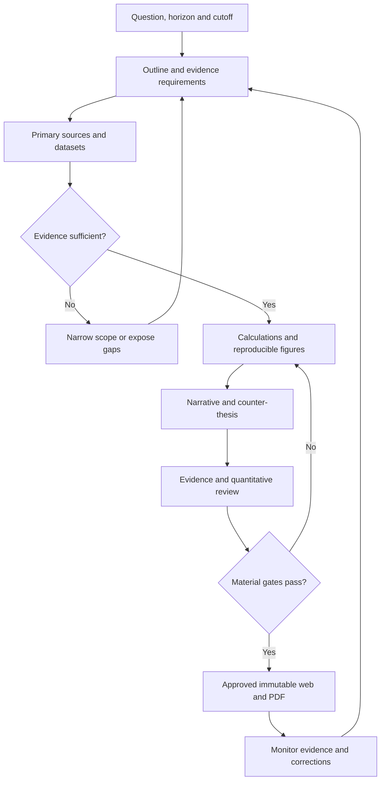
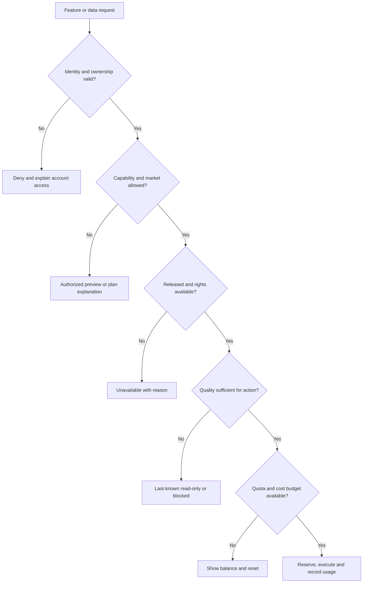
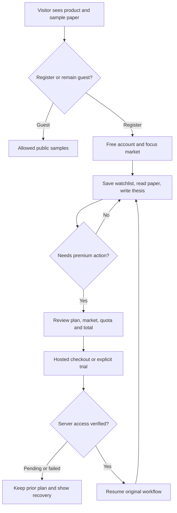
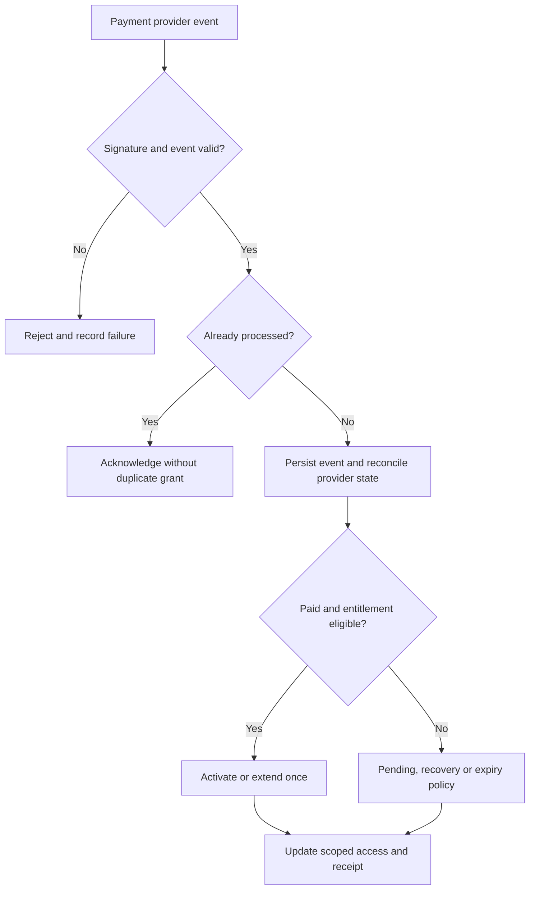

# MBG Trading — Complete Revamp Plan and Feasibility Study

**Prepared:** 1 October 2026, UTC+7  
**Project:** Market Brain Grid / MBG Trading  
**Repository:** [AhFu28/MBG-Trading](https://github.com/AhFu28/MBG-Trading)  
**Website:** [mbg-trading.pages.dev](https://mbg-trading.pages.dev/)  
**Document version:** 1.1 — expanded implementation handoff  
**Scope:** request recap, unfinished work, feature upgrades, every website surface, research papers/PDF, Free/Pro/Business packaging, internal developer access, architecture, feasibility, migration, release criteria and implementation sequence.

**This is a planning deliverable.** Four specialist agents reviewed product/tiering, UI/UX, research, and technical feasibility. This turn did not implement, push, merge or deploy website changes. The session's formal collaboration mode is Default; the work requested and performed here is planning only.

## Reading guide

| Need | Sections |
|---|---|
| What has actually been completed or remains unfinished? | 1–2 |
| What should the public product offer and how should Free/Pro work? | 3–4 |
| How should every page and interaction be redesigned? | 5–8 |
| What does paper/thesis-style research mean in implementation terms? | 9–10 |
| What additional features are worth building? | 11 |
| How will the existing stack support it? | 12–14 |
| What is feasible, in what order, at what effort/cost? | 15–17 |
| What requires owner setup and what proves the work is shipped? | 18–20 |
| What should be decided before implementation and which sources were used? | 21–22 |
| Which source files, tickets, dependencies and first-day outputs guide implementation? | Companion [MBG-Trading-Implementation-Backlog.md](sandbox:/workspace/scratch/47430f68ad9b/MBG-Trading-Implementation-Backlog.md) |

## 1. Completed, local-only, and unfinished work

### 1.1 Evidence and status rules

The recap covers the MBG discussions and artifacts recovered from 27–30 September, the current planning request, source inspection, and a limited live-site observation on 1 October. It excludes the unrelated CPNS repository and general bot playbook.

Use these statuses separately: **planned**, **implemented locally**, **committed locally**, **pushed**, **merged**, **deployed**, and **verified on the deployed site**. A successful build is not proof of deployment. A document is not an implemented feature. A cached `origin/main` reference is not today's remote HEAD.

| Evidence | Verified content | What it does not establish |
|---|---|---|
| `MBG-Trading-Combined-Audit.md` | 27 September audit at `581912fbe83de6c5f9eb4047d03754ce8d8f88cd`, findings, historical tests and browser supplement | Every later finding is still present or has been fixed |
| `MBG-Trading-Public-Product-Blueprint.md` | 28 September product/access proposal and re-audit at `35404f93eb22c77327282a9f03aed9485d5040ca` | Billing, Free/Pro enforcement, team workspaces or commercial readiness |
| `MBG-Research-Desk-Audit-and-Design.md` | Research audit, evidence architecture, report/readability proposal | A deployed institutional research system |
| `MBG-Research-Sample-Indonesian-Banks.pdf` | Completed seven-page example, prepared 30 September; historical BCA evidence plus explicitly labelled sensitivity/valuation simulations | Current market research, causal findings, a backtest or the website's export feature |
| Local `feat/research-pdf-export` | Clean local worktree; commit `b09ebff3b69700008d2cc243946044fe04ac0262` (short `b09ebff`); exporter, detail-modal integration, fonts, tests and documentation; six export tests passed in this planning review | Successful push, merge or production release |
| PDF branch ancestry | Based on cached `origin/main` at `b89aee6`; includes the September 28 redesign ancestor | Current remote revision, or identity between production and any local revision |
| Source reinspection for this plan | Read-only September 28 snapshot `35404f9`; export checkout `b09ebff` based on cached September 30 `b89aee6` | These snapshots are not claimed to be today's remote HEAD or deployed code |
| Live browser, 1 October around 18:47–18:49 UTC+7 | Homepage and one sector-research modal inspected in an existing session | Full mobile/accessibility audit, server authorization, payment behavior or deployment SHA |

The September 30 continuation reported that an attempted branch push was rejected by automated approval review because repository permission was considered insufficient. No push was attempted in this planning turn. Current push/merge/deploy status remains unverified. Do not describe the local exporter as shipped.

### 1.2 Requested work and its actual delivery state

| ID | Previously discussed/requested item | Current evidence-based status | Remaining concrete work |
|---|---|---|---|
| RQ01 | Check repo and deployed website; broad audit | Audit documents completed; a later authenticated exploration and today's limited observation exist | Reconcile current remote/deployed revisions; verify fixes against fresh source and deployed behavior |
| RQ02 | Fix serious audit findings and make MBG trustworthy | Findings identified; full remediation is not established | Implement and close the issue register in section 2 with evidence |
| RQ03 | Formulate MBG as a public product for sale | Blueprint completed | Build identity, server access, licensed coverage, billing, operations and validated sellable workflows |
| RQ04 | Divide subscriptions and feature/menu visibility | Proposed Basic/Pro/Business and market packs documented; browser tier demo exists | Adopt a coherent Free/Pro/Business policy, implement backend enforcement, and migrate any real customers explicitly |
| RQ05 | Private admin/developer mode for owner and collaborators, all modules visible | Designed; production role/permission implementation not verified | Separate internal roles, named invitations, MFA, sandbox, permissions, flags and audit log |
| RQ06 | Guest/trial/tester configuration | Designed | Expiring grants, safe feature cohorts, quota policy and server checks |
| RQ07 | Market segmentation / General / add-ons or DLC | Designed | Coverage/rights register, market-pack entitlements, simple checkout and cost validation |
| RQ08 | Process flowcharts | Earlier blueprint contains diagrams | Connect revised product, research, entitlement, billing and rollout flows to actual implementation |
| RQ09 | Audit/research the existing research feature | Audit/design completed; current short-form limitations observed again | Repair source integrity, archive, calculations and reader behavior |
| RQ10 | Research like a paper or thesis, detailed and easy to follow | Requirements and sample completed | Canonical report schema, continuous narrative, evidence, methods, figures, counter-thesis, reader and editorial workflow |
| RQ11 | Theory, best practice, current trends and institutional research rigor | Proposed architecture and sources documented | Curated theory/evidence stores, domain methods, availability/vintage handling, skeptical review and evaluation |
| RQ12 | Strong visualizations | Demonstrated in the sample PDF | Reproducible charts for production papers; shared web/PDF figure data and captions |
| RQ13 | Make a sample first in PDF format | **Completed:** seven-page Indonesian-banks sample | Keep as an editorial reference; create reviewed current papers only with suitable evidence |
| RQ14 | Add export to PDF to the research feature | **Implemented and committed locally** at `b09ebff`; six export tests pass; not verified shipped | Review against fresh authorized base, build/download/visual QA, release, and deployed verification |
| RQ15 | Explore after login / browser help | Earlier login/exploration completed; current homepage/note accessible in this session | Complete broader device and workflow QA during implementation |
| RQ16 | Upgrade the website's features | Existing modules plus proposals; no complete upgrade delivery established | Prioritized feature backlog in section 11 |
| RQ17 | Complete UI/UX revamp inspired by SpaceX, freebuff, command code and TradingView | This document is the consolidated guideline | Representative screen designs, component system, route migration and staged page rollout |
| RQ18 | Preserve instrument logos across the revamp | Existing stock/crypto/FX logo system found and live logos observed | Preserve and improve identity/resolver behavior; verify all required placements/themes/PDF |
| RQ19 | Full plan in Markdown with multiple-agent feasibility study | **Completed by this document** | Implementation remains a subsequent task |

### 1.3 Existing updates to preserve, without overstating them

The repository already contains separate market components, Cloudflare Functions, Python data/analysis modules, optional Supabase integration, data-integrity UI, a simple/advanced display preference, command search, instrument logos, and chart integrations. September 28 history includes a cockpit redesign, a tier foundation, bandarmology work, Telegram dispatch, and Phantom wallet integration. These are existing code changes, not evidence that the entire public-product proposal is complete.

Today's live homepage labels portfolio valuation **SIMULATOR**, and the Whale menu shows **SIM**. Retain these improvements; do not repeat the older visible-label findings as if unchanged. The observed homepage still combines many compact panels, controls and status claims. A stale macro footer coexists with LIVE labels elsewhere; that is a reason to make dataset-specific status clearer, not proof every quoted instrument is stale.

The inspected research note still displayed a 92% signal/verified claim, a 45/35/20 driver decomposition, a 60/40 allocation, repeated explanation blocks, an internal `#research-note` source link, and a chart iframe showing blocked content. No PDF-export button was visible in that note. These are observations of that screen, not a claim that every page was tested. The iframe failure's root cause was not diagnosed.

The local exporter already handles stored narrative, metadata, pagination, safe external links and common financial/math glyphs. Its documentation indicates that the earlier link/glyph problems were addressed. Revalidate them; do not automatically carry those earlier problems forward as still unfixed. It deliberately excludes interactive charts, live quotes and fabricated UI helper metrics. This is useful legacy-record export, separate from a complete paper renderer.

## 2. Remediation register carried forward from the audits

**P0:** block release of the affected feature until corrected or isolated. **P1:** required for dependable public research/subscription workflows. **P2:** advanced or later scope. A finding may be historical, source-reconfirmed, reproduced, or deployment-unverified; closure requires new evidence, not an absent mention in a later audit.

### 2.1 Every principal earlier finding and its target closure

| Audit ID | Finding carried forward | Required implementation / closure evidence | Release scope |
|---|---|---|---|
| C01 | Generated whale events and unsupported entity/direction attribution | Remove generators from public data; observed transaction IDs and provenance; unknown attribution stays unknown; watermark demos | P0 for Flows/Whale |
| C02 | Invented candles, running tape and depth | Timestamped real feeds or honest unavailable states; simulations never enter market analytics | P0 for affected market surfaces |
| C03 | Fabricated fallback news and fixed calendar releases | Sourced publication IDs/times; actual scheduled/releases data; missing feed stays missing | P0 for News/Calendar/Research |
| C04 | Real orders lack the requested protective exits | Dedicated server order service, acknowledged protective orders, sizing, idempotency and reconciliation; keep public live execution disabled meanwhile | Separate execution project |
| C05 | Browser PaperBroker: two simultaneous exits can lose one settlement | Immutable evaluation and exactly-once settlement; two stops produce two journal/cash settlements; independent Arena engines separately reconciled | P0 browser-paper release; Arena has its own gate |
| H01 | Authentication fallback/bypass paths | Individual identity, secure sessions, no production fallback credentials; logout/revocation tested | P0 public access |
| H02 | Protected data request can proceed without a token | Explicit public/private policies, auth before query, no protected static bundle; direct API tests | P0 premium/private access |
| H03 | Daemon reset lacks established admin authorization | Scoped admin authentication, deliberate impact review, audit and account/run isolation | P0 internal mutation |
| H04 | Exchange secrets in the browser | Remove browser secret custody; future server-only restricted credentials and redaction | Separate execution project |
| H05 | Database ownership/RLS is not established in source | Versioned user/workspace ownership and RLS policies; cross-account access tests | P0 multi-user launch |
| H06 | Invalid/non-finite numeric input corrupts accounting | Finite/positive/unit validation before any mutation; invalid request leaves balances unchanged | P0 paper/risk |
| H07 | Order type/side semantics are inconsistent | Explicit supported state machine, matching policy and order-type fixtures | P0 paper/execution module |
| H08 | Target status can override a stop/terminal position state | State keyed to account+position+event; terminal state cannot revive | P0 paper/risk |
| H09 | Currency and market classification are unsafe | Typed instrument, quantity, money and FX-conversion contract; no mixed-currency summation | P0 accounting/risk |
| H10 | AI veto/model error can fail open | Deterministic approval/safety state gates; missing/model-failed evidence cannot authorize action | P0 affected automation |
| H11 | Confidence/strategy labels imply unsupported certainty | Explain heuristic scores; calibrated probabilities only with evidence; no decorative VERIFIED | P1 all analytics |
| H12 | Untrusted feed text can influence prompts/control | Treat sources as evidence, not instructions; constrained outputs, isolated tools, numerical verification | P1 AI/research |
| H13 | Split ledgers and incompatible schemas | One canonical account/order/fill/position/journal contract; migrate/reconcile legacy stores | P0 performance products |
| H14 | Arena synchronization can be stale/inconsistent | One writer/authority per run/account, versioned updates, replay and restart checks | P0 Arena |
| H15 | Backtest portfolio metrics are not soundly constructed | Dated portfolio/equity series, exposure and costs; rerunnable methodology | P2 Strategy Lab gate |
| H16 | Profit factor/trials/return can be invented or mislabelled | Calculate from recorded run; unavailable/undefined metrics explained, not fixed values | P1 analytics |
| H17 | Freshness/integrity/verified labels are unreliable | Per-observation event time, receipt time, delay, quality and actual verification results | P0 public trust |
| H18 | Spot quotes overwrite futures mark semantics | Separate last/bid/ask/mark/index/settlement fields by venue and contract | P0 derivatives research |
| H19 | RSI initialization and precision defects | Independently calculated reference vectors; full precision internally, display rounding separately | P1 calculation foundation |
| H20 | Correlation is aligned by array position rather than dates | Join return series by time, define calendar/frequency/missingness/sample; test mismatched holidays | P1/P2 risk tools |
| H21 | Low-price stops can round to zero | Tick/step-aware rounding with positive supported price and unchanged risk bounds | P0 risk tools |
| H22 | Green health can coexist with stale observations | Separate process availability from data readiness; downstream quality gates | P0 public trust |
| M01 | Calendar/timezone/offset handling | Exchange sessions, holidays, DST and strict source-time parsing; separate event/source/receipt times | P1 markets/calendar |
| M02 | Wrong range/flow/fundamental definitions | True 52-week sample or correctly named shorter range; turnover is not ETF net flow; fundamentals dated and sourced | P1 research/data |
| M03 | Persistence/schedule failures are hidden | Atomic publish, job state/retry/dead-letter, durable storage, verified restore and schedule monitoring | P1 operations |
| M04 | MT5 restart/minimum-lot risk behavior | Persistent baselines and contract-aware fail-closed sizing; test separately before live scope | Separate MT5 project |

### 2.2 Additional September 28–October 1 issues

| Item | Status / evidence | Required action |
|---|---|---|
| Portfolio/performance hero | Older audit found hardcoded metrics; today's main valuation has a simulator label | Reconcile every hero metric to its actual account/run/source; do not assume labelling fixes the numbers |
| Solana swap | Source rechecked: connection/balance capability is distinct from a swap handler that generates a fake success/hash/fee | Keep as explicit internal demo or remove public action; implement real signing/submission/confirmation only in a separate validated scope |
| Tier foundation | `localStorage`/browser toggle is source-confirmed; tier-changing help still visible live | Move preview switch to admin sandbox; server owns paid entitlement |
| User-owned storage | Shared browser keys can mix watchlists/paper states | Cloud ownership, logout/account-switch isolation and optional consented import |
| Research payload | Existing research generator includes fixed BBCA/ANTM levels and allocation even in the successful AI path | Remove contamination; narrative/price/assumptions must come from registered inputs |
| Research reader | Repeated blocks, unsupported ratio/driver claims and internal source anchor observed live | Canonical paper reader and evidence checks; remove false quantitative precision |
| Research archive/refresh | Legacy retention is edition-count based; refresh can fetch static JSON rather than generate new work | Explicit archive pagination/version/retention and queued job semantics; button says what it actually does |
| Headline extraction/classification | Earlier exploration found `$2.8K` extraction and irrelevant-news classification problems | Unit-aware parsing, ticker/entity disambiguation and curated relevance fixtures |
| Routes | Command IDs `TESTING_LAB`/`QUANT_ACADEMY` differ from renderer/sidebar IDs | One route registry and tested aliases/deep links |
| Logo resolver | Unknown domains can be guessed; crypto suffix handling and image state can carry over between symbols | Verified identity registry and neutral fallback; reset failures on instrument change |
| Public claims | Runtime-cost, live/verified and product capabilities need evidence | Marketing uses deployed features and measured costs; remove unproved absolute claims |
| Public/private distribution channels | Continuation source inspection at local `b09ebff` traces full bundle/archive writes to public JSON, web/static readers and Telegram; production exposure is not established | Classify content and enforce approved projections/private delivery across every producer, scheduled writer, cache and channel; frontend hiding alone is insufficient |
| Reader/Copy/audio/PDF parity | Local `NewsDetailModal` prefers summary and generated intelligence helpers while the exporter prefers stored full narrative | Deliver the same authorized edition and complete body in reader, Copy, opted-in audio and paper PDF; legacy export alone does not close full-paper parity |

The two-stop defect was reproduced again in the **browser PaperBroker** using in-memory storage: both positions disappeared, but only one close/journal entry was recorded. This does not involve a broker or real money, and does not establish the same reproduction in every independent Arena engine. Those engines require their own tests and ledger reconciliation. The old 16-test/build result belongs to its historical revision; it is not a new full-suite certification.

## 3. Product direction and non-negotiable requirements

Build MBG first as a **market-research workspace**: discover instruments, understand evidence, maintain a watchlist/thesis, read a coherent paper, and review decisions. Keep existing experimental capabilities available to the owner/collaborators in appropriate internal environments.

| Requirement | Consequence for the revamp |
|---|---|
| Instrument logos remain | Preserve stock, crypto and FX recognition across lists, detail pages, command search, reports and exports |
| Research reads like a paper/thesis | Logical argument, explicit methods/data, useful figures, limitations/counter-thesis and references; dedicated reader |
| Free is useful | A complete basic monitoring/read/save/notes workflow; sources and honesty stay accessible |
| Pro adds depth | Approved full research, more saved workflows, bounded AI requests, comparisons, exports and alerts |
| Business adds collaboration | Named seats, shared research/workspaces and permissions after tenancy/billing validation |
| Admin/developer is private | Owner and invited collaborators; not sold as a tier; all modules visible for authorized preview/testing |
| UI density is a preference | Rename display modes to **Simple / Advanced / Compact** or **Ringkas / Lanjutan / Compact**; these do not change subscription rights |
| Data truth is uniform | Free and paid users receive truthful source/time/quality labels; paying never fixes an outage or licensing gap |
| Read-only public launch | Live orders, swap, MT5 and unvalidated performance claims are excluded from the initial sellable scope |
| Coverage is explicit | Name supported venues/symbols, delay, fields/history and rights; All Markets means released packs, not every instrument worldwide |

Default launch hypothesis: one licensed focus market. Indonesia is attractive for a Bahasa Indonesia research workflow, conditional on data rights. If IDX procurement blocks the pilot, use a carefully scoped Crypto Spot pilot while sourcing IDX. US, derivatives, FX and commodities expand after their own data/method gates.

## 4. Subscription tiers, sections and feature visibility

### 4.1 Recommended packaging

Adopt **Free → Pro → Business** as the target. The older **Basic → Pro → Business** design remains historical; paid Basic is not an extra launch tier in this plan. This choice is a proposal, not a declaration that current customers have been migrated. If actual paid accounts exist, preserve paid periods and use a documented transition.

Subscription capability and market scope are separate. Pro initially includes one launched standard market pack; extra packs/All Markets are optional. Business includes the released standard packs that can lawfully be supplied to its named seats. Exchange real-time fees, professional-user classification and raw-data redistribution rights remain separate.

| Audience | Identity / access |
|---|---|
| Guest | Public landing, intentionally public samples and limited licensed previews; no persistent private workspace |
| Registered Free | Personal account/workspace, basic tools and limited quotas |
| Pro | Individual paid depth/capacity and an entitled market scope |
| Business | Paid team workspace; admin of its own team, never platform admin |
| Trial | Temporary safe Pro subset with visible expiry; proposed seven days, one pack, no automatic charge in pilot |
| Invited tester | Cohort-specific feature/action/market/quota grant and expiry, with beta/sandbox status |
| Owner | Internal platform role; all module visibility and scoped production controls |
| Collaborator | Invited named internal account; all sandbox modules, explicit production privileges, audit and revocation |

### 4.2 Exact target feature matrix

**Pack:** requires the relevant purchased/granted market coverage. **Later:** target after its independent release gate. **Sample:** only intentionally public/approved material. **Internal:** owner/collaborator access in the proper environment. The table describes target packaging; only release-ready rows can appear as included in an actual sale.

| Feature / section | Guest | Free | Pro | Business | Internal / release condition |
|---|---|---|---|---|---|
| Landing, product, pricing, methodology, status | Public | Public | Public | Public | Truthful current capabilities |
| Overview / Today | Sample | Personal basic | Personal advanced | Team + personal | No invented portfolio metrics |
| Instrument search and logos | Public subset | Pack | Pack | Released packs | Identity registry; search scope enforced |
| IDX scanner/detail | Licensed preview | Basic Pack | Advanced Pack | Advanced Pack | Rights, timestamps, definitions |
| Crypto Spot scanner/detail | Licensed preview | Basic Pack | Advanced Pack | Advanced Pack | Venue/pair identity and quality |
| US scanner/earnings/detail | Licensed preview | Basic Pack | Advanced Pack | Advanced Pack | Coverage, adjustment, sessions |
| Forex/commodities detail | Public macro subset | Later | Later Pack | Later Pack | Separate venue/contract/rights gate |
| Crypto Futures research | None | Public sample only | Later Crypto | Later Crypto | Mark/funding/OI semantics; no execution |
| DEX/protocol research | Sample | Approved samples | Later Crypto | Later Crypto | Chain/address identity and economic evidence |
| Global market overview | Licensed subset | Standard subset | Standard + Pack detail | Standard + Pack detail | No cross-pack leakage |
| Heatmaps | Preview | Basic Pack | Filters/saved views | Shared views | Defined weighting/window and source |
| Basic contextual chart | Sample | Pack | Pack | Pack | Supported widget terms or own licensed data |
| Saved chart layouts | None | Limited | More layouts | Shared templates | Persist identity/timeframe; library terms |
| Multi-pane/custom studies | None | None | Later | Later | Implemented supported chart product/licence |
| Watchlists | Session demo only | Limited personal | More personal | Personal + shared | Cloud ownership and sync |
| Standard screener filters | Preview | Pack | Pack | Pack | No invented signals |
| Saved/comparative screeners | None | None | Yes | Shared | Server scope/definitions/history |
| News titles/source links | Licensed subset | Pack relevance | Filters/saved research | Shared curation | Publisher rights; not copied full articles |
| Daily brief | Sample | Bounded sourced brief | Deeper/filtered | Shared briefing | Facts, cutoff and uncertainty |
| Calendar | Public subset | Basic | Filters + alerts | Shared calendar | Actual provider events and revisions |
| Macro/Sentinel dossiers | Sample | Approved short summaries | Approved deeper dossiers | Shared dossiers | Evidence, mechanisms, no arbitrary DEFCON certainty |
| Research-paper library | Selected complete samples | Samples/entitled catalog | Approved full papers | Full entitled/shared papers | Canonical version and editorial gate |
| Research full-paper reader | Public papers | Entitled papers | Entitled papers | Entitled papers | Same quality/structure for delivered papers |
| Custom AI research requests | None | Bounded briefs if cost permits | Budgeted jobs | Shared budgeted jobs | Evidence sufficiency and reviewer gates |
| Source/evidence drawer | Public scope | Entitled content | Entitled content | Entitled content | Truth is not paywalled separately |
| Paper PDF download | Public sample | Entitled samples/briefs | Entitled full reports | Entitled shared reports | Export rights + server entitlement |
| Research archive/version history | Public scope | Entitled subset | Entitled archive | Shared archive | Explicit retained-reading policy |
| Ask this paper | None | None | Later | Later | Cited approved evidence; no invented targets |
| Scenario exploration | Public example | Selected example | Later | Later/shared | Assumptions visible; separate from published thesis |
| Thesis tracker | None | Basic personal notes | Linked evidence/alerts | Shared reviews | Versioned invalidation/update logic |
| Personal notes / journal writing | None/cloud | Yes | Yes + analytics later | Personal + permitted shared | User owns writing; financial metrics gated |
| Export own notes | None | Yes | Yes | Permitted own/shared | Separate from licensed raw-data export |
| Price/event alert rules | None | Limited | More/compound | Shared + personal | Server scheduling, freshness, consent, dedup |
| Watchlist research digest | None | Limited opt-in | Configurable | Shared opt-in | Approved versions and notification preferences |
| Data/source/freshness status | Public subset | Always | Always | Always | Actual quality, no upgrade for outages |
| Correlation / exposure tools | None | Basic education | Later | Later | Timestamp-aligned returns and sufficient samples |
| Risk / lot calculator | Educational sample | Basic supported instruments | Saved risk profiles | Shared templates | Contract-aware deterministic calculations |
| Forward paper trading | None | Later limited | Later | Later | Ledger and matching-policy gate |
| Backtest / Strategy Lab | None | Method/demo only | Later | Later | Cost/leakage/reproducibility gates |
| AI Arena / measured leaderboard | None | None at launch | Later approved experiments | Later approved experiments | One ledger/authority; measured methodology |
| Whale / broker-flow / running tape | Explicit demo only | None at launch | Later licensed verified research | Later licensed verified research | Transaction/attribution/source validation |
| Academy / glossary / methodology | Samples | Core | Advanced content | Content + team onboarding | Editorial quality; simulations labelled |
| Public changelog/help/status | Public | Public | Public | Public | Deployed release history, not local commits |
| Billing / usage / sessions | None | Own account | Own account | Own/team permissions | Backend-owned state |
| Team invites / seats / approvals | None | None | None | Later | Tenancy/member lifecycle validated |
| Provider configuration / editorial / cohorts / flags | None | None | None | None | Internal roles only |
| Own simulation/run pause/cancel/reset | None | Later if module entitled | Later if module entitled | Later if module entitled | Own resources only; impact review and audit |
| Platform emergency kill/reset / release / secrets | None | None | None | None | Internal scoped privileged controls; never a paid unlock |
| Binance/MT5 live orders / Phantom swaps | None | None | None | None | Separate internal/testing project until proven |

### 4.3 Quota and pricing experiments

These are **test hypotheses**, not present tariffs or promises. Security, provenance, logo identity, the integrity of delivered papers, and access to user-written notes are consistent across plans.

| Parameter | Free candidate | Pro candidate | Business candidate |
|---|---|---|---|
| Price | Rp0 | Test Rp199,000 vs Rp249,000/month | Test from Rp799,000/workspace/month |
| Named seats | 1 | 1 | 3 initially |
| Standard market scope | 1 launched basic pack | 1 launched pack; optional extras | Released packs lawful for named seats |
| Watchlists / saved symbols total | 1 / 20 | 10 / 200 | 30 / 600 workspace pool |
| Active alert rules | 3 | 50 | 150 shared pool |
| Saved custom screeners | 0; standard filters usable | 10 | 30 shared |
| Saved chart layouts | 1 | 10 | 30 shared |
| Monthly AI credits | 5 bounded brief credits | 100 | 300 shared |
| Job debit hypothesis | Brief 1; no custom full paper | Brief 1; bounded paper 5 | Same debit policy |
| Concurrent AI jobs | 1 bounded brief | 1 full job | 2 full jobs/workspace |
| Trial | Separate grant: 7 days, 1 pack, 15 credits, 10 alerts | Same temporary safe subset | Team demo separate |

A five-credit paper must have bounded source/document/model/render scope. At that debit, 100 credits permits at most 20 such jobs; it does not guarantee 20 published papers despite insufficient evidence or imply unlimited research. Final debits follow measured p50/p95 approved-report cost and review load.

Extra standard market pack: test Rp49,000–99,000/month after data costs/rights are known. Consider optional prepaid AI credits and extra named seats. Avoid per-button DLC, hidden overages, lifetime AI deals and unmeasured unlimited plans. Annual plans follow retention/cost evidence. Business is marked planned until team functionality is actually available.

Usage policy: validate access, reserve atomically, charge a successful result once, refund reservations on provider failures, deduplicate retry IDs, and display balance/reset/expected debit. Explain cancellation costs before the job. Alerts count active rules, not notifications sent. Never charge automatic top-ups because a cap was reached.

## 5. Information architecture and coverage of every website part

### 5.1 Public site, app, and internal administration

Use five primary app groups: **Overview, Markets, Intelligence, Workspace, Learn**. Account/help sit below them. Research is a prominent destination within Intelligence and has its own full-page reader. Admin uses a separate internal shell and environment banner.

On mobile use Overview, Markets, Research, Workspace and a More destination for other intelligence, Learn, account and help. The sidebar lists relevant released markets; an Explore Markets action explains other packs. Do not fill a Free user's navigation with dozens of locked experimental modules.

| Area | Target destinations | Job it helps the user complete |
|---|---|---|
| Public | Home, Product, Pricing, Research Samples, Methodology, Updates, Help, Status, Privacy/Terms | Understand MBG, inspect real output, compare access and register |
| Overview | Today, market/session summary, saved work, recent research | Decide what deserves attention next |
| Markets | IDX, Crypto Spot, US; derivatives/FX/commodities after gates; global overview | Find, filter, compare and inspect instruments |
| Intelligence | News, Research Desk, Calendar, Macro/Themes, Flows later | Understand evidence and mechanisms |
| Workspace | Watchlists, Charts, Alerts, Thesis/Journal; Simulation/Strategy/AI Lab later | Save work, track decisions, test hypotheses |
| Learn | Academy, Glossary, Methodology, Updates | Learn concepts and product methods |
| Account | Profile, Appearance, Markets/Plan, Usage, Billing, Notifications, Sessions, Team later | Control experience, access and ownership |
| Internal | Operations, Providers, Editorial, Users/Cohorts, Plans/Grants, Sandbox, Releases, Audit | Operate and improve the platform |

All paths below are proposed routes, not claims of current implementation. One route registry supplies sidebar, command palette, links and permission metadata. Preserve supported old hash/`?tab=` links through explicit aliases and a useful missing-route page.

### 5.2 Existing module-to-target mapping

| Current surface / route | Proposed destination | Required redesign and dependencies |
|---|---|---|
| `HOME` / HomeDashboardTab | `/app/overview` | Today's changes, market status, followed instruments, recent papers and saved work; portfolio block only for a selected valid simulation/account |
| `STOCK` / MasterQuantLeaderboard | `/app/markets/idx` | Universe, Setups, Dividends, Turnover; consistent filters/sort, source dates, stock logos and lot/currency semantics |
| `CRYPTO` / MasterQuantLeaderboard | `/app/markets/crypto/spot` | Universe, Momentum, Volume; explicit base/quote/venue, logo and price-type identity |
| `US_STOCKS` / USStockTab | `/app/markets/us` | Universe, Earnings, Setups; exchange/share class/ADR/ETF, adjusted history and session context |
| `FUTURES` / CryptoFuturesTab | `/app/markets/crypto/futures` | Funding, OI, mark/index/last, liquidations; interval/unit/as-of per metric; gated research-only |
| DEX/memecoin panels | `/app/markets/crypto/dex` | Separate pools from perps; chain, address, liquidity and token risks; no swap implied by a research view |
| `FOREX` / ForexCommandTab | `/app/markets/forex` | Currency context, scanner, sourced COT, pip tools; distinguish spot, CFD and futures proxies |
| `GLOBAL_MARKETS` / GlobalMarketsTab | `/app/markets/global` | Region/session overview; indexes, rates, FX, commodities with specific sources/last session |
| `HEATMAP` / MarketHeatmapTab | `/app/markets/:market/heatmap` | Window, weighting/universe, sector filters, legend and accessible table; click the same instrument preview |
| `WHALES` / WhaleIntelligenceTab | `/app/intelligence/flows` | Market-specific verified flow research; chain transfers, broker/foreign flow and delayed US filings are distinct evidence types |
| `CHARTING` / ChartingDeskTab | `/app/workspace/charts` | Local symbol/timeframe/layout toolbar, saved layouts, source/venue; compatible libraries/licences and data |
| `WATCHLIST` / PersonalWatchlistTab | `/app/workspace/watchlists` | Named lists, ownership, notes, alerts, stable instrument IDs and cloud sync |
| `NEWS` / NewsTab and BloombergNewsWire | `/app/intelligence/news` | Latest/My Markets/Saved; relevance and publication metadata; public product naming uses MBG News |
| `RESEARCH` / `ARCHIVE` in News/Home | `/app/intelligence/research` and `/app/research/:reportId` | Paper catalog, report series, explicit versions and dedicated reader; legacy briefs stay labelled |
| `ECONOMIC_CALENDAR` | `/app/intelligence/calendar` | Day/week agenda, timezone, previous/revised/consensus/actual, event source and release state |
| `AI_SENTINEL` aliases / drawer | `/app/intelligence/macro` | Themes, dossiers, geopolitical transmission; one content/state authority; drawer is a preview of the full page |
| `TESTING` / TestingHubTab | `/app/workspace/lab` | Separate simulation/backtest entry points and methodology; internal QA is not a customer product |
| `CURRENT_TEST` / VirtualForwardPortfolio | `/app/workspace/simulation` | Account/run selector, orders/positions/trades/cash/equity/reconciliation; permanent simulation context |
| `BACKTEST_LAB` / BacktestPerformanceLab | `/app/workspace/lab/backtests/:runId` | Run metadata, net equity, drawdown, benchmark, costs, robustness and out-of-sample evidence |
| `PEARSON_CORRELATION` | `/app/workspace/lab/correlation` | Return frequency, dates, window, sample, missingness, source and methodology; table alternative |
| `AI_AGENTS` / AiAgentArenaTab | `/app/workspace/ai-lab` | Experiment registry, bounded configurations, run state, genuine measured results and linked ledger |
| Arena review/rules/philosophy/recap/evolution/journal | AI Lab run/strategy detail pages | Versioned strategy docs, parameter history, run report and journal; reset/kill remain scoped actions |
| `ACADEMY` / QuantAcademyTab | `/app/learn` | Curriculum, glossary, progress, sourced examples and clearly labelled interactive simulations |
| `FLOW_PROCESS` | Public `/methodology`; internal `/admin/architecture` | Public explanation of evidence/research process; technical operational detail in internal administration |
| `CHANGELOG` | `/updates` | New/Changed/Fixed, actual release date/build and known limitations |
| Lot/calculation/currency tools | `/app/tools` plus contextual panels | Contract-aware units, saved inputs, clear hypothetical result; consistent instrument context |
| MbgLogo / instrument icon components | Global identity system | Preserve MBG identity and original instrument marks; do not copy inspiration-brand assets |

### 5.3 New pages and required states

| Page | Minimum content and behavior |
|---|---|
| Landing `/` | One concrete value proposition; monitor→research→review workflows; readable sample paper; screenshots honestly labelled; supported coverage; demo/signup CTA |
| Product `/product` | Actual use cases, example outputs, device support, data limits and current feature availability |
| Pricing `/pricing` | Free/Pro/Business, capability comparison, one market picker, optional bundles, term/tax/total; current vs planned features explicit |
| Sample research `/research/sample/:id` | Complete allowed sample, sources, evidence cutoff, figures and sample PDF; no hidden premium payload |
| Sign-up/sign-in/recovery | Per-user account, clear inline validation, password-manager support, recovery and verified session; no shared production password gate |
| Onboarding | Market, experience, timezone and density; first watchlist and first paper; skippable, editable preferences |
| Checkout/result | Selected plan+market+seat+term+price+quota; pending/failure/action-required/success based on server state; return to original task |
| Profile/settings | Language, locale/timezone, theme/density, notification preferences, session management, data export |
| Subscription/usage/billing | Period, renewal/cancel, remaining quota/reset, packs, receipts/invoices and downgrade impact |
| Team | Named members/invitations, workspace roles, shared views/reports and ownership rules; later release |
| Help/status/methodology/privacy/terms | Accessible permanent links; support context ID; provider status separate from market session; sourced product methods |
| Error/not-found/offline/forbidden | Recovery path and preserved draft/context; actual last-known data state; no plausible fake values |
| Internal admin | Environment banner, scoped operations, users/cohorts, editorial, entitlements, provider quality, audit and releases |

### 5.4 Drawers, modals, widgets and global interactions

| Existing/global surface | Target behavior |
|---|---|
| SecurityHubDrawer | Reusable 420–560 px desktop instrument preview: logo/name/venue/quote/as-of, Overview/Setup/Flow/News/Risk; Open Full Page; mobile full page with restored back/filter/scroll |
| TradingViewModal | Quick preview with consistent instrument header, resize/full-page action and provider attribution; honest blocked/unavailable state |
| AiIntelligenceDrawer | Evidence-linked dossier preview using the same state as Macro; no duplicate contradictory narrative |
| NewsDetailModal | Short source-record reader; retain permitted Copy/Save/audio, add legacy PDF once released; route to full paper when an approved report exists |
| LotCalculatorModal | Units/contract/FX source, balance/risk inputs, deterministic size, fees and assumptions; invalid inputs block calculation |
| OrderExecutionModal | Simulation-only public successor after ledger gate; future live review has account, venue, order, costs/risk/protection and acknowledged states |
| SolanaSwapModal | Internal demo, visibly simulated; future separate flow must review chain/address/slippage/expiry/fees/signing and confirmed transaction outcome |
| CommandPaletteModal | Search instruments/reports/pages/actions with logos and venue; keyboard navigation and permission-consistent results |
| DataIntegrityModal | Observation vs ingestion time, delay, source, quality, failed checks and retry state; no timed animation masquerading as verification |
| ComplianceRiskModal | Readable versioned notice, accessible focus and later access; acknowledgement does not certify data or erase defects |
| GlobalMarketTicker | Pause/hide, no compulsory movement, session/timezone labels and a static alternative |
| RunningTradeWidget / OrderBookSimulator | True source-specific tape/depth or permanent simulation labels; audio opt-in; missing real data remains unavailable |
| Alerts/toasts/jobs | Brief feedback in toast; material error/progress durable in a job/status view; IDs and retry/cancel where appropriate |
| Confirmation dialogs | Explain affected account/run/resources and reversibility; explicit confirm for destructive/financial actions; navigation cannot execute them |
| Loading/empty/stale/offline/locked/expired | Distinct states with next action; skeletons never fake prices; paywall is not an outage message; drafts survive |

## 6. Visual direction and design-system specification

### 6.1 Translating the requested references

| Inspiration | Proposed MBG interpretation | Where to apply it |
|---|---|---|
| SpaceX | Dark canvas, strong type hierarchy, restrained technical panels and generous space around public messaging | Landing/product pages, navigation and overview framing |
| “freebuff” | Assume **FreeBuf**: technical editorial depth, topic navigation, reports, author/source metadata | Research catalog, news topics, Academy |
| “command code” | Assume terminal/command-center interaction: command palette, keyboard efficiency, inspectable status, compact identifiers | Global shell, scanner, admin and research methods |
| TradingView | Consistent instrument identity, purposeful chart controls, saved workspaces, contextual panels | Markets, Charts, Watchlists and instrument detail |

FreeBuf identification and “command code” meaning are assumptions, not confirmed brands. Confirm visual references at the design checkpoint; they do not block this plan. Official design references were reviewed where accessible; no complete visual audit of SpaceX/FreeBuf was performed. Extract principles rather than copying logos, photos, branded assets or layouts.

Design default: a restrained dark market workspace with a complete light theme. Full papers use a calm reading surface with light-paper and dark-reading options. Use original instrument-logo colors as visual recognition. Reserve bright color for actions, changes, quality and alerts. Avoid turning every card into a glowing badge, shrinking text to fit, or filling the app with cinematic motion.

### 6.2 Initial semantic tokens

These are proposed starting values, not accessibility-certified combinations. Verify actual text, chart, focus and interaction contrast before use.

| Token | Dark | Light |
|---|---|---|
| Canvas | `#0B0E13` | `#F4F6F9` |
| Surface | `#131923` | `#FFFFFF` |
| Raised/selected surface | `#1B2431` | `#EDF2F7` |
| Border | `#344154` | `#CBD5E1` |
| Primary text | `#E9EEF5` | `#172033` |
| Secondary text | `#B4C0D0` | `#475569` |
| Muted metadata | `#8A9AAF` | `#5B6B80` |
| Action/focus | `#7BB6FF` | `#1D4ED8` |
| Positive | `#59D6A1` | `#047857` |
| Negative | `#FF8892` | `#B91C1C` |
| Warning/uncertain | `#F7CA6D` | `#92400E` |
| Paper canvas | `#11161D` | `#FFFEFA` |
| Paper ink | `#E5E9EF` | `#202834` |

Typography: retain Plus Jakarta Sans for UI if available; use JetBrains Mono for short numerical/technical identifiers, not all prose. Evaluate a licensed self-hosted serif such as Source Serif 4 for papers. Font assets and licences are reviewed before shipping. Prices use tabular numerals and instrument-specific precision.

| Parameter | Guideline |
|---|---|
| App text | Default 14 px; dense data target 12–13 px; supporting metadata about 12 px; no essential 8 px text |
| Paper prose | 17–18 px desktop, 16–18 px mobile; line height 1.6–1.75; about 65–80 characters per line |
| Page headings | 24–28 px, with a consistent hierarchy; short uppercase section labels only |
| Spacing | `4, 8, 12, 16, 24, 32, 48, 64` px scale |
| Radius | 4/8/12 px for controls/panels; pills for compact tags/status |
| Controls | 36–40 px desktop height; 44–48 px touch target design target |
| Shell | Sidebar about 224–248 px expanded / 64 px compact; header about 52–56 px |
| Content | Desktop padding 24 px, mobile 16 px; typical gap 16 px |
| Motion | Brief purposeful transitions; respect reduced motion; pause/hide tickers and avoid flash/audio defaults |

Core components: Button, IconButton, Inputs/Combobox, Tabs, Badge, SourceBadge, QuoteCell, InstrumentHeader, AssetIcon, DataTable, MetricCard, EmptyState, InlineError, Tooltip/Popover, Dialog/Drawer, Pagination, ChartFigure, ReportMetadata and CitationLink. Document variants and migrate repeated inline styling incrementally.

Simple mode reduces visible columns and explains context. Advanced mode exposes methods/evidence and extra permitted metrics. Compact changes spacing within readable limits. These preferences are available independently of paid tier; no density choice removes sources, status or logos.

## 7. Page-level UI/UX rules and complete workflows

### 7.1 Global shell and Overview

Header: current workspace, global search, scoped data-status summary, notifications and account. Put symbol/timeframe/filter controls in their own page toolbar. Move clocks, calculator, wallet experiments, secondary diagnostics and rare tools into contextual or overflow areas.

Distinguish transport **Connected** from each dataset's **Current/Delayed/EOD/Stale/Missing** state. A connected crypto WebSocket cannot make macro, research, IDX or other unrelated observations green.

Overview default: market/session context → important changes → followed instruments → latest relevant papers → saved work. Use at most roughly six primary blocks as an initial design constraint, configurable after testing. Macro/risk/flow panels become selectable widgets. Portfolio/simulation metrics require a selected account/run, cutoff and reconciled source. An empty account gets an empty state.

### 7.2 Market tables, scanners and instrument detail

Tables keep logo+ticker+name+venue visible, numbers right-aligned, missing values distinct from zero, and signed change readable without relying on red/green. Headers sort by explicit controls; filters show active chips and Clear. Persist view/filter state in the route/saved view. Page 25/50/100 rows or use accessible measured virtualization; do not mount hundreds of charts.

Instrument full page tabs: Overview, Chart, Fundamentals/Protocol or Contract, Research, News/Events, Flow where valid, Notes/Risk. A common header anchors identity, venue, asset/contract type, currency, quote type, source, observation time and session. Trade setup is a dated hypothetical analysis panel, not an acknowledged order. Compare and Save/Watch are the default actions.

Cross-market rules: Rupiah/lot for IDX; share classes and adjustments for US; venue/base/quote for crypto; mark/index/funding interval for derivatives; contract/pip conventions for FX. Do not infer these from a ticker string. Heatmap shows universe/weighting/window and has an equivalent table. Chart selections preserve instrument/timeframe across drawers, papers and notes.

### 7.3 Charts and visual integration

Chart toolbar: instrument search, interval, chart type, supported studies, compare, layout, save and source/as-of. Provide one pane first; larger layouts only when supported by the device and chosen chart product. Separate analysis overlays from actual order/position state.

For widgets, saved layouts initially mean MBG-owned symbol/timeframe/pane settings. Drawing/indicator persistence and cross-frame control require supported APIs; do not assume they work through an iframe. If choosing a proprietary chart library, follow its distribution terms and keep restricted library files out of the public repository.

Choose integration deliberately: contextual TradingView widgets, own-data charts through a suitable library, and Advanced Charts are different products. Widgets are not a data API or export source. Current official Advanced Charts free terms require visible attribution and a public implementation, not private/paywalled use; obtain an appropriate arrangement or choose an alternative for Pro-only functionality. Preserve provider logos/attributions/legal destinations as required. [S1–S4]

The inspected blocked iframe needs a diagnostic task covering deployed configuration, embedding restrictions, provider availability and supported symbol; do not assume an MBG redesign or paid TradingView account fixes it. Display useful explanation and permitted alternatives while blocked.

### 7.4 News, Calendar, Macro and Flows

News is a source browser: published time, publisher, title, permitted excerpt, tickers/topics and external link. Briefs and full papers have their own types/destinations. Curate relevance to remove sports/spam/entity collisions; deduplicate syndicated stories. AI interpretation and publisher facts are visibly distinct.

Retain permitted Copy/Save/audio reading controls. Copy includes applicable source/report metadata; audio reads the same authorized content, is opt-in and offers Stop/Mute. Neither action generates a contradictory second narrative or bypasses content rights.

Calendar: day/week view, local timezone, source and actual release state. Previous, revised previous, consensus and actual are separate fields. Event detail explains an economic transmission hypothesis and known uncertainty. Never populate a missed release with a template value.

Macro/Sentinel: theme → mechanism → affected assets → supporting/contrary evidence → scenarios → review trigger. A threat/regime score needs a named method and explanation; arbitrary emergency language is not a substitute. Flows separates observed transactions, inferred/unknown ownership, licensed broker data and delayed filings. Unsupported modules stay internal.

### 7.5 Watchlists, Alerts, Journal and Labs

Watchlists have identity/ownership, saved sort/views, clear quote/source state, notes and alert entry points. Explain cloud sync/conflicts; account switching cannot show another account's browser data. Imports preview/deduplicate IDs.

Alerts show rule/condition, required data, last evaluation, channel, cooldown, last delivery and enabled/suspended status. An outage says suspended/stale; it does not trigger false signals. Delivery is opt-in with unsubscribe/mute and account/team scope. Quiet hours, cooldown and duplicate suppression prevent noise.

Journal separates the user's reasoning from any imported order/ledger facts. A useful entry captures question/thesis, source/report version, horizon, assumptions, invalidation, planned review and outcome/reflection. Financial performance analytics stay gated until ledger/currency correctness. The user can export their writing on Free or after expiry.

Simulation, Strategy Lab and AI Lab display environment/account/run IDs, assumptions, dataset/method version, costs and measured state. A pause/kill/reset is explicit and scoped. Educational demos remain available as demos, without performance claims. User-facing Strategy Lab and internal QA tools are separate destinations.

### 7.6 Command and navigation interaction

`Ctrl/Cmd+K` opens command search; a visible header button provides the same access. Arrow keys choose, Enter navigates, Escape closes/restores focus. Search results group Instruments, Papers, Pages and Actions, with logos/name/venue/access state. `BRK.B`, `IDX:BBCA`, `BTC/USDT` and identical tickers on different venues resolve through the registry or ask the user to choose the visible match.

Prefix `>` may select actions, but Enter never executes a trade/reset/payment without a separate review step. Single-letter shortcuts are disabled in forms/charts/editors; users can view/disable shortcuts. Locked actions explain the required capability/market/quota and return to the original task after a verified upgrade. An outage/license gap offers status/recovery, not an upgrade CTA.

### 7.7 Responsive, accessibility and performance acceptance

Design and test at 360/390 px mobile, 768 px tablet, 1024 px compact desktop and 1440+ px desktop, plus zoom/text enlargement. Mobile uses readable prioritized columns/cards, full-page detail/reader, a TOC sheet and a small contextual action bar. Wide tables scroll in a labelled region; the entire page should not accidentally scroll sideways.

Include a 320 CSS-pixel reflow / 400% zoom acceptance case. Document legitimate two-dimensional table/chart exceptions and provide readable alternatives rather than exempting the entire app.

Target WCAG 2.2 AA with keyboard access, visible focus, meaningful labels, dialog focus management/restoration, sufficient contrast, error association, non-color signals, zoom/reflow and chart summaries/tables. Target 4.5:1 normal-text and 3:1 large-text/non-text contrast where the applicable criterion requires it; assess exceptions correctly. Automated checks are supplemented by keyboard/screen-reader review. These are acceptance targets, not an existing certification. [S5]

Performance targets for the pilot, to measure rather than claim: Core Web Vitals p75 LCP ≤2.5 s, INP ≤200 ms and CLS ≤0.1 under representative conditions; define page/device/connection/sample. Lazy-load route chunks, iframes and PDF libraries, batch render updates, and subscribe by instrument. Preserve observation integrity while reducing render frequency. Measure before optimizing; no “zero runtime cost” promise. [S6]

## 8. Instrument-logo preservation specification

This requirement applies to **every part of the revamp**, including instruments discovered through a new feature. Preserve the existing `AssetIcon.jsx`, `CryptoIcon.jsx`, `stock-icons.js`, `crypto-icons.js` and `forex-flags.js` as migration inputs.

| Requirement | Implementation guideline | Acceptance |
|---|---|---|
| Stable identity | Canonical instrument ID → approved logo key/asset; venue/share class/chain/contract are explicit | Identical ticker strings do not produce the wrong entity |
| Preserve original marks | Original color/aspect ratio, `contain`, safe padding and contrast surface; no forced recoloring/cropping | Recognizable in dark/light/dense/mobile views |
| Stocks | Verified corporate identity/assets; retain share-class distinction such as BRK.A/BRK.B | No invented `${ticker}.com` or `.co.id` domain as a purported issuer logo |
| Crypto | Base asset logo plus pair/venue badge; chain+address for token identity | Strip suffixes only through mapped aliases; 1000/perp tokens cannot silently become another asset |
| Forex | Ordered base/quote country/currency identity; two flags where appropriate | EUR/USD and USD/EUR remain distinct |
| Resolver state | Reset fallback/error index when instrument identity changes; bounded approved-host fallback | A failed previous logo does not contaminate the next symbol |
| Unknown/missing logo | Neutral monogram/symbol with real name/venue; no guessed brand mark | Failure preserves identity and layout without endless retries |
| All placements | Search, tables, watchlists, heatmaps where space permits, drawers, detail headers, comparison, alerts, papers and PDFs | Representative IDX/US/crypto/FX/logo-collision fixtures at all densities |
| Accessible rendering | Logo decorative when adjacent name is complete; otherwise meaningful alternative label | Screen reader avoids duplicate names but never loses identity |
| Safe assets | Validate remote hosts/type, sanitize SVGs, respect attribution/brand/provider usage terms | No untrusted remote asset code or broken provider attribution |
| PDF assets | Embed approved local/cached assets and retain attribution where required; neutral identity fallback if unavailable | Stable offline paper layout; cannot lose ticker/name when image fails |
| Performance | Fixed dimensions, lazy-load appropriately, caching and immutable asset version | No layout shift or blocking every row on image requests |

Logo preservation is a release gate, not a finishing touch. Before rollout make a baseline contact sheet/inventory and compare the new components visually. Preserve semantic identity even if a previously guessed or incorrect asset must be replaced by a verified logo or neutral fallback.

## 9. Research-paper and thesis standard

### 9.1 What the research feature must become

Combine an academic paper's argument structure, an investment memo's relevance, and a notebook's reproducibility. Institutional/hedge-fund-style rigor is a process goal: sound evidence, domain economics, competing explanations and honest evaluation. It is not a certification or guarantee of alpha, accuracy or return.

The CFA report guide is a useful reference for business/industry context, financial analysis, valuation and investment risks. MBG should adapt the framework to the question and asset, rather than force a stock recommendation onto every paper. [S7]

| Report family | Purpose | Planning length / analytical scope |
|---|---|---|
| Daily brief | What changed since the last edition? | About 1–2 pages; dated facts, context, sources, next events |
| Event note | What changed after earnings/policy/unlock/listing? | About 3–6 pages; expectations vs evidence, mechanism, conditional implications |
| Company/asset paper | What drives economics and what does valuation require? | About 6–15 pages plus warranted appendix; evidence, competing thesis and sensitivity |
| Sector/thematic paper | Why do common drivers create different outcomes? | Defined universe, comparable data, theory, dispersion and economic significance |
| Macro/FX paper | How does policy/regime transmit across assets? | Releases, mechanisms, lags/vintages, alternative drivers and scenarios |
| Quant study | Does an explicit signal survive honest testing? | Experiment log, point-in-time data, costs, holdout, robustness and capacity limits |
| Update/correction | What evidence/conclusion changed? | Linked previous version and clear change/impact statement |

Length guides are not page minimums. The completed seven-page sample demonstrates a compact paper; generic textbook padding does not add rigor. A six-month investment thesis is not the same horizon as today's pivot level. Inconclusive findings and missing evidence are valid outcomes.

### 9.2 Mandatory paper spine

| Chapter | Required substance | Conditional aspects |
|---|---|---|
| Cover / metadata | Question-based title, type, instrument logos/IDs, author/reviewer, horizon, cutoff, publication date, version/status | Price/target only where evidenced and relevant |
| Abstract / executive summary | Supported answer, main findings, strongest uncertainty/objection, next monitoring trigger | No new recommendation absent from body |
| Question / hypotheses | Why it matters, testable mechanism, alternatives, scope and exclusions | State if study is descriptive rather than causal |
| Theory / prior work | Relevant economics, assumptions, original/contrary evidence and applicability | Depth follows the actual analytical question |
| Context / economics | Business, balance sheet, protocol, market structure or regime | Domain-specific framework |
| Data / methods | Source, units, period, availability, vintage, missingness, transformations, benchmark and model/code version | Formal statistical methods only if appropriate |
| Results / evidence | Observations/calculations in a sequence that tests the hypothesis, with numbered exhibits | No invented findings to populate a blank chapter |
| Valuation / economic significance | What the effect means and what assumptions price/value depends on | Valuation required for a valuation claim; explain inapplicability |
| Counter-thesis / robustness | Best opposing mechanism, contradictory facts, sensitivities, relevant subsamples/regimes | Statistical tests only where design/sample supports them |
| Scenarios / risks | Assumptions, transmission, bear/base/bull or bounded alternatives and invalidation | Probabilities require a justified/calibrated method |
| Implications / monitoring | Conditional conclusions, horizon, catalysts, observable review triggers | Position sizing only for an explicit hypothetical mandate |
| Limitations / disclosures | Missing data, confounders, model/source limits, conflicts, AI involvement | Cannot be a footer used to excuse fabricated evidence |
| References / appendix | Claim-linked sources, calculation manifest, glossary and reproducibility material | Raw data/notebook distribution subject to rights |

Briefs use a compact subset and their proper type. Non-applicable chapters carry an editorial explanation; do not invent causality, targets, backtests, allocation or a 92% success probability to fill a template.

### 9.3 Asset-specific methods and useful exhibits

| Domain | Questions and evidence | Exhibits / checks |
|---|---|---|
| Indonesian/US companies | Revenue/margin drivers, cash conversion, balance sheet, capital allocation, governance, corporate actions, peers and horizon | Financial reconciliation, operating-driver waterfall, peer table, valuation sensitivity and catalyst/risk register |
| Banks | Asset vs deposit repricing, deposit mix, NIM vs NII, credit costs, asset quality, capital, ROE vs cost of equity | Yield/funding timeline, margin/credit-cost comparison, earnings bridge and ROE/discount-rate matrix |
| Macro/FX | Relative policy/real rates, growth/inflation, external balances, positioning, publication vs revision | Dated releases, mechanism map, aligned factor series and scenario transmission; no causal label from correlation |
| Crypto/protocol | Supply/unlocks, fee economics, token-holder value capture, governance/security, chain/venue liquidity | Supply schedule, activity/fee series, venue comparison, contract-risk and economic assumptions; transfers are not automatically trades |
| Commodities/futures/perps | Instrument/expiry, term structure, inventories, seasonality, mark/index, carry/funding/roll, liquidity/margin | Curve/carry, inventory context, funding sensitivity and expiry/catalyst calendar; costs and executable contract distinguished |
| Quant strategy/factor | Economic mechanism, tradable point-in-time universe, feature/label timing, portfolio construction, turnover/cost/capacity | Net equity/drawdown, factor exposures, cost sensitivity, regime panels, experiment/holdout summary and failure cases |

For quant work, prevent survivorship and look-ahead, availability leakage, repeated holdout tuning, inappropriate random splits of dependent data and understated costs. Record every experiment and selection decision. Consider purged validation/embargo, deflated Sharpe or PBO only when assumptions/data justify them; sophisticated test names do not validate a strategy by themselves. The original overfitting research is a methods reference, not a checkbox. [S8]

### 9.4 Narrative and visualization rules

Each section follows **question → evidence → interpretation → limitation → next question**. Define unfamiliar concepts before using them. Cite a figure near its supporting claim, explain what it shows and why the next section follows. One paragraph advances one argument. Do not jump from a headline to institutional accumulation to a target price.

Example bank-paper argument: explain relative repricing → compare observed asset/deposit yields → reconcile NII → examine credit-cost offsets → test valuation assumptions → state conditions under which the thesis survives. This is how to turn the existing interest-rate sample into a repeatable editorial pattern.

| Explanation needed | Figure choice | Required context |
|---|---|---|
| Historical change | Annotated time series | Dates, units, frequency, cutoff, event annotations |
| Earnings/cash-flow contribution | Waterfall | Components reconcile to reported change; residual shown |
| Cross-asset/company comparison | Table, bars or dots | Same period/definition/currency and explicit sample |
| Assumption sensitivity | Two-variable matrix / scenario table | Formula, baseline, ranges, extrapolation and uncertainty |
| Statistical association | Coefficient/interval plot / scatter | Model/sample/control/error method; causality limits |
| Strategy behavior | Return/drawdown/exposure/cost panels | Reconciled series, net costs, benchmark and test period |
| Regime stability | Small multiples | Predefined regime method, sample and uncertainty |
| Transmission mechanism | Compact hypothesis diagram | Arrows are mechanisms/hypotheses, not empirical proof |
| Monitoring | Catalyst/invalidation table | Observable condition, reason, source and review date |

Every exhibit records ID, question, dataset/source/version, period/cutoff, unit, transformation/run, caption, alt text, evidence type and takeaway. Interactive and frozen export views use the same computed data. Historical facts, forecasts and illustrative simulations have distinct legends/annotations. Generate precise figures with code; no AI-painted data chart. A missing dataset produces a gap, not an invented exhibit.

### 9.5 Reader and archive UX

Research library filters: instrument/venue, type, theme, horizon, date/cutoff, status, language and series. Report cards show logos, question, brief supported takeaway and version/as-of. Sentiment is optional metadata, not the thesis.

Reader tabs **Summary / Full Paper / Methods** share one approved version. Desktop has a sticky TOC, readable central column and occasional wider exhibits; mobile has a chapter selector and single column. Provide exact citation popovers/links, glossary, numbered captions, author/reviewer, limitations, status, version history and correction notices. Save reading position, bookmark, copy citation and download PDF. Optional permitted data/figure/notebook downloads follow rights.

The abstract, source/time and limitations remain honest on Free. Public previews contain only authorized content, not a full Pro paper hidden behind CSS. Selected Free samples can be complete papers. Report-source date, evidence cutoff, publication time and export time remain distinct.

Archive uses pagination and explicit retention. Fourteen editions must not be labelled fourteen days. A superseded/withdrawn report keeps a visible notice and linked update; a corrected edition receives a new immutable version. Notification/action summaries cannot continue promoting an invalidated conclusion.

## 10. Research architecture, production agents and PDF delivery

### 10.1 Canonical report and evidence contract

Create a validated **`research.v2`** contract for new papers. Legacy news/research JSON remains `legacy_news_record` through an adapter; do not retrospectively call it verified paper data. The following is an illustrative schema, not an implemented record or market finding:

```json
{
  "schema_version": "research.v2",
  "report_id": "stable-id",
  "version_id": "immutable-version-id",
  "parent_version_id": null,
  "type": "sector_paper",
  "status": "draft",
  "title": "Specific research question",
  "instrument_ids": ["IDX:BBCA"],
  "language": "id",
  "question": "Falsifiable question",
  "horizon": {"label": "Explicit horizon", "start": null, "end": null},
  "cutoff_at": null,
  "published_at": null,
  "next_review_at": null,
  "abstract": null,
  "sections": [],
  "claims": [],
  "sources": [],
  "datasets": [],
  "figures": [],
  "assumptions": [],
  "counterevidence": [],
  "scenarios": [],
  "limitations": [],
  "review": {"editor_id": null, "gate_results": []},
  "reproducibility": {"run_id": null, "code_commit": null, "environment_id": null},
  "distribution": {"access_policy_id": null, "rights_review_id": null},
  "artifacts": {"html_key": null, "pdf_key": null, "content_hash": null}
}
```

| Entity | Minimum validation |
|---|---|
| Claim | ID, statement, materiality, type: fact/calculation/assumption/interpretation/forecast, supporting source/run IDs and review result |
| Source | Publisher/title/canonical URL or document ID, source/publication/retrieval/availability time, hash, rights basis, page/section/table locator and claim-linked extraction/passage reference; retain permitted excerpt or retrievable locator+hash |
| Dataset | Version/vintage, origin/extraction, coverage, units/currency, missingness, adjustments, availability rules, quality and rights scope |
| Calculation/run | Inputs, code/environment versions, parameters, seed where relevant, numerical tolerance, reconciliation and output hashes |
| Figure/table | Dataset/run/claim IDs, frozen series, caption/units/source/cutoff/alt text and artifact |
| Review | Named reviewer/editor, gate result, unresolved issue severity, timestamp and required revision |
| Artifact | Report+version+hash, renderer version, export generation time, storage key and distribution policy |

Database holds indexed metadata/ownership/policy; private object storage holds immutable approved HTML/PDF/figures and permitted evidence snapshots. Public teasers contain only deliberately public fields. Private report body/artifacts cannot remain in a static public JSON bundle. Reader, export and short-lived storage URLs share server access/rights checks.

Rights-driven removal/restriction can override retention of underlying documents/artifacts. Preserve correction/withdrawal metadata where permitted, but immutable editions do not imply a right to retain or distribute source material forever.

Research has two source stores: slow theory/methodology and fast filings/releases/observations. Theory records mechanism, assumptions, proxies, validity domain, known failures and latest review. Trending stories create research questions; popularity is not proof of economic value or an edge.

Use primary issuer/regulator/exchange/central-bank/statistical material first, original research for methods, and permitted qualified reporting for discovery/context. SEC APIs are a US filing source, not a ready normalized financial dataset; reconcile units, periods, tags and restatements. For historical studies store when information was available, not only the observation date. FRED real-time/vintage functionality illustrates why today's revised past values may not be what a historical analyst knew. [S9–S10]

AI can find/summarize evidence and draft the argument. Deterministic jobs calculate numbers and figures. Documents are untrusted evidence, never instructions to tools/publishers. Tool/domain access, source count, model calls, tokens, retries, job duration and cost are bounded. Do not invent missing URLs/quotes/targets, or convert a model's tone into consensus/success percentages.

Agreement between models is not independent empirical validation. Reviewer agents can find issues; they cannot certify factual support merely by agreeing with one another.

### 10.2 Proposed production jobs / agent roles

These are future product responsibilities, distinct from the four agents used to prepare this plan. A role can be a deterministic job or a combined human/editor workflow; it need not be an independent LLM call.

| Role | Deliverable | Control |
|---|---|---|
| Research editor | Question, horizon, outline, claims and evidence requirements | Narrows/rejects unanswerable scope |
| Source analyst | Primary evidence ledger, dates/locators/rights, conflicts and gaps | No fabricated substitute source |
| Domain analyst | Appropriate theory, mechanism and counter-hypothesis | Explains scope/assumption limits |
| Quant worker | Versioned calculations, tables, figures, manifests | Blocks invalid/reconciliation-failed inputs |
| Writer/editor | Continuous narrative and summary from approved evidence | Cannot add unsupported numeric conclusions |
| Skeptical reviewer | Countercase, confounding, selection and uncertainty issues | Material objections return to analysis |
| Evidence verifier | Citation entailment, time/unit/math and cross-format checks | Failed material gate blocks publication |
| Publisher | Approved immutable web/PDF edition, index and access | Cannot publish a new claim or bypass rights |



Lifecycle: requested → gathering → analyzing → drafting → in_review → published, with insufficient_evidence/failed/cancelled/superseded/withdrawn states. Stale is a specific health/review flag, not a universal expiry rule: an old theory chapter may remain valid, while a new earnings release can invalidate valuation. Deep papers initially require an assigned human editor. This is a proposed publication workflow, not an approval requirement for this planning turn.

### 10.3 PDF implementation: reuse the existing work, then deepen it

| Step | Concrete work | Acceptance |
|---|---|---|
| A — release legacy export | Recover/review `b09ebff` utility, NewsDetail integration, embedded font licences, tests and docs; compare with fresh authorized target base | Tests/build plus real browser download, long-content pagination, link/glyph/mobile/error/filename QA; verified deployment later |
| B — paper MVP | Render approved `research.v2` sections, citations and precise static figures from one contract; serve approved PDF through reader | Web and PDF have identical title/version/cutoff/key values/sources/exhibit IDs |
| C — advanced publishing | Evaluate Quarto when equations/cross-references/reproducible manuscript publishing exceed the lean renderer | Pinned runtime, canonical adapter, CI renderer, font/assets and reviewable output; not a dependency for basic export |

Quarto's manuscript features are a publishing candidate, not a finance fact checker. [S11] Start with the existing React/Python/Supabase/Cloudflare setup, approved static figures and jsPDF or a suitable PDF renderer. Avoid a full new framework migration merely to add a download button.

Legacy PDF retains stored `full_narrative` over summary, source metadata and safe links, without adding fabricated helper metrics. It does not verify upstream content or include live/widget charts. Paper PDF uses the approved full body and figures; it does not regenerate fresh AI text at download or scrape a TradingView iframe.

Target A4 paper: simple cover, metadata, TOC where useful, consistent headings, running title/page numbers, numbered figures/tables, readable math, bibliography and optional landscape appendices. Keep table/figure captions with their content; test long tables/URLs and final-page completeness. Broader language font support is evaluated as publication languages expand. Preserve instrument logos through approved portable assets.

Export action displays report version and entitlement, then queued/rendering/ready/failed where a job is needed, or direct download for an already approved artifact. Validate rights/request and authorization before protected delivery. Recheck entitlement before completing a long job. Export time never becomes the market/source timestamp. A failed render does not show a success toast or empty PDF.

### 10.4 Quality gates and pilot evidence

| Gate | Pilot acceptance |
|---|---|
| Material factual support | Every material fact has a directly supporting passage or registered calculation; unsupported material claims = 0 in the approved pilot set |
| Time/vintage integrity | Evidence available by cutoff; historical availability and revisions tracked; no unacknowledged future information |
| Numerical accuracy | Units/currency/periods reconcile; critical values/figures reproduce within declared tolerance |
| Narrative continuity | Independent reader can explain thesis, strongest objection, key assumption and next monitoring trigger |
| Forecast honesty | Horizon/assumptions/invalidation visible; no unsupported calibrated probabilities or forced targets |
| Quant validity | Experiments/selection/costs/benchmark/holdout documented where a quant study is included |
| Cross-format identity | Approved web and PDF refer to one immutable edition and agree on material content |
| Access/rights | Direct API/artifact access respects audience and dataset export policy; no paid body in public index |
| Operational truth | Queued/error/stale/correction states are accurate; retries/cost bounded; no orphaned paid job |

Evaluate a curated bank/company paper, US earnings note, crypto asset paper and macro study as coverage permits; add a quant study only when credible inputs/methods exist. Include missing quarter, stale quote, conflicting/restated data, malformed AI output, source/ticker collision, figure mismatch, timeout, unauthorized export and rendering failure. The initial one-market core pilot can use a narrower subset; these cross-asset cases are the later expansion suite.

Track evidence entailment, calculation correctness, temporal validity, readability, latency, marginal approved-publication cost and reviewer correction time separately. A composite editorial score is not a market win probability.

### 10.5 Trusted-source / open-source candidates

| Candidate | Recommended role | Feasibility / limitation |
|---|---|---|
| Quarto | Later multi-format manuscript publishing | High suitability for publishing; additional render/runtime operations; does not validate research |
| OpenBB | Selected provider adapters after a measured need | Current official V5 release/licence material documents Apache-2.0 and major provider/package changes; pin and review version and each provider's data rights |
| Microsoft Qlib | Optional later quant experiment workflow | Bring suitable licensed point-in-time data; do not assume ready IDX/global coverage or profitable models |
| QuantStats | Optional reconciled returns analytics | Pin version and independently validate metrics; release corrections can change report numbers |
| GPT Researcher | Optional bounded retrieval/drafting spike | Evaluate citation entailment, source rights, injection controls, cost and reproducibility before adoption; not an automatic publication authority |

These are candidates, not dependencies installed or integrated by this plan. The historical OpenBB AGPL observation must not be repeated as the current root licence; exact installed versions and transitive/data licences need checking. Current OpenBB/Qlib/QuantStats official sources were reviewed; no blanket security/maintenance endorsement is implied. [S12–S14, S27]

## 11. Feature-side upgrades ranked by practical value

First make existing workflows dependable; then add features that connect monitoring, research and review. Priorities here are product recommendations, not claims these requests were already implemented.

| ID / priority | Upgrade idea | Why it is useful | Dependency / measurable completion |
|---|---|---|---|
| F01 / P0 | Per-field source/freshness and evidence drawer | User can inspect where a number or claim came from | Observation/claim contracts; stale/mock/unknown fixtures never say LIVE |
| F02 / P0 | Consistent instrument page and logo identity | Stops context loss between scanners/charts/research | Registry; venue/share-class/chain collisions resolve correctly |
| F03 / P1 | Dedicated paper library/reader/PDF | Makes deep research understandable, reusable and shareable | Sections 9–10; complete reviewed edition agrees across formats |
| F04 / P1 | Cloud watchlists and saved views | Work follows the user/device and feeds relevant research | Auth/ownership/sync; second account/device lifecycle tested |
| F05 / P1 | Thesis tracker | Connects a question, assumptions, evidence updates and invalidation | Versioned reports/notes; reviewer can trace a changed thesis |
| F06 / P1 | Watchlist research/event digest | Reduces repeated manual checking | Approved versions, alert jobs, opt-in; no irrelevant/spurious notifications |
| F07 / P1 | Smart price/event/earnings/unlock alerts | Surfaces changes in the user's actual workflow | Source contracts/cooldown/dedup; stale data suspends rule with explanation |
| F08 / P1 | Comparison workspace | Compares companies/assets on consistent definitions | Aligned dates/currency/units/rights; missing/incompatible values explained |
| F09 / P1 | Clear server-driven plan/usage center | Removes confusion about coverage, quotas and expiry | Entitlements/billing; pricing and server access agree |
| F10 / P1 | Research editorial/admin console | Keeps sources, corrections, reviews and releases manageable | Roles/audit/report lifecycle; unsupported draft cannot publish |
| F11 / P1 | Market-specific event/corporate-action calendar | Connects catalysts to instruments and papers | Licensed dated events; revisions/changed dates traceable |
| F12 / P1 | Academy-to-workflow links | Teaches terms in the context where used | Glossary/method references and learning progress; examples explicitly simulated |
| F13 / P2 | Ask this paper | Lets a reader interrogate approved evidence | Citation-grounded answers, rights and no-data behavior; no silent new forecasts |
| F14 / P2 | Scenario sandbox | Makes sensitivity and assumptions understandable | Deterministic formulas; user scenario labelled separately from published edition |
| F15 / P2 | Version comparison and correction alerts | Shows how a conclusion changed | Immutable versions; diff identifies material claim/number changes |
| F16 / P2 | Portfolio exposure / correlation | Helps inspect concentration rather than guess diversification | Currency/returns alignment; explain sample/uncertainty and missing data |
| F17 / P2 | Validated paper journal / performance | Lets users evaluate decisions with credible accounting | Unified ledger/matching/cost rules; section 2 defects closed |
| F18 / P2 | Reproducible Strategy Lab | Tests whether a signal survives costs and alternative periods | Historical rights/point-in-time data, experiment log, holdout and run manifests |
| F19 / P2 | Business research collaboration | Shared theses, approvals, templates and review history | Named seats, tenant isolation, ownership/member-removal and billing |
| F20 / P2 | Methods/notebook packages | Analysts can inspect/reproduce approved calculations | Data/code rights, pinned environment, tolerances and controlled access |
| F21 / P3 | Verified flow/on-chain intelligence | Adds meaningful market context beyond fabricated alerts | Observed transactions/filings, attribution uncertainty and rights |
| F22 / P3 | Bounded AI Arena research | Compares defined experiments with measured evidence | One authority/ledger, stable methodology and real test records |
| F23 / Separate | Broker/MT5 execution and real Web3 swaps | Optional future transaction product | Dedicated custody/protection/confirmation/reconciliation/terms assessment |

Additional UX improvements that do not require a new market feed: keyboard navigation, persistent filters, recent work, glossary/citation expansion, bookmark/read position, clear no-data states and user-note export. Build these alongside the stable shell rather than multiplying menu names.

Pilot product evaluation: interview target users, observe first watchlist+paper+note completion, track return to this workflow at D7/D30, paid conversion/refunds, approval/reviewer load and p95 cost. Initial internal hypotheses may be activation ≥50%, D30 paid retention ≥70%, contribution margin ≥70%; these are experimental goals, not industry benchmarks or evidence of product-market fit. Report sample sizes and user reasons, not only dashboard percentages.

## 12. Architecture and data contracts on the existing stack

### 12.1 Retain the stack, add enforced boundaries

| Existing component | Target role |
|---|---|
| React 18 / Vite | Shared design system, route registry, market workspace and paper reader |
| Cloudflare Pages / Functions or Workers | Public static delivery plus authenticated API/entitlement gateway and hosted provider callbacks |
| Python fetchers/analyzers | Normalization, domain calculations, report/figure jobs and scheduled batch work |
| Supabase/Postgres | User/workspace ownership, subscriptions/grants, research metadata, job/usage/audit state; private storage as selected |
| GitHub Actions | CI, publishing/build checks and suitable batch jobs; not continuous-trading timing guarantees |
| FastAPI/Hugging Face Arena daemon | Internal experiment worker until isolation, durability and authority are validated |
| MQL5 EA / broker adapters / Phantom | Separate execution/testing scope; not part of the initial public research launch |

Do not force pandas/other Python dependencies into an edge runtime. Retain a suitable Python worker/container and evaluate scheduling/storage/hosting against measured workload. Separate ingestion/calculation from UI rendering and paid access.

Canonical relationships: **instrument → observation/dataset → calculation/report → user workspace**. For future simulation: **plan version → accepted order → fills → position events → cash → journal → analytics**. UI helper values never become authoritative accounting or research evidence.

### 12.2 Instrument and observation schema

Instrument registry fields: stable ID, aliases, venue/exchange/chain/address, asset/contract type, base/quote currency, lot/tick/quantity step, multiplier, session/calendar, corporate-action policy, market-pack mapping, logo asset/version and provider identifiers.

Example IDs: `IDX:BBCA`, `NASDAQ:AAPL`, `BINANCE:BTCUSDT:SPOT`, `BINANCE:BTCUSDT:PERP`; on-chain identity uses chain+address. These examples illustrate mapping, not new coverage claims.

| Observation field | Meaning |
|---|---|
| `schema_version`, `instrument_id`, `field`, `price_type` | Typed observation; last/bid/ask/mark/index/settlement cannot overwrite each other |
| `value`, `unit`, `currency` | Numeric meaning and precision; null is not zero |
| `provider`, `source_record_id`, `dataset_version` | Traceable observation/series provenance |
| `provider_event_at`, `received_at`, `available_at` | Market/source event, ingestion and historical availability separately |
| `origin` | Observed / derived / simulated / illustrative / unknown |
| `freshness`, `delay_seconds`, `quality_flags` | Current / delayed / last-session / stale / unavailable / unknown; independent of origin |
| `market_session` | Open/closed/extended/holiday with actual calendar; separate from provider health |
| `calculation_version`, `input_ids` | Derived output reproducibility |
| `rights_policy_id` | Server reference to allowed audience/storage/display/export; not a client claim of licence |

If event time is missing, status is unknown; do not replace it with now. Re-fetching a cached value changes receipt time, not the original observation. Retain last-known observations read-only if safe and clearly dated; block dependent fresh recommendations/automation where required. A delayed feed stays DELAYED even when received now; closed markets show the last completed session.

Proposed freshness budgets need provider-specific confirmation. Streaming crypto might become stale after roughly 10 seconds without an event; a polled series after about two expected poll periods plus allowance. EOD/weekly macro/news have different definitions. Use data cadence/session/vendor promises, not one global timer. Publish coverage and delay rules before sale.

Validate schemas/finite values/units/time/order, quarantine malformed data, retain the last approved snapshot, and propagate failed-input status to each dependent metric/report. Process uptime, connection uptime, data age, calculation validation and report review are separate indicators.

### 12.3 Storage, jobs, API and operational controls

Core tables: profiles, workspaces, memberships, plan_versions, features, market_packs, subscriptions, entitlement_grants, usage_events/reservations, watchlists/items, alert_rules/deliveries, research_reports/versions/claims/sources, datasets, jobs, payment_events and audit_events. User resources include owner/workspace IDs and indexed policy filters. Store market snapshots in suitable database/object storage, not continuous code-repository state commits.

Proposed API responsibilities: `/api/me/entitlements`, instruments/search, scoped observations, watchlists/notes/alerts, report index/version/export, bounded research-job create/status/cancel, billing webhook and separately scoped admin endpoints. Private/user responses use appropriate cache controls; public caching applies only to approved public payloads. WebSockets, jobs/search/export and object URLs enforce access as well as the page.

Jobs have idempotency key, lease/authority, owner/workspace, input versions, cost budget, reserved quota, attempts, progress, cancellation and failure/dead-letter state. Atomic publication avoids half-updated research/bundles. An outbox or equivalent durable design coordinates state changes and notifications. Validate restart/replay and duplicate delivery.

GitHub scheduled workflows can be delayed/dropped; they are unsuitable as a promise of continuous 30-second execution or exact alert timing. Cloudflare Cron uses UTC. Exchange sessions/holidays/DST are domain rules layered above scheduling. Document actual measured cadence and choose a durable worker where needed. [S18–S19]

### 12.4 Deterministic math and future ledger

Money/accounting uses appropriate decimal/numeric or minor-unit arithmetic. Computational models keep adequate precision with documented tolerances; round at display or validated tick/step boundaries. Do not sum IDR/USD/USDT values without a dated conversion method. Contract specs determine lots, multipliers, leverage and tick/quantity steps; no blanket cross-asset assumptions.

Paper matching defines market/limit/stop, touch/cross, gaps, partial fills, TP1 residuals, fees/spread/slippage and bar ambiguity. If an OHLC bar touches both stop and target, use adequate sequence data or a conservative documented policy, not the most favorable exit. Pending setups are not fills. A kill switch blocks new intents; cancel/close are different audited actions.

One writer owns each simulation account/run. Keep paper, Arena, testnet and live account/environment namespaces separate. Every fill settles once; cash movements reconcile; closed quantity cannot exceed filled quantity. Rebuild views/journal/leaderboards from the same events.

Required fixtures: simultaneous stops, duplicate/concurrent ticks, partial fills, invalid/NaN/Infinity/negative values, low-price rounding, zero cash, account currencies/fees, stale inputs, TP1 remainder, corporate actions, restart/replay and cancellation. Analytics require dated reconciled returns; Sharpe/annualization, profit factor and win rate are explained for no-trade/zero-loss/short-sample cases rather than replaced with impressive constants.

## 13. Security, entitlements and private developer administration

### 13.1 Access policy

Evaluate identity, ownership/workspace role, feature capability, market entitlement, plan/grant status, quota, release readiness, data rights and quality. These are separate checks, not a numerical sum. Public guest routes have an explicit public policy. Administrative routes have a scoped internal policy; module visibility does not grant unrestricted production mutations.

Enforce deny-by-default and authorization on every protected request. Supabase RLS adds database isolation; user-editable metadata is not the authority for subscriptions/admin rights. Long-lived tokens cannot keep a revoked grant active indefinitely. Server service-role keys bypass protections and therefore stay server-only with explicit authorization in their handlers. [S15–S16]



Hiding the navigation is presentation only. Apply checks to deep links, search, API, exports, object URLs, streams, background jobs and notifications. Keep premium/private data out of public build assets. Staff preview mode uses a test identity/workspace and a visible environment banner, never a customer browser switch that changes the real plan.

### 13.2 Admin/developer panel

| Panel | Owner/collaborator capabilities | Required boundary |
|---|---|---|
| Collaborators | Invite named accounts, assign internal role/scope/expiry, revoke sessions | MFA, audit, least privilege; no shared staff credential |
| Feature catalog | Stable feature IDs, dependencies, draft/beta/GA/suspended status, market/environment | Every module can be inspected internally; public release separate |
| Guest/trial/tester cohorts | Select allowed read/write/AI/export actions, packs, quotas, dates and participants | Server grant, sandbox label, automatic expiry and bounded costs |
| Plans / grants | Versioned quotas/pack/seat policy; temporary scoped grant with reason | Not arbitrary production billing rewrite or client input |
| Preview as audience | Guest/Free/Pro/Business/tester views | Sandbox account only; does not bypass tenant/rights gates |
| Data/providers | Event age, delay, coverage, errors, allowed use, ingestion jobs | Secrets redacted; provider licence not changed by a UI flag |
| Research editorial | Drafts, evidence/issues, reviewer approval, publish/correct/withdraw | Material gate blocks unsupported publication |
| AI operations | Model/prompt/adapter version, budget, evaluation, cost and job failure | No unrestricted agents or secret-bearing logs |
| Billing operations | Event reconciliation, support grants, refund workflow and invoice state | Scoped permission, reason/audit and provider authority |
| Sandbox / experiments | Paper runs, Arena, flow/swap demonstrations and future testnet tools | Permanent environment/account identity and no fake live success |
| Releases / incidents | Flags/cohort rollout, release manifests, suspend/rollback, runbooks | Scoped production rights, impact preview and audit |
| Audit | Actor/action/resource/time/reason/before-after or event reference | Redacted durable evidence; customer privacy retained |

An internal collaborator may view all sandbox modules, while production release/reset/billing privileges are explicit. A Business admin only manages their own workspace and members. Platform-admin access cannot be purchased.

Configuration workflow: draft policy → preview dependencies/cost/safety → validate → publish version to chosen cohort → monitor → expand/rollback → automatic grant expiry. Production-sensitive changes require the appropriate scoped privilege and re-authentication where designed. This is an implementation control, not a request for permission to create this plan.

## 14. User, subscription and lifecycle flows

### 14.1 First useful workflow and optional purchase



### 14.2 Payment and plan state

Choose a provider suitable for the actual merchant/jurisdiction and recurring methods. Stripe documentation is an architecture reference, not an assertion that the owner's entity is eligible. For an Indonesian pilot evaluate a locally supported provider such as Midtrans, including KYC, recurring-capable methods, fees, refunds and one-time/manual renewal alternatives. Official webhook guidance supports signature/state verification, duplicate handling and reconciliation; a frontend success callback alone cannot grant premium access. [S21–S22]

| Event | Behavior |
|---|---|
| Trial begins | Visible expiry/market/quota; safe released Pro subset; no pilot auto-charge without explicit enrollment |
| Trial expires | Return to Free; stop new premium jobs/server processing; preserve user writing |
| Checkout pending/action required | Prior plan remains; explain pending or completion step |
| Payment verified | Intended product activates once; paid-through/pack/seat/plan-version recorded |
| Renewal succeeds | Extend period/reset cycle budget once; duplicate callback cannot reset again |
| Renewal fails | Published grace/recovery policy; stop new premium processing after grace |
| Upgrade | Total/prorata/effective date shown before payment; resume pending user action afterward |
| Downgrade | Next-period default; preview which excess alerts/resources become inactive; no silent deletion |
| Cancel | Stop renewal; paid access through paid-through date; clear route in account settings |
| Remove pack | Stop future protected data/processing on effective date; own thesis/notes remain |
| Remove seat/member | Revoke shared access/invites/jobs; workspace-owned reports remain; personal records separate |
| Refund/dispute | Apply disclosed policy and reconcile current payment/entitlement; old events cannot reactivate blindly |
| Staff grant | Explicit scope/reason/actor/expiry; audited separately from paid subscription |
| Provider outage | Show awaiting verification; retry/reconcile; do not invent success/failure |

Persist unique payment events before processing, reconcile authoritative provider state when order is ambiguous, and make subscription changes idempotent. User-originated plan/pack/seat prices are untrusted. Usage reservations/reset events are atomic. Avoid automatic overages/top-ups. Published terms specify grace, cancellation/refunds, pack/seat effective dates and archives.



### 14.3 Ownership and retained access

User-written notes/journal remain readable/exportable after downgrade/expiry. Historical market data, premium report archives, evidence attachments and dataset exports follow their specific subscription and provider-rights policy; “own writing” does not establish ownership of vendor data. Define retained access before sale. Where lawful, allow continued reading of acquired approved reports; do not silently promise perpetual access to every future feed/archive.

Member removal/session revocation stops future server access, but already downloaded PDFs cannot be remotely revoked. Explain permitted use/confidentiality in distribution policy; do not promise impossible copy withdrawal. Corrections and withdrawn editions are communicated through approved product channels/preferences during future implementation.

## 15. Phased implementation, migration and effort

### 15.1 Core release sequence

Estimates are engineering judgment, not a quote or calendar commitment. **One engineer person-week means roughly five focused working days.** Core scope: existing stack, one licensed market, individual Free/Pro access, cloud watchlist/notes, basic sourced news/calendar/charts, curated human-reviewed paper MVP/PDF, minimal scoped admin, hosted payment and pilot operations.

The core estimate excludes fully automated multi-asset institutional research, advanced quant/backtests, full Arena/ledger products, Business seats, real execution/swap/MT5, provider procurement delays, and separate design/analyst/support staffing. Some work can overlap after contracts stabilize; adding people does not remove the critical path or editorial/data review.

| Phase | Reviewable output | Engineer effort | Gate before proceeding |
|---|---|---|---|
| W0 — reconcile baseline | Current authorized remote/deployed SHA, source/route/data-rights inventory, issue/release matrix, scope and tickets | 0.5–1 person-week | Correct project/revision and owner dependencies established |
| W1 — trust and access | Individual auth, ownership/RLS, entitlement skeleton, provenance/instrument registry, public/static boundary, unsafe-path isolation | 3–5 person-weeks | Cross-account/role/pack denial and real-source/failure fixtures pass |
| W2 — shell and market workflow | Tokens/components, IA/route aliases, logos, responsive scanner/detail/chart, cloud watchlist/notes | 3–5 person-weeks | Representative screens and core monitor→save workflow pass desktop/mobile/keyboard QA |
| W3 — curated paper/PDF MVP | `research.v2`, approved version storage/editorial tools, dedicated reader, precise figures, reviewed papers and reused legacy export | 3–5 person-weeks | Claim/time/math/rights/cross-format review passes; real download works |
| W4 — commercial pilot | Free/Pro grants, hosted checkout/webhook, quota/jobs, basic alerts, usage/account/admin support tools | 2–4 person-weeks | Payment/expiry/revoke/concurrency/failure cases pass; p95 cost and support capacity measured |
| W5 — validation and staged release | Closed beta feedback, source/security/UX checks, restore/rollback drill, release evidence and production read-only smoke | 2–4 person-weeks | No unresolved blocker in the sold scope; exact live version/flags known |

**Core subtotal: 13.5–24 engineer person-weeks.** This is a rough scope estimate for the above MVP, not the whole long-term plan. W0 recalibrates it against fresh source and actual staffing. The local PDF exporter recovery/QA is a smaller first slice, approximately 2–4 engineering days, **included within W3**, not added again. Where access/data prerequisites allow, it can be released earlier on its own safe scope.

The mandatory paper standard, full reader and PDF are in the core. Full evidence-ingestion automation and broad market coverage are later work; manually curated approved reports are a feasible initial implementation of the standard.

### 15.2 Optional increments and independent gates

| Increment | Additional rough effort | Dependency |
|---|---|---|
| Research ingestion/calculation automation for selected sources | 10–20 engineering days plus 4–8 analyst days for a narrow pilot | Reliable source rights/availability, validated schema/editor workflow and measured cost |
| Advanced manuscript/Quarto renderer | 4–8 engineering days plus 1–2 QA days | Demonstrated lean-renderer limitation; runtime/security/licence/font/figure QA |
| More asset templates and monitoring | Re-estimate per provider/template; initial 8–15 engineering days plus 4–8 analyst days for a bounded expansion | Coverage and economics specific to assets; avoid promising all instruments |
| Unified validated paper ledger / Arena linkage | 4–7 engineer person-weeks | Contract specs, durable single writer and deterministic settlement |
| Strategy Lab/backtests | 4–8 engineer person-weeks | Licensed point-in-time data, honest portfolio/cost simulation and methodology review |
| Business team workspaces | 3–6 engineer person-weeks | Proven ownership/isolation, seat billing, shared-resource and departure lifecycle |
| Verified flow/on-chain research | Estimate after provider/identity spike | Data rights/transaction truth/entity attribution; no synthetic-event substitute |
| Live execution / real swaps / MT5 | Dedicated feasibility and vendor/testnet spike before estimating | Credential/custody model, protection/confirmation/reconciliation, contract/operational review |

These increments overlap where stated; do not sum every independent agent's research/UI estimate into a fake exact total. Each scope gets a separate backlog, owner and release manifest. Procurement/reviewer/vendor wait are external dependencies, not engineering days.

### 15.3 Migration without losing existing work

1. Record fresh baseline, published feature state, local export commit and incident/regression fixtures. Remove unsafe public promises/actions before broad exposure.
2. Add versioned instrument/observation/report/access APIs and ownership fields. Use a temporary legacy adapter for safe existing readers; do not preserve public premium leakage for compatibility.
3. Convert market/publication inputs to approved snapshots and provenance. Unknown old values stay unknown; do not stamp them current.
4. Build the new shell/component routes under cohort flags. Preserve hash/`?tab=` aliases, filter/scroll state, selected instrument identity and logos.
5. Import browser watchlists/drafts only with a clear preview, consent, destination workspace and deduplication. Do not import tier/auth tokens, broker secrets or simulated swap hashes as legitimate state.
6. Archive legacy research as brief/source records; attach legacy PDF export. Publish new `research.v2` papers through the approved route; retain appropriate correction/history metadata.
7. For paper-ledger migration, export/checkpoint/reconcile before choosing one writer. Old balances/results are labelled legacy/unverified until reconciled; no blind bankroll merging or uncontrolled dual writes.
8. Expand database schema → backfill → parity/ownership checks → switch readers → retire old endpoints/fields after a documented compatibility window. Keep deletion/rights exceptions explicit.
9. Roll out internal sandbox → invited testers → small Free cohort → Pro paid pilot → wider individual rollout → Business later. Each step uses release gates and measured feedback.

## 16. Feasibility verdict by workstream

**Verdict:** technically feasible to revamp the current stack into a useful public research workspace. Paid/public readiness is **not yet established by the available evidence**; each sold module must satisfy its own gates. The earlier NO-GO verdict concerned its audited state and scope. Today's visible improvements do not close unverified access/data/ledger issues, and older code findings are not automatically claims about every current production path.

| Workstream | Technical feasibility | Main risk / blocker | Recommended decision |
|---|---|---|---|
| Restrained shell/design system/responsive IA | High | Route fragmentation, dense surfaces and unmeasured interaction performance | Start on representative screens with stable contracts |
| Preserve/improve instrument logos | High | Incorrect guessing, collisions, network failure and usage rights | Mandatory identity/component migration gate |
| Stored-content PDF export | High; existing local work | Actual branch release/download/visual QA, no deployed proof | Recover and release before replacing renderer |
| Curated research-paper reader/publication | High | Evidence/reviewer and rights, not just typography | Core MVP with small approved catalog |
| Automated multi-asset research | Medium | Source normalization, vintages, rights, citations, reviewer/cost scale | Narrow source/domain pilot after manual proof |
| Free/Pro server entitlements | High | Shared auth/static payload/browser-only role foundation | Core access work before commercial opening |
| Billing / recurring subscriptions | High technically; merchant dependent | KYC/method eligibility, callbacks, renewal/grace/refunds | Hosted provider sandbox; no eligibility assumption |
| Cloud watchlists/notes | High | Ownership/import/account switch/sync conflicts | Core; useful Free workflow |
| News/calendar/alerts | Medium–high | Licensed feeds, dates/relevance, scheduling/freshness | Release on explicit coverage/cadence |
| Own-data charting/comparison | Medium–high | Data/history and library/licence capabilities | Use suitable own-data library or supported widget scope |
| IDX/US real-time data | Procurement dependent | Redistribution/professional seats/coverage fees | No free-by-default assumption; secure rights before promise |
| Cross-asset risk / correlation | Medium | Currency/calendar/adjustments/sample quality | Gated later tools with method evidence |
| Paper/Arena performance | Medium | Reproduced browser settlement issue, split ledgers/authorities | Keep unvalidated claims internal; independent test gates |
| Strategy Lab / institutional quant | Medium / high effort | Point-in-time data, costs/leakage/selection and experiment reproducibility | Separate later scope |
| Business collaboration | Medium–high | Shared ownership, permissions, seats and member lifecycle | Release after individual product stabilizes |
| Verified whale/broker/on-chain flows | Provider dependent | Synthetic data/attribution confidence and rights | Only verified evidence; uncertain labels stay uncertain |
| Real trading / real Web3 swaps | Dedicated project | Protection, credentials, chain/broker truth and irreversible transactions | Exclude from initial public-product commitment |

Feasibility changes when provider contracts, current deployment, desired chart product, staffing and budget are known. No open-source tool supplies trustworthy data and institutional research across all assets automatically.

## 17. Budget model, commercial constraints and decision economics

### 17.1 Infrastructure is only one cost layer

As checked against official pricing on 1 October, Cloudflare paid Workers begins at a $5/month minimum and Supabase Pro at $25/month. A single modest paid gateway/database baseline is therefore roughly **$30/month before usage and all other costs**; a separate small staging project can increase it. This is a planning floor, not the full MBG budget or a vendor quote. Verify exact projects, current plan allowances and add-ons before procurement. [S17, S20]

| Cost class | Planning calculation / dependency |
|---|---|
| Gateway/compute | Requests + CPU/runtime usage + selected queues/storage/products |
| Database/storage | Project compute + storage + backup/recovery + egress + authentication usage |
| Market data | Base contract + exchange/venue + entitled-user/seat/device + history/storage/export rights + volume |
| AI/retrieval | Jobs × input/output token rates + retrieval/tools + actual retries + render/compute |
| Research editorial | Approved publications × researcher/reviewer hours × blended rate |
| Notifications/auth mail | Delivery volume/channels, retries and sender/domain/provider costs |
| Payments | Processing, recurring methods, failed payments, refunds/disputes and applicable charges |
| Product operations | Monitoring, support, incident coverage, design/research maintenance and security |

Do not assume a public API/widget or a personal TradingView subscription grants MBG resale, real-time display, export, or all professional seats. TradingView distinguishes market-data charges; CoinGecko distinguishes commercial app use from raw-data resale/white label. Record the exact intended use and provider terms. No actual MBG IDX/US/feed/news rights were established by this plan. [S23–S24]

### 17.2 Unit economics and experiment policy

`Contribution per user = net revenue − payment/refund − variable data − AI/retrieval − marginal compute/delivery/support`

`Break-even customers for fixed costs = monthly fixed operating cost ÷ positive contribution per customer`

Illustrative arithmetic only: net revenue Rp199,000 and variable cost Rp49,000 gives Rp150,000 contribution. Rp15,000,000 fixed cost then requires 100 customers for those costs alone. At Rp99,000 variable cost, contribution is Rp100,000 and requires 150. These inputs are invented scenario assumptions, not actual provider quotes or forecasts, and exclude any omitted wages/marketing/tax. The simulated 0.8% swap fee is not existing revenue.

Before locking price/quota: measure cost per approved report, cache reuse, p95 heavy users, active alert volume, reviewer time, refunds and support; check market-specific feed economics. Standard pack vs real-time add-on is explicit. A 70% contribution target can guide pilot decisions, not guarantee profitability.

Commercial release also requires an appropriate review of merchant terms, privacy, refund/invoice/tax treatment and the actual research/signal/execution business model. This plan does not determine MBG's legal classification or licence. Confirm those decisions with suitable current authoritative/local guidance in the implementation/procurement workstream; no regulatory conclusion is assumed here.

## 18. Manual setup and ownership checklist

The engineer prepares code/configuration/migrations/checks and concrete instructions. The owner controls accounts, paid contracts, domains, credentials and invitations. No secret values belong in this document, a screenshot, public repository or browser build.

| Setup | Engineer prepares | Owner/collaborator action | Completion evidence |
|---|---|---|---|
| Repo baseline and permissions | Revision comparison, branch plan, CI/checks, release manifest | Confirm correct repo and intended collaborator access | Authorized current remote/branch and deploy linkage recorded |
| Cloudflare staging | Build settings, API routes/bindings, caching/headers and flags | Select/create staging project/account access and budget | Staging isolated, HTTPS, public/private behavior verified |
| Cloudflare production | Tested release/configuration separation and rollback package | Domain/DNS/project access and approved production budget | Exact commit/deployment ID, correct routes and safe smoke checks |
| Frontend build | Matched lockfile/build script/output verification | Confirm selected project root/settings | Candidate `frontend` root, `npm run build`, `dist` output verified against chosen SHA before setting |
| Supabase/database | Versioned migrations, RLS/ownership indexes, seeds and restore scripts | Choose account/project/region/budget; approve backup needs | User A/B/workspace isolation and staging restore test |
| Auth provider | Account/login/recovery/session/revoke/MFA flows and redirects | Configure allowed domains/redirects/SMTP or provider connection; create owner identity | No shared fallback; verification/recovery/revocation work |
| Internal accounts | Role/scope/invite/expiry/cohort and audit configuration | Invite named collaborators; enable MFA and production scope deliberately | Revoked/expired collaborator denied; scope audited |
| Data contracts | Connector mappings, coverage/delay/status/rights registry | Obtain approved source agreements/keys, including display/storage/export/history/seats | Contract-use register and real feed/failure fixtures |
| AI project | Structured adapter/model/prompt/evaluation and spend cap | Select provider/project and set keys/budgets | Missing/failed provider honest; measured job cost/limits |
| Payment provider | Sandbox checkout/webhook/state tests, receipts/cancel/refund flows | Merchant/KYC, eligible methods, live domain/keys and business settings | Verified sandbox lifecycle and current merchant approval |
| Notifications | Opt-in/preferences, delivery dedup/retries/logs | Configure approved sender/domain/bot/channels | Opted-in scope only; revoke/unsubscribe stops delivery |
| Object storage | Private buckets, artifact policy, checksum and short-lived URL delivery | Choose provider/storage budget/retention | Private PDF cannot be downloaded without current policy |
| Monitoring | Redaction, errors/metrics, cost alarms, incident/runbooks | Designate operational contacts/incident destination | Failure drill yields actionable signal without secrets |
| Research review | Editorial queue, claim gates, templates/corrections | Assign domain editor/reviewer and initial catalog priorities | Named review and publication evidence for pilot papers |
| Branding/logos | Portable verified assets, identity mapping/fallback/host policy | Confirm intended asset/source usage where necessary | Logo contact sheet and required-placement QA |
| Business later | Membership, shared ownership and seat lifecycle | Team/billing policy and named-seat contracts | Isolation/departure/invitation/rebilling tests |
| Execution later | Separate disabled/testing adapters and dedicated feasibility | Broker/wallet terms/account/custody model and appropriate review | Dedicated testnet/protection/reconciliation gates before public enablement |

Suggested order for owner setup: repository/deploy access → isolated staging/database/auth → source coverage/rights → owner/collaborator roles → reviewer/AI budgets → payment sandbox → notification/monitoring → approved release. Do not buy every vendor or configure real execution before the first scoped workflow proves useful.

Environment settings are named and documented per service/environment; values are entered only through authorized secret configuration. Keep database service credentials, AI keys, payment/webhook secrets, notification tokens and any future broker keys server-side. Public client configuration must be explicitly intended for exposure and protected by actual server/RLS policies. Existing names such as `SUPABASE_URL`, `SUPABASE_KEY` and `GEMINI_API_KEY` require deliberate classification/migration, not blind reuse.

## 19. Acceptance checks, monitoring and rollout gates

### 19.1 Minimum meaningful acceptance suite

These are future implementation checks selected for the actual risks. This planning turn only reran the existing six PDF tests and the isolated browser-ledger defect check; it did not run a full new production/security suite.

| ID | Acceptance case | Required result |
|---|---|---|
| AC01 | Absent/forged/expired/revoked private credentials | Protected API/artifact/job/stream denied; explicit public routes still work |
| AC02 | User A changes resource ID to User B/team resource | No read/write/export leakage; ownership enforced in API and database |
| AC03 | Client edits tier/role/market/localStorage | No entitlement escalation; staff preview is sandbox-only |
| AC04 | Public assets/search/cache | No private/premium body or user record in static bundle or public cache |
| AC05 | Logout/revoke/expiry/member removal | Server, active jobs/streams and cache delivery respect changed rights |
| AC06 | Provider failure/stale/delayed/closed market | Correct field status and original event time; unrelated feeds remain independent |
| AC07 | Synthetic/malformed/missing input | Never labelled live/verified; affected calculation/claim blocked or unavailable |
| AC08 | Symbol collision/suffix/chain/share class | Correct instrument, quote type, contract, currency and logo |
| AC09 | Logo missing/theme/mobile/PDF | Identity remains readable, original aspect/color retained, fallback state resets |
| AC10 | Research claim and citation | Every material fact has inspectable support; internal links not external evidence |
| AC11 | Report cutoff/vintage/restatement | No future-data leakage; corrections/withdrawal propagate to summary/reader |
| AC12 | Report figures/numbers/body | Reproducible within tolerance; units/time/horizon consistent; conclusion supported |
| AC13 | Web/PDF/version consistency | Same edition/material values/sources/exhibits; long final narrative preserved |
| AC14 | Export links/glyphs/pagination/error | Safe external links, readable supported notation, complete document, honest failure |
| AC15 | Research budget/concurrent jobs/retries | Atomic reservation, bounded work, no double debit, correct failure refund |
| AC16 | Duplicate/out-of-order/forged webhook and fake success redirect | No duplicate/unauthorized grant/reset; reconcile authoritative payment state |
| AC17 | Trial/renewal/cancel/downgrade/refund/pack/seat changes | Published lifecycle, preserved writing, deterministic excess-resource handling |
| AC18 | Alert cooldown/retry/stale inputs/opt-out | No false duplicate signals or unwanted delivery; scope respected |
| AC19 | Browser ledger: two same-tick stops and invalid numbers | Two exactly-once settlements; invalid input causes no mutation |
| AC20 | Future ledger duplicate/concurrent/partial/restart/currency | Reconciled event/view/journal invariants; own run controls cannot affect others |
| AC21 | Strategy Lab (when released) | Dated net returns, honest costs/selection/holdout, reproducible config/run |
| AC22 | Legacy routes/command/search/back navigation | Correct route alias/instrument/filter/scroll state; no accidental action execution |
| AC23 | Keyboard/mobile/zoom/screen reader/light/dark/states | Readable usable critical workflows with focus/error/status alternatives |
| AC24 | Backup/restore and safe rollback | Durable authorized data preserved/replayed; no fallback auth or unsafe feature re-enabled |
| AC25 | Deployed version and sold feature state | Exact release manifest, passed relevant gates and real read-only production smoke evidence |

### 19.2 Operational monitoring

Observe: route/download errors, API latency/authorization reason, provider/event age/ingestion lag, schema rejections, report/citation/figure validation, jobs/retries/dead-letter, usage/vendor cost, payment-event reconciliation, alert delivery, ledger mismatches and privileged actions. Correlate by request/job/report/version/account/run ID; redact secrets and unnecessary private content.

Display process uptime, transport connection and data/research readiness separately. Public status shows useful scoped incidents; detailed internal diagnostics stay admin-only. Define incident owner, action and thresholds after actual cadence/load measurement. Budget alarms include p95 research/AI use and provider overages.

### 19.3 Launch gates

| Release stage | Gate |
|---|---|
| Internal preview | Explicit environments, no misleading live/demo claims, known regressions and scoped controls |
| Invited beta | Core auth/ownership/source/report/UX fixtures pass; tester grants and support channel ready |
| Free public subset | Coverage/rights documented; useful monitor/read/save workflow; no premium leakage |
| Pro paid pilot | Billing/usage/expiry/cancel/refund validated, sold modules passed, approved papers/PDF, measured costs/support |
| Broader individual launch | Reliability/reader comprehension/retention/cost evidence and incident/restore capacity |
| Business | Team ownership/isolation/member lifecycle/seats/shared exports tested |
| Labs/flows/execution | Independent module gates; higher price does not waive validation |

Rollback order: suspend affected flag/cohort/new jobs → show incident state → preserve approved reports/user records → restore last **safe** compatible build/configuration → replay/reconcile durable work → verify and resume. Database changes stay additive until parity/retention checks. Do not restore insecure auth merely to make an old UI easier to open. Frontend rollback does not undo a real external transaction; future execution needs its own cancel/reconcile policy.

## 20. Implementation handoff and definition of done

### 20.1 Ticket packages

| Package | Starting tickets | Evidence needed to close |
|---|---|---|
| BASE | Fresh revisions/deploy manifest, source/rights/route inventory, regression reproduction and scope | Reproducible baseline and explicit outstanding issue list |
| TRUST | Provenance/no-fake-fallback, individual auth/RLS/private bundles, safe release flags | AC01–AC08, source/failure fixtures |
| DESIGN | Tokens, component catalog, IA aliases, representative screens, all logos | AC09, AC22–AC23; visual contact sheet and usability results |
| WORKSPACE | Cloud watchlist/notes/import, saved views, context, basic alerts | Ownership/sync/revoke/cooldown tests and useful first workflow |
| PDF-LEGACY | Review/rebase local `b09ebff`, link/glyph/pagination/download QA, safe release | Exact diff/build/tests/browser artifact and live verification |
| RESEARCH | `research.v2`, evidence/figures/editorial, reader/archive/correction and paper PDF | AC10–AC15; named approved pilot papers and cross-format evidence |
| COMMERCIAL | Plan/market/quota, payment lifecycle/account pages, usage and scoped admin | AC15–AC17, actual price/provider/rights/cost agreement |
| OPS | Telemetry/redaction, incidents, budgets, backup/restore and rollout | AC24–AC25 and operational ownership |
| LATER | Validated ledger, Strategy Lab, Business, flow providers, execution feasibility | Separate estimates/owners/gates; not silently added to core |

Every ticket records request/audit ID, audience/market/environment, dependency, proposed behavior, acceptance checks, owner, rollout/rollback and evidence. Do not mark several unrelated modules done because a PR has a broad “revamp” title.

### 20.2 Shipping state ledger

| State | Proof |
|---|---|
| Planned | Agreed target and acceptance; this document |
| Implemented locally | Inspectable code/diff on specified base |
| Committed locally | Commit ID and clean/known worktree state |
| Pushed | Authorized remote ref verified containing the commit |
| Preview tested | Preview deploy ID, exact build, relevant functional/visual gates |
| Merged | Target branch verified containing approved change |
| Deployed | Hosting deployment points to the intended commit/config/schema/flags |
| Runtime verified / shipped | Relevant live smoke evidence, truthful changelog, no unresolved blocker in sold scope and rollback readiness |

Some workflows push/merge before preview; treat these as evidence dimensions rather than assuming one universal CI order. Record exact feature availability, not only deployment success. The current exporter is local/committed with tests; public-product plans are plans; the PDF sample is a completed artifact. Completion of this Markdown plan does not change those implementation states.

### 20.3 Detailed continuation backlog

[MBG-Trading-Implementation-Backlog.md](sandbox:/workspace/scratch/47430f68ad9b/MBG-Trading-Implementation-Backlog.md) expands the packages into 32 planned tickets covering BASE, TRUST, DESIGN, WORKSPACE, PDF, RESEARCH, COMMERCIAL and OPS. Each includes existing versus proposed touchpoints, dependencies, responsible roles, acceptance and release/rollback evidence. It also supplies the pilot availability manifest, shared contracts, a first-ten-working-days sequence and review artifacts.

The continuation inspected the clean local `b09ebff` source again, with no application change, remote fetch, push, merge or deployment. New source observations do not establish current production exposure. The phase estimates remain the core 13.5–24 engineer person-weeks; ticket allocations partition those estimates and are not added again. W3 manual approved-paper rendering/delivery remains nonbillable; W4 paid operations require their own usage gates. Basic price alerts have an explicit W4 ticket. Business and broader automation/ledger/execution remain separate later scopes.

## 21. Decisions, defaults and remaining unknowns

| Decision | Proposed default | What could change it |
|---|---|---|
| Core product | Research/monitoring/read/save/review | Evidence of another valuable, safe supported workflow |
| Tier names | Free, Pro, Business later | Actual paid-customer migration or tested positioning |
| Markets | One standard focus pack; bundles/add-ons | Data rights/cost permit a simpler all-standard-market offering |
| First market | IDX if licensed; otherwise bounded Crypto Spot pilot | Procurement/quality/user-demand evidence |
| Trial | Seven days, one safe pack, explicit quota, no pilot auto-charge | Measured cost and activation |
| Internal admin | Owner + invited named collaborators, all sandbox module visibility | Explicit production roles/scope, never paid purchase |
| Display style | Restrained dark terminal + complete light theme; calm paper reader | Representative-screen usability/brand preference |
| “freebuff” / “command code” | FreeBuf editorial / terminal interaction assumptions | Exact user reference clarified at design checkpoint |
| Logos | Preserve original instrument marks with verified registry/fallback | Correcting wrong/unknown identities or usage rights |
| Research production | Human-reviewed curated papers first | Narrow automation passes evidence/time/math/cost gates |
| Export | Recover local jsPDF first; canonical full-paper next | Demonstrated need for richer renderer such as Quarto |
| Chart product | Supported widgets/own-data library scope | Appropriate Advanced Charts terms and measured feature need |
| Business/quant/flows/execution | Separate later gated scopes | Data/ownership/method/protection readiness |

Open facts to establish during W0: current remote HEAD and deployed SHA; which historical fixes are truly deployed; actual production auth/RLS/storage policy; paid customers and merchant eligibility; provider coverage/display/export rights; exact inspiration references; allowed budget/staff/reviewer time; required languages; performance load target and retention policy. Defaults let planning progress without inventing these facts or asking the owner to approve a vague blank scope.

## 22. Source register and evidence limits

### 22.1 Project evidence

The three earlier Markdown audits/designs and completed PDF were read as current stored artifacts. The read-only repo snapshots and local PDF-export branch were inspected; the six existing PDF tests and browser PaperBroker reproduction are specifically identified above. The live homepage and one research note were observed on 1 October. Public web retrieval did not establish current MBG remote HEAD, and live deployment SHA was not verified. No production mutation, order, swap, reset, role switch or payment occurred in this planning task.

Earlier artifacts:

- `MBG-Trading-Combined-Audit.md` — September 27 revision and audit supplement.
- `MBG-Trading-Public-Product-Blueprint.md` — September 28 design/re-audit, not deployed implementation.
- `MBG-Research-Desk-Audit-and-Design.md` — research quality/architecture proposal.
- `MBG-Research-Sample-Indonesian-Banks.pdf` — completed historical-evidence and labelled-simulation sample, September 30.
- Local `feat/research-pdf-export` / `b09ebff`: `frontend/src/utils/researchPdf.js`, `frontend/src/components/NewsDetailModal.jsx`, font assets, `frontend/tests/researchPdf.test.mjs`, and `docs/research-pdf-export.md`.

Relevant source anchors in the inspected repository: `frontend/src/App.jsx`, `components/Sidebar.jsx`, `AssetIcon.jsx`, `CryptoIcon.jsx`, `HomeDashboardTab.jsx`, `NewsTab.jsx`, `NewsDetailModal.jsx`, `WhaleIntelligenceTab.jsx`, `CryptoFuturesTab.jsx`, `SolanaSwapModal.jsx`, `services/brokerGateway.js`, `hooks/useLivePrices.js`, `frontend/functions/api/auth.js`, `api/data.js`, `engine/agents/news_research_agent.py`, `engine/analyzer/paper_portfolio.py`, `backtest_engine.py`, `correlation_matrix.py`, `technical_indicators.py`, `arena_runner_247.py`, `engine/database/schema.sql`, relevant GitHub workflows and `deploy/huggingface/app.py`. Paths are repository-relative for implementation handoff; source revision is part of each closure ticket.

### 22.2 Primary external references

Checked for this plan on 1 October 2026 where retrieval succeeded. Vendor terms, prices and releases must be checked again before choosing/installing/buying. These sources support architecture/method decisions, not proof that MBG owns a licence, passes the standard or has integrated the tool.

| Ref | Primary source | Use in this plan |
|---|---|---|
| S1 | [TradingView Advanced Charts introduction](https://www.tradingview.com/charting-library-docs/latest/introduction/) | Own data, attribution and public/free vs private/paywall conditions |
| S2 | [TradingView widget data FAQ](https://www.tradingview.com/widget-docs/faq/data/) | Widget data/export/API limits and personal-plan distinction |
| S3 | [Lightweight Charts documentation](https://tradingview.github.io/lightweight-charts/docs) | Own-data chart candidate and attribution requirements |
| S4 | [TradingView widget link customization](https://www.tradingview.com/widget-docs/tutorials/web-components/custom-links/) and [quick start](https://www.tradingview.com/charting-library-docs/latest/quick-start/) | Protected provider links and proprietary-library distribution constraints |
| S5 | [W3C WCAG 2.2](https://www.w3.org/TR/WCAG22/) | Accessibility acceptance target |
| S6 | [web.dev Web Vitals](https://web.dev/articles/vitals) | Proposed measurable performance thresholds |
| S7 | [CFA Institute Equity Research Report Essentials](https://www.cfainstitute.org/sites/default/files/-/media/documents/support/research-challenge/challenge/rc-equity-research-report-essentials.pdf) | Relevant equity-report structure, analysis and risks |
| S8 | [Bailey et al., Probability of Backtest Overfitting](https://www.davidhbailey.com/dhbpapers/backtest-prob.pdf) | Selection/experiment-accounting methods reference |
| S9 | [FRED API real-time periods](https://fred.stlouisfed.org/docs/api/fred/realtime_period.html) | Historical information availability and revisions |
| S10 | [SEC EDGAR APIs](https://www.sec.gov/search-filings/edgar-application-programming-interfaces) | US primary filing/XBRL ingestion |
| S11 | [Quarto Manuscripts](https://quarto.org/docs/manuscripts/) | Later reproducible manuscript/multi-format publishing candidate |
| S12 | [OpenBB official licence](https://github.com/OpenBB-finance/OpenBB/blob/main/LICENSE) and [releases](https://github.com/OpenBB-finance/OpenBB/releases) | Version-sensitive adapter/licence decision; official URL may redirect |
| S13 | [Microsoft Qlib official repository](https://github.com/microsoft/qlib) | Optional quant workflow; data remains a separate requirement |
| S14 | [QuantStats official releases](https://github.com/ranaroussi/quantstats/releases) | Optional analytics and metric-version validation |
| S15 | [Supabase Row Level Security](https://supabase.com/docs/guides/database/postgres/row-level-security) | Ownership and server/database access boundaries |
| S16 | [OWASP Authorization Cheat Sheet](https://cheatsheetseries.owasp.org/cheatsheets/Authorization_Cheat_Sheet.html) | Least privilege, deny by default and per-request checks |
| S17 | [Cloudflare Workers pricing](https://developers.cloudflare.com/workers/platform/pricing/) | Infrastructure baseline and usage cost |
| S18 | [Cloudflare Cron Triggers](https://developers.cloudflare.com/workers/configuration/cron-triggers/) | UTC scheduling and scheduled worker design |
| S19 | [GitHub workflow schedule documentation](https://docs.github.com/en/actions/reference/workflows-and-actions/events-that-trigger-workflows#schedule) | Schedule delay/drop limitations |
| S20 | [Supabase pricing](https://supabase.com/pricing) | Database/project baseline and usage costs |
| S21 | [Stripe webhooks](https://docs.stripe.com/webhooks) and [subscription events](https://docs.stripe.com/billing/subscriptions/webhooks) | Architecture reference for signatures/duplicates/lifecycle; merchant eligibility not assumed |
| S22 | [Midtrans HTTP(S) notifications](https://docs.midtrans.com/docs/https-notification-webhooks) | Server payment verification/reconciliation candidate |
| S23 | [CoinGecko commercial/custom licences](https://support.coingecko.com/hc/en-us/articles/16760512207257-What-Are-the-Differences-Between-Commercial-and-Custom-Licenses) | App monetization vs raw-data redistribution rights |
| S24 | [TradingView additional market data](https://www.tradingview.com/support/solutions/43000471705-how-to-purchase-additional-market-data/) | Software tier and exchange/data-fee distinction |
| S25 | [SpaceX](https://www.spacex.com/) | Requested visual direction; not copied assets or complete visual audit |
| S26 | [FreeBuf](https://www.freebuf.com/) | Assumed requested editorial reference; main fetch limited, official search material available |
| S27 | [GPT Researcher official repository](https://github.com/assafelovic/gpt-researcher) | Optional future retrieval/drafting evaluation, not a default integration |

Numerical quotas, prices, thresholds, staffing ranges and pilot targets labelled as proposals are MBG planning hypotheses. No forecast, fee revenue, data-rights grant or completed implementation is inferred from them. The delivered plan is complete within the recovered evidence and stated scope; future release status must be updated using the shipping ledger in section 20.
